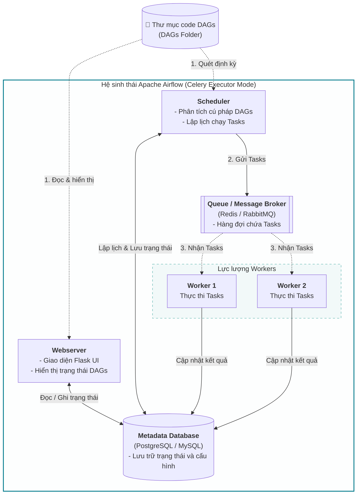

Trong kỷ nguyên Big Data, một quy trình xử lý dữ liệu thực tế hiếm khi diễn ra đơn giản. Hãy tưởng tượng bạn phải xây dựng một chuỗi công việc: cào dữ liệu từ Salesforce, lưu vào hồ dữ liệu Amazon S3, kích hoạt cụm máy chủ Spark để làm sạch, nạp kết quả cuối cùng vào kho dữ liệu Redshift, và gửi email báo cáo cho quản lý. 

Làm thế nào để bạn liên kết các bước này lại với nhau một cách tuần tự? Làm sao để bước sau biết đường tự động chạy ngay khi bước trước vừa hoàn thành? Và nếu một bước bị lỗi giữa chừng, làm cách nào để tự động chạy lại (retry) mà không cần can thiệp thủ công?

Để giải quyết bài toán phức tạp này, chúng ta cần đến một "nhạc trưởng" tài ba: **Apache Airflow**. Được phát triển tại Airbnb vào năm 2014 và sau đó trở thành dự án nguồn mở hàng đầu của Apache, Airflow hiện là nền tảng điều phối (Orchestration) luồng dữ liệu phổ biến nhất trên thế giới.

## Sự trỗi dậy của Airflow và hồi kết cho kỷ nguyên của các bash script

Trước khi Airflow xuất hiện, các kỹ sư dữ liệu thường sử dụng công cụ lập lịch cổ điển của hệ điều hành là `cron` kết hợp với các đoạn script Bash phức tạp. Tuy nhiên, cách tiếp cận này nhanh chóng bộc lộ các hạn chế nghiêm trọng khi hệ thống phình to:
* **Không quản lý được sự phụ thuộc:** `cron` chỉ biết chạy theo giờ cố định. Nó không thể hiểu được logic: *"Hãy đợi Task A chạy xong thành công rồi mới được chạy Task B"*.
* **Code rối rắm như mì ống (Spaghetti Code):** Việc viết các script bash tự gọi lẫn nhau tạo ra một mớ bòng bong không thể kiểm soát. Khi hệ thống gặp lỗi, kỹ sư phải lội qua hàng ngàn dòng log mà không biết chính xác lỗi bắt đầu từ đâu.
* **Không hỗ trợ chạy bù dữ liệu (Backfilling):** Khi muốn chạy lại dữ liệu của cả một tháng trước đó do phát hiện công thức tính toán bị sai, bạn sẽ phải chỉnh sửa code bằng tay cực kỳ vất vả.

Airflow ra đời và giải quyết triệt để các vấn đề trên nhờ ba triết lý thiết kế đột phá:

1. **Pipeline as Code (Đường ống dữ liệu dưới dạng mã nguồn):** Toàn bộ luồng công việc được định nghĩa hoàn toàn bằng ngôn ngữ Python. Điều này mang lại sự linh hoạt tuyệt đối: bạn có thể sử dụng vòng lặp `for` để sinh ra hàng trăm tác vụ tự động, sử dụng Git để quản lý phiên bản và viết unit test cho pipeline của mình.
2. **Khả năng mở rộng không giới hạn (Extensible):** Nhờ cấu trúc module mở rộng (Providers), Airflow dễ dàng kết nối và tương tác với hầu hết các dịch vụ đám mây và công cụ dữ liệu hiện đại như AWS, GCP, [Snowflake](/concepts/2-storage/cloud-data-platform/snowflake/), Slack, [dbt](/concepts/3-integration/transformation-analytics/dbt/),...
3. **Cơ chế chạy bù thông minh:** Khái niệm "Khoảng thời gian thực thi" (Execution Date) giúp giải quyết trọn vẹn bài toán chạy lại dữ liệu lịch sử một cách tự động và nhất quán.

> [!NOTE]  
> Airflow **không phải** là công cụ trực tiếp xử lý hay tính toán dữ liệu (như [Apache Spark](/concepts/3-integration/batch-processing/apache-spark/) hay Pandas). Nhiệm vụ cốt lõi của nó chỉ là **điều phối** – ra lệnh cho các hệ thống khác làm việc và giám sát tiến trình.

## Những viên gạch nền móng của Apache Airflow

Để làm chủ Airflow, bạn cần nắm vững bốn khái niệm cơ bản sau:

* **DAG (Directed Acyclic Graph - Đồ thị có hướng không chu trình):** Khung xương định nghĩa cấu trúc của một luồng công việc. DAG quy định các tác vụ nào sẽ chạy, và thứ tự phụ thuộc giữa chúng ra sao. Cụm từ "không chu trình" đảm bảo luồng công việc chảy theo một chiều duy nhất, không bị lặp vô tận.
* **Operator:** Các khuôn mẫu (Templates) được định nghĩa sẵn để thực hiện một loại công việc cụ thể. Ví dụ: `BashOperator` để chạy một câu lệnh shell, `PostgresOperator` để thực thi truy vấn SQL, hoặc `PythonOperator` để chạy một hàm Python tùy biến.
* **Task:** Là một thực thể cụ thể (Instance) của Operator khi được khai báo bên trong một DAG.
* **Task Instance:** Trạng thái chạy thực tế của một Task cụ thể tại một mốc thời gian cụ thể (ví dụ: Task A chạy cho ngày 07/06/2026 có trạng thái là SUCCESS).

## Kiến trúc tổng thể của Apache Airflow

Một hệ thống Airflow hoàn chỉnh được vận hành bởi sự phối hợp nhịp nhàng của 4 thành phần chính:

1. **Webserver:** Giao diện đồ họa UI trực quan (xây dựng trên nền Flask). Tại đây, bạn có thể dễ dàng theo dõi sơ đồ các bước chạy, kiểm tra log lỗi của từng tác vụ, bật/tắt DAG hoặc kích hoạt chạy lại thủ công.
2. **Scheduler (Bộ lập lịch):** Bộ não của toàn bộ hệ thống. Nó liên tục quét thư mục code, đối chiếu thời gian biểu để tạo ra các lượt chạy DAG mới và chuyển trạng thái các tác vụ đủ điều kiện sang hàng đợi.
3. **Metadata Database (Cơ sở dữ liệu lưu trữ trạng thái):** Thường sử dụng PostgreSQL hoặc MySQL. Đây là nơi lưu trữ toàn bộ lịch sử chạy của các tác vụ, thông tin đăng nhập cấu hình kết nối, biến môi trường và định nghĩa của các DAG.
4. **Executor & Workers (Bộ thực thi và Công nhân):** Lực lượng trực tiếp thực hiện công việc. Trong môi trường lớn, Airflow thường cấu hình **Celery Executor** (phân phối tác vụ cho các server worker tĩnh) hoặc **Kubernetes Executor** (mỗi tác vụ được khởi tạo chạy trên một Pod độc lập của Kubernetes và tự động hủy sau khi hoàn thành).


## Bắt tay vào code: Tạo một DAG ETL cơ bản

Dưới đây là một đoạn code Python tiêu chuẩn để định nghĩa một luồng công việc [ETL](/concepts/3-integration/etl-elt/etl/) đơn giản gồm 3 bước: Trích xuất (Extract) $\rightarrow$ Biến đổi (Transform) $\rightarrow$ Ghi dữ liệu (Load).
```python
from datetime import datetime, timedelta
from airflow import DAG
from airflow.operators.bash import BashOperator
from airflow.operators.python import PythonOperator
import time

# 1. Định nghĩa các cấu hình mặc định cho DAG
default_args = {
    'owner': 'data_engineering_team',
    'depends_on_past': False,
    'retries': 2,
    'retry_delay': timedelta(minutes=5),
}

# 2. Khởi tạo đối tượng DAG
with DAG(
    dag_id='example_daily_etl',
    default_args=default_args,
    description='Một DAG ETL đơn giản',
    schedule='@daily',      # Chạy định kỳ hàng ngày
    start_date=datetime(2026, 6, 1), # Ngày bắt đầu tính lịch chạy
    catchup=False,
) as dag:

    # 3. Định nghĩa các tác vụ (Tasks) sử dụng các Operator tương ứng
    extract_task = BashOperator(
        task_id='extract_data',
        bash_command='echo "Trích xuất dữ liệu cho ngày {{ ds }}"', # {{ ds }} là macro lấy ngày logic của lượt chạy
    )

    def process_logic():
        print("Đang biến đổi dữ liệu...")
        time.sleep(2)

    transform_task = PythonOperator(
        task_id='transform_data',
        python_callable=process_logic,
    )

    load_task = BashOperator(
        task_id='load_data',
        bash_command='echo "Ghi dữ liệu thành công!"',
    )

    # 4. Thiết lập sự phụ thuộc giữa các Task (Dependencies)
    extract_task >> transform_task >> load_task
```

## Những nguyên tắc sống còn khi viết code Airflow

* **DAG chỉ dùng để vẽ sơ đồ, không dùng để xử lý dữ liệu:** Đừng bao giờ viết code truy vấn database lớn hoặc gọi API nặng trực tiếp ở mức thụt lề ngoài cùng (top-level) của file DAG. Scheduler quét các file code này 30 giây một lần để phát hiện thay đổi. Nếu code top-level bị nặng, Scheduler sẽ bị nghẽn (Scheduler Timeout) và treo toàn bộ hệ thống. Logic tính toán nặng phải luôn được bọc trong các hàm callable của `PythonOperator` hoặc các dịch vụ tính toán bên ngoài.
* **Tuyệt đối không lưu mật khẩu trong code:** Hãy sử dụng tính năng `Connections` trên giao diện UI của Airflow hoặc tích hợp với các dịch vụ quản lý bí mật (như HashiCorp Vault, AWS Secrets Manager) để lưu trữ API [token](/concepts/6-ai-ml/genai-ml/token/) và thông tin đăng nhập database.
* **Sử dụng Variables một cách cẩn thận:** Tránh gọi lệnh `Variable.get("my_variable")` trực tiếp ở top-level code vì mỗi lần Scheduler quét file, nó sẽ mở một kết nối mới vào Metadata DB để lấy biến, dễ dẫn đến sập cơ sở dữ liệu. Giải pháp thay thế là sử dụng Jinja templating: `{{ var.value.my_variable }}`.

## Những cái bẫy kinh điển khiến lập trình viên "đau đầu"

* **Khái niệm "Execution Date" gây nhầm lẫn:** Đây là điểm gây bối rối nhất của Airflow. Nếu một DAG có lịch chạy hàng ngày (`@daily`) với Execution Date là `2026-06-07`, thì thực tế DAG này chỉ bắt đầu chạy trên server vào thời điểm kết thúc ngày đó, tức là `00:00:00 ngày 2026-06-08`. Logic đứng sau thiết kế này là: bạn chỉ có thể tổng hợp báo cáo cho một ngày cụ thể khi ngày đó đã đi qua hoàn toàn. (Từ phiên bản 2.2+, Airflow đã bổ sung hai biến rõ ràng hơn là `data_interval_start` và `data_interval_end`).
* **Lỗi tràn bộ nhớ (Out Of Memory - OOM):** Việc viết code tải toàn bộ bảng dữ liệu 10GB vào DataFrame của Pandas bên trong `PythonOperator` chạy trên tài nguyên hạn hẹp của Worker mặc định sẽ khiến hệ điều hành lập tức tắt tiến trình của Worker. Với các tác vụ nặng, hãy đẩy công việc tính toán sang cụm máy chủ chuyên dụng như Apache Spark hoặc AWS EMR.

## Điểm mạnh (Pros) và điểm yếu (Cons)

### Điểm mạnh (Pros)
* **Pipeline dưới dạng code Python:** Mang lại sự linh hoạt tuyệt đối, hỗ trợ đầy đủ các tính năng lập trình (loops, OOP, dynamic task generation), quản lý phiên bản qua Git và viết tests.
* **Hệ sinh thái phong phú (Providers):** Kết nối dễ dàng với hầu hết các nhà cung cấp đám mây lớn (AWS, GCP, Azure) và công nghệ dữ liệu hiện đại (dbt, Spark, Snowflake).
* **Giao diện Web UI trực quan:** Cho phép theo dõi trực tiếp cấu trúc luồng công việc (DAGs), quản lý logs chi tiết và kích hoạt lại các tác vụ thất bại một cách nhanh chóng.

### Điểm yếu (Cons)
* **Chi phí vận hành và hạ tầng lớn:** Yêu cầu cài đặt và quản lý nhiều thành phần (Scheduler, Webserver, Celery Workers, Redis, Metadata Database) khiến việc tự triển khai (self-hosted) khá phức tạp.
* **Giới hạn truyền tải dữ liệu:** Cơ chế truyền dữ liệu XCom được lưu dưới dạng Blob vào Metadata DB nên chỉ phù hợp với siêu dữ liệu (metadata) nhỏ, không hỗ trợ truyền Dataframe lớn.
* **Hạn chế đối với Event-driven Pipelines:** Thiết kế tối ưu cho Batch Processing theo chu kỳ hơn là các luồng xử lý thời gian thực hoặc kích hoạt động (event-driven).

## Khi nào nên dùng và không nên dùng

### Khi nào nên dùng
* **Hệ thống Batch Processing quy mô trung bình đến lớn:** Cần phối hợp hàng trăm bước xử lý dữ liệu phức tạp có ràng buộc về mặt thời gian và logic chặt chẽ.
* **Môi trường Multi-cloud / Hybrid:** Khi cần điều phối các tác vụ chạy trên nhiều nền tảng đám mây và hạ tầng khác nhau.
* **Yêu cầu Backfilling:** Khi thường xuyên cần chạy bù dữ liệu cho quá khứ (lịch sử) một cách tự động và chính xác.

### Khi nào không nên dùng
* **Hệ thống Streaming / Real-time:** Cho các pipeline cần độ trễ thấp ở mức giây hoặc mili-giây. Nên cân nhắc Apache Kafka, Apache Flink hoặc Apache Spark Streaming.
* **Quản trị viên hạ tầng hạn chế:** Nếu không có đủ nguồn lực để vận hành hạ tầng phức tạp và không sử dụng các dịch vụ Cloud Managed (như AWS MWAA hay GCP Composer).

## Các khái niệm liên quan

* [Orchestration](/concepts/3-integration/orchestration/orchestration/)
* [Directed Acyclic Graph (DAG)](/concepts/3-integration/orchestration/dag/)
* [Task Dependency](/concepts/3-integration/orchestration/task-dependency/)
* [Airflow Scheduler](/concepts/3-integration/orchestration/airflow-scheduler/)

## Trọng tâm ôn luyện phỏng vấn

### 1. Nếu một DAG có lịch chạy hàng ngày (`@daily`) và start_date bắt đầu từ ngày 2026-06-01, thì lượt chạy đầu tiên của DAG này sẽ được Scheduler kích hoạt vào thời điểm nào?
* **Gợi ý trả lời:** Lượt chạy đầu tiên sẽ được kích hoạt vào lúc `00:00:00 ngày 2026-06-02`. Trong Airflow, một lượt chạy cho một khoảng thời gian cụ thể (Data Interval) chỉ được bắt đầu khi khoảng thời gian đó kết thúc hoàn toàn. Do đó, lượt chạy của ngày 01/06 (khoảng thời gian từ 01/06 đến hết ngày 01/06) chỉ có thể chạy từ giây đầu tiên của ngày 02/06.

### 2. Sự khác biệt cốt lõi giữa Operator và Task trong Airflow là gì?
* **Gợi ý trả lời:** Trong lập trình, Operator đóng vai trò như một Class (Lớp), định nghĩa sẵn các logic và hành vi xử lý chung (ví dụ: `PostgresOperator` định nghĩa cách kết nối và chạy query). Còn Task là một Instance (Đối tượng) cụ thể được tạo ra từ Class đó và được gán vào một DAG cụ thể (ví dụ: task `create_users_table` sử dụng `PostgresOperator` để thực thi câu lệnh SQL cụ thể).

### 3. XCom trong Airflow dùng để làm gì? Bạn cần lưu ý điều gì về mặt hiệu năng khi sử dụng XCom?
* **Gợi ý trả lời:** XCom (Cross-Communication) là cơ chế cho phép các tác vụ trao đổi các thông tin nhỏ với nhau (ví dụ: Task A truyền một mã ID hoặc đường dẫn file cho Task B xử lý tiếp). Điểm cần lưu ý là dữ liệu XCom được lưu trực tiếp vào cơ sở dữ liệu Metadata của Airflow dưới dạng Blob. Vì vậy, tuyệt đối không dùng XCom để truyền các tập dữ liệu lớn hay DataFrame (sẽ làm nghẽn DB và tràn bộ nhớ Worker). Giải pháp đúng là lưu dữ liệu lớn vào [Cloud Storage](/concepts/2-storage/cloud-data-platform/cloud-storage/) (như S3/GCS) và dùng XCom để truyền đường dẫn URL của file đó.

### 4. Hãy so sánh hai cơ chế thực thi: Celery Executor và Kubernetes Executor.
* **Gợi ý trả lời:** Celery Executor duy trì một nhóm các máy chủ Worker chạy liên tục 24/7. Khi có tác vụ mới, Scheduler sẽ đẩy vào hàng đợi (Redis) và các Worker đang rảnh sẽ lấy ra chạy ngay lập tức, ưu điểm là tốc độ khởi chạy cực nhanh. Kubernetes Executor hoạt động theo mô hình động: mỗi tác vụ sẽ kích hoạt việc tạo mới một Pod riêng biệt trên cụm Kubernetes để chạy và tự động xóa Pod đi khi hoàn thành. Ưu điểm của Kubernetes Executor là khả năng co giãn tài nguyên linh hoạt về 0 (scale-to-zero), tiết kiệm chi phí và cách ly môi trường hoàn toàn giữa các tác vụ để tránh xung đột thư viện Python.

### 5. Cấu hình `catchup=True` (mặc định) có thể gây ra thảm họa gì khi bạn deploy một DAG mới có start_date lùi sâu về quá khứ?
* **Gợi ý trả lời:** Khi cấu hình `catchup=True`, Scheduler sẽ tự động tính toán toàn bộ các lịch chạy bị bỏ lỡ từ ngày `start_date` cho đến hiện tại và kích hoạt đồng loạt hàng chục, hàng trăm lượt chạy DAG chạy bù (backfill) cùng một lúc. Việc này có thể gây ra hiện tượng nghẽn tài nguyên cục bộ trên hệ thống Airflow, spam hàng loạt request làm quá tải các cơ sở dữ liệu đích (DDOS) hoặc làm cạn kiệt hạn mức API của các dịch vụ bên thứ ba. Best practice là luôn đặt `catchup=False` trừ khi bạn chủ động muốn chạy bù dữ liệu quá khứ.

## Xem thêm các khái niệm liên quan
* [Airflow Scheduler - Bộ não điều phối](/concepts/3-integration/orchestration/airflow-scheduler/)
* [DAG (Đồ thị có hướng không chu trình) trong Data Engineering](/concepts/3-integration/orchestration/dag/)
* [Orchestration - Lập lịch và điều phối dữ liệu](/concepts/3-integration/orchestration/orchestration/)

## Tài liệu tham khảo

* [Apache Airflow Official Documentation - Architecture Overview](https://airflow.apache.org/docs/apache-airflow/stable/core-concepts/overview.html)
* [Google Cloud Composer - Overview of Cloud Composer](https://cloud.google.com/composer/docs/composer-2/composer-overview)
* [AWS Managed Workflows for Apache Airflow (MWAA) User Guide](https://docs.aws.amazon.com/mwaa/latest/userguide/what-is-mwaa.html)
* [Azure Data Factory - Run Apache Airflow Job in ADF](https://learn.microsoft.com/en-us/azure/data-factory/playbook-airflow-integration)
* [Databricks - Integration with Apache Airflow](https://docs.databricks.com/en/workflows/jobs/how-to/use-airflow-with-jobs.html)
* [Snowflake - Task Scheduling and Orchestration](https://docs.snowflake.com/en/user-guide/tasks-intro)

## English Summary

**Apache Airflow** is the industry-standard, open-source orchestration platform for authoring, scheduling, and monitoring data pipelines. It utilizes Python to define workflows as Directed Acyclic Graphs (DAGs), adhering to the "pipeline-as-code" paradigm. Its modular architecture—comprising a Scheduler, Webserver, Metadata Database, and Executors (like Celery or Kubernetes)—allows it to scale infinitely and interface with virtually any modern data service via its rich ecosystem of Operators. Airflow shines in managing complex task dependencies and historical backfilling (via its unique logical execution date system), but users must take care not to treat it as a data processing engine or pass large datasets between tasks via its XCom backend.