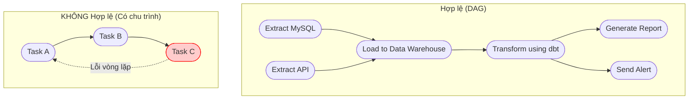

Trong thế giới Kỹ thuật dữ liệu ([Data Engineering](/concepts/1-foundations/foundation/data-engineering/)), nếu có một khái niệm toán học được áp dụng rộng rãi nhất làm nền tảng cho mọi đường ống dữ liệu ([Data Pipeline](/concepts/1-foundations/foundation/data-pipeline/)), thì đó chắc chắn phải là **DAG (Directed Acyclic Graph)**. Cho dù bạn đang làm việc với Apache Airflow, [dbt](/concepts/3-integration/transformation-analytics/dbt/), [Apache Spark](/concepts/3-integration/batch-processing/apache-spark/) hay [Snowflake](/concepts/2-storage/cloud-data-platform/snowflake/), việc hiểu rõ và thiết kế tốt cấu trúc DAG chính là chìa khóa để xây dựng các hệ thống điều phối dữ liệu mạnh mẽ và không bao giờ gặp lỗi bế tắc.

## DAG: Khung xương toán học định hình các Data Pipeline

Hiểu một cách đơn giản, **DAG (Directed Acyclic Graph)**, dịch sang tiếng Việt là **Đồ thị có hướng không chu trình**, là một cấu trúc toán học được sử dụng để mô hình hóa các luồng công việc. Cấu trúc này được cấu thành từ ba yếu tố cơ bản:

1. **Các đỉnh (Nodes / Vertices)**: Đại diện cho các tác vụ `(Tasks)` cụ thể cần thực hiện trong pipeline. Ví dụ: *Tải dữ liệu từ database, Làm sạch dữ liệu, Gửi email báo cáo*.
2. **Các cạnh có hướng (Directed Edges)**: Biểu diễn bằng các mũi tên nối giữa các đỉnh (ví dụ: $A \rightarrow B$). Nó định nghĩa mối quan hệ phụ thuộc chặt chẽ: *"Tác vụ A bắt buộc phải hoàn thành thành công thì tác vụ B mới được phép bắt đầu chạy"*.
3. **Đặc tính không chu trình (Acyclic)**: Nếu bạn bắt đầu đi từ một tác vụ bất kỳ theo chiều mũi tên, bạn sẽ **không bao giờ** có thể quay lại chính tác vụ đó. Nói cách khác, hệ thống tuyệt đối cấm các vòng lặp vô hạn dạng $A \rightarrow B \rightarrow C \rightarrow A$.

## Tại sao chúng ta cần cấu trúc DAG?

Hãy tưởng tượng bạn đang xây dựng một quy trình tính lương tự động cho doanh nghiệp:
1. Tổng hợp giờ làm việc của nhân viên (Tác vụ A).
2. Lấy thông tin thưởng doanh số/KPI (Tác vụ B).
3. Tính thuế thu nhập và tổng lương thực nhận (Tác vụ C – yêu cầu cả A và B phải hoàn tất).
4. Gửi email phiếu lương cho từng nhân sự (Tác vụ D – yêu cầu C phải hoàn tất).

Nếu bạn chỉ viết một file script chạy từ trên xuống dưới một cách tuần tự, việc tối ưu hóa hiệu năng sẽ rất khó khăn. Bạn không thể cho phép tác vụ A và B chạy song song để tiết kiệm thời gian. 

Hơn thế nữa, nếu có lỗi trong logic thiết kế khiến bạn quy định: *"Để tính KPI (B) cần xem trước bảng tổng lương thực nhận (C)"*, bạn đã vô tình tạo ra một **vòng lặp chết (Deadlock)**: C cần B, B lại cần C. Hệ thống sẽ bị đóng băng mãi mãi.

DAG ra đời như một ràng buộc kỹ thuật bắt buộc để:
* Giúp bộ điều phối `(Scheduler)` tối đa hóa khả năng chạy song song các tác vụ không phụ thuộc lẫn nhau.
* Đảm bảo mọi pipeline luôn có điểm bắt đầu và điểm kết thúc rõ ràng, không bao giờ bị rơi vào vòng lặp vô tận.

## Khả năng điều phối thông minh dựa trên đồ thị

Cấu trúc DAG giúp bộ điều phối tự động trả lời hai câu hỏi quan trọng nhất khi vận hành hệ thống phân tán:
* **Tác vụ nào có thể chạy tiếp theo?**: Hệ thống chỉ cần quét các tác vụ có tất cả mũi tên hướng vào nó `(Upstream)` đã báo trạng thái THÀNH CÔNG.
* **Hậu quả gì xảy ra nếu tác vụ X bị lỗi?**: Bộ điều phối sẽ lập tức tạm dừng tất cả các tác vụ nằm ở phía hạ lưu `(Downstream)` của tác vụ X để ngăn chặn việc xử lý dữ liệu lỗi lây lan, trong khi các nhánh độc lập khác của đồ thị vẫn được phép chạy bình thường.

## Bản thiết kế DAG: Sự khác biệt giữa Hợp lệ và Bất hợp lệ

Hãy quan sát sơ đồ dưới đây để thấy sự khác biệt trực quan giữa một đồ thị DAG chuẩn mực và một đồ thị lỗi có chứa chu trình:


Trong mô hình hợp lệ, hai tác vụ `Extract MySQL` và `Extract API` có thể chạy song song cùng lúc vì chúng không phụ thuộc lẫn nhau. Tác vụ `Transform using dbt` chỉ được kích hoạt khi quá trình tải dữ liệu lên [Data Warehouse](/concepts/2-storage/data-warehouse/data-warehouse/) hoàn tất.

## Cách thức vận hành bên dưới của Scheduler

Khi bạn khởi chạy một DAG, bộ điều phối (ví dụ như Airflow) sẽ thực hiện quy trình sau:
1. **Sắp xếp Topo (Topological Sort)**: Phân tích cấu trúc đồ thị và sắp xếp các tác vụ thành một chuỗi tuyến tính một chiều. Bước này sẽ lập tức báo lỗi và dừng chương trình nếu phát hiện ra bất kỳ chu trình lặp nào.
2. **Kích hoạt các tác vụ gốc (Roots)**: Đưa các tác vụ không phụ thuộc vào bất kỳ ai vào hàng đợi để thực thi ngay lập tức.
3. **Quản lý trạng thái phụ thuộc**: Mỗi khi một tác vụ hoàn tất, nó sẽ gửi tín hiệu báo cáo về cho DAG. Đồ thị sẽ kiểm tra xem các tác vụ con của nó đã nhận đủ tín hiệu thành công từ toàn bộ các tác vụ cha chưa để tiếp tục đưa vào hàng đợi.
4. **Kết thúc quy trình**: DAG được đánh giá là thành công khi tất cả các tác vụ lá (tác vụ không có con) hoàn thành trọn vẹn.

## Bắt tay vào định nghĩa DAG trong thực tế

Dưới đây là ví dụ minh họa cách định nghĩa một DAG trong Apache Airflow bằng Python, sử dụng toán tử `>>` để thiết lập mối quan hệ phụ thuộc:
```python
from airflow import DAG
from airflow.operators.empty import EmptyOperator
from datetime import datetime

with DAG(dag_id="example_dag", start_date=datetime(2026, 6, 1)) as dag:
    # 1. Khai báo các Node (Tác vụ)
    task_a = EmptyOperator(task_id="extract_postgres")
    task_b = EmptyOperator(task_id="extract_mongodb")
    task_c = EmptyOperator(task_id="transform_merge")
    task_d = EmptyOperator(task_id="notify_slack")
    task_e = EmptyOperator(task_id="notify_email")

    # 2. Định nghĩa các Cạnh (Mối quan hệ phụ thuộc)
    [task_a, task_b] >> task_c  # task_c chỉ chạy khi cả task_a và task_b hoàn thành
    task_c >> [task_d, task_e]  # task_c xong thì task_d và task_e sẽ chạy song song
```

Trong công cụ biến đổi dữ liệu **dbt (data build tool)**, bạn không cần tự tay viết các toán tử vẽ mũi tên. Thay vào đó, dbt sẽ tự phân tích cú pháp hàm tham chiếu `{{ ref() }}` trong các file SQL để tự động xây dựng nên một DAG khổng lồ.

Ví dụ trong file SQL `marts_revenue.sql`:

```sql
SELECT * 
FROM {{ ref('stg_sales') }} 
JOIN {{ ref('stg_users') }} ON ...
```
dbt sẽ tự động hiểu rằng mô hình `marts_revenue` phụ thuộc vào hai nguồn dữ liệu `stg_sales` và `stg_users` và vẽ mũi tên đồ thị tương ứng.

## Thiết kế DAG sao cho khoa học? (Best Practices)

* **Thiết kế dòng chảy một chiều rõ ràng**: Hãy luôn sắp xếp sơ đồ DAG của bạn đi theo một hướng thống nhất (ví dụ từ trái sang phải hoặc từ trên xuống dưới). Điều này giúp việc đọc hiểu, giám sát và bảo trì hệ thống trực quan hơn rất nhiều.
* **Kiểm soát kích thước của DAG**: Đừng thiết kế các DAG quá nhỏ (chỉ chứa 1 task) và cũng đừng gom tất cả vào một DAG khổng lồ chứa hàng ngàn task. Một Mega-DAG quá lớn sẽ làm chậm bộ điều phối khi tính toán thuật toán sắp xếp Topo và gây đơ giao diện web khi tải đồ thị. Hãy chủ động tách nhỏ thành các SubDAG hoặc gọi các DAG độc lập qua cơ chế trigger.
* **Nguyên tắc Nguyên tử (Atomicity)**: Mỗi tác vụ trong DAG chỉ nên đảm nhận đúng một nhiệm vụ duy nhất. Đừng gộp chung tác vụ tải dữ liệu và biến đổi dữ liệu vào một node Python duy nhất. Nếu bước biến đổi bị lỗi, bạn sẽ phải chạy lại toàn bộ tiến trình tải dữ liệu từ đầu, gây lãng phí tài nguyên và thời gian.

## Những lỗi sơ đẳng dễ gây sập hệ thống Orchestrator

* **Vô tình tạo phụ thuộc vòng lặp (Cyclic Dependency)**: Lỗi kinh điển nhất khi lập trình. Ví dụ: Tác vụ A yêu cầu thư viện đầu ra của Tác vụ B, nhưng Tác vụ B lại được thiết lập phụ thuộc vào Tác vụ A. Bộ điều phối sẽ lập tức báo lỗi `AirflowDagCycleException` và từ chối chạy.
* **Sử dụng vòng lặp vô tận chờ đợi bên trong một Tác vụ**: Việc lập trình viết các hàm `while True` bên trong một Task để chờ dữ liệu từ một hệ thống khác sẽ giữ chặt tài nguyên máy chủ `(worker lock)`, gây tắc nghẽn tài nguyên cho toàn bộ hệ thống. Hãy sử dụng các tác vụ chuyên biệt gọi là **[Sensors](/concepts/3-integration/orchestration/sensors/) (Cảm biến)** để lắng nghe tín hiệu một cách tối ưu.

## Điểm mạnh (Pros) và điểm yếu (Cons)

### Điểm mạnh (Pros)
* **Tránh Deadlock (Vòng lặp chết):** Tính chất không chu trình (Acyclic) ngăn chặn triệt để tình trạng hai hoặc nhiều tác vụ chờ đợi lẫn nhau vô hạn.
* **Tối ưu hóa chạy song song:** Scheduler dễ dàng phân tích và cho phép các tác vụ không phụ thuộc chạy đồng thời để tiết kiệm thời gian.
* **Theo dõi và cô lập lỗi:** Khi một tác vụ lỗi, hệ thống có thể tạm dừng các tác vụ downstream bị ảnh hưởng trực tiếp, trong khi các nhánh khác vẫn tiếp tục xử lý bình thường.

### Điểm yếu (Cons)
* **Không hỗ trợ vòng lặp động:** Không thể xây dựng các logic kiểu "lặp lại task cho đến khi thỏa mãn điều kiện" ngay trên sơ đồ trực quan của DAG.
* **Độ trễ biên dịch:** Phải định nghĩa và biên dịch tĩnh toàn bộ cấu trúc đồ thị trước khi chạy, khó đáp ứng với các yêu cầu thay đổi luồng nghiệp vụ thời gian thực (real-time).

## Khi nào nên dùng và không nên dùng

### Khi nào nên dùng
* **Xây dựng Data Pipelines (ETL/ELT):** Khi luồng xử lý dữ liệu trải qua nhiều giai đoạn có quan hệ cha-con rõ ràng.
* **Quản lý dependencies phức tạp:** Khi một tác vụ đòi hỏi dữ liệu đầu vào từ nhiều nguồn hoặc ngược lại, một nguồn cấp dữ liệu cho nhiều tác vụ đích.

### Khi nào không nên dùng
* **Luồng Event-Driven liên tục:** Với pipeline xử lý stream dữ liệu liên tục (real-time streaming), nơi không có khái niệm mốc thời gian bắt đầu/kết thúc cụ thể.
* **Tác vụ lặp đi lặp lại vô hạn:** Các quy trình cần chạy vòng lặp liên tục để kiểm tra trạng thái bên ngoài.

## Trọng tâm ôn luyện phỏng vấn

### 1. Hãy giải thích ý nghĩa của từ "Acyclic" (Không chu trình) trong DAG. Điều gì sẽ xảy ra nếu xuất hiện chu trình?
* **Mục đích câu hỏi**: Đảm bảo ứng viên nắm vững lý thuyết đồ thị cơ bản áp dụng trong kỹ thuật dữ liệu.
* **Gợi ý trả lời**:
  * *Acyclic* có nghĩa là đồ thị không chứa bất kỳ một vòng lặp kín nào. Các mũi tên phụ thuộc chỉ được phép đi theo một chiều tiến lên, không thể tạo ra đường đi quay ngược lại điểm xuất phát.
  * Nếu xuất hiện chu trình (ví dụ: A chờ B, B chờ C, C lại chờ A), hệ thống sẽ rơi vào trạng thái bế tắc hoàn toàn `(Deadlock)` vì không thể xác định được tác vụ nào được phép chạy trước. Bộ điều phối của các công cụ như Airflow sẽ phát hiện điều này thông qua thuật toán Topological Sort và báo lỗi ngay lập tức mà không chạy pipeline.

### 2. Sự khác biệt giữa việc thiết kế 1 DAG chứa 100 tác vụ và tách thành 10 DAGs độc lập, mỗi DAG chứa 10 tác vụ là gì?
* **Mục đích câu hỏi**: Đánh giá tư duy thiết kế hệ thống và kinh nghiệm vận hành thực tế của ứng viên.
* **Gợi ý trả lời**:
  * Việc dồn 100 tác vụ vào 1 DAG giúp chúng ta dễ dàng giám sát toàn bộ luồng dữ liệu trên một màn hình duy nhất. Tuy nhiên, nó sẽ khiến giao diện web load rất chậm, bộ điều phối tốn nhiều CPU để tính toán phụ thuộc, và một lỗi nhỏ ở một nhánh không quan trọng cũng có thể làm cả DAG bị đánh dấu thất bại.
  * Việc tách thành 10 DAGs độc lập theo từng nghiệp vụ giúp hệ thống có tính mô-đun hóa cao hơn, các đội ngũ có thể tự quản lý và nâng cấp code của mình một cách độc lập mà không ảnh hưởng đến nhau. Chúng ta có thể kết nối các DAG này bằng các tác vụ Sensors hoặc Trigger. Đây là phương án thiết kế tối ưu được khuyến nghị.

### 3. Trong dbt, DAG được tạo ra như thế nào? Cách làm này có gì khác so với Apache Airflow?
* **Mục đích câu hỏi**: Kiểm tra hiểu biết của ứng viên về các công cụ khác nhau trong hệ sinh thái dữ liệu hiện đại.
* **Gợi ý trả lời**:
  * Trong **Apache Airflow**, DAG được định nghĩa một cách tường minh `(Explicit)`. Kỹ sư dữ liệu phải tự viết code Python để vẽ các mũi tên liên kết giữa các tác vụ (ví dụ: `task_a >> task_b`).
  * Trong **dbt**, DAG được xây dựng một cách ngầm định `(Implicit)`. Kỹ sư phân tích chỉ cần viết các câu lệnh SQL độc lập cho từng model. dbt sẽ tự động quét cú pháp hàm `{{ ref('model_name') }}` trong các file SQL để tự suy luận và vẽ nên đồ thị phụ thuộc của toàn bộ hệ thống.

## Các khái niệm liên quan

* [Orchestration (Điều phối hệ thống)](/concepts/3-integration/orchestration/orchestration/)
* [Apache Airflow](/concepts/3-integration/orchestration/apache-airflow/)
* [Task Dependency (Phụ thuộc tác vụ)](/concepts/3-integration/orchestration/task-dependency/)

## Xem thêm các khái niệm liên quan
* [Airflow Scheduler - Bộ não điều phối](/concepts/3-integration/orchestration/airflow-scheduler/)
* [Apache Airflow - Nền tảng điều phối dữ liệu](/concepts/3-integration/orchestration/apache-airflow/)
* [Orchestration - Lập lịch và điều phối dữ liệu](/concepts/3-integration/orchestration/orchestration/)

## Tài liệu tham khảo

* [Apache Airflow Official Documentation - DAGs](https://airflow.apache.org/docs/apache-airflow/stable/core-concepts/dags.html)
* [Google Cloud Composer - DAGs and Airflow Workflow Concepts](https://cloud.google.com/composer/docs/composer-2/composer-overview)
* [AWS Managed Workflows for Apache Airflow (MWAA) - Writing DAGs](https://docs.aws.amazon.com/mwaa/latest/userguide/what-is-mwaa.html)
* [Databricks Workflows - Task Orchestration and DAG Design](https://docs.databricks.com/en/workflows/index.html)
* [Snowflake - Managing Task Dependencies with DAGs](https://docs.snowflake.com/en/user-guide/tasks-intro)
* [Azure Data Factory - Control Flow and Dependencies](https://learn.microsoft.com/en-us/azure/data-factory/concepts-pipeline-execution-triggers)

## English Summary

A **DAG (Directed Acyclic Graph)** is a mathematical structure representing a collection of tasks with defined, directional dependencies, strictly forbidding any loops or cycles. In data engineering frameworks like Apache Airflow, dbt, and Spark, DAGs serve as the architectural blueprint for modeling workflows. By explicitly mapping out which tasks must precede others, the Orchestrator can intelligently parallelize independent tasks, prevent execution deadlocks (since there are no cycles), efficiently pinpoint points of failure, and halt downstream execution when upstream errors occur. While a DAG limits dynamic, looping control-flow at the orchestration level, it forces developers into creating atomic, predictable, and robust data pipelines.