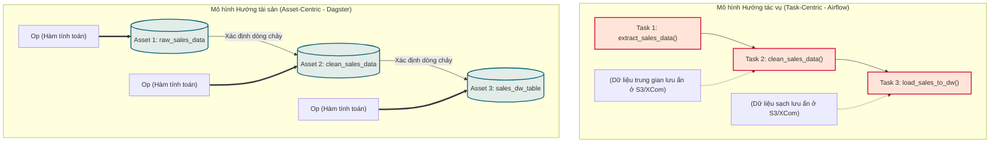

Trong hệ sinh thái kỹ thuật dữ liệu ([Data Engineering](/concepts/1-foundations/foundation/data-engineering/)), việc lựa chọn một công cụ điều phối ([Data Orchestrator](/concepts/3-integration/orchestration/orchestration/)) phù hợp là quyết định mang tính chiến lược, ảnh hưởng trực tiếp đến độ ổn định, khả năng mở rộng và tốc độ phát triển hệ thống của doanh nghiệp. Những năm gần đây chứng kiến sự dịch chuyển mạnh mẽ từ thế hệ điều phối hướng tác vụ cổ điển sang các nền tảng hướng tài sản dữ liệu hiện đại. 

Bài viết này phân tích sâu sắc và so sánh toàn diện ba đại diện tiêu biểu nhất hiện nay: **Apache Airflow**, **Prefect**, và **Dagster** trên năm khía cạnh cốt lõi: triết lý kiến trúc, quản lý trạng thái, mô hình lập lịch, khả năng nhận biết dữ liệu và tính hiệu quả vận hành.

---

## Triết lý kiến trúc & Mô hình lập trình (Architectural Paradigms)

Kiến trúc cốt lõi quyết định cách các kỹ sư dữ liệu tư duy, thiết kế và triển khai các đường ống dữ liệu ([Data Pipeline](/concepts/1-foundations/foundation/data-pipeline/)). Sự khác biệt lớn nhất giữa ba công cụ nằm ở cách định nghĩa đồ thị điều phối [DAG (Directed Acyclic Graph)](/concepts/3-integration/orchestration/dag/).

### Apache Airflow: Hướng đồ thị tĩnh & Lập trình mệnh lệnh (Static DAG-centric & Imperative)
Apache Airflow đại diện cho thế hệ orchestrator đầu tiên được mô hình hóa rõ ràng thông qua cấu trúc DAG tĩnh. 
* **Tĩnh (Static)**: Trong Airflow, cấu trúc đồ thị phụ thuộc được định nghĩa trước khi thực thi. Bộ lập lịch ([Scheduler của Airflow](/concepts/3-integration/orchestration/airflow-scheduler/)) phân tích cú pháp (parse) các file Python định kỳ để biên dịch thành một DAG tĩnh lưu trữ trong cơ sở dữ liệu.
* **Mệnh lệnh (Imperative)**: Các kỹ sư định nghĩa cụ thể từng bước thực thi thông qua các toán tử (`Operators`) và thiết lập [mối quan hệ phụ thuộc tác vụ](/concepts/3-integration/orchestration/task-dependency/) bằng các toán tử như `>>` hoặc `<<`. Việc thay đổi cấu trúc đồ thị khi runtime (lúc chạy) rất khó khăn và thường đòi hỏi các giải pháp workaround phức tạp như tạo các task động dựa trên tham số hóa cấu hình.

### Prefect: Hướng luồng dữ liệu động & Lập trình chức năng (Dynamic Data-flow & Functional)
Prefect loại bỏ hoàn toàn khái niệm DAG tĩnh cổ điển, thay thế bằng triết lý "Code as Workflows".
* **Động (Dynamic)**: Prefect hoạt động giống như một thư viện Python thông thường. Bạn chỉ cần thêm decorator `@flow` và `@task` vào các hàm Python. Đồ thị phụ thuộc được xây dựng động tại thời điểm chạy (runtime) dựa trên luồng chạy thực tế của code.
* **Chức năng (Functional)**: Prefect hỗ trợ lập trình dạng hàm rất tự nhiên. Nếu bạn viết một cấu trúc rẽ nhánh `if/else` bằng Python chuẩn, Prefect sẽ tự động nhận diện nhánh thực thi nào được chọn mà không cần các toán tử điều hướng chuyên dụng như `BranchPythonOperator` của Airflow.

### Dagster: Hướng khai báo & Định nghĩa tài sản (Declarative & Asset-oriented)
Dagster định nghĩa lại hoàn toàn cách xây dựng pipeline bằng việc đưa tài sản dữ liệu làm trung tâm thay vì các tác vụ tính toán.
* **Khai báo (Declarative)**: Thay vì khai báo *"Hãy chạy Task A rồi chạy Task B"*, Dagster yêu cầu bạn khai báo các tài sản dữ liệu mong muốn tồn tại (Software-Defined Assets - SDA). Bạn định nghĩa tài sản dữ liệu $Y$ phụ thuộc vào tài sản dữ liệu $X$.
* **Định nghĩa tài sản (Asset-oriented)**: Dagster tách biệt rõ ràng giữa logic tính toán (Ops) và định nghĩa tài sản. Hệ thống hiểu rõ kiểu dữ liệu đầu vào/đầu ra và sơ đồ dòng chảy dữ liệu (data lineage). Dagster giám sát trực tiếp trạng thái của các tài sản này thay vì chỉ giám sát trạng thái thành bại của các task chạy trên đó.

---

## Quản lý trạng thái (State Management)

Quản lý trạng thái quyết định cách các công cụ lưu trữ siêu dữ liệu (metadata), theo dõi tiến trình chạy và truyền tải dữ liệu giữa các bước.

| Đặc tính | Apache Airflow | Prefect | Dagster |
| :--- | :--- | :--- | :--- |
| **Nơi lưu trữ siêu dữ liệu** | Cơ sở dữ liệu quan hệ (PostgreSQL, MySQL) trung tâm. | Prefect Database (hoặc Prefect Cloud SaaS). | Run Storage (PostgreSQL/SQLite) & Event Log Storage. |
| **Truyền tải dữ liệu (Data Passing)** | Sử dụng `XComs` (lưu tuần tự hóa vào DB) - Không thiết kế cho dữ liệu lớn. | Chuyển đổi in-memory hoặc lưu trữ qua Cloud Storage (S3, GCS) tự động. | Thông qua `I/O Managers` chuyên dụng (S3, GCS, DuckDB, v.v.). |
| **Cách xử lý lỗi** | Kiểm tra trạng thái trong DB và kích hoạt các cơ chế Retry ở mức Task. | State-machine quản lý các dịch chuyển trạng thái (Pending -> Running -> Completed/Failed). | Đánh giá tính hợp lệ của Asset Materialization; hỗ trợ re-execute từ điểm lỗi dựa trên I/O cache. |

### Apache Airflow: XCom và Cơ sở dữ liệu tập trung
Mọi trạng thái của Task Instance trong [Apache Airflow](/concepts/3-integration/orchestration/apache-airflow/) đều được đồng bộ chặt chẽ với cơ sở dữ liệu quan hệ thông qua các kết nối trực tiếp. Khi truyền dữ liệu giữa các task, Airflow sử dụng cơ chế `XCom` (Cross-Communication). Theo mặc định, `XCom` sẽ serialize (tuần tự hóa) dữ liệu và lưu thẳng vào database metadata. Điều này dẫn đến nguy cơ làm nghẽn hoặc quá tải DB nếu lập trình viên vô tình truyền các Dataframe lớn qua `XCom`.

### Prefect: Cơ chế Hybrid và Quản lý trạng thái phía Client
Prefect áp dụng mô hình lai (Hybrid model). Máy chủ điều khiển (Prefect Cloud hoặc Prefect Server) chịu trách nhiệm theo dõi và chuyển đổi trạng thái của flow và task (ví dụ: từ `Scheduled` sang `Running` và `Completed`). Tuy nhiên, dữ liệu thực tế được xử lý hoàn toàn ở môi trường thực thi của người dùng (Agent/Worker). Dữ liệu truyền giữa các task không đi qua máy chủ Prefect, giúp bảo mật dữ liệu tuyệt đối và tránh nghẽn băng thông.

### Dagster: I/O Manager tách biệt vật lý
Dagster giải quyết triệt để bài toán quản lý trạng thái bằng việc đưa ra khái niệm `I/O Manager`. Khi một tài sản dữ liệu (Asset) được tạo ra, `I/O Manager` chịu trách nhiệm lưu trữ nó vào một nơi lưu trữ vật lý (như Snowflake, S3 hoặc thư mục cục bộ). Task tiếp theo cần tiêu thụ tài sản này sẽ gọi `I/O Manager` để đọc lại. Điều này giúp loại bỏ hoàn toàn việc truyền dữ liệu thủ công, đồng thời hỗ trợ tính năng chạy lại từ điểm lỗi (re-execution) cực kỳ tối ưu vì trạng thái trung gian của mọi tài sản đã được lưu trữ rõ ràng.

---

## Sơ đồ tư duy: Task-Centric vs Asset-Centric Flow Logic

Sự khác biệt cốt lõi trong tư duy thiết kế giữa mô hình hướng tác vụ (Task-centric) của Airflow và hướng tài sản (Asset-centric) của Dagster được thể hiện trực quan qua sơ đồ dưới đây:

---

## Mô hình lập lịch (Scheduling Models)

Cách thức kích hoạt và phân phối công việc (Scheduling) quyết định khả năng đáp ứng thời gian thực (Real-time reactivity) của hệ thống điều phối.

### Apache Airflow: Cơ chế Kéo dựa trên Lập lịch tĩnh (Pull-based Scheduling)
Bộ Scheduler của Airflow chạy một vòng lặp vô hạn (infinite loop) để liên tục kiểm tra cơ sở dữ liệu metadata. Nó tìm kiếm các DAG cần chạy dựa trên cấu hình tần suất lập lịch dạng Cron hoặc Interval (ví dụ: `schedule_interval='@daily'`). 
* **Cơ chế Kéo (Pull-based)**: Scheduler liên tục kéo thông tin từ DB để tìm các tác vụ ở trạng thái `Scheduled`, sau đó đẩy chúng vào hàng đợi (Queue) để các Worker kéo về xử lý.
* **Hạn chế**: Mô hình này gặp khó khăn lớn khi đối mặt với các pipeline hướng sự kiện (Event-driven). Dù Airflow đã phát triển thêm cơ chế `Sensors` và `Triggers` không đồng bộ, việc lắng nghe các sự kiện bên ngoài trong thời gian dài vẫn gây tiêu tốn tài nguyên hệ thống đáng kể.

### Prefect: Cơ chế Đẩy hướng sự kiện kết hợp (Hybrid Push-based & Event-driven)
Prefect tiếp cận theo hướng hiện đại hơn bằng cách kết hợp cơ chế đẩy (Push-based) và hướng sự kiện (Event-driven).
* **Đơn giản hóa với Workpools và Workers**: Thay vì duy trì một Scheduler cồng kềnh liên tục quét DB, Prefect Server có thể nhận các tín hiệu kích hoạt trực tiếp từ bên ngoài thông qua API webhooks.
* **Cơ chế Đẩy (Push-based)**: Khi có sự kiện xảy ra, Prefect Server lập tức đẩy công việc vào một `Work Pool`. Các Worker đăng ký lắng nghe Pool đó sẽ nhận lệnh thực thi ngay lập tức. Điều này giúp giảm thiểu độ trễ lập lịch xuống gần như bằng không (near zero latency), lý tưởng cho các luồng xử lý dữ liệu thời gian thực.

### Dagster: Cảm biến thông minh và Khai báo lịch trình (Sensor-based & Declarative Schedules)
Dagster kết hợp hoàn hảo cả hai thế giới thông qua các bộ Lập lịch (Schedules) truyền thống và các Bộ cảm biến (Sensors).
* **Sensors (Bộ cảm biến)**: Dagster cung cấp tính năng Sensor gốc có khả năng theo dõi liên tục các thay đổi trên môi trường lưu trữ (ví dụ: tệp tin mới xuất hiện trên S3, bảng mới được cập nhật trên database). Khi Sensor phát hiện sự thay đổi, nó sẽ kích hoạt việc materialize các Asset hạ lưu phụ thuộc.
* **Khai báo tự động**: Nhờ hiểu biết sâu sắc về dòng chảy tài sản (Asset Lineage), Dagster hỗ trợ mô hình lập lịch khai báo: *"Hãy giữ cho tài sản này luôn được cập nhật trong vòng 3 giờ kể từ khi tài sản cha thay đổi"*. Dagster sẽ tự động tính toán lịch trình chạy tối ưu mà kỹ sư không cần cấu hình thời gian chạy chi tiết.

---

## Sự đánh đổi khi triển khai và vận hành (Deployment & Operational Trade-offs)

Mỗi công cụ đòi hỏi mức độ đầu tư hạ tầng và công sức vận hành rất khác nhau. Việc hiểu rõ những sự đánh đổi này giúp doanh nghiệp lựa chọn giải pháp tối ưu chi phí.

### Apache Airflow: Trưởng thành nhưng phức tạp
* **Ưu điểm**: Là tiêu chuẩn công nghiệp (industry standard). Cộng đồng khổng lồ, tài liệu dồi dào, hàng trăm thư viện kết nối (providers) tích hợp sẵn với mọi hệ thống cloud lớn. Các dịch vụ Managed Services mạnh mẽ như AWS MWAA hay Google Cloud Composer giúp giảm bớt gánh nặng quản trị hạ tầng.
* **Nhược điểm**: Kiến trúc phân tán cực kỳ phức tạp bao gồm: Webserver, Scheduler, Triggerer, Database, và các Executor (Celery/Kubernetes). Quá trình phát triển cục bộ (local development) rất nặng nề và khó cấu hình đồng bộ giữa local và production.

### Prefect: Phát triển nhanh, vận hành linh hoạt
* **Ưu điểm**: Cực kỳ thân thiện với nhà phát triển. Bạn có thể kiểm thử chạy local chỉ bằng cách chạy script Python trực tiếp (`python flow.py`) mà không cần cài đặt bất kỳ cơ sở dữ liệu hay máy chủ cục bộ nào. Phiên bản Prefect Cloud (SaaS) cung cấp giao diện quản trị hiện đại, giúp loại bỏ hoàn toàn việc vận hành control plane.
* **Nhược điểm**: Mặc dù Prefect đã trưởng thành nhanh chóng, hệ sinh thái các tích hợp sẵn có (integrations) vẫn chưa thể phong phú bằng kho tàng đồ sộ của Apache Airflow. Tài liệu giữa các phiên bản cũ (Prefect 1.0) và mới (Prefect 2.x/3.x) đôi khi gây nhầm lẫn cho người mới bắt đầu.

### Dagster: Trải nghiệm lập trình tuyệt vời, kiến trúc trung bình
* **Ưu điểm**: Cung cấp môi trường phát triển cục bộ xuất sắc nhất thông qua công cụ giao diện UI trực quan sinh động (Dagit/Dagster UI). Tính năng kiểm thử tự động (Unit testing) rất dễ viết vì logic tính toán (Ops) hoàn toàn độc lập với môi trường lưu trữ (nhờ I/O Manager). Khả năng debug dòng chảy dữ liệu cực tốt nhờ hiển thị trực quan trạng thái của từng cột, từng bảng dữ liệu.
* **Nhược điểm**: Đòi hỏi một tư duy thiết kế hoàn toàn mới (Asset-centric) từ đội ngũ kỹ sư. Hệ thống hạ tầng vận hành yêu cầu chạy daemon riêng biệt, webserver và các gRPC server chứa code người dùng (User Code Deployments) để cô lập mã nguồn. Điều này làm tăng độ khó khi thiết lập hạ tầng CI/CD trên Kubernetes.

---

## Điểm mạnh và điểm yếu

### Apache Airflow
* **Điểm mạnh (Pros)**:
  * Hệ sinh thái tích hợp lớn nhất thế giới dữ liệu.
  * Hỗ trợ đa dạng Executor (Local, Celery, Kubernetes).
  * Độ tin cậy cao, đã được chứng minh qua hơn một thập kỷ hoạt động tại các tập đoàn lớn nhất.
* **Điểm yếu (Cons)**:
  * Khó chia sẻ dữ liệu an toàn giữa các tác vụ (XCom không tối ưu).
  * Thời gian phản hồi lập lịch chậm do cơ chế kéo (pull loop).
  * Phát triển cục bộ phức tạp, tốn tài nguyên phần cứng.

### Prefect
* **Điểm mạnh (Pros)**:
  * Thiết kế hiện đại dựa trên lập trình hàm động, dễ đọc và dễ bảo trì.
  * Hỗ trợ xử lý bất đồng bộ (asyncio) cực tốt từ thiết kế gốc.
  * Mô hình Hybrid Agent bảo mật tối đa dữ liệu của doanh nghiệp.
* **Điểm yếu (Cons)**:
  * Đòi hỏi lập trình viên phải tự quản lý việc lưu trữ dữ liệu trung gian khi chuyển giao giữa các task (nếu không dùng Prefect Cloud).
  * Sự thay đổi thường xuyên trong kiến trúc cốt lõi qua các phiên bản lớn làm tăng chi phí nâng cấp hệ thống.

### Dagster
* **Điểm mạnh (Pros)**:
  * Khả năng quản lý và truy vết dòng chảy tài sản dữ liệu (Asset Lineage) tuyệt vời.
  * Giao diện UI/UX trực quan sinh động nhất giúp giám sát và debug nhanh chóng.
  * Kiểm thử đơn vị (Unit Testing) dễ dàng nhờ tách biệt hóa I/O.
* **Điểm yếu (Cons)**:
  * Kiến trúc cô lập mã nguồn bằng gRPC làm phức tạp hóa quy trình triển khai CI/CD.
  * Cộng đồng nhỏ hơn so với Airflow, ít tài nguyên giải đáp lỗi trên các diễn đàn công cộng hơn.

---

## Khi nào nên dùng và không nên dùng

### Khi nào nên dùng?
* **Nên dùng Apache Airflow khi**: Doanh nghiệp đã đầu tư hạ tầng mạnh mẽ vào các dịch vụ đám mây (AWS, GCP), sở hữu hàng nghìn tác vụ tính toán truyền thống không yêu cầu truyền tải dữ liệu dung lượng lớn qua lại, và cần một giải pháp cực kỳ ổn định, có sự hỗ trợ lâu dài từ cộng đồng.
* **Nên dùng Prefect khi**: Đội ngũ kỹ sư dữ liệu ưu tiên tốc độ phát triển, muốn viết code Python thuần túy không bị ràng buộc bởi các lớp toán tử (Operators) phức tạp, cần xử lý các pipeline hướng sự kiện thời gian thực (real-time) hoặc các mô hình học máy (Machine Learning) có tính động cao.
* **Nên dùng Dagster khi**: Bạn đang xây dựng một kiến trúc dữ liệu hiện đại lấy dữ liệu làm trung tâm (Data Lakehouse, Modern Data Stack với dbt, Snowflake), muốn kiểm soát chặt chẽ chất lượng và dòng chảy tài sản dữ liệu, và mong muốn có trải nghiệm phát triển, kiểm thử cục bộ tốt nhất.

### Khi nào không nên dùng?
* **Không nên dùng Apache Airflow khi**: Bạn cần chạy các pipeline phản hồi dưới 1 giây hoặc liên tục thay đổi cấu hình đồ thị dựa trên kết quả chạy của các task trước đó.
* **Không nên dùng Prefect khi**: Doanh nghiệp yêu cầu một hệ thống quản lý dòng chảy dữ liệu trực quan hiển thị rõ ràng sơ đồ quan hệ của các bảng database vật lý (Data Lineage) ở mức chi tiết nhất.
* **Không nên dùng Dagster khi**: Hạ tầng vận hành của bạn cực kỳ hạn chế (ví dụ: chỉ có một máy chủ ảo EC2 đơn lẻ) và đội ngũ không có đủ thời gian để học và thích nghi với triết lý hướng tài sản mới.

---

## Trọng tâm ôn luyện phỏng vấn

### Câu hỏi 1: XCom trong Airflow khác gì với I/O Manager trong Dagster về bản chất?
**Trả lời**:
* **XCom (Airflow)** là cơ chế truyền các giá trị nhỏ (metadata, tham số cấu hình) giữa các tác vụ bằng cách tuần tự hóa dữ liệu (serialization) và lưu trực tiếp vào cơ sở dữ liệu quan hệ trung tâm của Airflow. Nó không được thiết kế để truyền tải các tập dữ liệu lớn vì sẽ làm chậm và phình to cơ sở dữ liệu của Orchestrator.
* **I/O Manager (Dagster)** là một lớp trừu tượng (abstraction layer) chịu trách nhiệm xác định cách lưu trữ và đọc dữ liệu của các tài sản. Khi một Op tạo ra dữ liệu, I/O Manager sẽ đẩy nó vào một kho lưu trữ độc lập (như Amazon S3, Google Cloud Storage, hoặc Snowflake) và chuyển tiếp tham chiếu vị trí cho Op tiếp theo. Việc lưu trữ dữ liệu thực tế tách biệt hoàn toàn với cơ sở dữ liệu điều hành của Dagster.

### Câu hỏi 2: Tại sao lập trình viên nói Prefect hỗ trợ các "Dynamic Pipelines" tốt hơn Apache Airflow?
**Trả lời**:
* Trong **Airflow**, đồ thị DAG là tĩnh. Scheduler phải phân tích mã nguồn trước để dựng lên cấu trúc đồ thị trong DB. Nếu bạn muốn thay đổi luồng chạy dựa trên dữ liệu runtime (ví dụ: số lượng file nhận được từ API hôm nay quyết định số lượng task song song cần khởi tạo), bạn phải dùng các kỹ thuật phức tạp hoặc sinh code động rất khó quản lý.
* Trong **Prefect**, đồ thị phụ thuộc được xây dựng động trực tiếp khi code Python thực thi (runtime). Bạn có thể viết các vòng lặp `for` thông thường, các khối điều kiện `if/else` phụ thuộc trực tiếp vào kết quả của một tác vụ trước đó. Prefect ghi nhận các task instance này tại thời điểm chúng được gọi trong runtime, giúp hỗ trợ tối đa các pipeline động và không có cấu trúc cố định.

### Câu hỏi 3: Triết lý "Software-Defined Assets" (SDA) của Dagster giải quyết nỗi đau lớn nào của kỹ sư dữ liệu?
**Trả lời**:
* Trong các hệ thống cũ hướng tác vụ (Task-centric), orchestrator chỉ biết trạng thái của các bước chạy (ví dụ: `Task_A` chạy thành công). Tuy nhiên, nó hoàn toàn mù mịt về việc dữ liệu mà `Task_A` tạo ra (ví dụ: bảng `users_dim`) có thực sự tồn tại, có bị lỗi định dạng hay bị mất dữ liệu hay không. Kỹ sư phải tự viết các task kiểm tra thủ công.
* **SDA của Dagster** gắn kết chặt chẽ mã nguồn tính toán với tài sản dữ liệu thực tế mà nó tạo ra. Dagster theo dõi trực tiếp trạng thái và lịch sử cập nhật của tài sản dữ liệu. Nếu một bảng dữ liệu hạ lưu phụ thuộc vào bảng dữ liệu thượng nguồn bị lỗi thời (stale), Dagster sẽ phát hiện và tự động đề xuất chạy lại phần pipeline bị ảnh hưởng để đồng bộ hóa tài sản dữ liệu, thay vì bắt kỹ sư phải thủ công tra cứu đồ thị tác vụ.

---

## English Summary

Choosing the right modern data orchestrator is key to building sustainable data platforms. 
* **Apache Airflow** remains the undisputed heavyweight champion in terms of community size and cloud provider support. It utilizes a **static, DAG-centric** paradigm that requires upfront graph definition. However, its infrastructure overhead and lack of data-awareness can hinder fast iteration cycles.
* **Prefect** shifts the paradigm to **dynamic, data-flow** pipelines. It allows developers to write standard Python code with minimal decoration. The state management is decoupled via a hybrid architectural pattern, and scheduling is highly responsive and **event-driven**.
* **Dagster** introduces a **declarative, asset-centric** programming model. Instead of managing tasks, engineers define **Software-Defined Assets** and their upstream dependencies. Dagster's built-in **I/O Managers** isolate business logic from storage, enabling clean unit testing and unparalleled local debugging experiences.

The decision hinges on team capability, existing cloud infrastructure, and whether your workflow is task-oriented or demands rigorous data-asset governance.

---

## Xem thêm các khái niệm liên quan
* [Airflow Scheduler - Bộ não điều phối](/concepts/3-integration/orchestration/airflow-scheduler/)
* [Apache Airflow - Nền tảng điều phối dữ liệu](/concepts/3-integration/orchestration/apache-airflow/)
* [DAG (Đồ thị có hướng không chu trình) trong Data Engineering](/concepts/3-integration/orchestration/dag/)

## Tài liệu tham khảo (References)

1. [Apache Airflow Architecture - Official Documentation](https://airflow.apache.org/docs/apache-airflow/stable/core-concepts/overview.html)
2. [Google Cloud Composer: Airflow Orchestration Service Concepts](https://cloud.google.com/composer/docs/concepts/overview)
3. [AWS Managed Workflows for Apache Airflow (MWAA) User Guide](https://docs.aws.amazon.com/mwaa/latest/userguide/what-is-mwaa.html)
4. [Databricks: Orchestrating Data Pipelines at Scale with Delta Live Tables](https://www.databricks.com/blog/2022/06/24/orchestrating-data-pipelines-at-scale.html)
5. [Prefect Workflows Architecture & Core Concepts](https://docs.prefect.io/concepts/flows/)
6. [Dagster Software-Defined Assets & Lineage Documentation](https://docs.dagster.io/concepts/assets/software-defined-assets)
