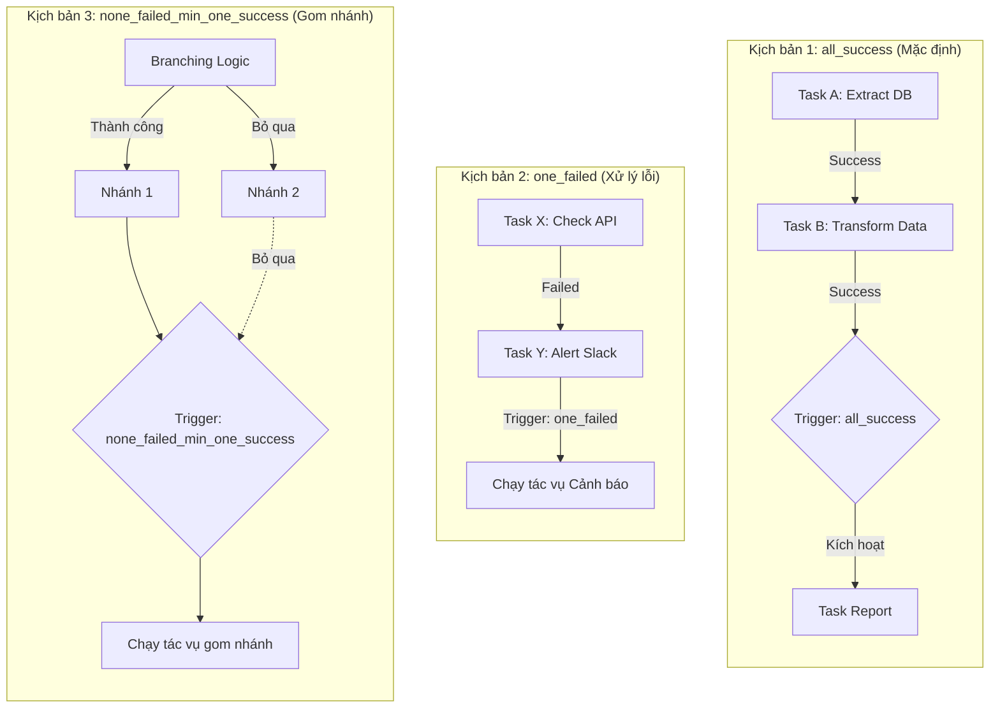

Trong thế giới điều phối dữ liệu (Data [Orchestration](/concepts/3-integration/orchestration/orchestration/)) dựa trên mô hình đồ thị có hướng không chu trình (DAG), **Task Dependency (Sự phụ thuộc tác vụ)** đóng vai trò như một hệ thống đèn tín hiệu giao thông. Nó quyết định trình tự thực thi (Control Flow) của các bước trong đường ống dữ liệu, chỉ rõ: Tác vụ A phải kết thúc với trạng thái như thế nào thì Tác vụ B mới được phép khởi chạy. 

Quản lý phụ thuộc tốt không chỉ giúp dữ liệu được xử lý đúng thứ tự, ngăn chặn thảm họa sử dụng dữ liệu rác, mà còn cho phép chúng ta xây dựng các kịch bản ứng phó sự cố (Exception Handling) cực kỳ linh hoạt và thông minh.

## Khái niệm Upstream và Downstream: Ai đi trước, ai theo sau?

Task Dependency thực chất là một mối liên kết có hướng (mũi tên chỉ đường) giữa hai tác vụ (Nodes) trong một sơ đồ DAG. Về mặt thuật ngữ chuyên ngành, chúng ta phân chia thành hai vai trò rõ rệt:

* **Upstream Task (Tác vụ thượng nguồn / Tác vụ cha):** Là tác vụ đứng trước mũi tên. Nó cần phải được thực hiện và hoàn tất trước để chuẩn bị tài nguyên hoặc dữ liệu.
* **Downstream Task (Tác vụ hạ nguồn / Tác vụ con):** Là tác vụ đứng sau mũi tên. Nó bị khóa lại và bắt buộc phải chờ đợi tín hiệu trạng thái từ Upstream Task mới được phép chạy.

## Tại sao chúng ta phải thiết lập sự phụ thuộc tác vụ?

Hãy tưởng tượng một đường ống dữ liệu cuối ngày có nhiệm vụ tính toán doanh thu báo cáo cho Ban Giám đốc:
* **Task 1:** Tải tệp dữ liệu giao dịch từ API của ngân hàng về server.
* **Task 2:** Chạy lệnh SQL tính tổng doanh thu từ tệp vừa tải.

Nếu bạn không thiết lập sự phụ thuộc giữa hai tác vụ này, hệ thống sẽ chạy song song cả hai cùng lúc để tối ưu thời gian. Kết quả là Task 2 sẽ chạy xong ngay lập tức và báo cáo doanh thu ngày hôm nay bằng... 0 đồng (vì lúc đó Task 1 vẫn đang loay hoay tải file chưa xong). Báo cáo 0 đồng này được tự động gửi đi và cả công ty sẽ rơi vào trạng thái hoảng loạn.

Task Dependency tồn tại như một "người gác cổng" nghiêm ngặt. Nó đảm bảo dữ liệu ở bước trước phải được chuẩn bị sẵn sàng và chính xác trước khi bước sau được phép tiêu thụ nó. Nếu bước trước bị lỗi (Failed), các bước sau sẽ tự động bị hủy bỏ (Skipped) để bảo vệ tính toàn vẹn của hệ thống báo cáo.

## Mở rộng kiểm soát luồng với Trigger Rules (Quy tắc kích hoạt)

Kiểm soát sự phụ thuộc không đơn thuần chỉ là quy luật tuyến tính *"A thành công thì B mới chạy"*. Các công cụ điều phối hiện đại đã nâng cấp nó lên thành khái niệm **Trigger Rules (Quy tắc kích hoạt)**.

Trigger Rules cho phép nhà phát triển định nghĩa các logic rẽ nhánh phức tạp tại các giao điểm. Một tác vụ Downstream sẽ đánh giá trạng thái của tất cả các tác vụ Upstream kết nối với nó để đưa ra quyết định:
* **all_success (Mặc định):** Chỉ chạy khi tất cả các tác vụ cha đều thành công.
* **one_failed:** Chỉ cần có ít nhất một tác vụ cha bị lỗi là lập tức kích hoạt (thường dùng để chạy tác vụ gửi cảnh báo lên Slack/Teams).
* **all_done:** Cứ chờ tất cả các tác vụ cha hoàn thành (bất kể thành công hay thất bại) là chạy (thường dùng cho các tác vụ dọn dẹp tài nguyên).

## Cách thức vận hành (Theo cơ chế Airflow)

Quy trình đánh giá sự phụ thuộc diễn ra như sau:
1. **Khai báo:** Kỹ sư sử dụng code (ví dụ toán tử `>>` trong Airflow) để thiết lập: `A >> B`.
2. **Khởi chạy:** Trình điều phối (Scheduler) quét qua B. Nhận thấy B phụ thuộc vào A, nó đánh dấu B ở trạng thái chờ (`None`).
3. **Cập nhật trạng thái:** Khi A chạy xong, nó ghi nhận trạng thái (`Success`, `Failed` hoặc `Skipped`) vào cơ sở dữ liệu của hệ thống điều phối.
4. **Đánh giá quy tắc:** Scheduler quay lại kiểm tra B, áp dụng Trigger Rule của B (ví dụ `all_success`) lên kết quả của A.
5. **Quyết định hành động:**
   * Nếu A thành công $\rightarrow$ Trigger Rule thỏa mãn $\rightarrow$ B chuyển sang trạng thái `Scheduled` để chuẩn bị chạy.
   * Nếu A thất bại $\rightarrow$ Trigger Rule bị vỡ $\rightarrow$ B tự động chuyển sang trạng thái `Upstream_Failed` và dừng lại.

## Sơ đồ minh họa các quy tắc Trigger Rules phổ biến

Dưới đây là một số kịch bản rẽ nhánh và hội tụ dựa trên Trigger Rules trong DAG:


## Ví dụ thực tế: Viết DAG Airflow thiết lập sự phụ thuộc

Trong Apache Airflow, cách phổ biến nhất để thiết lập Task Dependency là sử dụng các toán tử dịch bit (`>>` và `<<`):
```python
from airflow import DAG
from airflow.operators.empty import EmptyOperator
from airflow.utils.trigger_rule import TriggerRule

with DAG(...) as dag:
    t1 = EmptyOperator(task_id='extract')
    t2 = EmptyOperator(task_id='transform')
    t3 = EmptyOperator(task_id='load')
    
    t_alert = EmptyOperator(
        task_id='alert_error',
        trigger_rule=TriggerRule.ONE_FAILED # Chỉ chạy nếu có ít nhất 1 bước ở trên bị lỗi
    )
    
    t_cleanup = EmptyOperator(
        task_id='cleanup_temp_files',
        trigger_rule=TriggerRule.ALL_DONE  # Luôn chạy bất kể các bước trước thành công hay thất bại
    )

    # 1. Liên kết tuyến tính (Linear Dependency)
    t1 >> t2 >> t3
    
    # 2. Rẽ nhánh báo lỗi (Fan-out)
    [t1, t2, t3] >> t_alert  
    
    # 3. Gom nhánh dọn dẹp (Fan-in)
    [t3, t_alert] >> t_cleanup
```

> [!NOTE]
> Trong một số công cụ transform dữ liệu như [dbt](/concepts/3-integration/transformation-analytics/dbt/), sự phụ thuộc giữa các bảng thường được tự động nhận diện thông qua hàm tham chiếu `{{ ref('ten_bang') }}` thay vì phải khai báo thủ công.

## Nghệ thuật viết DAG: Best Practices và những lỗi sơ đẳng

### Các nguyên tắc thiết kế tốt (Best Practices)
* **Giữ sơ đồ đơn giản:** Hãy cố gắng giữ luồng dữ liệu theo dạng tuyến tính hoặc dạng cây đơn giản. Việc lạm dụng các mối quan hệ đan chéo phức tạp kèm theo nhiều Trigger Rules khác nhau sẽ khiến việc debug khi xảy ra sự cố trở thành một cơn ác mộng.
* **Sử dụng Dummy Node (EmptyOperator) làm điểm trung chuyển:** Nếu bạn có 5 tác vụ nạp dữ liệu song song cần kết nối tới 5 tác vụ biến đổi song song (mô hình All-to-All), việc nối trực tiếp sẽ tạo ra \\$5 \times 5 = 25$ mũi tên đan chéo trên giao diện. Hãy chèn một `EmptyOperator` ở giữa làm trạm trung chuyển (`[T1..T5] >> Dummy >> [T6..T10]`). Số lượng kết nối giảm xuống chỉ còn 10 đường, giúp giao diện DAG cực kỳ gọn gàng và dễ nhìn.
* **Tận dụng Setup/Teardown logic:** Đối với các tác vụ dọn dẹp tài nguyên hệ thống (như tắt cụm máy chủ ảo sau khi tính toán xong), hãy sử dụng cơ chế Setup/Teardown chuyên dụng được hỗ trợ trong các phiên bản Airflow mới thay vì lạm dụng trigger rule `all_done` thô sơ.

### Bẫy rẽ nhánh (Branching Trap) - Sai lầm kinh điển
Một lỗi cực kỳ phổ biến khi sử dụng toán tử rẽ nhánh `BranchPythonOperator`: Giả sử bạn có logic rẽ nhánh: ngày thường đi Nhánh A, ngày cuối tuần đi Nhánh B. Nhánh không được chọn sẽ mang trạng thái `Skipped`. 

Nếu ở cuối DAG, bạn hội tụ hai nhánh này về Task C bằng Trigger Rule mặc định (`all_success`), Task C sẽ **không bao giờ được chạy**. Lý do là vì `all_success` yêu cầu cả A và B bắt buộc phải thành công, trong khi thực tế luôn có một nhánh bị bỏ qua (`Skipped`). 
* *Cách sửa:* Hãy đổi Trigger Rule của Task C thành `none_failed_min_one_success` (Không có nhánh nào bị lỗi, và có ít nhất một nhánh thành công).

## Điểm mạnh (Pros) và điểm yếu (Cons)

### Điểm mạnh (Pros)
* **Bảo vệ tính toàn vẹn dữ liệu:** Cơ chế mặc định `all_success` đảm bảo dữ liệu lỗi ở upstream không bao giờ bị nạp sâu vào hệ thống.
* **Tự động hóa xử lý ngoại lệ (Trigger Rules):** Cho phép tự động kích hoạt cảnh báo (`one_failed`) hoặc dọn dẹp hạ tầng (`all_done`) mà không cần con người trực tiếp can thiệp.
* **Trực quan hóa luồng nghiệp vụ:** Cung cấp bản đồ phụ thuộc rõ ràng giúp debug lỗi nhanh chóng.

### Điểm yếu (Cons)
* **Hiệu ứng domino thất bại (Cascading Failures):** Chỉ một lỗi nhỏ ở task phụ có thể làm toàn bộ pipeline hạ lưu bị hủy bỏ vô lý.
* **Phức tạp khi debug nhánh hội tụ:** Các kịch bản rẽ nhánh lớn (branching) rất dễ gây kẹt kịch bản chạy nếu không nắm vững Trigger Rules.

## Khi nào nên dùng và không nên dùng

### Khi nào nên dùng
* **ETL/ELT data pipelines:** Có thứ tự nạp dữ liệu $\rightarrow$ làm sạch $\rightarrow$ tổng hợp rõ ràng.
* **Cần xử lý dọn dẹp hoặc gửi cảnh báo tự động:** Tắt cụm server sau khi chạy xong hoặc gửi thông báo khi có task lỗi.

### Khi nào không nên dùng
* **Pipeline tuần tự đơn giản:** Nếu pipeline chỉ có 1-2 bước chạy từ trên xuống dưới, việc cấu hình Trigger Rules phức tạp là không cần thiết.
* **Hệ thống Streaming thời gian thực:** Nơi dữ liệu chảy liên tục và không có các ranh giới mốc chạy (DAG runs) rõ ràng để tính toán dependencies.

## Các khái niệm liên quan

* [Directed Acyclic Graph (DAG) - Đồ thị có hướng không chu trình](/concepts/3-integration/orchestration/dag/)
* [Apache Airflow - Công cụ điều phối dữ liệu](/concepts/3-integration/orchestration/apache-airflow/)
* [Sensors - Bộ cảm biến kích hoạt](/concepts/3-integration/orchestration/sensors/)

## Trọng tâm ôn luyện phỏng vấn

### 1. Ý nghĩa của "Upstream" và "Downstream" trong Task Dependency là gì?
* **Gợi ý trả lời:**
  Đây là các khái niệm mô tả dòng chảy của dữ liệu và logic điều khiển trong đường ống. 
  * **Upstream (Thượng nguồn):** Là các tác vụ cha nằm ở phần gốc của mũi tên, thực hiện công việc trước và tạo ra tiền đề hoặc dữ liệu đầu vào.
  * **Downstream (Hạ nguồn):** Là các tác vụ con nằm ở đầu nhọn của mũi tên, chạy sau và phụ thuộc hoàn toàn vào kết quả của các tác vụ Upstream. Nếu một tác vụ Upstream bị lỗi, nó sẽ tạo ra làn sóng hủy bỏ các tác vụ Downstream phía sau để bảo vệ hệ thống.

### 2. Sự khác biệt giữa Trigger Rule `all_success` và `all_done` là gì? Cho ví dụ thực tế.
* **Gợi ý trả lời:**
  * `all_success` (mặc định) yêu cầu tất cả các tác vụ cha trực tiếp phải hoàn thành thành công. Chỉ cần một tác vụ cha bị lỗi hoặc bị bỏ qua, tác vụ con sẽ không chạy. Ví dụ: Chỉ chạy bước tính toán doanh thu khi bước tải dữ liệu từ API thành công hoàn toàn.
  * `all_done` chỉ yêu cầu tất cả các tác vụ cha hoàn thành việc chạy, không quan tâm kết quả là thành công hay thất bại. Ví dụ: Luôn luôn chạy tác vụ tắt cụm máy chủ ảo Spark EMR để tối ưu chi phí, bất kể công việc tính toán trước đó chạy thành công hay bị văng lỗi.

### 3. Tại sao việc chèn một "Dummy node" (EmptyOperator) lại được coi là một Best Practice khi liên kết nhiều task song song?
* **Gợi ý trả lời:**
  Khi chúng ta có nhiều tác vụ ở tầng trước (ví dụ 10 tác vụ tải dữ liệu) và nhiều tác vụ ở tầng sau (10 tác vụ lưu dữ liệu), nếu nối trực tiếp All-to-All, hệ thống phải quản lý \\$10 \times 10 = 100$ mối quan hệ phụ thuộc. Điều này làm rối loạn giao diện đồ thị (thành một mạng nhện chằng chịt) và gây tải cho Scheduler Database. 
  Bằng cách chèn một Dummy Node ở giữa làm trạm trung chuyển, chúng ta giảm số lượng liên kết xuống còn \\$10 + 10 = 20$. Thiết kế này giúp giao diện DAG trực quan, gọn gàng, đồng thời tạo ra một điểm chốt chặn (Checkpoint) rõ ràng giúp việc theo dõi trạng thái hệ thống dễ dàng hơn rất nhiều.

## Xem thêm các khái niệm liên quan
* [Airflow Scheduler - Bộ não điều phối](/concepts/3-integration/orchestration/airflow-scheduler/)
* [Apache Airflow - Nền tảng điều phối dữ liệu](/concepts/3-integration/orchestration/apache-airflow/)
* [DAG (Đồ thị có hướng không chu trình) trong Data Engineering](/concepts/3-integration/orchestration/dag/)

## Tài liệu tham khảo

* [Apache Airflow Documentation - Control Flow and Trigger Rules](https://airflow.apache.org/docs/apache-airflow/stable/core-concepts/dags.html#control-flow)
* [Google Cloud Composer - Airflow Task Dependency Guide](https://cloud.google.com/composer/docs/composer-2/composer-overview)
* [AWS MWAA - Designing Task Dependencies](https://docs.aws.amazon.com/mwaa/latest/userguide/what-is-mwaa.html)
* [Azure Data Factory - Pipeline Activities Control Flow](https://learn.microsoft.com/en-us/azure/data-factory/concepts-pipeline-execution-triggers)
* [Databricks Workflows - Task Dependencies and Rules](https://docs.databricks.com/en/workflows/index.html)
* [Snowflake - Managing Task Dependencies with DAGs](https://docs.snowflake.com/en/user-guide/tasks-intro)

## English Summary

In DAG-based data orchestration, **Task Dependency** defines the explicit execution order of operations by establishing parent-child (upstream-downstream) relationships. This control flow mechanism ensures that tasks only fire when their prerequisites are met, safeguarding systems against data corruption resulting from out-of-order execution. Furthermore, orchestrators like Airflow enhance this concept via **Trigger Rules**, which dictate exactly how a downstream task evaluates the statuses of its upstream parents (e.g., waiting for all to succeed, triggering only if one fails for alerting, or running unconditionally for resource teardown), thus enabling sophisticated error handling and branching logic within the pipeline.