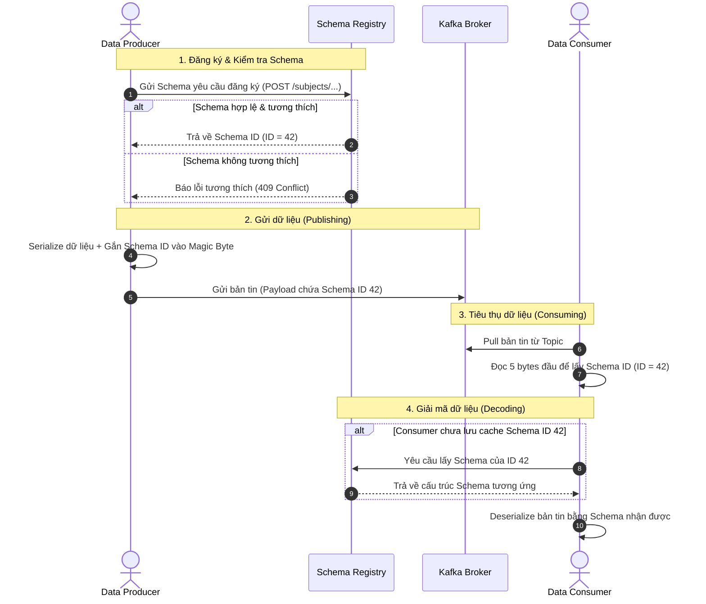

Trong các hệ sinh thái dữ liệu phân tán hiện đại, một trong những cơn ác mộng lớn nhất của kỹ sư dữ liệu là việc hệ thống downstream (như Data Warehouse hay Data Lakehouse) bị sập đột ngột do upstream thay đổi cấu trúc bảng hoặc định dạng thông điệp gửi đi. Khi không có sự ràng buộc chặt chẽ, bên sản xuất dữ liệu (Data Producer) có thể tự ý đổi tên trường, thay đổi kiểu dữ liệu hoặc xóa bớt cột mà bên tiêu thụ (Data Consumer) không hề hay biết. 

Để giải quyết triệt để vấn đề này, khái niệm **Hợp đồng dữ liệu - Data Contract** đã ra đời. Trong môi trường streaming theo thời gian thực sử dụng **[Hệ sinh thái Apache Kafka](/concepts/4-realtime/streaming-processing/apache-kafka/)**, công cụ đắc lực nhất để hiện thực hóa và tự động hóa Data Contract chính là **Kafka Schema Registry**.

---

## 1. Tầm quan trọng của Data Contracts trong kiến trúc dữ liệu

Data Contract là một thỏa thuận chính thức, rõ ràng và có khả năng thực thi tự động (enforceable) giữa bên cung cấp dữ liệu (`Data Producers` - thường là đội Kỹ sư Phần mềm/Backend) và bên tiêu thụ dữ liệu (`Data Consumers` - Đội Phân tích/Kỹ sư dữ liệu). 

Hợp đồng này hoạt động như một cơ chế quản trị kết nối thế giới vận hành (`Operational / Microservices`) và thế giới phân tích (`Analytical / Data Warehouse`). Trong kiến trúc Event-Driven Architecture và mô hình **[Data Mesh](/concepts/1-foundations/system-architecture/data-mesh/)**, việc áp dụng Data Contract mang lại các lợi ích cốt lõi:

*   **Tách biệt hoàn toàn Producer và Consumer (Decoupling)**: Cả Producer và Consumer chỉ cần giao tiếp thông qua ID của schema được lưu trữ tập trung, giúp hai bên có thể phát triển độc lập một cách an toàn mà không cần chia sẻ trực tiếp các thư viện code.
*   **Ngăn chặn lỗi đổ vỡ Pipeline dữ liệu**: Khi một ứng dụng Backend deploy một phiên bản mới và cố gắng gửi một thông điệp vi phạm hợp đồng (ví dụ: đổi kiểu dữ liệu từ `INT` sang `STRING`), Schema Registry sẽ từ chối đăng ký schema mới này và chặn đứng đợt deploy. Rác không bao giờ lọt vào Kafka.
*   **Thực thi Schema ngay tại lớp nhập liệu (Shift-Left Data Quality)**: Thay vì phát hiện lỗi dữ liệu sau khi đã đi vào Data Lake thông qua các bài test hậu kỳ (như dbt tests), chúng ta ngăn chặn dữ liệu lỗi ngay từ thời điểm nó chuẩn bị đi vào hệ thống.

---

## 2. Kiến trúc hoạt động và Sơ đồ tuần tự

Khi tích hợp Kafka Schema Registry, luồng đi của một bản tin được kiểm duyệt thông qua một quy trình phối hợp nhịp nhàng giữa Producer, Schema Registry, Kafka Broker, và Consumer:




### Chi tiết định dạng gói tin trên Kafka:
Để tối ưu hiệu năng, Schema Registry không gửi toàn bộ file schema kèm theo mỗi message. Thay vào đó, gói tin (Payload) gửi lên Kafka Broker được định dạng như sau:
*   **Byte 0**: Magic Byte (luôn có giá trị là `0x00` để báo hiệu gói tin sử dụng Schema Registry).
*   **Bytes 1-4**: ID của Schema (4 bytes kiểu Integer, chỉ định chính xác schema lưu trong registry).
*   **Bytes tiếp theo**: Dữ liệu thực tế được serialize (Avro, Protobuf, hoặc JSON).

---

## 3. So sánh các định dạng Schema: Avro vs Protobuf vs JSON Schema

| Tiêu chí | Apache Avro | Protocol Buffers (Protobuf) | JSON Schema |
| :--- | :--- | :--- | :--- |
| **Định dạng dữ liệu** | Binary (Không tự giải nghĩa) | Binary (Không tự giải nghĩa) | Text (JSON thô) |
| **Kích thước Payload** | Rất nhỏ (Cực kỳ tối ưu) | Rất nhỏ (Cực kỳ tối ưu) | Lớn (Nặng do chứa cả key và value) |
| **Tốc độ tuần tự hóa** | Nhanh | Rất nhanh | Chậm |
| **Khả năng đọc hiểu** | Khó đọc trực tiếp | Khó đọc trực tiếp | Dễ đọc (Human-readable) |
| **Cơ chế tiến hóa** | Dựa trên tên trường & giá trị mặc định | Dựa trên số thứ tự thẻ (Field Tags) | Dựa trên các từ khóa JSON Schema |
| **Hệ sinh thái phù hợp** | Hadoop, Spark, Big Data truyền thống | gRPC, Microservices, Real-time APIs | Web APIs, Webhooks, Javascript/Node |

---

## 4. Các mô hình tương thích Schema (Schema Compatibility Models)

Để hệ thống vận hành trơn tru mà không cần phải tắt toàn bộ ứng dụng khi nâng cấp, Schema Registry cung cấp các chế độ quản lý tương thích:

*   **Chế độ BACKWARD (Tương thích ngược)**: Consumer sử dụng schema mới nhất có thể đọc được dữ liệu được tạo ra bởi Producer sử dụng schema cũ. Bạn chỉ có thể *xóa trường* hoặc *thêm trường có giá trị mặc định*. Quy trình deploy: **Nâng cấp Consumer trước**, sau đó mới nâng cấp Producer.
*   **Chế độ FORWARD (Tương thích xuôi)**: Consumer cũ vẫn có thể đọc được dữ liệu được tạo ra bởi Producer sử dụng schema mới. Bạn chỉ có thể *thêm trường mới* hoặc *xóa trường có giá trị mặc định*. Quy trình deploy: **Nâng cấp Producer trước**, sau đó mới nâng cấp Consumer.
*   **Chế độ FULL (Tương thích toàn phần)**: Đảm bảo cả hai điều kiện BACKWARD và FORWARD. Bạn chỉ có thể *thêm hoặc xóa các trường có giá trị mặc định*. Quy trình deploy: Thứ tự deploy bên nào trước cũng được. Đây là chế độ an toàn nhất nhưng khắt khe nhất.

---

## 5. Ví dụ thực tế về một Data Contract

Dưới đây là một tệp YAML khai báo Data Contract chuẩn chỉnh (dựa trên tiêu chuẩn mở tại `datacontract.com`):

```yaml
dataContractSpecification: 0.9.2
id: urn:datacontract:checkout:orders
info:
  title: Orders Checkout Data Contract
  version: 1.0.0
  owner: checkout-squad@company.com

models:
  orders:
    description: Data stream for completed customer orders.
    type: table
    fields:
      order_id:
        type: string
        required: true
        primary: true
        description: Unique identifier of the order.
      customer_id:
        type: integer
        required: true
      total_amount:
        type: decimal
        required: true
      status:
        type: string
        enum: [PENDING, COMPLETED, CANCELLED]
        required: true
        
quality:
  type: SodaCL
  rules:
    - row_count > 0
    - duplicate_count(order_id) = 0
```

---

## 6. Ví dụ mã nguồn triển khai thực tế (Python với Protobuf)

### Định nghĩa tệp Schema: `order.proto`

```protobuf
syntax = "proto3";

package com.kythuatdulieu.events;

message OrderEvent {
  string order_id = 1;
  string customer_id = 2;
  double total_amount = 3;
  int64 created_at = 4;
  string status = 5; 
}
```

### Mã nguồn Producer kiểm thực dữ liệu (Python)

Để đảm bảo an ninh hệ thống theo các chuẩn mực phát triển phần mềm an toàn, chúng ta không được phép hardcode các thông tin đăng nhập nhạy cảm. Chúng ta phải cấu hình thông tin qua biến môi trường.

```python
import os
import time
from confluent_kafka import Producer
from confluent_kafka.schema_registry import SchemaRegistryClient
from confluent_kafka.schema_registry.protobuf import ProtobufSerializer
from confluent_kafka.serialization import StringSerializer, SerializationContext, MessageField
import order_pb2  # Được compile từ file order.proto bằng protoc

# Load cấu hình từ môi trường bảo mật
KAFKA_BOOTSTRAP_SERVERS = os.getenv("KAFKA_BOOTSTRAP_SERVERS", "localhost:9092")
SCHEMA_REGISTRY_URL = os.getenv("SCHEMA_REGISTRY_URL", "http://localhost:8081")
SCHEMA_REGISTRY_API_KEY = os.getenv("SCHEMA_REGISTRY_API_KEY")
SCHEMA_REGISTRY_SECRET = os.getenv("SCHEMA_REGISTRY_SECRET")

def delivery_report(err, msg):
    if err is not None:
        print(f"[-] Gửi bản tin thất bại: {err}")
    else:
        print(f"[+] Gửi bản tin thành công tới topic {msg.topic()} [Partition: {msg.partition()}]")

def main():
    # 1. Cấu hình Schema Registry Client
    sr_conf = {'url': SCHEMA_REGISTRY_URL}
    if SCHEMA_REGISTRY_API_KEY and SCHEMA_REGISTRY_SECRET:
        sr_conf['basic.auth.user.info'] = f"{SCHEMA_REGISTRY_API_KEY}:{SCHEMA_REGISTRY_SECRET}"
    sr_client = SchemaRegistryClient(sr_conf)

    # 2. Khởi tạo Serializer cho Protobuf
    protobuf_serializer = ProtobufSerializer(
        order_pb2.OrderEvent,
        sr_client,
        {'use.deprecated.format': False}
    )

    # 3. Cấu hình Kafka Producer
    producer_conf = {
        'bootstrap.servers': KAFKA_BOOTSTRAP_SERVERS,
        'acks': 'all',  
        'enable.idempotence': True  
    }
    producer = Producer(producer_conf)

    topic = "store-orders"
    print(f"[*] Bắt đầu sản xuất dữ liệu tới topic: {topic}...")

    try:
        raw_data = {
            "order_id": "ORD-20260612-9981",
            "customer_id": "CUST-8802",
            "total_amount": 1250000.0,
            "created_at": int(time.time()),
            "status": "PENDING"
        }

        order_event = order_pb2.OrderEvent(**raw_data)

        producer.produce(
            topic=topic,
            key=StringSerializer('utf_8')(raw_data["order_id"]),
            value=protobuf_serializer(order_event, SerializationContext(topic, MessageField.VALUE)),
            on_delivery=delivery_report
        )
        producer.flush()

    except Exception as e:
        print(f"[-] Lỗi trong quá trình thực thi Data Contract: {e}")

if __name__ == "__main__":
    main()
```

---

## Khi nào nên dùng

*   **Nên dùng:**
    *   **Kiến trúc Microservices quy mô lớn**: Khi có hàng chục dịch vụ trao đổi dữ liệu với nhau qua Kafka. Data Contract giúp ngăn ngừa lỗi cấu trúc làm sập hệ thống hạ nguồn.
    *   **Xây dựng Data Lakehouse / Data Warehouse**: Giúp dữ liệu sạch ngay từ đầu (Shift-Left), giảm thiểu tối đa tài nguyên và thời gian làm sạch dữ liệu.
    *   **Môi trường yêu cầu bảo mật và tuân thủ cao**: Nơi cần quản lý chặt chẽ siêu dữ liệu (metadata), kiểm soát chất lượng dữ liệu.
*   **Không nên dùng:**
    *   **Các dự án khởi nghiệp nhỏ (Prototypes/PoC)**: Khi các yêu cầu nghiệp vụ thay đổi hàng giờ và cấu trúc dữ liệu chưa ổn định.
    *   **Dữ liệu hoàn toàn phi cấu trúc**: Ví dụ luồng dữ liệu log thô từ máy chủ hoặc dữ liệu hình ảnh, video nhị phân thô không có cấu trúc cố định.
    *   **Hệ thống xử lý nội bộ đơn giản**: Nơi cả Producer và Consumer đều do duy nhất một kỹ sư phát triển và sở hữu.

---

## Điểm mạnh và điểm yếu (Trade-offs)

### Điểm mạnh (Pros)
*   **Kiểm soát chất lượng tuyệt đối**: Ngăn chặn hoàn toàn hiện tượng "silent data corruption" (lỗi dữ liệu ngầm) nhờ kiểm soát ngay từ nguồn.
*   **Tối ưu tài nguyên mạng**: Nhờ cơ chế chỉ gửi Schema ID, dung lượng bản tin thực tế đẩy lên Kafka giảm đi đáng kể so với việc gửi raw JSON hay XML.
*   **Tự động hóa tài liệu hóa**: Schema lưu tại Registry đóng vai trò như một Single Source of Truth, giúp các đội nhóm tự tìm hiểu cấu trúc dữ liệu.
*   **Hỗ trợ tiến hóa schema linh hoạt**: Cho phép doanh nghiệp thay đổi cấu trúc dữ liệu theo thời gian mà không cần phải phối hợp tắt hệ thống đồng bộ giữa nhiều đội phát triển.

### Điểm yếu (Cons)
*   **Tăng độ phức tạp của hệ thống**: Yêu cầu phải vận hành và giám sát thêm một component trung gian (Schema Registry cluster). Nếu component này bị sập, cả Producer và Consumer mới (chưa có cache ID) đều không thể xử lý dữ liệu.
*   **Tăng chi phí phát triển ban đầu**: Đội ngũ phát triển phần mềm không thể viết code gửi JSON tự do nữa mà phải làm việc với các file định nghĩa schema, thực hiện compile code.
*   **Độ trễ ở lần gọi đầu tiên (Cold Start Latency)**: Bản tin đầu tiên được tiêu thụ bởi Consumer mới sẽ tốn thêm thời gian gọi HTTP REST API sang Schema Registry để lấy schema về.
*   **Sự chuyển dịch văn hóa làm việc (Cultural Friction)**: Cần sự phối hợp và ủng hộ từ đội Backend để tuân thủ quy trình phát triển.

---

## Trọng tâm ôn luyện phỏng vấn

### 1. Hãy phân biệt Data Contract và dbt tests (hoặc Great Expectations)?
*   **Gợi ý trả lời**: dbt tests hay Great Expectations hoạt động ở lớp chuyển đổi dữ liệu (Transformation), tức là kiểm tra sau khi dữ liệu đã nằm trong [Data Warehouse](/concepts/2-storage/data-warehouse/data-warehouse/) (Post-ingestion). Nó mang tính chất phát hiện và cảnh báo sự cố. Ngược lại, Data Contract là một cơ chế phòng vệ chủ động ngăn chặn sự thay đổi cấu trúc sai lệch ngay từ nguồn phát hoặc trong quá trình build code (Pre-ingestion). Data Contract giúp \"rác không vào nhà\", còn dbt tests giúp \"dọn dẹp đống rác lỡ lọt vào nhà\".

### 2. Ai là người sở hữu (Owner) thực sự của một bản Data Contract?
*   **Gợi ý trả lời**: Data Producer (đội ngũ phát triển phần mềm/Backend trực tiếp quản lý miền dữ liệu đó) phải là chủ sở hữu chính của Data Contract. Họ là những người trực tiếp sinh ra dữ liệu nên họ mới có khả năng kiểm soát chất lượng từ đầu nguồn. Tuy nhiên, nội dung của hợp đồng phải là sự kết hợp thỏa thuận giữa họ và Data Consumer (đội ngũ phân tích dữ liệu ở hạ nguồn).

### 3. Phân biệt sự khác nhau giữa tính tương thích BACKWARD và FORWARD trong Schema Registry?
*   **Gợi ý trả lời**: 
    - **BACKWARD (Tương thích ngược)**: Consumer sử dụng schema mới nhất có thể đọc dữ liệu cũ được tạo ra bởi schema cũ. Thích hợp khi nâng cấp Consumer trước. Chỉ được xóa trường hoặc thêm trường có giá trị mặc định.
    - **FORWARD (Tương thích xuôi)**: Consumer cũ vẫn đọc được dữ liệu mới nhất được tạo ra bởi schema mới. Thích hợp khi nâng cấp Producer trước. Chỉ được thêm trường hoặc xóa trường có giá trị mặc định.

### 4. Làm thế nào để xử lý tình huống Schema Registry cluster bị sập đột ngột? Hệ thống có bị tê liệt hoàn toàn không?
*   **Gợi ý trả lời**: Nếu Schema Registry sập, các Producer và Consumer đang chạy bình thường sẽ không bị ảnh hưởng lập tức nhờ cơ chế **caching schema cục bộ** (Local Cache) của client library. Tuy nhiên, các lỗi sẽ xảy ra nếu một Producer cố gắng gửi một bản tin với schema mới chưa từng được đăng ký, hoặc một Consumer mới khởi tạo nhận gói tin có ID lạ chưa có sẵn trong cache cục bộ của nó, dẫn đến việc không thể gửi yêu cầu HTTP tải schema để giải mã. Vì vậy, Schema Registry luôn cần được triển khai dưới dạng cụm có độ sẵn sàng cao (High Availability).

---

## Xem thêm các khái niệm liên quan
* [CI/CD cho Data Pipeline & Slim CI](/concepts/3-integration/transformation-analytics/data-pipeline-cicd/)
* [Advanced dbt Pipelines & Stateful CI](/concepts/3-integration/transformation-analytics/dbt-advanced/)
* [dbt Models - Tầng biến đổi và cấu trúc dự án](/concepts/3-integration/transformation-analytics/dbt-models/)

## Tài liệu tham khảo

* [AWS - Implement data contracts in an AWS Data Mesh architecture](https://aws.amazon.com/blogs/big-data/implement-data-contracts-in-an-aws-data-mesh-architecture/)
* [Google Cloud - Data Mesh architecture and governance](https://cloud.google.com/architecture/architecture-data-mesh)
* [Databricks - What is a Data Contract?](https://www.databricks.com/blog/what-is-a-data-contract)
* [Snowflake - Understanding Data Contracts and Governance](https://www.snowflake.com/en/resources/glossary/data-contract/)
* [Confluent - Data Contracts in Action with Schema Registry](https://www.confluent.io/blog/data-contracts-in-action-with-schemas/)
* [Confluent - Schema Registry Overview and Architecture](https://docs.confluent.io/platform/current/schema-registry/index.html)
* [Apache Kafka - Serialization and Schema Documentation](https://kafka.apache.org/documentation/)

---

## English Summary

A **Data Contract** is an explicit, enforceable agreement between software engineers (Data Producers) and data engineers/analysts (Data Consumers) that defines the schema, semantics, and quality standards of a data stream or dataset. In real-time streaming architectures built on Apache Kafka, **Schema Registry** (supporting Avro, Protobuf, or JSON Schema) acts as the central metadata store to automatically validate and enforce these contracts. By validating schemas at the ingestion point (shifting quality checks left), Data Contracts prevent catastrophic downstream pipeline breakages caused by silent schema changes. Depending on the update sequence, engineers configure compatibility modes like **BACKWARD** (new consumers read old data), **FORWARD** (old consumers read new data), or **FULL** (both ways) to evolve schemas without system downtime.