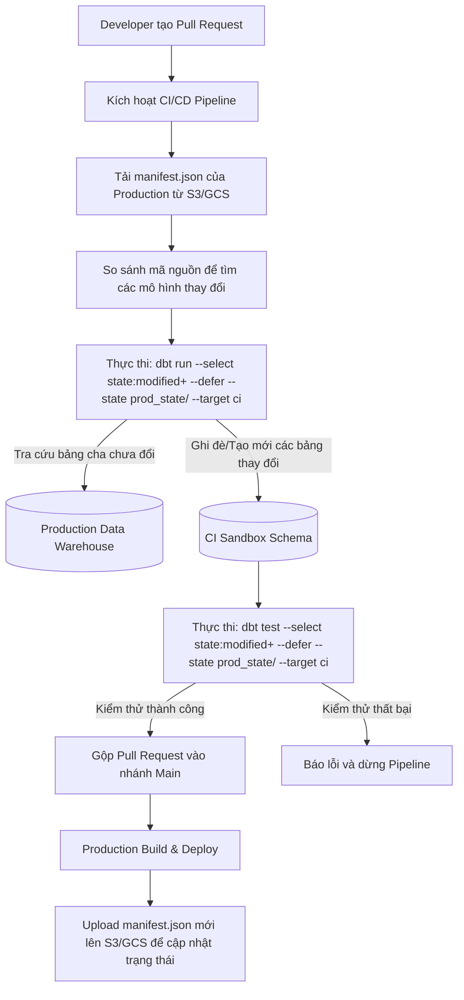

Trong các hệ thống Data Warehouse hiện đại, việc tối ưu hóa hiệu năng và chi phí vận hành các đường ống dữ liệu ([Data Pipeline](/concepts/1-foundations/foundation/data-pipeline)) là một bài toán sống còn. Khi quy mô dữ liệu (data volume) đạt đến mức Terabyte hoặc Petabyte, việc xây dựng lại toàn bộ bảng dữ liệu hàng ngày bằng phương pháp rebuild truyền thống trở nên vô cùng tốn kém và chậm trễ. 

Để giải quyết vấn đề này, công cụ [dbt](/concepts/3-integration/transformation-analytics/dbt) cung cấp hai giải pháp cốt lõi: mô hình nạp dữ liệu gia tăng ([Incremental Load](/concepts/3-integration/etl-elt/incremental-load)) nâng cao và quy trình tích hợp liên tục tối ưu hóa trạng thái (Stateful CI/CD) thông qua cơ chế Code Deferral. Bài viết này sẽ phân tích sâu các cơ chế hoạt động của các chiến lược này và cách chúng vận hành thực tế trên các nền tảng đám mây phổ biến như Google BigQuery và Snowflake.

---

## 1. Bản chất của các chiến lược Incremental Model trong dbt

Incremental model (mô hình tăng trưởng) trong dbt hoạt động dựa trên cơ chế lọc dữ liệu thô đầu vào để chỉ xử lý các dòng dữ liệu mới hoặc đã thay đổi kể từ lần chạy cuối cùng thông qua macro `is_incremental()`. Điều này giúp tối ưu hóa hiệu năng [materialization](/concepts/3-integration/transformation-analytics/materialization). Tuy nhiên, cách dbt cập nhật dữ liệu này vào bảng đích phụ thuộc vào **Incremental Strategy** (Chiến lược gia tăng) được cấu hình.

Có 4 chiến lược gia tăng cơ bản được dbt Core hỗ trợ:

### 1.1. Append (Ghi tiếp)
*   **Cơ chế hoạt động:** Đây là chiến lược đơn giản nhất. dbt chỉ thực hiện câu lệnh `INSERT INTO` để chèn trực tiếp các bản ghi mới từ bảng nguồn vào bảng đích mà không thực hiện bất kỳ kiểm tra trùng lặp (duplicate check) nào.
*   **Cú pháp SQL mẫu:**
    ```sql
    insert into target_table (id, event_time, value)
    select id, event_time, value from temp_staging_table;
    ```
*   **Đặc điểm:** Tốc độ thực thi cực nhanh và tốn ít tài nguyên tính toán nhất, nhưng có nguy cơ cao gây trùng lặp dữ liệu (data duplication) nếu dữ liệu nguồn bị gửi lặp lại.

### 1.2. Merge (Hợp nhất)
*   **Cơ chế hoạt động:** Chiến lược này sử dụng câu lệnh SQL chuẩn `MERGE` để so khớp dữ liệu mới với dữ liệu hiện tại dựa trên một hoặc nhiều khóa duy nhất (`unique_key`).
*   **Cơ chế thực thi:** 
    *   Nếu `unique_key` đã tồn tại trong bảng đích, dbt thực hiện hành động `UPDATE` để ghi đè các cột dữ liệu mới.
    *   Nếu `unique_key` chưa tồn tại, dbt thực hiện hành động `INSERT` để chèn dòng mới.
*   **Cú pháp SQL mẫu:**
    ```sql
    merge into target_table T
    using temp_staging_table S
    on T.unique_key = S.unique_key
    when matched then
        update set T.value = S.value, T.updated_at = S.updated_at
    when not matched then
        insert (unique_key, value, updated_at) values (S.unique_key, S.value, S.updated_at);
    ```

### 1.3. Insert Overwrite (Ghi đè phân vùng)
*   **Cơ chế hoạt động:** Thay vì cập nhật từng dòng dữ liệu (row-level update), chiến lược này thực hiện xóa sạch và ghi đè toàn bộ một hoặc nhiều phân vùng dữ liệu (`partitions`) cụ thể.
*   **Cơ chế thực thi:** dbt sẽ xác định các phân vùng chứa dữ liệu mới trong đợt chạy hiện tại, sau đó thực hiện lệnh thay thế dữ liệu của đúng các phân vùng đó trong bảng đích.
*   **Đặc điểm:** Rất tối ưu khi làm việc với các bảng dữ liệu khổng lồ được phân vùng theo thời gian (ví dụ: ngày, tháng). Không cần so khớp từng dòng dữ liệu, từ đó giảm thiểu đáng kể chi phí quét dữ liệu (scan cost).

### 1.4. Delete+Insert (Xóa và Chèn)
*   **Cơ chế hoạt động:** dbt thực hiện quy trình gồm hai bước độc lập: xóa các dòng dữ liệu cũ trong bảng đích trùng khớp với `unique_key` của dữ liệu mới, sau đó chèn toàn bộ dữ liệu mới vào bảng.
*   **Cú pháp SQL mẫu:**
    ```sql
    delete from target_table
    where unique_key in (select unique_key from temp_staging_table);
    
    insert into target_table
    select * from temp_staging_table;
    ```
*   **Đặc điểm:** Hữu ích đối với các cơ sở dữ liệu không hỗ trợ câu lệnh `MERGE` bản địa (native MERGE syntax) hoặc khi hiệu năng của `MERGE` quá kém trên các bảng có số lượng cột lớn.

---

## 2. Ánh xạ các chiến lược Incremental lên BigQuery và Snowflake

Mỗi Data Warehouse có kiến trúc lưu trữ và cách tính chi phí khác nhau. Việc chọn chiến lược Incremental phù hợp yêu cầu kỹ sư dữ liệu hiểu rõ cách dbt chuyển dịch các chiến lược này thành câu lệnh SQL tối ưu trên từng hệ thống.

### 2.1. Google BigQuery: Partition Overlays vs Merge
Google BigQuery tính chi phí dựa trên dung lượng dữ liệu quét qua (on-demand query pricing) hoặc dung lượng slot tính toán (slots capacity). 

*   **Hạn chế của MERGE:** Khi thực hiện chiến lược `merge`, BigQuery bắt buộc phải quét toàn bộ bảng đích để tìm kiếm các dòng trùng khớp với `unique_key`. Điều này dẫn đến chi phí truy vấn tăng dần theo thời gian khi kích thước bảng đích phình to.
*   **Sức mạnh của Partition Overlays (Insert Overwrite):** BigQuery hỗ trợ ghi đè dữ liệu trực tiếp ở cấp độ phân vùng (partition-level overwrite) thông qua cơ chế metadata-only operation mà không cần quét toàn bộ bảng. 
    Khi cấu hình `incremental_strategy='insert_overwrite'` kèm theo `partition_by`, dbt sẽ tự động tạo ra câu lệnh sử dụng cơ chế ghi đè phân vùng tĩnh (static partition override) hoặc động (dynamic partition override).

**Cấu hình dbt mẫu trên BigQuery:**
```sql
{{ config(
    materialized='incremental',
    incremental_strategy='insert_overwrite',
    partition_by={
      "field": "event_date",
      "data_type": "date",
      "granularity": "day"
    }
) }}

select *
from {{ ref('stg_events') }}

  -- Giới hạn dữ liệu quét ở bảng nguồn để tối ưu chi phí
  where event_date >= date_sub(current_date(), interval 2 day)

```

Khi chạy mô hình này, dbt sẽ chỉ thực hiện ghi đè dữ liệu của các phân vùng ngày nằm trong phạm vi 2 ngày qua. Dữ liệu của các ngày trước đó hoàn toàn không bị ảnh hưởng và không bị quét qua, giúp kiểm soát chi phí BigQuery một cách tối đa.

### 2.2. Snowflake: Micro-Partitions & Merge Engine
Khác với BigQuery, Snowflake sử dụng kiến trúc lưu trữ micro-partitions tự động và tính phí dựa trên thời gian chạy của Virtual Warehouse (tài nguyên tính toán).

*   **Tối ưu hóa MERGE:** Snowflake không yêu cầu khai báo phân vùng thủ công. Mọi bảng dữ liệu đều được tự động chia nhỏ thành các micro-partitions. Snowflake lưu trữ metadata cực kỳ chi tiết cho từng micro-partition (bao gồm min/max values của mọi cột). Khi thực hiện câu lệnh `MERGE` dựa trên `unique_key`, dịch vụ Cloud Services của Snowflake sẽ đọc metadata để loại bỏ (pruning) các micro-partitions không chứa khóa cần tìm, tránh việc quét toàn bộ bảng một cách hiệu quả.
*   **Cơ chế Zero-Copy Cloning:** Khi dbt thực hiện cập nhật gia tăng, Snowflake sử dụng cơ chế phân tách và ghi khi thay đổi (copy-on-write). Do đó, chỉ các micro-partitions có dữ liệu bị thay đổi hoặc chèn mới mới cần được ghi lại, giúp tiết kiệm không gian lưu trữ và tăng tốc độ xử lý DML.

---

## 3. Stateful CI/CD và cơ chế tối ưu hóa kiểm thử

Trong một dự án dbt lớn có hàng trăm hoặc hàng ngàn mô hình ([dbt models](/concepts/3-integration/transformation-analytics/dbt-models)), việc chạy toàn bộ dự án (full build) cho mỗi Pull Request (PR) trên môi trường CI/CD là một sự lãng phí tài nguyên khổng lồ. Quy trình **Stateful CI** (CI/CD dựa trên trạng thái) giải quyết vấn đề này bằng cách chỉ xây dựng và kiểm thử các mô hình bị chỉnh sửa hoặc bị ảnh hưởng trực tiếp bởi thay đổi đó.

### 3.1. Manifest và so sánh trạng thái (State Comparison)
Mỗi lần dbt biên dịch (compile) hoặc chạy (run), nó sẽ sinh ra một tệp metadata có tên là `manifest.json` nằm trong thư mục `target/`. Tệp này chứa toàn bộ thông tin chi tiết về đồ thị phụ thuộc (DAG - Directed Acyclic Graph), cấu hình và cấu trúc của toàn bộ dự án tại thời điểm đó.

Để triển khai Stateful CI, quy trình CI/CD sẽ lấy tệp `manifest.json` được sinh ra từ môi trường Production (được lưu trữ trên Cloud Storage như AWS S3 hoặc Google Cloud Storage) làm mốc so sánh (state reference). dbt sẽ so sánh tệp manifest hiện tại ở nhánh PR với manifest của Production để phát hiện ra các thay đổi.

Lệnh dbt để lọc các mô hình bị thay đổi:
```bash
dbt run --select state:modified --state path/to/production/manifest/
```

Để chạy mô hình bị thay đổi kèm theo toàn bộ các mô hình hạ nguồn (downstream) chịu ảnh hưởng từ nó, ta sử dụng cú pháp dấu cộng (`+`):
```bash
dbt run --select state:modified+ --state path/to/production/manifest/
```

### 3.2. Cơ chế ủy thác mã nguồn (Code Deferral) hoạt động như thế nào?
Giả sử bạn chỉnh sửa mô hình `fct_orders`. Mô hình này phụ thuộc vào một mô hình cha (parent model) là `dim_customers`. Nhánh PR của bạn được cấu hình để ghi dữ liệu vào một schema tạm thời (ví dụ: `dbt_cloud_pr_123`).

Nếu bạn chỉ chạy `dbt run --select fct_orders`, dbt sẽ biên dịch câu lệnh SQL của `fct_orders` trỏ tới bảng cha `dim_customers` trong schema tạm thời (`dbt_cloud_pr_123.dim_customers`). Tuy nhiên, do `dim_customers` không hề bị thay đổi trong PR này, nó chưa từng được tạo ra trong schema tạm thời đó. Lệnh chạy của bạn sẽ thất bại ngay lập tức với lỗi `Table not found`.

**Cơ chế Deferral (`--defer`)** giải quyết triệt để lỗi này. Khi sử dụng cờ `--defer --state path/to/state`, dbt sẽ thực hiện các bước sau:
1. Xác định các bảng tiền đề (parent tables/views) cần thiết cho mô hình đang chạy.
2. Kiểm tra xem các bảng cha đó có tồn tại trong schema đích của môi trường CI hiện tại hay không.
3. Nếu **không**, dbt sẽ tra cứu thông tin trong tệp `manifest.json` của Production để lấy ra schema vật lý thực tế của bảng cha đó trên Production (ví dụ: `analytics.dim_customers`).
4. dbt tự động thay thế namespace của bảng cha trong câu lệnh SQL biên dịch của `fct_orders` từ schema CI tạm thời sang schema Production.

Nhờ có Deferral, bạn có thể kiểm thử độc lập bất kỳ mô hình nào ở hạ nguồn mà không cần tốn thời gian và chi phí để build lại toàn bộ các mô hình thượng nguồn (upstream models) của nó trong môi trường Sandbox.

---

## 4. Mô hình quy trình Stateful CI/CD Pipeline

Dưới đây là sơ đồ luồng hoạt động chuẩn của một quy trình Stateful CI/CD khi một kỹ sư thực hiện mở Pull Request trên Git:



---

## Điểm mạnh (Pros) và điểm yếu (Cons)

### Điểm mạnh (Pros)
*   **Tiết kiệm chi phí tối đa:** Giảm thiểu lượng dữ liệu quét (BigQuery scan bytes) và thời gian sử dụng tài nguyên compute (Snowflake credits) trên môi trường CI bằng cách loại bỏ việc xây dựng lại các bảng không thay đổi.
*   **Tăng tốc độ bàn giao (Speed):** Thời gian chạy CI/CD giảm từ vài tiếng đồng hồ xuống chỉ còn vài phút, tăng tốc phản hồi cho lập trình viên.
*   **Đảm bảo tính nhất quán (Data Integrity):** Code Deferral giúp môi trường CI luôn liên kết chính xác với dữ liệu thực tế trên Production, giảm thiểu rủi ro kiểm thử trên dữ liệu giả lập lỗi thời.

### Điểm yếu (Cons)
*   **Độ phức tạp trong quản lý State:** Yêu cầu một quy trình tự động hóa để lưu trữ, quản lý phiên bản và truy xuất tệp `manifest.json` một cách an toàn giữa các môi trường.
*   **Rủi ro từ sự khác biệt dữ liệu (Data Drift):** Nếu dữ liệu trên Production bị thay đổi cấu trúc (schema change) mà chưa được phản ánh kịp thời trong manifest tham chiếu, cơ chế Deferral có thể dẫn đến các lỗi truy vấn khó debug trong quá trình CI.
*   **Phụ thuộc vào quyền truy cập chéo (Cross-schema permissions):** Môi trường CI cần có quyền đọc (SELECT) trên schema Production để cơ chế Deferral có thể truy vấn các bảng cha. Điều này yêu cầu cấu hình phân quyền bảo mật chặt chẽ.

---

## Khi nào nên/không nên dùng

### Khi nào nên dùng
*   **Quy mô dự án lớn:** Khi dự án dbt sở hữu trên 100 models và thời gian thực thi full-run vượt quá 20 phút.
*   **Sử dụng dịch vụ Cloud Data Warehouse tính phí theo dung lượng/thời gian:** Giúp tối ưu hóa ngân sách vận hành hạ tầng dữ liệu của doanh nghiệp.
*   **Tần số thay đổi mã nguồn cao:** Nhiều kỹ sư dữ liệu cùng làm việc và thực hiện merge code liên tục trong ngày.

### Khi nào không nên dùng
*   **Dự án quy mô nhỏ:** Khi tổng thời gian run toàn bộ dự án dưới 5 phút. Việc duy trì cơ chế lưu trữ state và cấu hình deferral sẽ mang lại nhiều overhead phức tạp hơn là lợi ích thực tế mang lại.
*   **Môi trường bảo mật cô lập hoàn toàn:** Khi chính sách bảo mật của doanh nghiệp nghiêm cấm hoàn toàn việc môi trường Dev/CI đọc dữ liệu trực tiếp từ môi trường Production.
*   **Dự án đang trong giai đoạn tái cấu trúc lớn (Heavy Refactoring):** Khi hầu hết các bảng nền tảng đều bị thay đổi cấu trúc, việc chạy stateful CI không còn ý nghĩa vì hầu hết DAG đều bị đánh dấu là sửa đổi.

---

## Trọng tâm ôn luyện phỏng vấn

### Câu hỏi 1: Sự khác biệt bản chất giữa chiến lược `merge` và `insert_overwrite` trong dbt là gì? Khi nào bạn ưu tiên dùng `insert_overwrite` trên BigQuery?
*   **Trả lời:** 
    *   Sự khác biệt bản chất nằm ở mức độ tác động dữ liệu. `merge` hoạt động ở cấp độ dòng dữ liệu (row-level), thực hiện so khớp khóa duy nhất để quyết định UPDATE hoặc INSERT. `insert_overwrite` hoạt động ở cấp độ phân vùng (partition-level), xóa sạch dữ liệu của các phân vùng liên quan rồi chèn dữ liệu mới vào.
    *   Trên BigQuery, tôi sẽ ưu tiên sử dụng `insert_overwrite` khi bảng dữ liệu có kích thước lớn và được phân vùng theo thời gian (ví dụ: ngày). Do BigQuery tính phí dựa trên lượng dữ liệu quét qua, việc dùng `merge` sẽ bắt buộc quét toàn bộ bảng đích để tìm khóa trùng khớp, gây tốn kém. Trong khi đó, `insert_overwrite` chỉ tác động đến các phân vùng dữ liệu mới được nạp, giúp tối ưu hóa chi phí quét dữ liệu đáng kể.

### Câu hỏi 2: Giải thích cơ chế hoạt động của cờ `--defer` trong dbt CI/CD. Tại sao nó lại quan trọng?
*   **Trả lời:** 
    *   Cờ `--defer` cho phép dbt chạy các mô hình dữ liệu bị thay đổi mà không cần phải xây dựng các mô hình cha (parent models) của chúng trong schema CI tạm thời.
    *   Khi thực thi, dbt sẽ kiểm tra sự hiện diện của các bảng cha trong schema CI. Nếu không tìm thấy, dbt sẽ tự động đối chiếu với tệp `manifest.json` của môi trường Production (được truyền qua cờ `--state`) và biên dịch SQL để trỏ thẳng tới bảng cha tương ứng nằm trên Production.
    *   Cơ chế này cực kỳ quan trọng vì nó giúp loại bỏ việc phải chạy lại các bảng cha không thay đổi, tiết kiệm thời gian chạy CI và giảm thiểu tài nguyên tính toán của Data Warehouse.

### Câu hỏi 3: Nếu một mô hình dbt tăng trưởng (incremental model) bị lỗi dữ liệu quá khứ (data corruption), bạn sẽ xử lý thế nào để sửa đổi toàn bộ dữ liệu lịch sử?
*   **Trả lời:** 
    *   Để sửa đổi dữ liệu lịch sử bị lỗi, tôi sẽ thực hiện chạy lại toàn bộ mô hình dữ liệu đó bằng cách sử dụng cờ `--full-refresh`. 
    *   Cú pháp thực hiện: `dbt run --select <model_name> --full-refresh`.
    *   Khi nhận được cờ này, dbt sẽ tạm thời bỏ qua cấu hình incremental, thực hiện câu lệnh xóa bảng cũ (hoặc phân vùng cũ) và tạo dựng lại bảng dữ liệu từ đầu dựa trên toàn bộ dữ liệu nguồn lịch sử có sẵn.

## Các khái niệm liên quan

* [dbt Basics](/concepts/3-integration/transformation-analytics/dbt/)
* [dbt Semantic Layer & MetricFlow](/concepts/3-integration/transformation-analytics/dbt-semantic-layer/)

## English Summary

Managing large-scale data transformation workflows requires deep optimization of materialization strategies and deployment patterns. dbt Core provides powerful features to execute cost-effective, incremental pipelines and stateful CI workflows:

1.  **Incremental Strategies:** Data engineers can configure `append`, `merge`, `insert_overwrite`, or `delete+insert` to handle incremental runs. While `merge` performs row-level reconciliation, `insert_overwrite` manages partition-level replacement.
2.  **Database Alignments:** Modern warehouses process these strategies differently. On **Google BigQuery**, `insert_overwrite` leverages partition overlays to avoid full table scans, drastically reducing query costs. On **Snowflake**, the native `MERGE` engine works efficiently with metadata-driven micro-partition pruning.
3.  **Stateful CI/CD & Deferral:** Stateful integration uses a production `manifest.json` file as a reference to identify modified models via `state:modified` selectors. The `--defer` mechanism dynamically redirects unmodified upstream references to production datasets, preventing run-time errors and reducing CI resources.

Implementing these practices minimizes compute overhead, guarantees data reliability, and optimizes delivery cycles for analytics engineering teams.

---

## Xem thêm các khái niệm liên quan
* [Hợp đồng dữ liệu - Data Contract & Schema Registry](/concepts/3-integration/transformation-analytics/data-contract/)
* [CI/CD cho Data Pipeline & Slim CI](/concepts/3-integration/transformation-analytics/data-pipeline-cicd/)
* [dbt Models - Tầng biến đổi và cấu trúc dự án](/concepts/3-integration/transformation-analytics/dbt-models/)

## Tài liệu tham khảo (References)

1.  [dbt Labs - About incremental models](https://docs.getdbt.com/docs/build/incremental-models)
2.  [dbt Labs - Stateful CI/CD configurations](https://docs.getdbt.com/docs/deploy/stateful-cicd)
3.  [dbt Labs - Understanding state node selection](https://docs.getdbt.com/reference/node-selection/state)
4.  [Google Cloud BigQuery - Introduction to partitioned tables](https://cloud.google.com/bigquery/docs/partitioned-tables)
5.  [Snowflake Documentation - MERGE SQL Statement Details](https://docs.snowflake.com/en/sql-reference/sql/merge)
6.  [Databricks Lakehouse - MERGE INTO syntax and micro-partition updates](https://docs.databricks.com/en/sql/language-manual/sql-ref-syntax-dml-merge-into.html)
7.  [AWS Redshift - Performing MERGE operations in data warehouses](https://docs.aws.amazon.com/redshift/latest/dg/r_MERGE.html)
