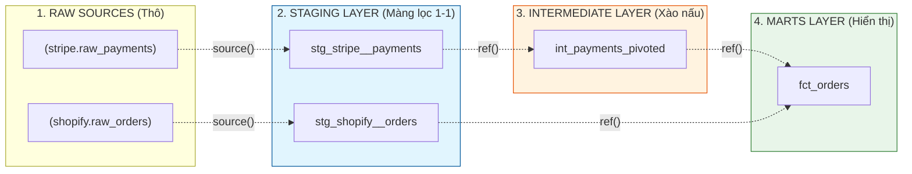

Nếu bạn đã từng làm việc trong một dự án dữ liệu lớn sử dụng SQL truyền thống, chắc hẳn bạn không lạ gì cảnh tượng: Những câu lệnh SQL dài hàng ngàn dòng, JOIN hàng chục bảng chồng chéo lên nhau. Khi số liệu bị sai hoặc cấu trúc nguồn thay đổi, việc tìm kiếm và sửa lỗi biến thành một cơn ác mộng "mò kim đáy bể". Logic bị lặp lại ở khắp mọi nơi, và không ai dám chắc mình đã sửa hết các chỗ cần sửa.

Để giải quyết đống "mì Spaghetti" hỗn độn đó, cộng đồng Analytics Engineering đã đưa ra một cẩm nang thiết kế chuẩn mực cho **dbt (data build tool)**. Trọng tâm của phương pháp này là việc chia nhỏ logic biến đổi thành các **Models** và tổ chức chúng theo một **Kiến trúc phân tầng (Layering Architecture)** nghiêm ngặt.

## dbt Model thực chất là gì?

Trong thế giới dbt, một **Model** đơn giản là một file `.sql` chứa duy nhất một câu lệnh `SELECT` (có thể kết hợp với các mã Jinja để tối ưu hóa). Mỗi Model này khi chạy sẽ được dbt biên dịch và tạo thành một bảng vật lý (Table) hoặc một khung nhìn ảo (View) tương ứng trên [Data Warehouse](/concepts/2-storage/data-warehouse/data-warehouse/) của bạn.

Để quản lý hàng trăm, hàng ngàn Models một cách khoa học, chúng ta áp dụng mô hình phân tầng dữ liệu — cho phép dữ liệu chảy tuần tự từ thô đến thành phẩm. Quy tắc vàng là: *Một model ở tầng trên chỉ được phép đọc dữ liệu từ các tầng thấp hơn hoặc cùng cấp, tuyệt đối không được gọi ngược (Circular dependency) hoặc gọi tắt (Bypass).*

## Tại sao chúng ta cần một kiến trúc phân tầng nghiêm ngặt?

Hãy tưởng tượng một kịch bản: Bạn Analyst thứ nhất cần làm một Báo cáo Doanh thu, bạn viết câu lệnh SQL truy cập trực tiếp vào bảng thô `raw_sales`. Hôm sau, bạn Analyst thứ hai làm Báo cáo Thuế cũng trỏ thẳng xuống bảng `raw_sales` đó và tự viết lại logic quy đổi tiền tệ hệt như bạn thứ nhất. 

Đột nhiên, hệ thống nguồn thay đổi cấu trúc, đổi tên cột `sale_amount` thành `revenue_amount`. Ngay lập tức, cả hai báo cáo của bạn đều bị sập. Bạn sẽ phải đi tìm từng file báo cáo để sửa lại tên cột.

Kiến trúc phân tầng ra đời để đóng vai trò như một "tấm khiên" bảo vệ hệ thống:
1. **Lớp trừu tượng (Staging)** giúp cô lập các thay đổi ở nguồn. Nếu nguồn đổi cấu trúc, bạn chỉ cần sửa ở duy nhất một nơi.
2. **Loại bỏ trùng lặp code (DRY - Don't Repeat Yourself)**: Các logic dùng chung được đưa vào các bảng trung gian để tái sử dụng.
3. **Đồ thị luồng dữ liệu ([DAG](/concepts/3-integration/orchestration/dag/))** rõ ràng, giúp dễ dàng kiểm tra nguồn gốc và debug khi có sự cố.

---

## 3 Tầng kiến trúc cốt lõi trong một dự án dbt

Một thư mục dự án dbt tiêu chuẩn được tổ chức thành 3 lớp rõ rệt:




### 1. Tầng Staging (Làm sạch cơ bản)
* **Thư mục**: `models/staging/<source_name>/` (ví dụ: `models/staging/stripe/stg_stripe__payments.sql`).
* **Nhiệm vụ**: Đây là màng lọc đầu tiên tiếp xúc với dữ liệu thô (được gọi qua hàm `{{ source() }}`). Tại đây, chúng ta thực hiện các phép biến đổi nhẹ như: đổi tên cột về chuẩn (`snake_case`), ép kiểu dữ liệu (`CAST`), chuẩn hóa múi giờ sang UTC, và làm sạch cơ bản.
* **Quy tắc vàng**: **Tuyệt đối không JOIN hoặc GROUP BY ở tầng này.** Mỗi bảng Staging bắt buộc phải giữ mối quan hệ 1-1 với bảng thô ở nguồn.

### 2. Tầng Intermediate (Xử lý trung gian)
* **Thư mục**: `models/intermediate/<business_domain>/` (ví dụ: `models/intermediate/finance/int_payments_pivoted.sql`).
* **Nhiệm vụ**: Chứa các logic biến đổi phức tạp, ví dụ như tính toán các hàm cửa sổ (Window Functions), thực hiện các phép JOIN phức tạp, hoặc xoay bảng (Pivot). Tầng này đóng vai trò chuẩn bị nguyên liệu tinh chế để tầng Marts cuối cùng không phải gánh các câu lệnh SQL dài hàng trăm dòng. Các model ở đây thường được lưu dưới dạng View hoặc Ẩn (`ephemeral`).

### 3. Tầng Marts (Thành phẩm doanh nghiệp)
* **Thư mục**: `models/marts/<department>/` (ví dụ: `models/marts/core/fct_orders.sql`).
* **Nhiệm vụ**: Định hình cấu trúc dữ liệu theo mô hình đa chiều (Star Schema) với các bảng Fact và Dimension hoàn chỉnh, sẵn sàng phục vụ cho các công cụ BI (Tableau, Power BI) vẽ báo cáo.
* **Quy tắc vàng**: Dữ liệu ở tầng Marts phải dễ hiểu cho người làm kinh doanh, chứa các chỉ số KPIs đã được tính toán đầy đủ. **Marts tuyệt đối không được đọc trực tiếp từ Source thô** mà bắt buộc phải thông qua Staging.

---

## Tổ chức thư mục dự án dbt chuẩn

Dưới đây là sơ đồ cây thư mục điển hình của một dự án dbt được tổ chức khoa học:
```text
├── models/
│   ├── staging/
│   │   └── stripe/
│   │       ├── _stripe__sources.yml     # Khai báo Raw data
│   │       ├── stg_stripe__payments.sql # Model làm sạch
│   │       └── _stripe__models.yml      # Khai báo tests/docs cho staging
│   │
│   ├── intermediate/
│   │   └── finance/
│   │       ├── int_payments_pivoted.sql # Xử lý logic Pivot
│   │       └── _finance__models.yml     
│   │
│   └── marts/
│       └── core/
│           ├── dim_customers.sql        # Thành phẩm cho BI
│           ├── fct_orders.sql           # Thành phẩm cho BI
│           └── _core__models.yml        # Tests chặt chẽ nhất
```

---

## Ví dụ thực tế về một Staging Model

Dưới đây là nội dung của file `stg_stripe__payments.sql`. Hãy chú ý cách sử dụng hàm `{{ source() }}` để gọi dữ liệu nguồn và các thao tác làm sạch cơ bản:
```sql
WITH raw_payments AS (
    SELECT * 
    FROM {{ source('stripe', 'payment') }}
),

renamed_and_casted AS (
    SELECT
        -- Đổi tên cột sang định dạng chuẩn snake_case
        id AS payment_id,
        orderid AS order_id,
        paymentmethod AS payment_method,
        
        -- Ép kiểu và quy đổi đơn vị tiền tệ (từ cents sang dollars)
        status,
        amount / 100.0 AS payment_amount_usd,
        
        -- Đồng bộ mốc thời gian
        created AS created_at
    FROM raw_payments
)

SELECT * FROM renamed_and_casted
```

---

---

## Điểm mạnh và điểm yếu

### Điểm mạnh (Pros)
* **Modularity (Tính mô-đun hóa)**: Cho phép chia nhỏ các câu lệnh SQL khổng lồ thành các model nhỏ hơn, dễ quản lý và bảo trì.
* **Reusability (Tính tái sử dụng)**: Tránh lặp lại code (DRY) nhờ khả năng gọi ref() các model trung gian.
* **Impact Analysis (Phân tích ảnh hưởng)**: DAG rõ ràng giúp xác định ngay lập tức các model hạ nguồn bị ảnh hưởng khi có sự thay đổi ở nguồn.

### Điểm yếu (Cons)
* **Complexity (Độ phức tạp)**: Sinh ra số lượng bảng và view trung gian cực kỳ lớn trên Data Warehouse.
* **Performance Overhead**: Việc lạm dụng quá nhiều tầng view trung gian có thể gây chậm hiệu suất truy vấn nếu không được cấu hình materialization (`table`, `incremental`, `ephemeral`) hợp lý.

---

## Khi nào nên dùng

### Nên áp dụng khi:
* Dự án dbt có số lượng model lớn (trên 15-20 models) và có sự tham gia của nhiều Analytics Engineers hoặc Analysts.
* Cần xây dựng một Data Warehouse chuẩn hóa, tái sử dụng được logic và dễ dàng truy vết lineage dữ liệu.

### Chưa nên áp dụng khi:
* Các dự án phân tích ad-hoc quy mô nhỏ với chỉ 1-2 bảng đơn giản, nơi việc thiết lập kiến trúc phân tầng tạo ra quá nhiều overhead.
* Đội ngũ chưa quen thuộc với các khái niệm của dbt và Analytics Engineering, dễ dẫn đến việc thiết kế sai cấu trúc tầng.

---

## Trọng tâm ôn luyện phỏng vấn

### 1. Tại sao quy tắc nghiêm ngặt nhất của tầng Staging trong dbt là "Không được thực hiện phép JOIN"?
* **Gợi ý trả lời**: Tầng Staging đóng vai trò là lớp trừu tượng (Abstraction Layer) giữ mối quan hệ 1-1 với dữ liệu nguồn. Nếu chúng ta JOIN các bảng ngay tại Staging (ví dụ JOIN bảng Khách hàng với bảng Đơn hàng), bảng Staging đó sẽ bị ràng buộc chặt chẽ với một logic nghiệp vụ cụ thể. Khi một phòng ban khác chỉ cần danh sách khách hàng sạch mà không quan tâm đến đơn hàng, họ sẽ phải dùng một bảng Staging chứa đầy dữ liệu đơn hàng dư thừa và có nguy cơ bị nhân bản dòng (Fan-out). Việc giữ Staging độc lập 1-1 giúp nó trở thành những "viên gạch Lego" nguyên thủy chuẩn nhất để bất kỳ mô hình hạ nguồn nào cũng có thể tái sử dụng một cách an sau.
* **Lỗi cần tránh**: Tránh trả lời chung chung rằng JOIN làm giảm hiệu năng mà không chỉ ra vấn đề về khả năng tái sử dụng.

### 2. Sự khác biệt giữa Materialization loại `view`, `table` và `ephemeral` trong dbt là gì? Thường áp dụng ở tầng nào?
* **Gợi ý trả lời**:
  * **`view`**: Tạo ra khung nhìn ảo không chứa dữ liệu vật lý trên database. Thường được dùng cho tầng **Staging** vì chúng ta rất ít khi truy vấn trực tiếp vào Staging, giúp tiết kiệm chi phí lưu trữ.
  * **`table`**: Tính toán và ghi toàn bộ dữ liệu vật lý xuống đĩa cứng. Thường được dùng cho tầng **Marts** hoặc các bảng tính toán cực kỳ nặng, giúp các công cụ BI đọc dữ liệu và hiển thị dashboard nhanh nhất có thể.
  * **`ephemeral`**: Không tạo ra bất kỳ đối tượng vật lý hay ảo nào trên database. dbt sẽ biên dịch model này thành một khối mã nguồn CTE (`WITH ... AS`) và tự động chèn nó vào bên trong câu truy vấn của model hạ nguồn gọi nó. Thường được dùng cho tầng **Intermediate** để tránh làm rác database bởi quá nhiều view trung gian.

### 3. Nếu hệ thống nguồn thay đổi tên cột từ `usr_name` thành `full_name`, bạn sẽ xử lý như thế nào theo chuẩn dbt?
* **Gợi ý trả lời**: Nhờ có cấu trúc phân tầng rõ ràng, chúng ta chỉ cần chỉnh sửa ở duy nhất một file ở tầng Staging là `stg_users.sql`. Chúng ta sửa logic SELECT thành: `SELECT full_name AS user_name FROM {{ source(...) }}`. Vì tên cột đầu ra tiêu chuẩn nội bộ vẫn được giữ nguyên là `user_name`, tất cả các bảng ở tầng Intermediate và Marts ở hạ nguồn hoàn toàn không bị ảnh hưởng và hệ thống vẫn biên dịch thành công mà không cần sửa thêm bất kỳ dòng code nào khác.

### 4. Ephemeral models giúp giải quyết nhược điểm gì của kiến trúc dbt nhiều tầng?
* **Gợi ý trả lời**: Khi chia nhỏ dự án thành nhiều tầng Staging -> Intermediate -> Marts, database sẽ xuất hiện hàng trăm view/table trung gian gây rối mắt cho người dùng cuối. Việc cấu hình `ephemeral` cho các model Intermediate giúp chúng "tàng hình" trên database (chỉ tồn tại dưới dạng mã CTE khi dbt compile). Điều này giúp thu gọn Data Warehouse sạch sẽ, người dùng cuối truy cập vào chỉ thấy các bảng thành phẩm ở tầng Marts.

### 5. Hậu tố `+` trong lệnh `dbt run --select stg_users+` có ý nghĩa là gì?
* **Gợi ý trả lời**: Đây là cú pháp bộ chọn đồ thị (Graph Selection) của dbt. Hậu tố `+` nằm sau tên model có nghĩa là: *"Hãy chạy build model `stg_users` và tất cả các model ở hạ nguồn (downstream) có phụ thuộc vào nó"*. Điều này cực kỳ hữu ích khi bạn vừa chỉnh sửa logic của một bảng Staging và chỉ muốn build lại nhánh dữ liệu bị ảnh hưởng, giúp tiết kiệm thời gian và chi phí so với việc chạy `dbt run` cho toàn bộ dự án. (Nếu dấu `+` nằm trước tên model, nó sẽ chạy build model đó và tất cả các model thượng nguồn của nó).

---

## Xem thêm các khái niệm liên quan
* [Hợp đồng dữ liệu - Data Contract & Schema Registry](/concepts/3-integration/transformation-analytics/data-contract/)
* [CI/CD cho Data Pipeline & Slim CI](/concepts/3-integration/transformation-analytics/data-pipeline-cicd/)
* [Advanced dbt Pipelines & Stateful CI](/concepts/3-integration/transformation-analytics/dbt-advanced/)

## Tài liệu tham khảo

1. dbt Labs Documentation: [How we structure our dbt projects](https://docs.getdbt.com/guides/best-practices/how-we-structure/1-guide-overview)
2. Databricks Guide: [Best practices for software engineering with dbt on Databricks](https://docs.databricks.com/en/partner-connect/dbt-best-practices.html)
3. Snowflake Blog: [Building a robust analytics architecture with dbt and Snowflake](https://www.snowflake.com/blog/building-a-robust-analytics-architecture-with-dbt-and-snowflake/)
4. Google Cloud: [Modernizing data warehousing with dbt and BigQuery](https://cloud.google.com/architecture/modernizing-data-warehousing-with-dbt-and-bigquery)
5. AWS Architecture Blog: [Orchestrate dbt on AWS with Airflow](https://aws.amazon.com/blogs/big-data/orchestrate-dbt-on-amazon-ecs-with-aws-step-functions-and-amazon-mwaa/)

---

## English Summary

In the dbt ecosystem, organizing [SQL transformation](/concepts/3-integration/transformation-analytics/sql-transformation/) code into a structured, tiered **Layering Architecture** is vital for maintainability and preventing "spaghetti dependency" graphs. The standard pattern divides models into three core layers: **Staging** (1-to-1 with raw sources, focused strictly on cleaning, renaming, and type-casting without JOINs), **Intermediate** (for complex, modular business logic manipulations), and **Marts** (business-ready facts and dimensions optimized for BI tools). Strictly enforcing the rule that data must flow downstream (e.g., Marts can only reference Staging or Intermediate models, never raw sources directly) creates a robust abstraction layer. This allows teams to adapt to upstream schema changes by updating just a single staging file, keeping the rest of the enterprise data warehouse untouched and error-free.