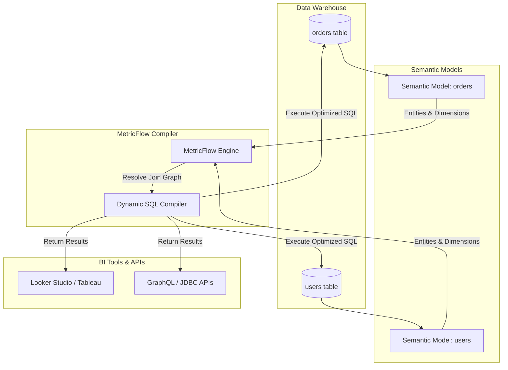

Trong kỷ nguyên của **Modern Data Stack**, việc xây dựng và duy trì một nguồn dữ liệu đáng tin cậy (single source of truth) là mục tiêu hàng đầu của mọi đội ngũ dữ liệu. Trước đây, dbt ([data build tool](/concepts/3-integration/transformation-analytics/dbt)) chủ yếu tập trung vào quá trình chuyển đổi dữ liệu vật lý (physical transformation) qua các model SQL. Tuy nhiên, khi dữ liệu được phân phối tới các công cụ BI khác nhau, logic tính toán các chỉ số (metrics) thường bị định nghĩa lại một cách rời rạc, dẫn đến tình trạng bất đồng số liệu như đã thảo luận trong bài viết về [Metrics Layer](/concepts/3-integration/transformation-analytics/metrics-layer).

Để giải quyết triệt để vấn đề này, dbt Labs đã giới thiệu **dbt Semantic Layer** được hỗ trợ bởi công nghệ cốt lõi **MetricFlow**. Bài viết này sẽ phân tích chi tiết kiến trúc, các thành phần cấu tạo, cơ chế hoạt động của MetricFlow, và cách triển khai nó trong các dự án thực tế.

---

## 1. Sự tiến hóa: Từ Legacy dbt Metrics đến MetricFlow và Semantic Layer

### Legacy dbt Metrics (Thế hệ cũ)
Trong các phiên bản dbt Core v1.x đầu tiên, dbt đã giới thiệu khái niệm `metrics` nguyên bản. Kỹ sư dữ liệu có thể khai báo các chỉ số trực tiếp trong file cấu hình `schema.yml`. Tuy nhiên, phiên bản legacy này gặp phải nhiều hạn chế nghiêm trọng:
* **Thiếu khả năng tự động JOIN**: Kỹ sư phải tự viết các câu lệnh JOIN phức tạp hoặc sử dụng các dbt packages phụ trợ để ghép nối các chiều dữ liệu (dimensions).
* **Không tối ưu hóa truy vấn**: Các câu lệnh SQL được sinh ra thường cồng kềnh, không tối ưu cho các hệ cơ sở dữ liệu phân tán.
* **Hạn chế về loại chỉ số**: Chỉ hỗ trợ các phép tính đơn giản và khó triển khai các chỉ số phức tạp như tỷ lệ (ratio) hay chỉ số tích lũy theo thời gian (cumulative).

### Sự xuất hiện của MetricFlow và Semantic Layer
Nhận ra những hạn chế này, dbt Labs đã mua lại **Transform** vào năm 2023 và tích hợp công nghệ **MetricFlow** làm engine cốt lõi cho **dbt Semantic Layer**.

Sự chuyển dịch này mang lại một triết lý thiết kế mới: **Tách biệt định nghĩa chỉ số khỏi cấu trúc bảng vật lý**. Thay vì truy vấn trực tiếp bảng, các công cụ BI hoặc ứng dụng sẽ gửi yêu cầu lấy chỉ số (ví dụ: `revenue` theo `country`) tới dbt Semantic Layer. MetricFlow đóng vai trò như một compiler thông minh, tự động phân tích đồ thị quan hệ (relationship graph) giữa các bảng để sinh ra câu lệnh SQL tối ưu nhất.

| Đặc điểm | Legacy dbt Metrics | dbt Semantic Layer & MetricFlow |
| :--- | :--- | :--- |
| **Engine thực thi** | Trình biên dịch Jinja SQL của dbt | MetricFlow Compiler chuyên dụng |
| **Cơ chế JOIN** | Thủ công thông qua dbt packages phụ trợ | Tự động hoàn toàn dựa trên Entity Relationships |
| **Hỗ trợ chỉ số phức tạp** | Rất hạn chế | Hỗ trợ đầy đủ: Simple, Ratio, Cumulative, Derived |
| **Độ trễ & Hiệu năng** | Phụ thuộc vào cách viết model vật lý | Được tối ưu hóa động (Dynamic SQL compilation) |

---

## 2. Các thành phần cốt lõi của Semantic Model (Core Components)

Để cấu hình dbt Semantic Layer, chúng ta định nghĩa các **Semantic Models** trong các file YAML trong thư mục dự án dbt (thường là `models/semantic_models/`). Một Semantic Model đóng vai trò làm lớp trừu tượng (abstraction layer) nằm trên một dbt model vật lý hoặc một bảng dữ liệu nguồn.

Dưới đây là sơ đồ kiến trúc tổng quan mô tả cách dòng dữ liệu đi qua Semantic Layer:




Một Semantic Model bao gồm ba thành phần chính: **Entities (Thực thể)**, **Dimensions (Chiều dữ liệu)**, và **Measures (Số đo)**.

### 2.1. Entities (Thực thể)
Entities là các cột đóng vai trò làm khóa (keys) để liên kết (JOIN) các Semantic Models lại với nhau. MetricFlow sử dụng Entities để xây dựng đồ thị quan hệ (join graph) tự động.
* **Primary Key (Khóa chính)**: Khóa duy nhất đại diện cho thực thể của bảng đó. Ví dụ: `order_id` trong bảng `orders`.
* **Foreign Key (Khóa ngoại)**: Khóa tham chiếu đến khóa chính của một bảng khác. Ví dụ: `user_id` trong bảng `orders`.
* **Unique Key (Khóa duy nhất)**: Dùng cho các trường hợp định danh duy nhất nhưng không phải khóa dùng để JOIN.

```yaml
# Ví dụ cấu hình Entities trong semantic model
entities:
  - name: order_id
    type: primary
  - name: user_id
    type: foreign
```

### 2.2. Dimensions (Chiều dữ liệu)
Dimensions là các thuộc tính dùng để nhóm (group by) hoặc lọc (filter) dữ liệu khi phân tích các chỉ số.
* **Categorical Dimensions (Chiều phân loại)**: Các thuộc tính dạng chuỗi hoặc logic. Ví dụ: `status` (pending, completed), `country`, `device_type`.
* **Time Dimensions (Chiều thời gian)**: Các mốc thời gian ghi nhận sự kiện. MetricFlow yêu cầu ít nhất một chiều thời gian được đánh dấu làm chiều thời gian chính (`primary: true`) để phục vụ cho các phép tính liên quan đến chuỗi thời gian (time-series) hoặc cửa sổ trượt (rolling window).

```yaml
# Ví dụ cấu hình Dimensions
dimensions:
  - name: order_status
    type: categorical
    expr: status
  - name: ordered_at
    type: time
    type_params:
      is_primary: true
      time_granularity: day
```

### 2.3. Measures (Số đo)
Measures là các phép tính tổng hợp thô (raw aggregations) được định nghĩa ở cấp độ bảng vật lý. Chúng là nguyên liệu thô để tạo nên các Metrics. Các phép tổng hợp phổ biến bao gồm `SUM`, `COUNT`, `COUNT_DISTINCT`, `AVERAGE`, `MIN`, `MAX`.

```yaml
# Ví dụ cấu hình Measures
measures:
  - name: order_total
    agg: sum
    expr: amount
  - name: distinct_users
    agg: count_distinct
    expr: user_id
```

---

## 3. Các loại Chỉ số (Metric Types) trong MetricFlow

Sau khi đã định nghĩa các Measures thô trong Semantic Models, chúng ta sẽ định nghĩa các **Metrics** hiển thị cho người dùng cuối. MetricFlow hỗ trợ 4 loại chỉ số chính:

### 3.1. Simple Metrics (Chỉ số đơn giản)
Đây là loại chỉ số cơ bản nhất, ánh xạ trực tiếp từ một Measure duy nhất đã được định nghĩa trong Semantic Model.

```yaml
# Định nghĩa Simple Metric
metrics:
  - name: total_revenue
    label: Total Revenue
    type: simple
    type_params:
      measure: order_total
```

### 3.2. Ratio Metrics (Chỉ số tỷ lệ)
Được sử dụng khi bạn cần chia một Metric/Measure cho một Metric/Measure khác. MetricFlow sẽ tự động xử lý các tình huống chia cho 0 (division by zero) một cách an toàn.

```yaml
# Định nghĩa Ratio Metric (ví dụ: Giá trị trung bình của mỗi đơn hàng)
metrics:
  - name: average_order_value
    label: Average Order Value
    type: ratio
    type_params:
      numerator: total_revenue
      denominator: total_orders
```

### 3.3. Cumulative Metrics (Chỉ số tích lũy & Cửa sổ trượt)
Sử dụng để tính toán các giá trị tích lũy theo thời gian hoặc trong một khoảng thời gian trượt (rolling window). Đây là tính năng cực kỳ mạnh mẽ của MetricFlow giúp thay thế các đoạn code SQL window function phức tạp.
* **Cumulative (Tích lũy vô hạn)**: Tính tổng từ thời điểm bắt đầu lịch sử dữ liệu đến thời điểm hiện tại.
* **Rolling Window (Cửa sổ trượt)**: Tính tổng hoặc trung bình trong một khoảng thời gian cố định (ví dụ: 7 ngày qua, 30 ngày qua).

```yaml
# Định nghĩa Cumulative Metric với cửa sổ trượt 30 ngày (Active Users trong 30 ngày)
metrics:
  - name: monthly_active_users
    label: 30-Day Active Users
    type: cumulative
    type_params:
      measure: distinct_users
      window: 30 days
```

### 3.4. Derived Metrics (Chỉ số phái sinh)
Derived metrics cho phép bạn kết hợp nhiều chỉ số khác nhau thông qua các biểu thức toán học (+, -, *, /) để tạo ra chỉ số mới mà không cần định nghĩa lại các phép tính tổng hợp thô.

```yaml
# Định nghĩa Derived Metric (ví dụ: Lợi nhuận ròng = Doanh thu - Chi phí - Thuế)
metrics:
  - name: net_profit
    label: Net Profit
    type: derived
    type_params:
      expr: revenue - cost - tax
      metrics:
        - name: total_revenue
          alias: revenue
        - name: total_cost
          alias: cost
        - name: total_tax
          alias: tax
```

---

## 4. Cơ chế biên dịch SQL động (Dynamic SQL Compilation) và JOINs

Điểm ưu việt lớn nhất của MetricFlow nằm ở **Cơ chế biên dịch SQL động**. Khi một người dùng yêu cầu xem dữ liệu:

> "Hãy cho tôi biết `monthly_active_users` theo `country` trong tháng `2026-05`."

MetricFlow sẽ thực hiện các bước sau:
1. **Duyệt đồ thị (Graph Traversal)**: Tìm kiếm đường đi ngắn nhất giữa Semantic Model chứa measure `distinct_users` (bảng `orders`) và Semantic Model chứa thuộc tính `country` (bảng `users`) thông qua Entity `user_id`.
2. **Xác định các mối quan hệ (Relationships)**: Nhận biết quan hệ là Nhiều-Một (Many-to-One) từ `orders` sang `users`.
3. **Biên dịch câu lệnh SQL (SQL Compilation)**: Sinh ra mã SQL tối ưu cho Data Warehouse đích (như Google BigQuery hoặc Snowflake).
4. **Giải quyết vấn đề Fan-out và Chasm Trap**: 
   * **Fan-out trap**: Xảy ra khi thực hiện JOIN bảng Một-Nhiều trước khi tổng hợp, khiến dữ liệu bảng "Một" bị nhân bản lên nhiều lần, dẫn đến kết quả `SUM` bị sai lệch. MetricFlow giải quyết bằng cách áp dụng kỹ thuật **Symmetric Aggregation** (tổng hợp đối xứng) hoặc thực hiện tổng hợp dữ liệu (aggregation) tại đúng cấp độ hạt (granularity) trước khi tiến hành JOIN.
   * **Chasm trap**: Xảy ra khi JOIN hai bảng Nhiều-Một với cùng một bảng trung gian, dẫn đến tích Đề-các (Cartesian product). MetricFlow tự động biên dịch thành các câu truy vấn con (subqueries) độc lập và thực hiện JOIN các kết quả đã được tổng hợp ở bước cuối cùng.

Nhờ cơ chế này, các [kỹ sư phân tích](/concepts/1-foundations/foundation/data-engineering/) không còn phải lo lắng về việc viết sai logic JOIN làm sai lệch số liệu báo cáo, đồng thời giảm thiểu tối đa sự phụ thuộc vào các kỹ năng viết SQL nâng cao được đề cập trong tài liệu [dbt nâng cao](/concepts/3-integration/transformation-analytics/dbt-advanced).

---

## Điểm mạnh và điểm yếu (Pros/Cons)

### Điểm mạnh (Pros)
* **Tính nhất quán tuyệt đối (Consistency)**: Chỉ số được định nghĩa một lần duy nhất bằng code (DRY - Don't Repeat Yourself). Tất cả các công cụ BI đều sử dụng chung một định nghĩa này.
* **Tính linh hoạt cao (Agility)**: Khi logic tính toán thay đổi (ví dụ: thay đổi công thức tính doanh thu ròng), bạn chỉ cần cập nhật tại một file YAML trong dbt. Thay đổi sẽ ngay lập tức áp dụng lên toàn bộ hệ thống báo cáo.
* **Hỗ trợ chu kỳ phát triển phần mềm (Software Engineering Best Practices)**: Quản lý phiên bản chỉ số bằng Git, thực hiện CI/CD tự động và kiểm thử chỉ số giống như kiểm thử code (xem thêm tại [dbt Testing](/concepts/3-integration/transformation-analytics/dbt-testing)).
* **Tối ưu hóa hiệu năng**: MetricFlow sinh ra SQL chuẩn hóa và tối ưu cho từng loại database, tránh các lỗi truy vấn kém hiệu quả từ phía người dùng BI.

### Điểm yếu (Cons)
* **Độ phức tạp ban đầu cao**: Việc định nghĩa các Semantic Models đòi hỏi sự tỉ mỉ và hiểu biết sâu sắc về quan hệ thực thể trong database.
* **Phụ thuộc vào dbt Cloud**: Một số tính năng kết nối Semantic Layer nâng cao thông qua giao thức JDBC/GraphQL yêu cầu sử dụng tài khoản dbt Cloud, điều này có thể phát sinh thêm chi phí bản quyền.
* **Thời gian phản hồi (Latency)**: Vì SQL được biên dịch động khi có yêu cầu, những truy vấn phức tạp trên lượng dữ liệu khổng lồ có thể gặp độ trễ nhất định nếu không được kết hợp với các giải pháp caching hoặc materialized views.

---

## Khi nào nên dùng

### Khi nào nên dùng dbt Semantic Layer?
* Doanh nghiệp sử dụng **nhiều công cụ BI khác nhau** (ví dụ: Tableau cho ban giám đốc, Looker Studio cho Marketing, Hex cho đội phân tích) và gặp tình trạng lệch số liệu giữa các bên.
* Hệ thống dữ liệu có cấu trúc phức tạp với nhiều bảng chiều (dimensions) và bảng sự kiện (fact tables) đan xen.
* Đội ngũ dữ liệu muốn áp dụng quy trình kiểm thử tự động cho các chỉ số kinh doanh thay vì chỉ kiểm thử cấu trúc dữ liệu thô.
* Phù hợp khi xây dựng kiến trúc **Headless BI** để cấp dữ liệu trực tiếp cho các ứng dụng SaaS bên ngoài thông qua API.

### Khi nào không nên dùng?
* Hệ thống báo cáo đơn giản, chỉ sử dụng duy nhất một công cụ BI mạnh về semantic layer (như Power BI với DAX hoặc Looker với LookML). Việc triển khai thêm dbt Semantic Layer có thể gây dư thừa kiến trúc.
* Đội ngũ dữ liệu còn mỏng và chưa tối ưu xong các model dữ liệu cơ bản (dbt models). Hãy tập trung xây dựng nền móng dữ liệu vững chắc bằng cách tham khảo tài liệu [dbt cơ bản](/concepts/3-integration/transformation-analytics/dbt) trước khi tiến lên Semantic Layer.

---

## Trọng tâm ôn luyện phỏng vấn

### Q1: Sự khác biệt cơ bản giữa dbt Model vật lý và dbt Semantic Model là gì?
**Gợi ý trả lời:**
* **dbt Model vật lý**: Là các file SQL/Python biên dịch trực tiếp thành các bảng (Tables) hoặc Views vật lý lưu trữ trong Data Warehouse. Nó tập trung vào việc làm sạch, biến đổi và cấu trúc lại dữ liệu (ETL/ELT).
* **dbt Semantic Model**: Là một lớp định nghĩa siêu dữ liệu (metadata layer) dạng YAML bao quanh các bảng vật lý. Nó không tạo ra bảng mới mà chỉ định nghĩa cách MetricFlow hiểu các cột trong bảng đó (đâu là Entities để JOIN, đâu là Dimensions để group/filter, đâu là Measures để aggregate) nhằm phục vụ việc biên dịch truy vấn động.

### Q2: Làm thế nào MetricFlow ngăn chặn hiện tượng Fan-out Trap khi thực hiện JOIN?
**Gợi ý trả lời:**
Hiện tượng Fan-out xảy ra khi ta JOIN một bảng chiều (ví dụ: bảng Users có quan hệ 1-Nhiều với bảng Orders) trước khi thực hiện tính tổng (`SUM`). Việc này làm nhân bản các giá trị của bảng Users, khiến phép tính tổng bị sai lệch (inflated sum).
MetricFlow ngăn chặn điều này bằng hai cách:
1. **Tổng hợp trước khi JOIN (Pre-aggregation JOIN)**: Nó tự động biên dịch SQL để thực hiện phép gom nhóm và tính toán tổng hợp (aggregate) trên bảng đích trước, sau đó mới thực hiện JOIN kết quả đã thu gọn với bảng chiều.
2. **Symmetric Aggregation**: Sử dụng các hàm tổng hợp đối xứng được tối ưu hóa cho từng Data Warehouse để đảm bảo tính chính xác của phép tính bất kể thứ tự thực hiện JOIN.

### Q3: Cumulative Metric hoạt động như thế nào trong MetricFlow và làm thế nào để tối ưu hóa nó?
**Gợi ý trả lời:**
Cumulative Metric trong MetricFlow dùng để tính lũy kế của một số đo theo thời gian (ví dụ: Running Total của doanh thu, hoặc số lượng người dùng hoạt động trong cửa sổ trượt 30 ngày).
* **Cơ chế**: MetricFlow tự động tạo ra các câu lệnh SQL sử dụng `WINDOW` hoặc tạo các dải ngày liên tục (date spine) để điền đầy dữ liệu và tính toán các chỉ số trong khoảng thời gian xác định.
* **Tối ưu hóa**: Để tối ưu hiệu năng của Cumulative Metric trên lượng dữ liệu lớn, ta nên:
  - Sử dụng các chiều thời gian đã được đánh chỉ mục hoặc phân vùng (partitioned/clustered columns) trong Data Warehouse.
  - Thiết lập các giá trị `grain` thời gian hợp lý (ví dụ: tổng hợp theo ngày thay vì theo giờ) để giảm số lượng dòng tính toán.
  - Sử dụng tính năng Materialization của dbt để lưu trữ sẵn các bảng tổng hợp trung gian.

---

## English Summary

| Vietnamese Term | English Equivalent | Description |
| :--- | :--- | :--- |
| Lớp ngữ nghĩa | **Semantic Layer** | An abstraction layer that translates complex physical data structures into business-friendly concepts. |
| Biên dịch truy vấn động | **Dynamic Query Compilation** | The process where MetricFlow translates high-level metric requests into optimized SQL statements at runtime. |
| Thực thể | **Entities** | Identifiers (keys) used to define relationships and perform joins across different semantic models. |
| Số đo | **Measures** | Raw aggregations (e.g., SUM, COUNT) calculated directly from columns in physical tables. |
| Chỉ số phái sinh | **Derived Metrics** | Advanced metrics computed by combining other metrics using mathematical operators. |
| Lỗi nhân bản dòng | **Fan-out Trap** | A common SQL error where joining a 1-to-many relationship before aggregation inflates metric values. |

**Key Takeaways**:
1. The **dbt Semantic Layer** (powered by **MetricFlow**) represents a major shift from static, model-based metric definitions to dynamic, relationship-aware metric generation.
2. By defining **Entities**, **Dimensions**, and **Measures**, you build a semantic graph that MetricFlow uses to resolve join paths, eliminating inconsistencies across BI tools.
3. MetricFlow natively supports complex metrics like **Ratio**, **Cumulative** (with rolling windows), and **Derived** metrics.
4. Implementing a semantic layer establishes **Single Source of Truth**, enforces **DRY principles**, and brings software engineering rigor to business metrics management.

---

## Xem thêm các khái niệm liên quan
* [Hợp đồng dữ liệu - Data Contract & Schema Registry](/concepts/3-integration/transformation-analytics/data-contract/)
* [CI/CD cho Data Pipeline & Slim CI](/concepts/3-integration/transformation-analytics/data-pipeline-cicd/)
* [Advanced dbt Pipelines & Stateful CI](/concepts/3-integration/transformation-analytics/dbt-advanced/)

## Tài liệu tham khảo

1. [dbt Core and MetricFlow Documentation](https://docs.getdbt.com/docs/build/about-metricflow)
2. [dbt Semantic Models configuration spec](https://docs.getdbt.com/docs/build/semantic-models)
3. [Snowflake Integration with dbt Semantic Layer](https://docs.snowflake.com/en/developer-guide/dbt-semantic-layer)
4. [Databricks Partner Connect for dbt Semantic Layer](https://docs.databricks.com/partner-connect/dbt-semantic-layer.html)
5. [Google Cloud Blog: dbt Semantic Layer on BigQuery](https://cloud.google.com/blog/products/databases/dbt-semantic-layer-support-for-bigquery)
6. [Apache Superset: Connecting to dbt Semantic Layer](https://superset.apache.org/docs/configuration/databases#dbt-semantic-layer)
