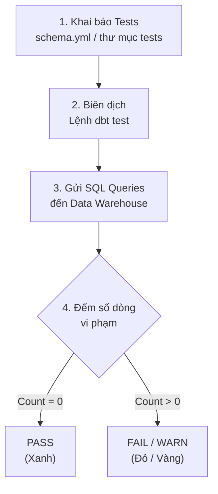

Có một tình huống trớ trêu mà bất kỳ ai làm trong ngành dữ liệu cũng từng trải qua ít nhất một lần: Sếp hoặc đối tác kinh doanh gửi một tin nhắn đầy giận dữ vào group chat: *"Tại sao doanh thu trên dashboard hôm nay lại giảm đi 50%?"* hoặc *"Sao danh sách khách hàng lại xuất hiện tên trùng lặp thế này?"*. Cả đội dữ liệu cuống cuồng đi kiểm tra, rà soát lại đống code [ETL](/concepts/3-integration/etl-elt/etl/) phức tạp để tìm xem lỗi phát sinh từ đâu.

Để chấm dứt cảnh tượng "chữa cháy" bị động đó, **dbt Testing** đã ra đời. Đây là một cơ chế kiểm thử tích hợp trực tiếp trong **[dbt](/concepts/3-integration/transformation-analytics/dbt/) (data build tool)**, giúp bạn chủ động phát hiện lỗi và bảo vệ chất lượng dữ liệu (Data Quality) tự động ngay khi dữ liệu vừa được biến đổi.

## dbt Testing hoạt động như thế nào?

Trong hệ sinh thái dbt, mọi bài kiểm thử (test) thực chất đều là một câu truy vấn SQL (SQL Query). 

Nguyên lý hoạt động của dbt Testing cực kỳ đơn giản nhưng vô cùng hiệu quả: **Một bài test dbt sẽ cố gắng tìm kiếm và trả về (SELECT) những dòng dữ liệu vi phạm quy tắc.

** 


1. Bạn khai báo các bài test trong file cấu hình `.yml` hoặc tự viết câu lệnh SQL.
2. Khi bạn gõ lệnh `dbt test`, dbt sẽ tự động biên dịch các cấu hình đó thành các câu lệnh SQL hoàn chỉnh.
3. dbt gửi các câu lệnh SQL này lên [Data Warehouse](/concepts/2-storage/data-warehouse/data-warehouse/) (như BigQuery, [Snowflake](/concepts/2-storage/cloud-data-platform/snowflake/), hay PostgreSQL) để thực thi.
4. Hệ thống sẽ đếm số lượng dòng dữ liệu trả về:
   * Nếu kết quả trả về là **0 dòng**: Nghĩa là không có dòng dữ liệu nào vi phạm $\rightarrow$ Test **PASS** (màu xanh lá).
   * Nếu kết quả trả về từ **1 dòng trở lên**: Nghĩa là đã có dữ liệu lỗi xuất hiện $\rightarrow$ Test **FAIL** (màu đỏ). dbt sẽ thông báo chi tiết dòng nào bị lỗi và trả về mã lỗi.

## Tại sao dbt Testing lại là bắt buộc?

Dữ liệu thô thu thập từ các hệ thống nguồn (như APIs hay cơ sở dữ liệu ứng dụng) là một thế giới đầy biến động và không bao giờ hoàn hảo. Có hàng tá lỗi có thể xảy ra:
* Một bản cập nhật phần mềm của đội Product vô tình làm rớt khóa chính, khiến dữ liệu giao dịch bị nhân đôi (Duplicate).
* Hệ thống thanh toán gặp lỗi logic, ghi nhận số lượng đơn hàng hoặc số tiền thanh toán là một số âm.
* Lỗi liên kết khóa ngoại: ID sản phẩm trong bảng hóa đơn không tồn tại trong bảng danh mục sản phẩm.

Nếu chúng ta không có một hệ thống tự động kiểm tra dữ liệu này trước khi đưa lên báo cáo, chúng ta sẽ liên tục đưa ra những quyết định kinh doanh sai lệch dựa trên những con số sai.

## Hai loại vũ khí kiểm thử trong dbt

dbt cung cấp cho bạn hai công cụ kiểm thử mạnh mẽ để bao phủ mọi trường hợp:

### 1. Generic Tests (Kiểm thử cấu hình sẵn)
Đây là những bài test phổ biến nhất, được định nghĩa sẵn bằng các macro Jinja và có thể tái sử dụng cho bất kỳ cột, bất kỳ bảng nào chỉ với vài dòng khai báo trong file cấu hình `.yml`. 

dbt tích hợp sẵn 4 bài test cơ bản cực kỳ quan trọng (thường gọi là "Big 4"):
* `unique`: Đảm bảo giá trị trong cột không được trùng lặp.
* `not_null`: Đảm bảo cột không chứa giá trị NULL.
* `accepted_values`: Ràng buộc giá trị trong cột phải nằm trong một danh sách giới hạn cho trước.
* `relationships`: Kiểm tra tính toàn vẹn của khóa ngoại (đảm bảo mọi ID ở bảng Fact đều phải tồn tại ở bảng Dimension tương ứng).

### 2. Singular Tests (Kiểm thử đặc thù)
Nếu bạn có những logic kiểm tra phức tạp, mang tính đặc thù nghiệp vụ mà 4 bài test trên không giải quyết được, bạn có thể tự viết câu lệnh SQL thuần túy và lưu vào thư mục `tests/`. 

Ví dụ: *"Ngày kết thúc hợp đồng không được phép nhỏ hơn ngày bắt đầu hợp đồng"* hoặc *"Tổng doanh số ngày hôm nay không được phép giảm quá 50% so với ngày hôm qua"*.

---

## Ví dụ thực tế về Generic và Singular Tests

### Khai báo Generic Test (trong file `schema.yml`)
```yaml
version: 2

models:
  - name: fct_orders
    description: "Bảng sự kiện giao dịch đơn hàng."
    columns:
      - name: order_id
        description: "Khóa chính của đơn hàng"
        tests:
          - unique
          - not_null
      
      - name: customer_id
        tests:
          - relationships:
              to: ref('dim_customers') # Kiểm tra khóa ngoại xem ID khách hàng có tồn tại không
              field: customer_id
              
      - name: status
        tests:
          - accepted_values:
              values: ['placed', 'shipped', 'completed', 'returned']
```

### Viết Singular Test (tạo file `tests/assert_total_amount_is_positive.sql`)
Nhớ rằng, chúng ta cần truy vấn ra các dòng dữ liệu bị lỗi (doanh thu bị âm):
```sql
-- Tìm các đơn hàng có doanh thu bị lỗi (nhỏ hơn 0)
SELECT
    order_id,
    sum_amount
FROM {{ ref('fct_orders') }}
WHERE sum_amount < 0
```

---

## "Bí kíp" thực chiến & Những sự đánh đổi khi test dữ liệu

### Kinh nghiệm triển khai thực tế (Best Practices)
* **Bắt buộc test mọi khóa chính**: Hãy luôn gán cặp test `unique` và `not_null` cho mọi cột khóa chính trong dự án của bạn. Điều này ngăn chặn triệt để lỗi nhân bản dòng (Fan-out) khi thực hiện các phép JOIN phía sau.
* **Tích hợp vào quy trình CI/CD**: Cấu hình để hệ thống tự động chạy `dbt test` mỗi khi có ai đó mở Pull Request sửa code. Chặn không cho merge code mới nếu có bất kỳ bài test nào bị báo đỏ.
* **Tận dụng thư viện cộng đồng**: Đừng tự mình viết lại bánh xe. Hãy cài đặt các package mở rộng như `dbt_expectations` để sử dụng thêm hàng chục bài test mạnh mẽ (như kiểm tra định dạng email bằng regex, kiểm tra phân phối dữ liệu dị biệt).
* **Phân cấp độ lỗi (Severity)**: Với các lỗi không quá nghiêm trọng (ví dụ dữ liệu thử nghiệm của môi trường test bị thiếu), bạn nên đổi cấu hình sang cảnh báo `severity: warn` thay vì báo lỗi `error` làm dừng toàn bộ pipeline.

### Những sai lầm phổ biến cần tránh
* **Lạm dụng viết test (Over-testing)**: Tạo ra quá nhiều bài test không cần thiết trên những cột phụ. Việc này sẽ làm tăng hóa đơn tính toán (Compute cost) của Data Warehouse một cách vô ích.
* **Bỏ qua các cảnh báo (Warnings)**: Rất nhiều đội ngũ kỹ thuật cấu hình cảnh báo `warn` rồi phớt lờ chúng. Các cảnh báo này tích tụ lâu ngày sẽ biến thành một bãi rác dữ liệu khổng lồ mà không ai kiểm soát được.

### Đánh đổi (Trade-offs)
* **Chất lượng dữ liệu vs. Chi phí vận hành**: Chạy các bài test trên các bảng dữ liệu khổng lồ (hàng tỷ dòng) sẽ ngốn rất nhiều tài nguyên và tiền bạc của doanh nghiệp. Hãy tối ưu bằng cách cấu hình test chỉ chạy trên phần dữ liệu mới cập nhật (`incremental testing`) thay vì quét toàn bộ bảng.
* **Nỗ lực bảo trì**: Dữ liệu nghiệp vụ liên tục thay đổi. Ví dụ, công ty thêm một trạng thái đơn hàng mới là `refunded`, bạn sẽ phải cập nhật lại toàn bộ danh sách `accepted_values` tương ứng để tránh hệ thống báo lỗi giả (False Positives).

---

## Điểm mạnh và điểm yếu

### Điểm mạnh (Pros)
* **Automated & Continuous**: Tự động hóa hoàn toàn quá trình kiểm thử dữ liệu trong CI/CD, ngăn chặn sớm dữ liệu rác.
* **Standardized**: Định nghĩa kiểm thử rõ ràng thông qua file cấu hình YAML (Generic Tests), giúp dễ bảo trì và mở rộng.
* **Declarative**: Cú pháp khai báo đơn giản, không cần lập trình code phức tạp để chạy các test cơ bản.

### Điểm yếu (Cons)
* **Compute Cost**: Chạy kiểm thử trên bảng lớn ngốn tài nguyên tính toán (Compute cost) của Data Warehouse.
* **Maintenance Overhead**: Khi logic nghiệp vụ thay đổi, cần liên tục cập nhật các quy tắc test tương ứng để tránh cảnh báo giả.

---

## Khi nào nên dùng

### Nên áp dụng khi:
* Dữ liệu nguồn từ bên thứ ba hoặc hệ thống microservices thường xuyên có sự thay đổi cấu trúc hoặc thiếu đồng bộ.
* Xây dựng các luồng dữ liệu quan trọng phục vụ báo cáo tài chính, báo cáo quản trị cấp cao yêu cầu độ chính xác tuyệt đối.

### Chưa nên áp dụng khi:
* Môi trường phát triển ban đầu (POC) với dữ liệu giả lập tĩnh, không thay đổi cấu trúc hoặc không có rủi ro về chất lượng dữ liệu.

---

## Trọng tâm ôn luyện phỏng vấn

### 1. Triết lý thiết kế đằng sau một bài test dbt (Singular test) là gì? Khác biệt giữa câu lệnh `SELECT` thông thường và `SELECT` trong dbt test như thế nào?
* **Gợi ý trả lời**: Triết lý của dbt testing là phát hiện dòng lỗi. Một câu lệnh `SELECT` thông thường dùng để tìm kiếm dữ liệu đúng theo yêu cầu (Target data). Ngược lại, câu lệnh `SELECT` trong dbt test lại đi tìm kiếm những dòng dữ liệu bị lỗi (Failing data). Do dbt quy định kết quả trả về lớn hơn 0 dòng là test FAIL, nên chúng ta phải thiết lập điều kiện lọc ở mệnh đề `WHERE` để tóm được các bản ghi vi phạm (ví dụ lọc doanh thu nhỏ hơn 0 thay vì lớn hơn 0).

### 2. Làm thế nào để khắc phục chi phí quét dữ liệu quá đắt đỏ khi chạy `unique` test trên một bảng sự kiện hàng tỷ dòng mỗi ngày?
* **Gợi ý trả lời**: Để tối ưu chi phí và hiệu năng khi test bảng lớn, tôi áp dụng các cách sau:
  * **Cấu hình lọc dữ liệu gần nhất (Filtering)**: Thay vì quét toàn bộ lịch sử bảng, tôi viết thêm điều kiện để test chỉ chạy trên dữ liệu của 3 ngày gần đây (ví dụ: `WHERE created_at >= CURRENT_DATE - 3`).
  * **Tận dụng metadata**: Đảm bảo các bảng Dimension và Fact trên Data Warehouse được cấu hình tối ưu (như clustered tables) để giúp việc kiểm tra khóa chính diễn ra nhanh nhất mà không phải quét toàn bộ ổ đĩa vật lý.

---

## Xem thêm các khái niệm liên quan
* [Hợp đồng dữ liệu - Data Contract & Schema Registry](/concepts/3-integration/transformation-analytics/data-contract/)
* [CI/CD cho Data Pipeline & Slim CI](/concepts/3-integration/transformation-analytics/data-pipeline-cicd/)
* [Advanced dbt Pipelines & Stateful CI](/concepts/3-integration/transformation-analytics/dbt-advanced/)

## Tài liệu tham khảo

1. dbt Labs Documentation: [Test your dbt projects](https://docs.getdbt.com/docs/build/tests)
2. AWS Big Data Blog: [Data quality validation with dbt on AWS](https://aws.amazon.com/blogs/big-data/data-quality-validation-with-dbt-on-aws/)
3. Databricks Blog: [Integrating dbt testing with Databricks workflows](https://www.databricks.com/blog/integrating-dbt-testing-with-databricks-workflows)
4. Snowflake Documentation: [Testing and deploying dbt models on Snowflake](https://docs.snowflake.com/en/developer-guide/dbt/dbt-snowflake-testing)
5. Google Cloud Architecture: [CI/CD pipelines for data warehousing with dbt and BigQuery](https://cloud.google.com/architecture/cicd-pipelines-for-data-warehousing-with-dbt-and-bigquery)

---

## English Summary

**dbt Testing** provides an automated framework for Data and Analytics Engineers to embed data quality checks (assertions) directly into their transformation pipelines. Using YAML configurations for generic tests (like `unique`, `not_null`, `accepted_values`, and `relationships`) or writing custom SQL for singular tests, dbt dynamically executes these queries against the Data Warehouse. The fundamental rule is that a test fails if it returns one or more records (representing data violations), enabling teams to catch data anomalies early, ensure Single Source of Truth integrity, and prevent bad data from reaching downstream business dashboards.