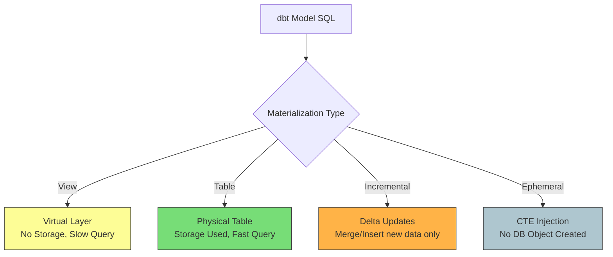

Khi bạn viết một mô hình (model) trong [dbt](/concepts/3-integration/transformation-analytics/dbt/) (data build tool), về mặt bản chất bạn chỉ đang viết một câu lệnh `SELECT` thuần túy. Vậy làm thế nào để câu lệnh `SELECT` đó biến thành một bảng dữ liệu thực tế hay một khung nhìn ảo trên [Data Warehouse](/concepts/2-storage/data-warehouse/data-warehouse/) ([Snowflake](/concepts/2-storage/cloud-data-platform/snowflake/), BigQuery, Redshift,...)? 

Câu trả lời nằm ở **Materialization (Vật chất hóa / Phương thức lưu trữ)**.

Việc chọn đúng loại materialization là một trong những quyết định quan trọng nhất của một Analytics Engineer. Nó không chỉ ảnh hưởng trực tiếp đến tốc độ chạy của pipeline mà còn quyết định hóa đơn chi phí Cloud hàng tháng của doanh nghiệp.

## Materialization là gì?

Nói một cách đơn giản, **Materialization** là chiến lược xác định cách dbt biên dịch và thực thi mã SQL của bạn trên Data Warehouse. Thay vì bắt bạn phải tự tay viết các câu lệnh DDL (Data Definition Language) phức tạp và dễ lỗi như `CREATE TABLE AS` hay `CREATE VIEW AS`, dbt cho phép bạn tập trung 100% vào logic nghiệp vụ của câu lệnh `SELECT`. dbt sẽ tự động "bọc" câu lệnh của bạn bằng cú pháp tương ứng với chiến lược lưu trữ mà bạn chọn.

## Bốn phương thức lưu trữ cốt lõi trong dbt

dbt cung cấp cho chúng ta 4 loại materialization được xây dựng sẵn:



### 1. View (Mặc định)
Khi cấu hình là View, dbt sẽ tạo ra một khung nhìn logic ảo trên database (`CREATE VIEW AS`). 
* **Cơ chế**: Phương thức này không chiếm bất kỳ dung lượng đĩa cứng nào vì nó không lưu dữ liệu thực tế. Mỗi khi bạn chạy truy vấn đến View này, cơ sở dữ liệu sẽ phải đọc lại logic SQL gốc và tính toán lại từ đầu.
* **Thời gian build**: Gần như tức thời (chỉ tốn vài miligiây để cập nhật metadata của View).
* **Hiệu năng truy vấn downstream**: Chậm nếu truy vấn phức tạp hoặc chứa nhiều phép JOIN.

### 2. Table
Với Table, dữ liệu được tính toán trước và ghi vật lý xuống đĩa cứng (`CREATE TABLE AS`).
* **Cơ chế**: Tốn dung lượng lưu trữ nhưng tốc độ truy vấn sau đó cực kỳ nhanh vì dữ liệu đã nằm sẵn trên ổ đĩa dưới dạng các cột đã được tối ưu hóa (micro-partitions trong Snowflake hoặc partitioned blocks trong BigQuery).
* **Thời gian build**: Chậm vì phải ghi toàn bộ dữ liệu xuống đĩa.
* **Quy trình Drop & Swap**: dbt thực hiện quy trình này một cách an toàn bằng cách tạo bảng tạm (`__dbt_tmp`), chèn dữ liệu, rename bảng gốc thành bảng backup, rename bảng tạm thành bảng chính thức và cuối cùng xóa bảng backup. Điều này tránh downtime cho các báo cáo đang chạy.

### 3. Incremental (Cập nhật gia tăng)
Đây là phiên bản nâng cấp của Table dành cho các bảng dữ liệu khổng lồ. Thay vì xóa đi và xây lại toàn bộ bảng (Full Refresh) mỗi ngày, dbt sẽ chỉ chèn (insert) hoặc cập nhật (merge) các dòng dữ liệu mới xuất hiện hoặc có thay đổi kể từ lần chạy cuối cùng.
* **Cơ chế**: Tiết kiệm tối đa tài nguyên tính toán và chi phí khi làm việc với các bảng dữ liệu lớn.
* **Các chiến lược gia tăng (Incremental Strategies)**:
  * **Append**: Chỉ chèn thêm dữ liệu mới vào cuối bảng mà không kiểm tra trùng lặp (phù hợp với log events).
  * **Merge**: Thực hiện cập nhật các dòng đã tồn tại và chèn thêm dòng mới dựa trên một `unique_key` (phù hợp với bảng chiều - dimension).
  * **Delete+Insert**: Xóa các bản ghi khớp với khóa và chèn dữ liệu mới vào (giải pháp tốt cho các database không hỗ trợ cú pháp `MERGE` trực tiếp).
  * **Insert+Overwrite**: Ghi đè toàn bộ phân vùng (partitions) dữ liệu bị ảnh hưởng (rất tối ưu cho BigQuery hoặc Databricks Delta).

### 4. Ephemeral (Bảng tạm thời)
Đây là một cơ chế đặc biệt giúp dbt dọn dẹp Data Warehouse. Mô hình cấu hình Ephemeral sẽ không tạo ra bất kỳ đối tượng vật lý hay ảo nào trên database. Khi có một mô hình khác tham chiếu đến nó thông qua hàm `ref()`, dbt sẽ tự động chèn toàn bộ logic của mô hình Ephemeral này vào dưới dạng một CTE (`WITH ... AS ()`).

---

## Bảng so sánh chi tiết các loại Materialization

| Tiêu chí | View | Table | Incremental | Ephemeral |
| :--- | :--- | :--- | :--- | :--- |
| **Lưu trữ vật lý** | Không | Có | Có | Không |
| **Thời gian build** | Rất nhanh | Chậm | Nhanh (chỉ nạp delta) | Không có build time độc lập |
| **Chi phí tính toán truy vấn** | Cao (tính toán lại mỗi lần) | Thấp (đã tính trước) | Thấp (đã tính trước) | Phụ thuộc vào câu lệnh downstream |
| **Downtime khi cập nhật** | Không | Không (nhờ quy trình swap) | Không (Merge/Insert trực tiếp) | Không |
| **Độ phức tạp thiết lập** | Thấp nhất | Thấp | Cao (cần lọc thời gian/khóa) | Trung bình |

---

## Thiết kế Custom Materializations trong dbt
Đối với các kịch bản nâng cao, dbt cho phép lập trình viên định nghĩa các custom materializations bằng cách viết các macro với khối lệnh ``.

Ví dụ, bạn muốn tạo một bảng dạng Snowflake Transient Table thay vì Table thông thường để tiết kiệm chi phí Fail-safe storage, hoặc định nghĩa cấu trúc lưu trữ phi chuẩn. Cấu trúc cơ bản của một macro custom materialization như sau:

```sql

  
  
  
  -- Thực thi tạo bảng tạm transient
  
    create or replace transient table {{ tmp_relation }} as (
      {{ sql }}
    );
  
  
  -- Swap bảng tạm transient với bảng chính thức
  
  
  {{ return({'relations': [target_relation]}) }}

```

---

## Thực hành: Thiết lập Incremental Materialization

Dưới đây là một ví dụ thực tế về cách cấu hình một mô hình cập nhật gia tăng (Incremental) cho bảng theo dõi sự kiện truy cập web (`pageviews`):
```sql
{{
    config(
        materialized='incremental',
        unique_key='event_id',
        incremental_strategy='merge'
    )
}}

SELECT
    event_id,
    user_id,
    page_url,
    event_timestamp
FROM {{ source('web_tracking', 'raw_pageviews') }}

-- Khối logic này chỉ chạy trong các lần chạy incremental, không chạy khi full-refresh


  WHERE event_timestamp >= (SELECT max(event_timestamp) FROM {{ this }})

```

---

## Điểm mạnh và điểm yếu

### Điểm mạnh (Pros)
* **Flexibility & Simplicity**: Thay đổi chiến lược lưu trữ dữ liệu (từ View sang Table/Incremental) cực kỳ nhanh chóng chỉ bằng cách sửa cấu hình ở đầu file, không cần viết lại mã DDL.
* **Resource Optimization**: Incremental materialization giúp tiết kiệm đáng kể tài nguyên tính toán và chi phí khi xử lý các tập dữ liệu lớn bằng cách hạn chế quét toàn bộ dữ liệu lịch sử.
* **Dọn dẹp môi trường**: Ephemeral giúp giữ sơ đồ schema của Data Warehouse gọn gàng bằng cách ẩn đi các bảng trung gian chỉ phục vụ tính toán một lần.

### Điểm yểu (Cons)
* **Độ phức tạp của Incremental**: Việc thiết lập đòi hỏi sự cẩn thận cao. Nếu logic lọc ngày bị lệch hoặc cấu trúc bảng nguồn thay đổi, dữ liệu gia tăng có thể bị trùng lặp hoặc mất mát.
* **Tải bộ nhớ với Ephemeral**: Việc lồng ghép quá nhiều model Ephemeral liên tục khiến câu lệnh SQL cuối cùng trở nên quá dài và phức tạp, dễ gây quá tải trình tối ưu hóa truy vấn của Data Warehouse.

---

## Khi nào nên dùng

### Nên áp dụng khi:
* Cần tối ưu hóa hiệu năng truy vấn cho các báo cáo BI thông qua việc vật chất hóa dữ liệu dưới dạng Table hoặc Incremental.
* Cần giảm thiểu chi phí quét dữ liệu hàng ngày trên các Cloud Data Warehouses bằng cách chỉ nạp dữ liệu gia tăng.
* Tạo các bảng Staging nhẹ nhàng, biến đổi nhanh chóng bằng View.

### Chưa nên áp dụng khi:
* Logic nghiệp vụ biến đổi dữ liệu chưa ổn định và cấu trúc bảng nguồn (schema) liên tục thay đổi lớn, khiến các Incremental models dễ bị lỗi.
* Đối với các tập dữ liệu nhỏ (dưới vài trăm ngàn dòng), chi phí quản lý các Incremental models lớn hơn nhiều so với việc chỉ đơn giản chạy full-refresh bằng Table.

---

## Trọng tâm ôn luyện phỏng vấn

### 1. Phân biệt `is_incremental()` macro và cấu hình incremental materialization trong dbt? Tại sao chúng ta luôn cần cả hai?
* **Gợi ý trả lời**:
  * Cấu hình `materialized='incremental'` hướng dẫn dbt cách tạo DDL/DML tương ứng để chèn hoặc merge dữ liệu thay vì xây dựng lại từ đầu.
  * Tuy nhiên, nếu thiếu macro `is_incremental()`, dbt vẫn sẽ lấy toàn bộ kết quả của câu lệnh `SELECT` để merge vào bảng đích, làm mất đi ý nghĩa của việc cập nhật gia tăng.
  * Macro `is_incremental()` giúp lọc dữ liệu động (ví dụ: chỉ lấy các dòng có timestamp lớn hơn timestamp lớn nhất hiện có trong bảng). Sự kết hợp của cả hai đảm bảo tối ưu hóa cả DDL chạy trên kho dữ liệu và lượng dữ liệu được quét.

### 2. Sự khác biệt giữa các chiến lược `merge` và `insert_overwrite` trong Incremental model là gì?
* **Gợi ý trả lời**:
  * Chiến lược **`merge`** dựa trên khóa chính (`unique_key`) để tìm các bản ghi trùng khớp giữa tập dữ liệu mới và dữ liệu hiện có trong bảng. Bản ghi trùng sẽ được cập nhật (update), bản ghi mới sẽ được chèn vào (insert).
  * Chiến lược **`insert_overwrite`** không tìm kiếm từng bản ghi dựa trên khóa chính. Thay vào đó, nó xác định các phân vùng (partitions) dữ liệu nào có thay đổi trong tập dữ liệu mới, xóa sạch toàn bộ các phân vùng đó trong bảng cũ, và chèn toàn bộ dữ liệu mới của các phân vùng đó vào. Chiến lược này tối ưu hơn nhiều khi xử lý lượng dữ liệu khổng lồ trên BigQuery hoặc Spark.

### 3. Ephemeral materialization hoạt động như thế nào và khi nào nó có thể gây ra lỗi hiệu năng trong dbt?
* **Gợi ý trả lời**: 
  * Ephemeral materialization không tạo ra bất kỳ thực thể vật lý nào trên Data Warehouse. Khi biên dịch, dbt sẽ tiêm mã SQL của model này thành một CTE lồng bên trong các model downstream tham chiếu đến nó.
  * Nó gây lỗi hiệu năng khi model Ephemeral này được tham chiếu nhiều lần ở các nhánh khác nhau trong cùng một model downstream, hoặc khi lồng quá nhiều cấp Ephemeral. Lúc này, trình tối ưu hóa của database có thể không thể cache kết quả của CTE và phải thực thi lại logic tính toán đó nhiều lần, làm tăng CPU và thời gian xử lý.

### 4. Custom Materialization trong dbt được định nghĩa ở đâu và khi nào nên dùng nó?
* **Gợi ý trả lời**: Custom Materialization được định nghĩa dưới dạng các macro trong thư mục `macros/` của dự án dbt. Chúng ta nên tự thiết kế custom materialization khi các phương thức mặc định của dbt không hỗ trợ cấu trúc lưu trữ đặc thù (ví dụ: tạo bảng dạng transient table của Snowflake, viết trực tiếp vào file parquet trên S3 thông qua các bảng external, hoặc gọi các stored procedures chuyên biệt để tối ưu hóa hiệu năng ghi dữ liệu).

### 5. Làm thế nào để giải quyết lỗi khi cấu trúc bảng nguồn (schema) thay đổi trong Incremental model?
* **Gợi ý trả lời**: Chúng ta có thể cấu hình tham số `on_schema_change` trong dbt với các tùy chọn như:
  * `fail`: Báo lỗi và dừng pipeline nếu phát hiện schema thay đổi.
  * `ignore`: Bỏ qua các cột mới được thêm vào.
  * `append_new_columns`: Tự động thêm các cột mới vào cuối bảng đích (nhưng không thay đổi kiểu dữ liệu cột cũ).
  * `sync_all_columns`: Đồng bộ hoàn toàn cả cột mới và cột bị xóa. Nếu có sự thay đổi lớn về kiểu dữ liệu của cột cũ, phương pháp tốt nhất là chạy lệnh `dbt run --select <model_name> --full-refresh` để xây dựng lại bảng đích từ đầu.

---

## Xem thêm các khái niệm liên quan
* [CI/CD cho Data Pipeline & Slim CI](/concepts/3-integration/transformation-analytics/data-pipeline-cicd/)
* [Advanced dbt Pipelines & Stateful CI](/concepts/3-integration/transformation-analytics/dbt-advanced/)
* [dbt Models & Phân tầng Thư mục](/concepts/3-integration/transformation-analytics/dbt-models/)

## Tài liệu tham khảo

1. dbt Labs Documentation: [About materializations](https://docs.getdbt.com/docs/build/materializations)
2. Google Cloud Architecture: [Optimize BigQuery query performance using partition and cluster](https://cloud.google.com/bigquery/docs/partitioned-tables)
3. AWS Architecture Blog: [Best practices for designing databases on AWS](https://aws.amazon.com/blogs/database/best-practices-for-designing-databases-on-aws/)
4. Snowflake Documentation: [Understanding materialization and caching in Snowflake](https://docs.snowflake.com/en/user-guide/views-materialized)
5. Databricks Blog: [Optimizing data pipelines using delta tables and dbt](https://www.databricks.com/blog/optimizing-data-pipelines-using-delta-tables-and-dbt)

---

## English Summary

In dbt, materialization refers to the strategies defining how an underlying SQL model is instantiated in the target Data Warehouse. The four primary materializations are **View** (virtual layer, zero build time but slow query), **Table** (physical instantiation, fast query but slow build), **Incremental** (inserting or updating only new data to an existing table to save compute time on massive datasets), and **Ephemeral** (compiled directly as CTEs within downstream models without physical persistence). Advanced users can design **Custom Materializations** using Jinja macros to customize write strategies on modern cloud data warehouses like Snowflake, BigQuery, or Databricks Delta. Choosing the correct materialization is crucial for optimizing cloud compute costs, storage, and pipeline execution time.
