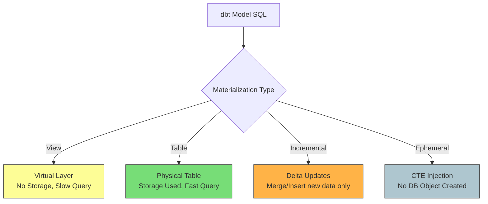

Khi bạn viết một mô hình (model) trong [dbt](/concepts/3-integration/transformation-analytics/dbt/) (data build tool), về mặt bản chất bạn chỉ đang viết một câu lệnh `SELECT` thuần túy. Vậy làm thế nào để câu lệnh `SELECT` đó biến thành một bảng dữ liệu thực tế hay một khung nhìn ảo trên [Data Warehouse](/concepts/2-storage/data-warehouse/data-warehouse/) ([Snowflake](/concepts/2-storage/cloud-data-platform/snowflake/), BigQuery, Redshift,...)? 

Câu trả lời nằm ở **Materialization (Vật liệu hóa / Phương thức lưu trữ)**.

Việc chọn đúng loại materialization là một trong những quyết định quan trọng nhất của một Analytics Engineer. Nó không chỉ ảnh hưởng trực tiếp đến tốc độ chạy của pipeline mà còn quyết định hóa đơn chi phí Cloud hàng tháng của doanh nghiệp.

## Materialization là gì?

Nói một cách đơn giản, **Materialization** là chiến lược xác định cách dbt biên dịch và thực thi mã SQL của bạn trên Data Warehouse. Thay vì bắt bạn phải tự tay viết các câu lệnh DDL (Data Definition Language) phức tạp và dễ lỗi như `CREATE TABLE AS` hay `CREATE VIEW AS`, dbt cho phép bạn tập trung 100% vào logic nghiệp vụ của câu lệnh `SELECT`. dbt sẽ tự động "bọc" câu lệnh của bạn bằng cú pháp tương ứng với chiến lược lưu trữ mà bạn chọn.

## Bốn phương thức lưu trữ cốt lõi trong dbt

dbt cung cấp cho chúng ta 4 loại materialization được xây dựng sẵn:


### 1. View (Mặc định)
Khi cấu hình là View, dbt sẽ tạo ra một khung nhìn logic ảo trên database (`CREATE VIEW AS`). 
* **Đặc điểm**: Phương thức này không chiếm bất kỳ dung lượng đĩa cứng nào vì nó không lưu dữ liệu thực tế. Mỗi khi bạn chạy truy vấn đến View này, cơ sở dữ liệu sẽ phải lục lại logic SQL ban đầu và chạy lại từ đầu.
* **Thời gian build**: Gần như tức thời.

### 2. Table
Với Table, dữ liệu được tính toán trước và ghi vật lý xuống đĩa cứng (`CREATE TABLE AS`).
* **Đặc điểm**: Tốn dung lượng lưu trữ nhưng tốc độ truy vấn sau đó cực kỳ nhanh vì dữ liệu đã nằm sẵn ở đó, không cần tính toán lại.
* **Thời gian build**: Chậm vì phải ghi dữ liệu xuống đĩa.

### 3. Incremental (Cập nhật gia tăng)
Đây là phiên bản nâng cấp của Table dành cho các bảng dữ liệu khổng lồ. Thay vì xóa đi và xây lại toàn bộ bảng (Full Refresh) mỗi ngày, dbt sẽ chỉ chèn (insert) hoặc cập nhật (merge) các dòng dữ liệu mới xuất hiện hoặc có thay đổi kể từ lần chạy cuối cùng.
* **Đặc điểm**: Tiết kiệm tối đa tài nguyên tính toán và chi phí khi làm việc với các bảng dữ liệu hàng trăm triệu dòng.

### 4. Ephemeral (Bảng tạm thời)
Đây là một cơ chế đặc biệt giúp dbt dọn dẹp Data Warehouse. Mô hình cấu hình Ephemeral sẽ không tạo ra bất kỳ đối tượng vật lý hay ảo nào trên database. Khi có một mô hình khác tham chiếu đến nó thông qua hàm `ref()`, dbt sẽ tự động tiêm toàn bộ logic của mô hình Ephemeral này vào dưới dạng một CTE (`WITH ... AS ()`).

---

## Kiến trúc và Cách dbt thực thi Materialization

Khi bạn gõ lệnh `dbt run`, hệ thống sẽ thực hiện các bước sau để đảm bảo an toàn cho dữ liệu và hạn chế tối đa thời gian gián đoạn (downtime) của hệ thống:
1. **Biên dịch (Compile)**: Đọc file SQL và cấu hình (khai báo trong khối `{{ config(materialized='...') }}` ở đầu file hoặc trong file `dbt_project.yml`).
2. **Tạo đối tượng tạm (Temp objects)**: Tạo ra một bảng hoặc view tạm thời (ví dụ: `model_name__dbt_tmp`).
3. **Thực thi DDL**: Chạy câu lệnh SQL để đổ dữ liệu vào bảng tạm đó.
4. **Swap & Drop**: Đổi tên bảng tạm thành bảng chính thức và xóa bảng cũ đi. Quy trình này đảm bảo nếu có lỗi xảy ra trong lúc build, bảng cũ vẫn hoạt động bình thường, không gây ảnh hưởng đến người dùng cuối.

---

## Thực hành: Thiết lập Incremental Materialization

Dưới đây là một ví dụ thực tế về cách cấu hình một mô hình cập nhật gia tăng (Incremental) cho bảng theo dõi sự kiện truy cập web (`pageviews`):
```sql
{{
    config(
        materialized='incremental',
        unique_key='event_id'
    )
}}

SELECT
    event_id,
    user_id,
    page_url,
    event_timestamp
FROM {{ source('web_tracking', 'raw_pageviews') }}

-- Khối logic này chỉ chạy trong các lần chạy incremental, không chạy khi full-refresh


  WHERE event_timestamp >= (SELECT max(event_timestamp) FROM {{ this }})

```

---

## Điểm mạnh và điểm yếu

### Điểm mạnh (Pros)
* **Flexibility & Simplicity**: Thay đổi chiến lược lưu trữ dữ liệu (từ View sang Table/Incremental) cực kỳ nhanh chóng chỉ bằng cách sửa cấu hình, không cần viết lại mã DDL.
* **Resource Optimization**: Incremental materialization giúp tiết kiệm đáng kể tài nguyên tính toán và chi phí khi xử lý các tập dữ liệu cực lớn.
* **Clean Database**: Ephemeral giúp giữ giao diện Data Warehouse sạch sẽ bằng cách tránh tạo các bảng trung gian không cần thiết.

### Điểm yếu (Cons)
* **Complexity of Incremental**: Việc thiết lập và bảo trì các Incremental models đòi hỏi sự cẩn thận cao để tránh tình trạng sai lệch hoặc mất mát dữ liệu do thay đổi cấu trúc nguồn.
* **Memory limits with Ephemeral**: Việc lạm dụng lồng ghép quá nhiều model Ephemeral dễ gây quá tải bộ nhớ (OOM) cho database engine.

---

## Khi nào nên dùng

### Nên áp dụng khi:
* Cần tối ưu hóa hiệu năng truy vấn cho các báo cáo BI thông qua việc vật chất hóa dữ liệu dưới dạng Table hoặc Incremental.
* Cần giảm thiểu chi phí quét và xử lý dữ liệu hàng ngày trên các Cloud Data Warehouses bằng cách chỉ nạp dữ liệu gia tăng.

### Chưa nên áp dụng khi:
* Logic biến đổi chưa ổn định và cấu trúc bảng nguồn (schema) liên tục thay đổi lớn, khiến các Incremental models dễ bị gãy vỡ.
* Với các dự án nhỏ có lượng dữ liệu ít (dưới vài chục ngàn bản ghi), việc thiết lập các cấu hình materialization phức tạp không mang lại nhiều giá trị thực tế.

---

## Trọng tâm ôn luyện phỏng vấn

### 1. Phân biệt `is_incremental()` macro và cấu hình incremental materialization trong dbt? Tại sao chúng ta luôn cần cả hai?
* **Gợi ý trả lời**:
  * Cấu hình `materialized='incremental'` nói cho dbt biết chiến lược DDL cần thực thi trên Data Warehouse (sử dụng lệnh `MERGE` hoặc `INSERT` thay vì `CREATE TABLE AS`).
  * Tuy nhiên, nếu chỉ cấu hình như vậy mà không có macro `is_incremental()`, dbt vẫn sẽ quét sạch toàn bộ dữ liệu từ bảng nguồn để merge vào bảng đích, gây lãng phí tài nguyên.
  * Macro `is_incremental()` giúp chúng ta viết câu lệnh lọc dữ liệu động (như `WHERE event_timestamp >= (SELECT max(event_timestamp) FROM {{ this }})`). Nhờ đó, dbt chỉ phải quét và xử lý một lượng nhỏ dữ liệu mới sinh ra, giúp tối ưu hiệu năng chạy.

### 2. Điều gì xảy ra nếu bạn chạy một Incremental model nhưng schema của bảng nguồn đã thay đổi (ví dụ: có thêm cột mới)?
* **Gợi ý trả lời**:
  * Mặc định, dbt sẽ bỏ qua các cột mới được thêm vào ở bảng nguồn để bảo vệ cấu trúc bảng đích. 
  * Để thay đổi hành vi này, chúng ta có thể cấu hình tham số `on_schema_change` với các giá trị như `append_new_columns` (tự động thêm cột mới vào bảng đích) hoặc `sync_all_columns` (đồng bộ hoàn toàn cấu trúc).
  * Đối với các thay đổi cấu trúc lớn (như đổi kiểu dữ liệu cột), giải pháp an toàn nhất là chạy lệnh `dbt run --full-refresh` để dbt xóa bảng cũ và xây dựng lại toàn bộ cấu trúc mới từ đầu.

### 3. Ephemeral materialization hoạt động như thế nào và khi nào nó có thể gây ra lỗi hiệu năng trong dbt?
* **Gợi ý trả lời**: 
  * Ephemeral materialization không tạo ra bất kỳ bảng hay view nào trong database. Thay vào đó, dbt sẽ tiêm toàn bộ code SQL của model này dưới dạng một Common Table Expression (CTE) vào tất cả các model downstream tham chiếu đến nó.
  * Nó gây lỗi hiệu năng khi bạn lồng ghép quá nhiều model Ephemeral liên tiếp hoặc tham chiếu đến cùng một model Ephemeral ở nhiều nơi trong cùng một truy vấn downstream. Điều này khiến database optimizer phải biên dịch và thực thi cùng một khối logic CTE nhiều lần, làm tăng vọt lượng CPU sử dụng và có thể gây lỗi hết bộ nhớ (OOM).

---

## Xem thêm các khái niệm liên quan
* [Hợp đồng dữ liệu - Data Contract & Schema Registry](/concepts/3-integration/transformation-analytics/data-contract/)
* [CI/CD cho Data Pipeline & Slim CI](/concepts/3-integration/transformation-analytics/data-pipeline-cicd/)
* [Advanced dbt Pipelines & Stateful CI](/concepts/3-integration/transformation-analytics/dbt-advanced/)

## Tài liệu tham khảo

1. dbt Labs Documentation: [About materializations](https://docs.getdbt.com/docs/build/materializations)
2. Google Cloud Architecture: [Optimize BigQuery query performance using partition and cluster](https://cloud.google.com/bigquery/docs/partitioned-tables)
3. AWS Architecture Blog: [Best practices for designing databases on AWS](https://aws.amazon.com/blogs/database/best-practices-for-designing-databases-on-aws/)
4. Snowflake Documentation: [Understanding materialization and caching in Snowflake](https://docs.snowflake.com/en/user-guide/views-materialized)
5. Databricks Blog: [Optimizing data pipelines using delta tables and dbt](https://www.databricks.com/blog/optimizing-data-pipelines-using-delta-tables-and-dbt)

---

## English Summary

In dbt, materialization refers to the strategies defining how an underlying SQL model is instantiated in the target Data Warehouse. The four primary materializations are **View** (virtual layer, zero build time but slow query), **Table** (physical instantiation, fast query but slow build), **Incremental** (inserting or updating only new data to an existing table to save compute time on massive datasets), and **Ephemeral** (compiled directly as CTEs within downstream models without physical persistence). Choosing the correct materialization is crucial for optimizing cloud compute costs, storage, and pipeline execution time.