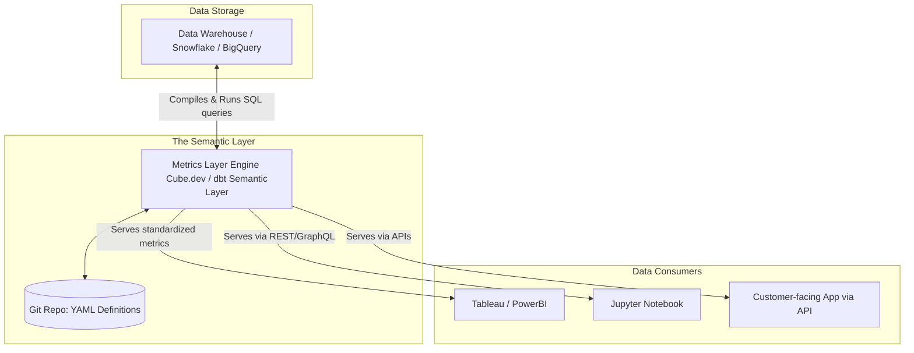

Trong các cuộc họp ban giám đốc ở nhiều doanh nghiệp, một cảnh tượng dở khóc dở cười thường xuyên xảy ra: 
- Giám đốc Marketing báo cáo tổng doanh thu tháng qua là 10 tỷ (dùng Google Looker Studio).
- Giám đốc Bán hàng khẳng định doanh thu thực tế là 12 tỷ (dùng Tableau).
- Trong khi đó, bộ phận Kế toán lại đưa ra con số 9 tỷ trên tệp Excel của họ.

Mặc dù tất cả các phòng ban đều truy cập vào cùng một kho dữ liệu Data Warehouse tập trung, nhưng sự bất nhất này xuất phát từ việc **logic tính toán bị cài cắm trực tiếp (hardcoded) bên trong các công cụ BI khác nhau**. Đội Marketing có thể đã loại trừ các đơn hàng bị hoàn trả, đội Sales tính cả các đơn hàng đặt trước chưa giao, còn đội Kế toán thì khấu trừ đi các khoản thuế VAT. 

Mỗi khi thay đổi công cụ BI hoặc có nhân sự mới, doanh nghiệp lại phải cặm cụi viết lại toàn bộ công thức tính toán từ đầu.

Để chấm dứt sự hỗn loạn này, các kỹ sư hệ thống đã phát triển một lớp kiến trúc trung gian gọi là **Metrics Layer (hay Semantic Layer, Headless BI)**.

## Metrics Layer là gì?

**Metrics Layer** là một lớp kiến trúc nằm giữa tầng lưu trữ dữ liệu ([Data Warehouse](/concepts/2-storage/data-warehouse/data-warehouse/)) và các công cụ tiêu thụ dữ liệu đầu cuối (như các phần mềm BI, mô hình Machine Learning, hoặc các ứng dụng Web/SaaS). 

Lớp này đóng vai trò như một kho quản lý mã nguồn tập trung (thường sử dụng định dạng YAML) để định nghĩa rõ ràng:
1. **Định nghĩa chỉ số**: Thế nào là một "Khách hàng hoạt động" (Active User), thế nào là "Doanh thu" (Revenue), hay "Tỷ lệ rời bỏ" (Churn Rate).
2. **Logic tính toán**: Công thức tổng hợp dữ liệu là tính tổng (`SUM`), đếm số lượng duy nhất (`COUNT DISTINCT`), hay tính trung bình (`AVERAGE`).
3. **Các chiều phân tích (Dimensions)**: Các lát cắt dữ liệu được phép áp dụng như theo vùng miền, thời gian, hay danh mục sản phẩm.

Khi các công cụ trực quan hóa muốn lấy số liệu, chúng không còn viết các câu lệnh SQL trực tiếp xuống Database. Thay vào đó, chúng sẽ gửi yêu cầu tới Metrics Layer. Lớp trung gian này sẽ tự động biên dịch yêu cầu thành câu lệnh SQL chuẩn hóa, thực thi nó trên Data Warehouse, và trả lại kết quả đồng nhất cho tất cả các bên.

## Ý tưởng cốt lõi của kiến trúc "Headless BI"

Triết lý của Metrics Layer là **"Định nghĩa một lần, sử dụng mọi nơi"** (Define once, use anywhere). Đây còn được gọi là kiến trúc **Headless BI**:
* **Headless (Không đầu)**: Các công cụ BI lúc này chỉ đóng vai trò là giao diện hiển thị hình ảnh, biểu đồ (cái đầu).
* **Body (Thân mình)**: Metrics Layer là phần thân chứa toàn bộ não bộ tính toán và logic nghiệp vụ.

Bằng cách mã hóa định nghĩa chỉ số vào trong các tệp tin cấu hình được quản lý bởi Git, chúng ta có thể áp dụng các quy trình phát triển phần mềm chuẩn mực (như quản lý phiên bản, kiểm tra mã nguồn và phê duyệt thay đổi qua Pull Request) cho các công thức kinh doanh. 

Khi công thức tính doanh thu thay đổi, bạn chỉ cần sửa đổi tại một nơi duy nhất trên Git. Toàn bộ các dashboard kết nối vào hệ thống sẽ tự động cập nhật số liệu mới một cách đồng bộ.

---

## Cơ chế vận hành của Metrics Layer

Quy trình hoạt động cơ bản khi có sự tham gia của Metrics Layer (như [dbt](/concepts/3-integration/transformation-analytics/dbt/) Semantic Layer hoặc Cube.js):



1. **Định nghĩa**: Analytics Engineer khai báo cấu trúc chỉ số trong file YAML:
   ```yaml
   metrics:
     - name: monthly_revenue
       description: Tổng doanh thu đã thanh toán thành công, trừ đi hàng hoàn.
       type: sum
       sql: amount_paid - amount_refunded
       timestamp: order_created_at
       dimensions:
         - country
         - product_category
   ```
2. **Yêu cầu truy vấn**: Người dùng trên Tableau yêu cầu xem: *"Doanh thu tháng 5 theo quốc gia"*.
3. **Biên dịch**: Metrics Layer tiếp nhận yêu cầu, kết hợp định nghĩa trong file YAML với cấu trúc bảng dưới Data Warehouse để tự động sinh ra một câu lệnh SQL tối ưu.
4. **Thực thi**: Câu lệnh SQL được chạy trực tiếp trên Data Warehouse (BigQuery, [Snowflake](/concepts/2-storage/cloud-data-platform/snowflake/)), và kết quả chuẩn xác được trả về cho Tableau.

---

## Ví dụ thực tế: Cung cấp Dashboard cho khách hàng (Embedded Analytics)

Giả sử bạn đang phát triển một ứng dụng SaaS và cần hiển thị biểu đồ số lượt click chuột cho người dùng cuối. Thay vì viết các API backend tự gọi SQL thô (rất dễ sai sót và chạy chậm), backend của bạn có thể gọi trực tiếp đến Metrics Layer (ví dụ Cube.js) qua GraphQL API:

* **Câu truy vấn từ ứng dụng**:
  ```graphql
  query {
    clicksMetrics(
      timeDimensions: [{
        dimension: "clicks.created_at"
        dateRange: ["2026-05-01", "2026-05-31"]
      }]
    ) {
      count
    }
  }
  ```
* **Phản hồi**: Metrics Layer tự động sinh SQL, đồng thời tận dụng cơ chế lưu bộ nhớ đệm (caching) thông minh để trả về kết quả cho ứng dụng trong vài mili-giây, che giấu hoàn toàn các câu lệnh `JOIN` phức tạp bên dưới Data Warehouse.

---

## So sánh Kiến trúc Semantic Layer và BI Metrics truyền thống

| Tiêu chí | Native BI Metrics (Tableau, Power BI, Looker) | Centralized Semantic Layer (dbt Semantic Layer, Cube) |
| :--- | :--- | :--- |
| **Nơi định nghĩa logic** | Khóa cứng (hardcoded) trong từng file báo cáo hoặc dashboard của BI tool. | Tập trung trong một Git repository chung (YAML/SQL). |
| **Độc lập công cụ** | Không (Logic của Tableau không thể dùng cho Power BI hay Python Notebook). | Có (Cung cấp API chung cho mọi loại client tiêu thụ). |
| **Kiểm soát phiên bản** | Hạn chế, khó review thay đổi qua PR. | Hoàn hảo (Áp dụng đầy đủ quy trình Git, CI/CD). |
| **Khả năng tái sử dụng** | Thấp, dễ xảy ra Metric Sprawl (trùng lặp chỉ số). | Cao, định nghĩa duy nhất một lần. |

---

## Điểm mạnh và điểm yếu

### Điểm mạnh (Pros)
* **Nguồn sự thật duy nhất (Single Source of Truth)**: Loại bỏ hoàn toàn việc lệch số liệu giữa các phòng ban.
* **Độc lập công cụ (Tool Agnostic)**: Doanh nghiệp có thể tự do chuyển đổi từ Tableau sang Looker hay bất kỳ công cụ BI nào khác mà không lo bị mất các công thức tính toán cũ.
* **Phục vụ đa kênh**: Không chỉ công cụ BI, mà cả các Jupyter Notebook của Data Scientist, ứng dụng nội bộ hay thậm chí là các AI Agent đều có thể tái sử dụng chung một định nghĩa chỉ số.
* **[Quản trị dữ liệu (Data Governance)](/concepts/5-quality-governance/governance-metadata/data-governance/)**: Hỗ trợ tốt cho quy trình quản trị dữ liệu, đảm bảo bảo mật và phân quyền truy cập nhất quán.

### Điểm yếu (Cons)
* **Tăng độ phức tạp cho hệ thống**: Bạn phải vận hành và duy trì thêm một lớp công nghệ trung gian trong hạ tầng dữ liệu của mình.
* **Khả năng tương thích**: Một số công cụ BI đời cũ có lớp semantic layer đóng kín của riêng họ (như PowerBI DAX) nên việc tích hợp với Metrics Layer bên ngoài đôi khi gặp nhiều hạn chế.

---

## Khi nào nên dùng

### Nên áp dụng khi:
* Công ty bạn đang sử dụng đồng thời nhiều công cụ phân tích khác nhau và các phòng ban thường xuyên tranh cãi về sự lệch số liệu.
* Bạn đang xây dựng tính năng hiển thị biểu đồ số liệu trực tiếp trong sản phẩm (embedded analytics) cho khách hàng xem.
* Bạn đang xây dựng hệ thống GenAI hoặc AI Chatbot để truy vấn dữ liệu — LLM sẽ hiểu và tương tác với các định nghĩa rõ ràng trong Semantic Layer tốt hơn nhiều so với việc bắt nó tự viết SQL thô.

### Chưa nên áp dụng khi:
* Đội ngũ dữ liệu của bạn còn quá nhỏ, chỉ sử dụng duy nhất một công cụ BI đã có sẵn lớp semantic layer mạnh mẽ (ví dụ sử dụng Looker với LookML).
* Nhu cầu phân tích đơn giản, các chỉ số cố định và ít khi thay đổi công thức tính toán.

---

## Trọng tâm ôn luyện phỏng vấn

### 1. Sự khác biệt giữa việc tính toán chỉ số trong quá trình [ETL](/concepts/3-integration/etl-elt/etl/) (Data Transformation) và trong Metrics Layer là gì?
* **Gợi ý trả lời**:
  * **Trong quá trình ETL (như dbt models)**: Việc tính toán mang tính chất vật lý hóa (pre-calculated). Ví dụ, chúng ta tính sẵn doanh thu theo ngày và lưu thành một bảng cứng trong database. Điều này giới hạn lát cắt của dữ liệu: nếu người dùng muốn xem doanh thu theo giờ, chúng ta buộc phải viết lại code ETL và tạo bảng mới.
  * **Trong Metrics Layer**: Việc tính toán diễn ra một cách động tại thời điểm truy vấn (query-time). Chúng ta chỉ định nghĩa công thức cơ bản và các chiều phân tích được phép cắt. Khi người dùng kéo thả trên giao diện BI, Metrics Layer sẽ tự động sinh SQL tương ứng để tính toán ngay lập tức, mang lại sự linh hoạt tối đa mà không cần tạo thêm bất kỳ bảng vật lý nào.

### 2. Giải thích khái niệm "Headless BI" bằng một ví dụ dễ hiểu?
* **Gợi ý trả lời**:
  * Tương tự như Headless CMS trong phát triển web, **Headless BI** là kiến trúc tách rời hoàn toàn phần hiển thị (biểu đồ, bảng biểu trên BI tools) ra khỏi phần logic định nghĩa số liệu.
  * *Ví dụ*: Định nghĩa chỉ số "Khách hàng VIP" được lưu tập trung ở Metrics Layer. Khi phòng Marketing sử dụng Tableau và phòng Sales sử dụng PowerBI cùng gọi chỉ số này, cả hai công cụ đều nhận được một kết quả giống hệt nhau thông qua API của Metrics Layer, bất kể giao diện hiển thị của chúng khác nhau như thế nào.

### 3. Tại sao AI Agents và LLMs lại cần có Metrics Layer để truy vấn dữ liệu thay vì tự viết SQL?
* **Gợi ý trả lời**:
  * Khi LLM tự viết SQL trực tiếp trên database thô, nó thường gặp khó khăn với các cấu trúc database phức tạp, hàng tá bảng JOIN và các quy tắc nghiệp vụ ngầm (như loại trừ các dòng test, xử lý múi giờ).
  * Metrics Layer cung cấp một giao diện API ngữ nghĩa rõ ràng, được tài liệu hóa bằng YAML. LLM chỉ cần dịch yêu cầu của người dùng thành một lệnh gọi chỉ số (ví dụ: `get metrics: revenue where country = 'VN'`), Metrics Layer sẽ chịu trách nhiệm biên dịch nó thành SQL chuẩn, tối ưu và tuyệt đối chính xác. Điều này giúp ngăn ngừa ảo tưởng (hallucination) của AI trong phân tích dữ liệu.

### 4. Mối quan hệ giữa Semantic Layer của dbt và MetricFlow là gì?
* **Gợi ý trả lời**: MetricFlow là công cụ tính toán chỉ số (semantic engine) chạy ngầm bên dưới dbt Semantic Layer. dbt Labs đã mua lại MetricFlow để thay thế cho hệ thống Metrics cũ của họ. MetricFlow chịu trách nhiệm đọc các định nghĩa chỉ số trong file YAML, xây dựng sơ đồ quan hệ giữa các thực thể (entities), tự động sinh các câu lệnh SQL JOIN phức tạp và gửi xuống Data Warehouse khi có yêu cầu truy vấn từ client.

### 5. Làm thế nào để giải quyết vấn đề hiệu năng (Latency) khi Metrics Layer phải sinh SQL chạy động trên Data Warehouse?
* **Gợi ý trả lời**:
  * Để giải quyết độ trễ truy vấn động, các Metrics Layer hiện đại tích hợp cơ chế caching thông minh (ví dụ: Cube.js sử dụng Pre-aggregations, dbt sử dụng caching của Snowflake hoặc materialized views).
  * Khi có truy vấn, hệ thống sẽ kiểm tra xem kết quả tổng hợp của chỉ số đó đã được lưu trữ sẵn trong tầng cache hay chưa. Nếu có, dữ liệu sẽ được trả về ngay lập tức (trong vòng dưới 100ms) mà không cần quét lại hàng tỷ dòng dữ liệu thô trên Data Warehouse gốc.

### 6. Sự khác biệt giữa Metric (Chỉ số) và Dimension (Chiều kích) trong Metrics Layer?
* **Gợi ý trả lời**:
  * **Metric (Chỉ số)**: Là các đại lượng định lượng (quantitative values) có thể đo lường và tính toán (ví dụ: doanh thu, số lượng đơn hàng, số click chuột). Metric luôn đi kèm với một hàm tổng hợp (aggregation function) như SUM, COUNT, AVG.
  * **Dimension (Chiều kích)**: Là các thuộc tính định tính (qualitative attributes) dùng để lọc, phân nhóm hoặc cắt nhỏ các chỉ số (ví dụ: quốc gia, giới tính khách hàng, danh mục sản phẩm, năm/tháng).

---

## Xem thêm các khái niệm liên quan
* [Hợp đồng dữ liệu - Data Contract & Schema Registry](/concepts/3-integration/transformation-analytics/data-contract/)
* [CI/CD cho Data Pipeline & Slim CI](/concepts/3-integration/transformation-analytics/data-pipeline-cicd/)
* [Advanced dbt Pipelines & Stateful CI](/concepts/3-integration/transformation-analytics/dbt-advanced/)

## Tài liệu tham khảo

1. dbt Labs Documentation: [About the dbt Semantic Layer](https://docs.getdbt.com/docs/use-dbt-semantic-layer/about-semantic-layer)
2. Google Cloud Blog: [Standardizing business metrics with the Semantic Layer](https://cloud.google.com/blog/products/databases/standardizing-business-metrics-with-semantic-layer)
3. Databricks Blog: [Introducing the Databricks Semantic Layer partnership](https://www.databricks.com/blog/introducing-databricks-semantic-layer-partnership)
4. Snowflake Documentation: [Working with the Semantic Layer in Snowflake](https://docs.snowflake.com/en/developer-guide/dbt/dbt-snowflake-semantic)
5. Confluent: [Decoupling business logic using schema registry and semantic layers](https://www.confluent.io/blog/decoupling-business-logic-with-schemas/)

---

## English Summary

The Metrics Layer (or Semantic Layer / Headless BI) is an architectural component that sits between the Data Warehouse and downstream consumption tools (BI, ML, APIs). It acts as a centralized, version-controlled repository where business logic, dimensions, and metric definitions (e.g., "Revenue", "Active Users") are standardized using code (YAML/SQL). By decoupling business definitions from visualization tools, it prevents "metric sprawl" and ensures a Single Source of Truth across the organization, allowing diverse consumers to query data dynamically without writing raw SQL or creating conflicting metrics.
