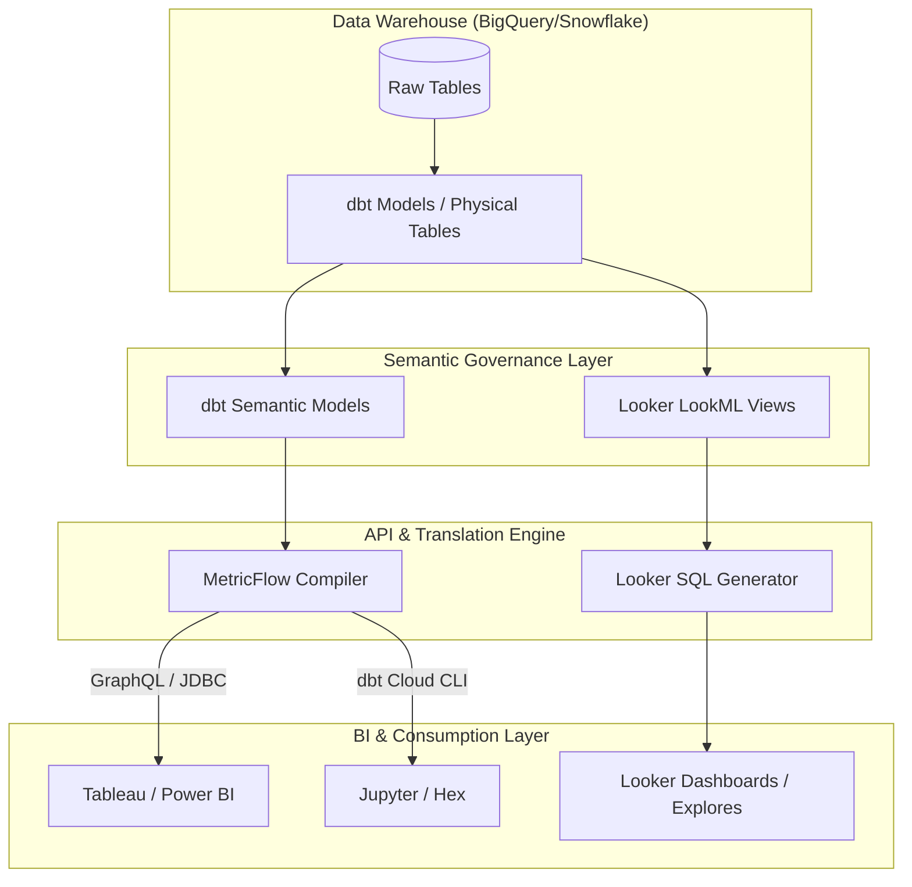

Trong kiến trúc dữ liệu hiện đại (Modern Data Stack), việc biến đổi dữ liệu thô thành các bảng định dạng tinh sạch chỉ là một nửa chặng đường. Thách thức lớn nhất đối với các doanh nghiệp không nằm ở việc lưu trữ hay biến đổi vật lý, mà là làm thế nào để đảm bảo tính đồng nhất của các chỉ số kinh doanh (metrics) khi chúng được tiêu thụ bởi các phòng ban khác nhau qua nhiều công cụ BI (Business Intelligence) khác nhau. 

Khi các phòng ban tự định nghĩa chỉ số trên các công cụ BI riêng lẻ, hiện tượng bất đồng số liệu xảy ra thường xuyên. Để giải quyết triệt để vấn đề này, khái niệm **Semantic Layer** (hay [Metrics Layer](/concepts/3-integration/transformation-analytics/metrics-layer/)) ra đời như một thành phần kiến trúc cốt lõi. Bài viết này sẽ phân tích chuyên sâu về kiến trúc Semantic Layer, cách hiện thực hóa thông qua hai giải pháp hàng đầu hiện nay là **Looker LookML** và **dbt Semantic Layer (MetricFlow)**, cùng các kỹ thuật tối ưu hóa truy vấn nâng cao.

---

## 1. Tầm quan trọng về mặt kiến trúc của Semantic Layer

### Giải quyết bài toán "Tập trung hóa định nghĩa chỉ số" (Centralizing Metric Definitions)
Trong các hệ thống truyền thống không có [Metrics Layer](/concepts/3-integration/transformation-analytics/metrics-layer/) hay Semantic Layer, logic tính toán chỉ số (ví dụ: Doanh thu thuần, Khách hàng hoạt động) thường được viết trực tiếp dưới dạng truy vấn SQL trong các công cụ BI hoặc ổ cứng của cá nhân các Analyst. Khi công thức tính toán thay đổi (ví dụ: loại trừ thêm một mã hoàn tiền mới), kỹ sư phải tìm và sửa thủ công ở mọi Dashboard. 

Semantic Layer giải quyết vấn đề này bằng cách đưa toàn bộ logic định nghĩa chỉ số vào một kho lưu trữ tập trung, được quản lý bằng mã nguồn (Git) và áp dụng quy trình kiểm thử tự động. Mọi công cụ tiêu thụ phía sau chỉ cần gọi tên chỉ số thay vì tự viết lại logic tính toán.

### Tách biệt mô hình hóa dữ liệu và báo cáo BI (Decoupling Data Modeling & BI Reporting)
Semantic Layer hoạt động như một lớp trừu tượng (abstraction layer) trung gian, che giấu sự phức tạp của cấu trúc bảng vật lý bên dưới.
* **Tầng vật lý (Physical Layer):** Các bảng và cột thực tế trong Data Warehouse.
* **Tầng ngữ nghĩa (Semantic Layer):** Định nghĩa mối quan hệ logic (JOINs), chiều dữ liệu (dimensions), và phép tổng hợp (measures/metrics).
* **Tầng trình diễn (Presentation Layer):** Các Dashboard, báo cáo ad-hoc trên BI tool.

Sự tách biệt này giúp các Data Engineer tự do tối ưu hóa cấu trúc bảng ở tầng vật lý (như phân vùng, đổi tên bảng) mà không làm hỏng các báo cáo của người dùng cuối, miễn là giao diện ngữ nghĩa được giữ nguyên.

### Giải quyết vấn đề "Multi-source of truth"
Hãy tưởng tượng kịch bản: Phòng Tài chính định nghĩa "Doanh thu" bằng cách lấy `sum(amount)` từ bảng hóa đơn và lọc các hóa đơn đã thanh toán. Trong khi đó, phòng Marketing định nghĩa "Doanh thu" bao gồm cả hóa đơn đang chờ xử lý để đo lường hiệu dịch chiến dịch quảng cáo. Khi họp hội đồng quản trị, hai phòng ban đưa ra hai con số doanh thu khác nhau, dẫn đến sự thiếu tin tưởng vào hệ thống dữ liệu.

Bằng cách áp dụng Semantic Layer, doanh nghiệp buộc phải thống nhất và định nghĩa rõ ràng các chỉ số như `finance_revenue` và `marketing_attributed_revenue` ở một nơi duy nhất. Mọi truy vấn từ Tableau, Looker, Power BI hay các ứng dụng nội bộ đều được định tuyến qua Semantic Layer để đảm bảo trả về cùng một kết quả chính xác.




---

## 2. Mô hình hóa dữ liệu với Looker LookML

LookML (Looker Modeling Language) là ngôn ngữ khai báo độc quyền của Looker, được thiết kế để định nghĩa các mối quan hệ ngữ nghĩa, chiều dữ liệu, chỉ số và bảo mật trên kho dữ liệu SQL.

### Các thành phần cốt lõi của LookML
1. **Views (Khung nhìn):** Định nghĩa một bảng logic. Mỗi view ánh xạ tới một bảng vật lý hoặc kết quả của một câu lệnh SQL (Derived Table). Bên trong View, chúng ta định nghĩa các `dimensions` (chiều dữ liệu) và `measures` (chỉ số đo lường).
2. **Explores (Khám phá):** Là giao diện trực quan cho phép người dùng cuối kéo thả dữ liệu. Một Explore được xây dựng bằng cách kết hợp một hoặc nhiều Views thông qua các mối quan hệ JOIN.
3. **Joins (Liên kết):** Xác định cách thức kết nối các Views trong một Explore. LookML yêu cầu khai báo rõ ràng mối quan hệ (như `one_to_many`, `many_to_one`) và điều kiện join (`sql_on`).
4. **Dimensions & Measures:** 
   * **Dimensions:** Các thuộc tính đại diện cho dữ liệu dạng chuỗi, số hoặc thời gian (ví dụ: ngày đặt hàng, quốc gia, ID khách hàng). Chúng được dùng làm mệnh đề `GROUP BY` hoặc `WHERE` trong SQL.
   * **Measures:** Các phép tổng hợp số liệu (như `sum`, `count`, `average`). Chúng được dịch thành các hàm gom cụm trong SQL.
5. **Access Filters (Bộ lọc quyền truy cập):** Cơ chế bảo mật cấp dòng dữ liệu (Row-Level Security). Cấu hình này tự động chèn thêm điều kiện lọc vào mệnh đề `WHERE` của SQL dựa trên thuộc tính của người dùng đang đăng nhập (ví dụ: nhân viên vùng nào chỉ được xem dữ liệu vùng đó).

### Ví dụ mã nguồn LookML mẫu
Dưới đây là một ví dụ thực tế định nghĩa View `order_items` và Explore tương ứng trong LookML:

```lookml
# Định nghĩa View cho bảng order_items
view: order_items {
  sql_table_name: `analytics_dw.fct_order_items` ;;

  # Định nghĩa khóa chính
  dimension: id {
    primary_key: yes
    type: number
    sql: ${TABLE}.id ;;
  }

  # Chiều dữ liệu thời gian
  dimension_group: created {
    type: time
    timeframes: [raw, time, date, week, month, quarter, year]
    sql: ${TABLE}.created_at ;;
  }

  # Chiều dữ liệu thông thường
  dimension: sale_price {
    type: number
    sql: ${TABLE}.sale_price ;;
    value_format_name: usd
  }

  # Chỉ số đo lường (Measure) tổng doanh số
  measure: total_sales {
    type: sum
    sql: ${sale_price} ;;
    value_format_name: usd
  }

  # Chỉ số đo lường trung bình giá bán
  measure: average_sale_price {
    type: average
    sql: ${sale_price} ;;
    value_format_name: usd
  }
}

# Định nghĩa View cho bảng users
view: users {
  sql_table_name: `analytics_dw.dim_users` ;;

  dimension: id {
    primary_key: yes
    type: number
    sql: ${TABLE}.id ;;
  }

  dimension: country {
    type: string
    sql: ${TABLE}.country ;;
  }
}

# Định nghĩa Explore để người dùng truy vấn kéo thả
explore: order_items {
  label: "Phân Tích Đơn Hàng"
  
  join: users {
    type: left_outer
    sql_on: ${order_items.user_id} = ${users.id} ;;
    relationship: many_to_one
  }

  # Áp dụng bộ lọc bảo mật cấp dòng dựa trên thuộc tính người dùng
  access_filter: {
    user_attribute: user_country
    field: users.country
  }
}
```

---

## 3. dbt Semantic Layer (MetricFlow)

Khi dbt Labs mua lại công nghệ MetricFlow để phát triển [dbt Semantic Layer & MetricFlow](/concepts/3-integration/transformation-analytics/dbt-semantic-layer/), họ đã tái định nghĩa lại cách thức khai báo chỉ số trong các dự án dbt. dbt Semantic Layer không cố gắng thay thế công cụ BI, mà đóng vai trò là một dịch vụ biên dịch SQL trung gian nhận yêu cầu từ các công cụ BI qua API (GraphQL/JDBC) và dịch sang câu lệnh SQL thích hợp.

### Các thành phần khai báo của MetricFlow
* **Semantic Models:** Lớp khai báo nằm trên các [dbt models](/concepts/3-integration/transformation-analytics/dbt-models/) vật lý. Mỗi Semantic Model mô tả cấu trúc của một bảng nguồn bao gồm các Dimensions, Entities và Measures.
* **Dimensions:** Các thuộc tính để nhóm và lọc. MetricFlow hỗ trợ hai loại dimension chính là `time` (dùng để tính toán chuỗi thời gian) và `categorical` (phân loại thông thường).
* **Entities:** Các khóa định danh (Identifiers) của thực thể dữ liệu (như `customer`, `order`). Đây là thông tin cực kỳ quan trọng giúp MetricFlow tự động hiểu sơ đồ quan hệ và tự động sinh câu lệnh JOIN giữa các bảng khi người dùng truy vấn các chỉ số từ nhiều mô hình khác nhau.
* **Measures:** Các phép tính tổng hợp cơ bản được thực hiện trực tiếp trên các cột của bảng vật lý (ví dụ: `sum`, `count`, `min`, `max`).

### Các loại Metrics trong dbt MetricFlow
dbt MetricFlow hỗ trợ các loại metric đa dạng để giải quyết các bài toán nghiệp vụ phức tạp:
1. **Simple Metric (Chỉ số đơn giản):** Trỏ trực tiếp tới một measure cụ thể của một semantic model (ví dụ: tổng doanh thu).
2. **Derived Metric (Chỉ số dẫn xuất):** Được tạo ra bằng cách thực hiện các phép toán học (+, -, *, /) trên các metric khác (ví dụ: giá trị đơn hàng trung bình = tổng doanh thu / tổng số đơn hàng).
3. **Ratio Metric (Chỉ số tỷ lệ):** Được định nghĩa bằng một tử số (numerator) và mẫu số (denominator) riêng biệt. Điểm đặc biệt của Ratio Metric là nó tự động xử lý các trường hợp mẫu số bằng 0 hoặc rỗng một cách an toàn.
4. **Cumulative Metric (Chỉ số tích lũy):** Tính toán giá trị lũy kế qua một khoảng thời gian xác định (ví dụ: doanh số tích lũy từ đầu năm đến nay - YTD, hoặc doanh số tích lũy trượt 30 ngày).

### Cấu hình dbt Semantic Layer bằng YAML
Dưới đây là một ví dụ khai báo cấu hình Semantic Model và Metrics trong file cấu hình YAML:

```yaml
# models/semantic_models/marts_orders.yml
semantic_models:
  - name: semantic_orders
    model: ref('fct_orders')
    defaults:
      agg_time_dimension: ordered_at

    entities:
      - name: order_id
        type: primary
      - name: customer_id
        type: foreign

    dimensions:
      - name: ordered_at
        type: time
        type_params:
          time_granularity: day
      - name: order_status
        type: categorical

    measures:
      - name: order_amount
        agg: sum
      - name: distinct_orders
        agg: count_distinct
        expr: order_id

metrics:
  # 1. Simple Metric
  - name: total_order_revenue
    label: Tổng Doanh Thu Đơn Hàng
    type: simple
    type_params:
      measure: order_amount

  # 2. Ratio Metric
  - name: average_order_value
    label: Giá Trị Đơn Hàng Trung Bình
    type: ratio
    type_params:
      numerator: total_order_revenue
      denominator: total_orders_count

  # 3. Simple Metric làm mẫu số cho Ratio
  - name: total_orders_count
    label: Tổng Số Lượng Đơn Hàng
    type: simple
    type_params:
      measure: distinct_orders

  # 4. Cumulative Metric (Doanh thu tích lũy năm - YTD)
  - name: cumulative_revenue_ytd
    label: Doanh Thu Lũy Kế YTD
    type: cumulative
    type_params:
      measure: order_amount
      window: 1 year
```

---

## 4. Tối ưu hóa truy vấn & Caching (Query Optimization & Caching)

Khi số lượng dữ liệu trong kho dữ liệu lên tới hàng tỷ dòng, việc gửi các truy vấn thô trực tiếp xuống bảng chi tiết mỗi lần người dùng tải Dashboard sẽ gây ra độ trễ cực lớn và tiêu tốn chi phí điện toán khổng lồ. Do đó, tối ưu hóa truy vấn và bộ nhớ đệm là tính năng bắt buộc của một Semantic Layer hiện đại.

### Aggregate Awareness (Định tuyến truy vấn thông minh)
**Aggregate Awareness** là kỹ thuật tự động định tuyến các truy vấn từ công cụ BI sang các bảng tổng hợp (aggregate tables/views) được chuẩn bị trước, thay vì quét qua toàn bộ bảng dữ liệu chi tiết (granular table). 

* **Cơ chế hoạt động:** Khi người dùng yêu cầu xem "Doanh thu theo năm", Semantic Layer sẽ kiểm tra xem có bảng tổng hợp doanh thu theo tháng hoặc năm hay không. Nếu có, nó tự động viết lại truy vấn để trỏ vào bảng nhỏ hơn đó. Nếu người dùng yêu cầu xem "Doanh thu theo từng ngày của một khách hàng cụ thể", hệ thống sẽ tự động định tuyến truy vấn về bảng chi tiết giao dịch.
* **Lợi ích:** Người dùng cuối không cần biết sự tồn tại của các bảng tổng hợp hay phải chủ động thay đổi câu lệnh SQL của họ. Tốc độ truy vấn có thể tăng lên hàng trăm lần trong khi chi phí quét dữ liệu giảm đáng kể.

### Persistent Derived Tables (PDT) trong Looker
Trong Looker, khi các truy vấn SQL phức tạp cần thời gian xử lý lâu, Looker cho phép định nghĩa các **Persistent Derived Tables (PDT)**. PDT là các bảng dẫn xuất được Looker tự động khởi tạo vật lý (materialized) thành các bảng thực tế nằm trong một schema tạm thời trên kho dữ liệu của bạn.

* **Cơ chế Trigger và Refresh:** PDT được quản lý thông qua các `datagroups`. Chúng ta có thể cấu hình tần suất làm mới bảng dựa trên một câu lệnh SQL trigger (ví dụ: kiểm tra xem bảng nguồn đã chạy xong quy trình ETL hàng ngày chưa bằng cách truy vấn bảng log: `SELECT MAX(run_id) FROM etl_log`) hoặc cấu hình thời gian hết hạn tối đa (`max_cache_age`).
* **Hoạt động ngầm:** Khi dữ liệu thay đổi, Looker sẽ xây dựng một bảng PDT mới ở chế độ nền. Trong thời gian bảng mới đang được xây dựng, người dùng vẫn truy vấn vào bảng PDT cũ để đảm bảo không gặp gián đoạn hoặc lỗi truy cập dữ liệu.

### Tối ưu hóa hiệu năng truy vấn chung
1. **Caching (Bộ nhớ đệm):** Cả Looker và dbt Semantic Layer đều lưu trữ kết quả của các truy vấn gần nhất. Nếu một truy vấn giống hệt được gửi lại trong khoảng thời gian cache khả dụng, hệ thống sẽ trả về kết quả ngay lập tức từ bộ nhớ đệm mà không cần chạm vào kho dữ liệu.
2. **Dynamic SQL Compilation (Biên dịch SQL động):** MetricFlow của dbt biên dịch SQL dựa trên đồ thị ngữ nghĩa (semantic graph). Nó phân tích và chỉ JOIN những bảng tối thiểu cần thiết để trả về kết quả yêu cầu, tránh việc viết các truy vấn JOIN dư thừa thường thấy ở các truy vấn SQL viết tay.

---

## Điểm mạnh và điểm yếu

### Điểm mạnh (Pros)
* **Tính nhất quán tuyệt đối:** Định nghĩa chỉ số một lần duy nhất, loại bỏ hoàn toàn sự sai lệch số liệu giữa các phòng ban.
* **Tăng tốc độ phát triển:** Data Analysts không cần tốn thời gian viết lại các câu lệnh JOIN hay các phép tính phức tạp; họ chỉ cần kéo thả hoặc gọi các chỉ số sẵn có.
* **Tối ưu chi phí hạ tầng:** Nhờ cơ chế Aggregate Awareness và bộ nhớ đệm Caching thông minh, số lượng truy vấn quét qua bảng thô giảm đáng kể, giúp tiết kiệm chi phí điện toán trên Snowflake, BigQuery.
* **Kiểm soát phiên bản tốt:** Toàn bộ định nghĩa ngữ nghĩa được quản lý bằng mã nguồn (LookML hoặc YAML files), cho phép theo dõi lịch sử thay đổi, đánh giá mã nguồn (code review) trước khi triển khai.

### Điểm yếu (Cons)
* **Độ dốc đường cong học tập (Learning Curve):** Đội ngũ dữ liệu cần thời gian để làm quen và thành thạo ngôn ngữ LookML hoặc cách cấu hình YAML phức tạp của MetricFlow.
* **Tăng chi phí quản lý ban đầu:** Việc thiết lập hệ thống Semantic Layer đòi hỏi sự đầu tư nghiêm túc về mặt thời gian để làm sạch dữ liệu nguồn và thống nhất định nghĩa chỉ số giữa các bên liên quan.
* **Phụ thuộc vào nhà cung cấp (Vendor Lock-in):** Khi viết toàn bộ logic nghiệp vụ bằng LookML, doanh nghiệp rất khó chuyển đổi sang một công cụ BI khác mà không phải viết lại toàn bộ lớp ngữ nghĩa từ đầu. (dbt Semantic Layer giảm thiểu được điểm yếu này do hoạt động độc lập với BI).

---

## Khi nào nên dùng

### Trường hợp nên sử dụng
* **Doanh nghiệp sử dụng nhiều công cụ BI:** Khi trong cùng một doanh nghiệp có các đội ngũ sử dụng song song Looker, Tableau, Power BI và cả Hex/Jupyter Notebooks cho Data Science.
* **Dữ liệu có độ phức tạp cao:** Khi các chỉ số nghiệp vụ cần phải trải qua nhiều bước tính toán phức tạp, hoặc yêu cầu bảo mật cấp dòng ngặt nghèo trên nhiều chiều thông tin.
* **Quy mô đội ngũ phân tích lớn:** Khi số lượng Data Analyst vượt quá 10 người và việc giao tiếp thủ công để đồng bộ logic SQL không còn hiệu quả.

### Trường hợp chưa nên sử dụng
* **Dự án nhỏ hoặc Startup giai đoạn đầu:** Khi nguồn lực hạn chế, dữ liệu thay đổi liên tục hàng ngày và doanh nghiệp chỉ sử dụng duy nhất một công cụ BI (như Metabase hoặc Power BI) kết nối trực tiếp với database.
* **Team phân tích mỏng:** Chỉ có 1-2 người quản lý toàn bộ luồng dữ liệu, việc áp dụng thêm Semantic Layer có thể tạo ra gánh nặng vận hành không đáng có so với việc viết trực tiếp các [dbt models](/concepts/3-integration/transformation-analytics/dbt-models/) dạng bảng phẳng (flat tables).

---

## Trọng tâm ôn luyện phỏng vấn

### Câu hỏi 1: Sự khác biệt cốt lõi giữa dbt Semantic Layer (MetricFlow) và Looker LookML là gì? Bạn sẽ lựa chọn công cụ nào cho dự án của mình?
* **Trả lời:** 
  * **LookML** là một giải pháp Semantic Layer gắn liền với hệ sinh thái Looker. Nó rất mạnh mẽ về khả năng tự động hóa sinh SQL, quản lý cache, và bảo mật dòng dữ liệu nhưng bị giới hạn là chỉ hoạt động tốt nhất trong môi trường Looker.
  * **dbt Semantic Layer (MetricFlow)** hoạt động độc lập hoàn toàn với công cụ hiển thị. Nó định nghĩa các chỉ số ngay tại tầng biến đổi dữ liệu (dbt project) và cung cấp các giao diện API (GraphQL, JDBC) để mọi công cụ BI (bao gồm cả Tableau, Power BI) hay các ứng dụng Python khác đều có thể tiêu thụ chung một nguồn chỉ số.
  * **Lựa chọn:** Nếu doanh nghiệp đã đầu tư toàn bộ hệ thống vào Looker làm công cụ BI chính, LookML là lựa chọn tối ưu nhất nhờ tính tích hợp sâu. Nếu doanh nghiệp hướng tới kiến trúc mở, sử dụng đa dạng công cụ BI hoặc có đội ngũ Data Science mạnh cần truy vấn chỉ số trực tiếp từ code Python/R, dbt Semantic Layer là giải pháp phù hợp hơn để tránh bị khóa vào một nhà cung cấp BI cụ thể.

### Câu hỏi 2: Kỹ thuật Aggregate Awareness hoạt động như thế nào trong Semantic Layer? Hãy giải thích quy trình từ lúc người dùng gửi yêu cầu đến khi trả về kết quả.
* **Trả lời:** Quy trình hoạt động của Aggregate Awareness bao gồm các bước sau:
  1. **Định nghĩa:** Kỹ sư dữ liệu tạo ra một bảng tổng hợp vật lý (ví dụ: `sales_daily_agg` tổng hợp doanh thu theo ngày và danh mục sản phẩm) và khai báo cho Semantic Layer biết bảng này tương ứng với bảng chi tiết giao dịch `sales_transactions` nào.
  2. **Nhận yêu cầu:** Người dùng thực hiện truy vấn lấy "Tổng doanh thu theo tháng và danh mục sản phẩm".
  3. **Biên dịch & Đánh giá:** Trình biên dịch Semantic Layer (Looker SQL Generator hoặc MetricFlow Compiler) chặn truy vấn này và phân tích các chiều dữ liệu (dimensions) và chỉ số (measures) được yêu cầu.
  4. **Định tuyến (Routing):** Hệ thống nhận thấy bảng `sales_daily_agg` chứa đầy đủ thông tin để tính toán yêu cầu của người dùng và có số lượng dòng ít hơn rất nhiều so với bảng chi tiết. Nó quyết định viết lại câu lệnh SQL để trỏ vào bảng `sales_daily_agg`.
  5. **Thực thi:** Câu lệnh SQL đã tối ưu hóa được gửi xuống Data Warehouse để thực thi và trả kết quả về cho người dùng với tốc độ nhanh nhất.

### Câu hỏi 3: Hãy giải thích cách xử lý bảo mật dữ liệu cấp dòng (Row-Level Security) trong Looker LookML và cách kiểm soát nó thông qua Access Filters.
* **Trả lời:** Bảo mật cấp dòng trong Looker được quản lý thông qua tính năng `access_filter` được cấu hình bên trong định nghĩa `explore`.
  * Đầu tiên, chúng ta gán các thuộc tính người dùng (User Attributes) cho từng tài khoản (ví dụ: người dùng A có thuộc tính `user_country = 'Vietnam'`).
  * Tiếp theo, trong cấu hình `explore`, chúng ta khai báo `access_filter` trỏ tới thuộc tính người dùng này và liên kết nó với trường dữ liệu tương ứng trong View (ví dụ: `users.country`).
  * Khi người dùng A thực hiện bất kỳ truy vấn nào trên Explore đó, Looker sẽ tự động chèn thêm điều kiện `WHERE users.country = 'Vietnam'` vào câu lệnh SQL được sinh ra trước khi gửi xuống cơ sở dữ liệu. Điều này đảm bảo người dùng A tuyệt đối không thể nhìn thấy dữ liệu của các quốc gia khác.

---

## English Summary

A **Semantic Layer** (or Metrics Layer) is an essential architectural component in modern data platforms that centralizes business logic and metric definitions, decoupling data warehousing transformations from downstream consumption. By defining metrics in a single, version-controlled repository, organizations solve the "multi-source of truth" problem, where different BI tools display conflicting figures for the exact same business metric. 

This guide explores two leading implementations: **Looker LookML**, a robust, proprietary modeling language deeply integrated with Looker BI, and **dbt Semantic Layer (MetricFlow)**, an open, vendor-agnostic framework that exposes metrics to multiple BI and data science tools via standard APIs. To handle massive data volumes efficiently, modern semantic layers utilize **Aggregate Awareness** (automatically routing queries to pre-aggregated summary tables) and **Persistent Derived Tables (PDT)** to slash compute costs and boost dashboard performance.

---

## Xem thêm các khái niệm liên quan
* [Hợp đồng dữ liệu - Data Contract & Schema Registry](/concepts/3-integration/transformation-analytics/data-contract/)
* [CI/CD cho Data Pipeline & Slim CI](/concepts/3-integration/transformation-analytics/data-pipeline-cicd/)
* [Advanced dbt Pipelines & Stateful CI](/concepts/3-integration/transformation-analytics/dbt-advanced/)

## Tài liệu tham khảo

1. [Looker LookML Quick Reference Documentation](https://cloud.google.com/looker/docs/lookml-quick-reference)
2. [Google Cloud Guide on Aggregate Awareness in Looker](https://cloud.google.com/looker/docs/aggregate-awareness)
3. [Looker Persistent Derived Tables (PDT) Configuration Guide](https://cloud.google.com/looker/docs/pdts)
4. [Databricks dbt Semantic Layer Integration Reference](https://docs.databricks.com/partner-connect/dbt-semantic-layer.html)
5. [Snowflake Semantic Layer Architecture and Integration](https://docs.snowflake.com/en/user-guide/semantic-layer)
6. [dbt MetricFlow Official Documentation](https://docs.getdbt.com/docs/build/about-metricflow)
7. [AWS Redshift Integration with Semantic Layers](https://docs.aws.amazon.com/redshift/latest/dg/semantic-layer.html)
