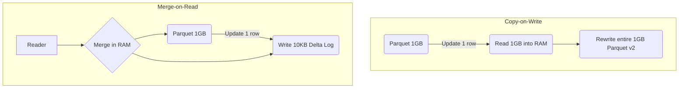
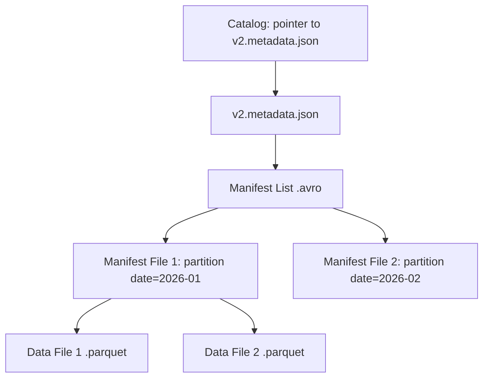

Data Lake truyền thống (chỉ gồm HDFS hoặc S3 chứa file Parquet/ORC) không hỗ trợ giao dịch ACID. Khi một tiến trình Spark đang ghi đè một thư mục (Overwrite) mà bị Crash giữa chừng, hoặc khi hai tiến trình cùng lúc UPDATE một bảng (Concurrent Writes), kết quả là dữ liệu bị hỏng (Data Corruption), tình trạng đọc dữ liệu "rác" (Dirty Reads), hoặc mất dữ liệu.

Các **Table Formats** (Delta Lake, Apache Iceberg, Apache Hudi) ra đời để mang ACID lên Data Lake (tạo thành Data Lakehouse). Chìa khóa thiết kế kiến trúc nằm ở việc **trừu tượng hóa hoàn toàn Metadata (Siêu dữ liệu) khỏi Data (Dữ liệu vật lý)**. 

Thay vì dựa vào các lệnh như `S3 LIST` hoặc `HDFS ls` (vốn chậm chạp, không nhất quán theo Eventual Consistency và tốn kém I/O), hệ thống đọc/ghi thông qua một Metadata Layer đóng vai trò là "Single Source of Truth".

---

## Kiến trúc Thực thi Vật lý: Tách biệt Metadata và Data

Trong hệ thống Data Lakehouse, khi bạn thực thi một câu lệnh `INSERT`, `UPDATE` hoặc `DELETE`, Engine (Spark/Trino) không sửa trực tiếp file Parquet hiện có (vì Object Storage bản chất là *Immutable*). 

Mọi giao dịch tuân theo quy tắc:
1. Ghi file dữ liệu (Parquet) mới ra Object Storage (Thao tác này chưa hiển thị với người đọc).
2. Khi file dữ liệu đã nằm an toàn trên disk/S3, Engine thực hiện một thao tác **Atomic Commit** vào Metadata Log.
3. Người đọc (Reader) luôn query Metadata Log trước, lấy Snapshot (ảnh chụp) mới nhất, sau đó mới quét (Scan) các file vật lý được chỉ định trong Snapshot đó.

### Đánh đổi Cấu trúc: Copy-on-Write (CoW) vs Merge-on-Read (MoR)

Hai chiến lược vật lý này quyết định trực tiếp đến **Write Amplification** (Khuếch đại ghi) và **Read Amplification** (Khuếch đại đọc).



1. **Copy-on-Write (CoW)**
   - **Hoạt động:** Sửa 1 dòng trong file Parquet 1GB? Spark phải kéo cả 1GB lên Memory, đổi 1 dòng, và ghi đè xuống S3 thành một file Parquet 1GB hoàn toàn mới. File cũ bị đánh dấu xóa (Tombstoned).
   - **Trade-offs:** 
     - *Pro:* Read Latency cực thấp vì dữ liệu lúc đọc đã sạch sẽ.
     - *Con:* Write Amplification khủng khiếp. Không thể dùng cho Streaming Ingestion hoặc CDC với tần suất UPDATE cao. Gây ra I/O Bottleneck.

2. **Merge-on-Read (MoR)**
   - **Hoạt động:** Thay vì ghi lại cả file, nó chỉ ghi nội dung cập nhật (Delta files / Delete logs) ra một file nhỏ.
   - **Trade-offs:**
     - *Pro:* Write Latency rất thấp. Chịu tải tốt cho CDC và Streaming.
     - *Con:* Read Latency bị ảnh hưởng (Read Amplification) vì Engine truy vấn (Trino/Presto) phải thực hiện `Merge` file Parquet gốc và Delta file ngay trong RAM tại Runtime. Yêu cầu chạy tiến trình Compaction định kỳ ngầm.

---

## Mổ xẻ Kiến trúc 3 Ông Lớn (Delta, Iceberg, Hudi)

### 1. Delta Lake: Kiến trúc Transaction Log (`_delta_log`)

Delta Lake thiết kế xoay quanh thư mục `_delta_log` chứa các file JSON. Mỗi file JSON (ví dụ `000001.json`) là một Atomic Commit ghi nhận hành động `add` (thêm file Parquet) hoặc `remove` (xóa file).

```json
// Ví dụ nội dung 1 commit trong Delta Log
{
  "add": {
    "path": "part-00000-xxx.parquet",
    "size": 10485760,
    "partitionValues": {"date": "2026-06-26"},
    "stats": "{\"numRecords\":100,\"minValues\":{\"id\":1},\"maxValues\":{\"id\":100}}"
  }
}
```

**Rủi ro Vận hành (Operational Risks): The Replay Overhead**
- **Sự cố:** Nếu bảng có hàng triệu transaction, việc Spark khởi tạo job bằng cách đọc và replay (chơi lại) hàng ngàn file JSON sẽ gây OOM (Out Of Memory) ở Driver node hoặc làm chậm thời gian lập kế hoạch truy vấn (Query Planning).
- **Khắc phục:** Delta giải quyết bằng **Checkpoints** (lưu lại trạng thái toàn cục của metadata dưới dạng Parquet sau mỗi 10 commits). Tuy nhiên, nếu tần suất commit quá dày đặc (streaming 1s/batch), Checkpoint creation có thể trở thành bottleneck.

### 2. Apache Iceberg: Hierarchical Metadata & Tránh Cartesian Explosion

Iceberg sinh ra tại Netflix để trị các bảng ở mức Petabyte, nơi mà việc bỏ tất cả log vào một thư mục như Delta sẽ sụp đổ. Kiến trúc của Iceberg là một cây (Tree) Metadata:



**Tính năng Đỉnh cao: Hidden Partitioning**
Trong Hive truyền thống, nếu bạn query không filter đúng cột partition (ví dụ filter bằng `event_time` thay vì cột partition `event_date`), Engine sẽ phải thực hiện "Full Table Scan".
Iceberg Metadata theo dõi min/max values của mọi cột trong Manifest Files. Bạn đổi logic phân vùng từ ngày (Day) sang giờ (Hour), Iceberg tự động cắt tỉa (Pruning) chính xác file cần thiết mà không yêu cầu viết lại toàn bộ lịch sử, hoàn toàn trong suốt với người dùng.

**Rủi ro Vận hành:** Iceberg sử dụng Optimistic Concurrency Control (OCC). Trong kịch bản *High Concurrency Writes* (nhiều Spark jobs cùng commit vào 1 bảng), sự cố **Commit Conflict** xảy ra. Job thất bại sẽ phải retry (Retry Storms), kéo theo hệ lụy OOM do cấp phát lại bộ nhớ để tính toán.

### 3. Apache Hudi: Tối ưu Streaming và CDC

Hudi (Hadoop Upserts Deletes and Incrementals) từ Uber không chỉ là Table Format mà thiên về một **Processing Framework**. Cốt lõi của Hudi là **Timeline** – theo dõi mọi action (`commits`, `cleans`, `compactions`) dọc theo trục thời gian.

**Trade-off Đặc trưng:** 
Hudi có kiến trúc MoR rất mạnh mẽ, sử dụng file Avro để lưu trữ row-level logs (phục vụ update) bên cạnh file Parquet (lưu base data).
- Hỗ trợ Incremental Processing xuất sắc: Cho phép Trino hay Spark stream dữ liệu thay đổi kể từ `commit X` một cách tự nhiên (như Kafka).
- **Sự cố:** Tiến trình Asynchronous Compaction (Gộp file ngầm) của Hudi cần cấu hình RAM cực lớn. Nếu Compaction lag (không theo kịp tốc độ Ingestion), lượng file Avro log phình to, khi query sẽ gây tràn RAM (JVM OOMKilled) trên các Executor do quá tải việc giải quyết các phiên bản record (Record-level conflict resolution).

---

## Tối ưu Hiệu năng và Troubleshooting 

### 1. Vấn đề "Small Files" (Khủng hoảng Metadata)
Streaming liên tục vào Lakehouse sinh ra hàng ngàn file Parquet vài KB.
- **Hậu quả:** Gây sập Metadata Layer (Metadata nở to hơn cả Data), Query Planning mất hàng chục phút, S3/GCS API throttling.
- **Giải pháp thực chiến:** 
  - Đẩy `OPTIMIZE` (hoặc `Clustering`) định kỳ: Dùng một luồng Airflow chạy Daily để bin-pack các file nhỏ thành file 1GB.
  - Phải đi kèm `VACUUM` (hoặc `ExpireSnapshots`) để xóa các file rác vật lý, nếu không Storage Cost sẽ tăng theo cấp số nhân.

### 2. Z-Ordering / Liquid Clustering (Chống Data Skew)
Chỉ partition theo Ngày (Date) thường là không đủ. Khi filter bằng `user_id`, Spark vẫn phải đọc nhiều file.
Z-Ordering (hoặc Liquid Clustering trong Delta mới) sắp xếp lại vật lý (co-locate) các dòng có cùng `user_id` vào chung một file Parquet, giúp File Statistics (Min/Max) chặt chẽ hơn -> Data Skipping hiệu quả hơn (bỏ qua 90% dữ liệu không cần thiết ở tầng I/O).

```sql
-- Ví dụ chạy Optimize Z-Order trong Spark Delta
OPTIMIZE events ZORDER BY (user_id, device_type);
```
**Cảnh báo Đánh đổi:** Chạy Z-Ordering rất tốn Compute Cost. Cần giới hạn số lượng cột Z-Order (tối đa 2-3 cột) để tránh hiện tượng loãng không gian đa chiều (Curse of Dimensionality).

---

## Nguồn Tham Khảo

1. Databricks Engineering Blog: [Delta Lake Architecture and Protocol](https://delta.io/)
2. Netflix Tech Blog: [How Netflix uses Apache Iceberg](https://netflixtechblog.com/)
3. Apache Iceberg Official Specification: [Iceberg Table Spec](https://iceberg.apache.org/spec/)
4. Uber Engineering: [Apache Hudi Architecture](https://hudi.apache.org/docs/concepts)
5. Kleppmann, M. (2017). *Designing Data-Intensive Applications*. O'Reilly Media. (Chapter 3: Storage and Retrieval - SSTables & LSM-Trees).
