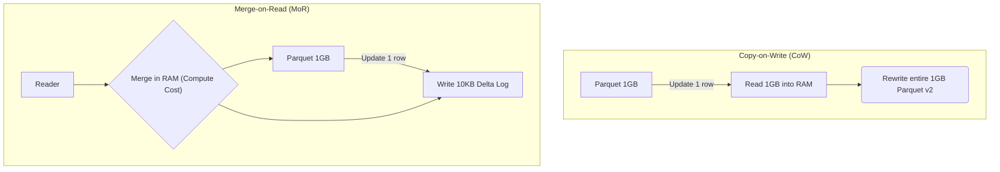
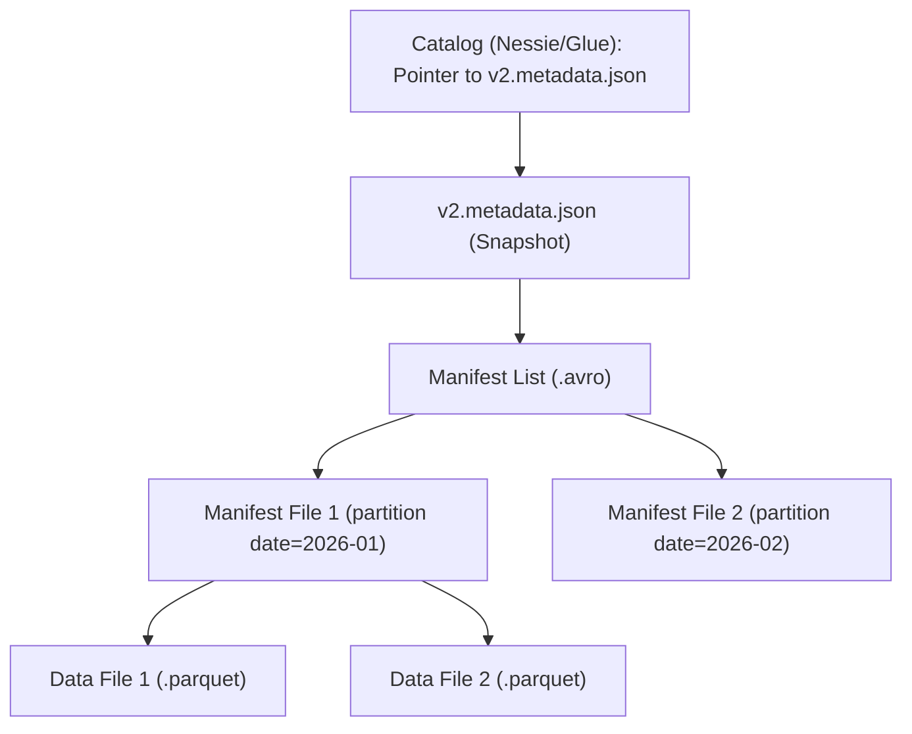

Data Lake truyền thống (sử dụng HDFS, S3 hoặc GCS chứa file Parquet/ORC) vốn dĩ **không hỗ trợ giao dịch ACID**. Hãy tưởng tượng kịch bản: Vào lúc 2 giờ sáng, một tiến trình Spark đang ghi đè một thư mục (Overwrite) thì Node bị tắt nguồn đột ngột, hoặc hai tiến trình (Concurrent Writes) cùng lúc cố gắng `UPDATE` một bảng. Kết quả là dữ liệu bị hỏng (Data Corruption), tình trạng đọc dữ liệu "rác" (Dirty Reads), hoặc mất dữ liệu nghiêm trọng.

Sự ra đời của các **Open Table Formats** (Delta Lake, Apache Iceberg, Apache Hudi) đã định hình lại khái niệm Data Lakehouse bằng cách mang các đặc tính ACID của RDBMS truyền thống lên trên Object Storage phân tán. Chìa khóa thiết kế cốt lõi nằm ở việc **trừu tượng hóa hoàn toàn Metadata (Siêu dữ liệu) khỏi Data (Dữ liệu vật lý)** và áp dụng các mô hình đồng thời nâng cao.

---

## 1. Cơ sở lý thuyết Đồng thời: MVCC và OCC

Để hỗ trợ ACID trên Cloud Object Storage — nơi không có khái niệm khóa dòng (Row-level Locks) như MySQL/PostgreSQL — các Table Formats dựa vào hai nguyên lý nền tảng:

### 1.1. Multi-Version Concurrency Control (MVCC)
MVCC là chiến lược cho phép nhiều người đọc (Readers) truy cập vào một **Snapshot (ảnh chụp) nhất quán** của dữ liệu, ngay cả khi dữ liệu đó đang bị một tiến trình khác thay đổi.
*   Reader không bao giờ bị chặn (Block) bởi Writer.
*   Mỗi khi Writer commit một thay đổi, nó tạo ra một Snapshot version mới hoàn toàn (ví dụ: `v1`, `v2`, `v3`).
*   Reader bắt đầu query ở version nào thì sẽ luôn thấy dữ liệu cố định của version đó cho đến khi query hoàn tất, bất chấp thế giới bên ngoài thay đổi ra sao.

### 1.2. Optimistic Concurrency Control (OCC)
Thay vì sử dụng Lock cơ học (Pessimistic Locking) gây bóp nghẹt băng thông hệ thống, **Optimistic Concurrency Control (OCC)** giả định rằng: *"Xung đột dữ liệu hiếm khi xảy ra"*.
*   Mọi Writer đều được phép thoải mái tính toán và ghi file Parquet mới (staging) ra S3 mà không bị ai cản trở.
*   Tại thời điểm **Commit (Xác nhận)**, Engine mới bắt đầu kiểm tra xung đột. Nó so sánh version của bảng lúc bắt đầu ghi và version hiện tại.
*   Nếu không có ai sửa bảng trong khoảng thời gian đó, thao tác Commit thành công tức thì (Atomic Swap).
*   Nếu phát hiện xung đột, Writer sẽ bị từ chối (Fail) và phải tiến hành chu trình **Retry** ngầm hoặc báo lỗi về ứng dụng.

---

## 2. Kiến trúc Thực thi: Copy-on-Write vs Merge-on-Read

Dù dùng format nào, các giao dịch (Transactions) đều phải xử lý cách cập nhật file tĩnh (vì Object Storage bản chất là *Immutable*). Điều này sinh ra hai chiến lược đánh đổi khốc liệt:



### 2.1. Copy-on-Write (CoW)
- **Hoạt động:** Bạn muốn sửa 1 dòng trong file Parquet 1GB? Spark phải kéo cả 1GB lên Memory, đổi 1 dòng, và ghi đè xuống S3 thành một file Parquet 1GB hoàn toàn mới. File cũ bị đánh dấu là "Tombstoned" (bia mộ).
- **Đánh đổi (Trade-offs):**
  - *Pro:* Read Latency cực thấp vì dữ liệu lúc đọc đã sạch sẽ, quét tuần tự rất mượt.
  - *Con:* **Write Amplification (Khuếch đại ghi)** tàn bạo. Không thể dùng cho Streaming Ingestion hoặc CDC (Change Data Capture) với tần suất UPDATE cao vì I/O cost sẽ phá nát ngân sách Cloud của bạn.

### 2.2. Merge-on-Read (MoR)
- **Hoạt động:** Thay vì ghi lại cả file to, hệ thống chỉ ghi phần nội dung vừa thay đổi (Delta/Delete logs) ra một file rất nhỏ.
- **Đánh đổi (Trade-offs):**
  - *Pro:* Write Latency rất thấp. Chịu tải xuất sắc cho CDC và Kafka Streaming.
  - *Con:* **Read Amplification (Khuếch đại đọc)** và tốn Compute. Khi Engine truy vấn (Trino/Spark) đọc dữ liệu, nó phải tự động thực hiện thao tác `Merge` file Parquet gốc và Delta file ngay trong RAM tại Runtime. Bắt buộc phải có tiến trình Compaction (Gộp file) chạy ngầm định kỳ để dọn dẹp.

---

## 3. Mổ xẻ Kiến trúc 3 Ông Lớn

### 3.1. Delta Lake: Kiến trúc Transaction Log (`_delta_log`)
Delta Lake thiết kế xoay quanh thư mục `_delta_log` chứa các chuỗi file JSON. Mỗi file JSON (ví dụ `000001.json`) là một Atomic Commit ghi nhận hành động thêm (`add`) hoặc xóa (`remove`) file Parquet vật lý.

```json
// Ví dụ nội dung 1 commit (Snapshot) trong Delta Log
{
  "add": {
    "path": "part-00000-xxx.parquet",
    "size": 10485760,
    "partitionValues": {"date": "2026-06-26"},
    "stats": "{\"numRecords\":100,\"minValues\":{\"id\":1},\"maxValues\":{\"id\":100}}"
  }
}
```
**Rủi ro Vận hành: The Replay Overhead**
Nếu bảng trải qua hàng triệu transactions, thao tác khởi tạo Spark job sẽ phải đọc và replay (chơi lại) hàng vạn file JSON. Việc này gây **OOM (Out Of Memory)** trên Driver node. Delta giải quyết bằng **Checkpoints** (Lưu Snapshot định kỳ dạng Parquet sau mỗi 10 commits).

### 3.2. Apache Iceberg: Hierarchical Metadata & Tránh Cartesian Explosion
Iceberg (do Netflix tạo ra) trị các bảng khổng lồ (Petabytes) nhờ tổ chức Metadata theo dạng cấu trúc Cây Phân Cấp (Hierarchical Tree) rất chặt chẽ:


- **Atomic Compare-and-Swap:** Commit trong Iceberg là việc Catalog (VD: Hive Metastore, AWS Glue) trỏ tham chiếu (pointer) từ `v1.metadata.json` sang `v2.metadata.json` bằng 1 nguyên tử lệnh duy nhất.
- **Hidden Partitioning (Tuyệt kỹ ẩn mình):** Nếu bạn query lọc bằng `event_time` nhưng bảng lại partition theo `event_date`, Iceberg tự tính toán biên độ thời gian và quét chính xác thư mục (Pruning) nhờ Manifest Files. Query Engine không cần quét toàn bảng (Tránh Cartesian Scan), và Data Engineer không cần nhồi cột partition phụ vào bảng, khiến mọi thứ cực kỳ trong suốt với người dùng.

### 3.3. Apache Hudi: Tối ưu Streaming và CDC
Hudi (Hadoop Upserts Deletes and Incrementals) thiên về **Processing Framework**. Cốt lõi của nó là hệ thống **Timeline**, theo dõi mọi action (`commits`, `cleans`, `compactions`) dọc trục thời gian, cực mạnh ở Incremental Processing (Xử lý tăng dần). Bạn có thể dễ dàng query "Lấy tất cả các row thay đổi từ 8h sáng hôm nay".

---

## 4. Các Sự cố Vận hành Phổ biến (Troubleshooting)

Làm việc với Data Lakehouse yêu cầu Kỹ sư Dữ liệu phải thấu hiểu các Incident sau:

### 4.1. Concurrency Retry Storms (Bão Retry do OCC)
Vì Delta và Iceberg dùng OCC, nếu bạn cấu hình 20 luồng Airflow chạy ghi đồng thời (Concurrent Ingests) vào chung 1 bảng (thậm chí 1 partition), chúng sẽ dẫm đạp lên nhau lúc Commit. 
*   **Hậu quả:** Job thất bại, tự động kích hoạt Retry. 20 luồng cùng Retry tạo thành bão (Retry Storm), Driver liên tục Re-compute lại dữ liệu trên RAM dẫn đến OOMKilled và bốc hơi ngân sách Cloud.
*   **Giải pháp:** Áp dụng Hash-partitioning trước khi ghi, cô lập các luồng ghi vào các Partition vật lý độc lập.

### 4.2. Khủng hoảng "Small Files" & Nổ Metadata
Ghi Streaming dữ liệu 5 phút/lần sinh ra hàng vạn file Parquet chỉ vài KB.
*   **Hậu quả:** Thư mục Metadata bành trướng khổng lồ. S3/GCS chặn IP của bạn vì Request Rate [API GET/PUT] vượt quá giới hạn (Throttling). Query Planning của Spark mất 20 phút thay vì 2 giây.
*   **Giải pháp Thực chiến:**
    1.  Khởi chạy luồng `OPTIMIZE` (hoặc Compaction) hàng đêm để bin-pack file nhỏ thành file 512MB hoặc 1GB.
    2.  BẮT BUỘC chạy luồng `VACUUM` (Delta) hoặc `ExpireSnapshots` (Iceberg) để dọn dẹp các file cũ không còn được tham chiếu. Nếu quên, tiền lưu trữ (Storage Cost) trên S3 sẽ thổi bay lợi nhuận của công ty.

---

## 5. Nguồn Tham Khảo (References)
*   **Netflix Tech Blog:** [How Netflix uses Apache Iceberg][https://netflixtechblog.com/]
*   **Databricks Documentation:** [Delta Lake Concurrency Control (OCC]][https://docs.databricks.com/en/optimizations/isolation-level.html]
*   **Apache Iceberg Spec:** [Iceberg Table Spec & Metadata Hierarchy][https://iceberg.apache.org/spec/]
*   **Designing Data-Intensive Applications** - *Martin Kleppmann* (MVCC Concepts).
*   **Onehouse Blog:** [Apache Hudi Architecture](https://hudi.apache.org/docs/concepts/]
