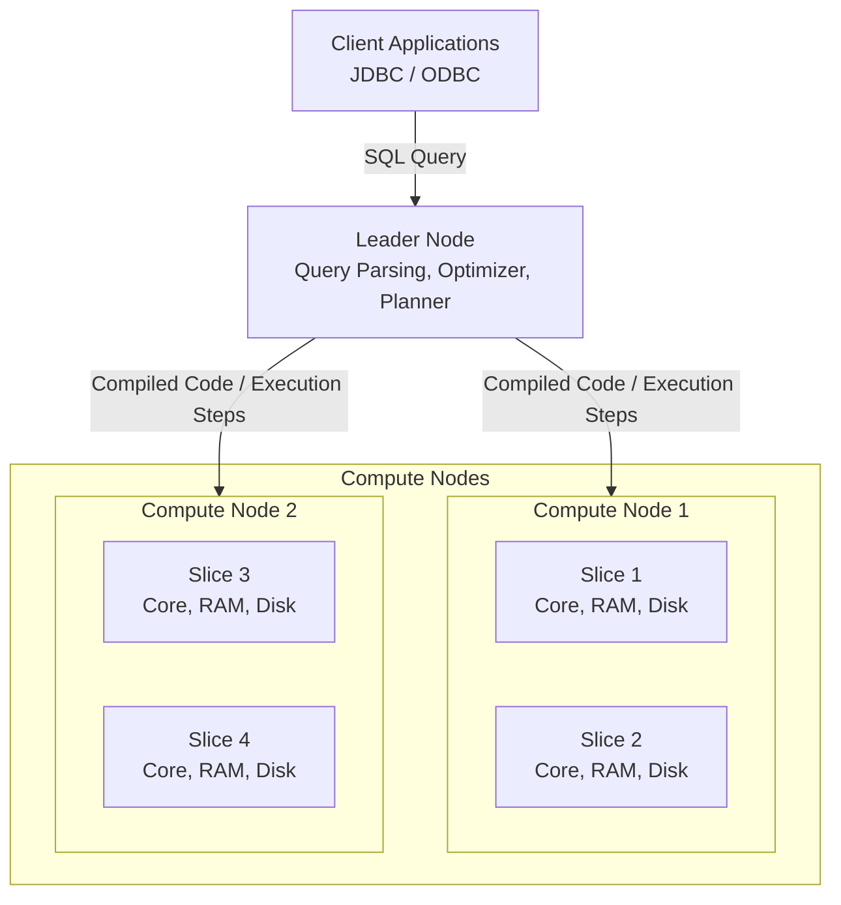
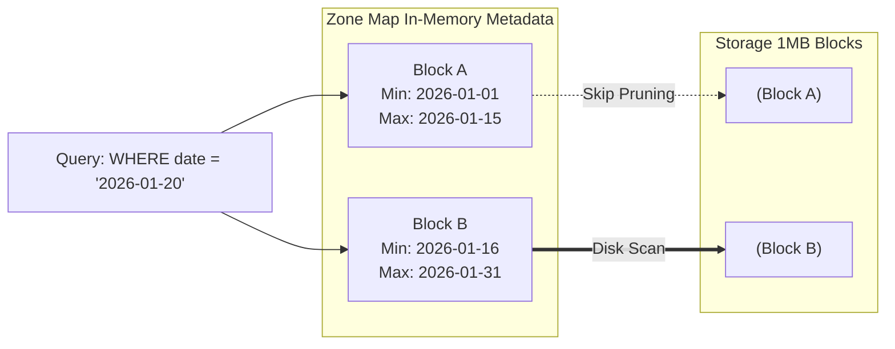

Amazon Redshift là Data Warehouse có kiến trúc xử lý song song khổng lồ (MPP - Massively Parallel Processing), được fork từ lõi PostgreSQL nhưng thiết kế lại hoàn toàn hệ thống lưu trữ (Storage Engine) theo định dạng cột (Columnar) phục vụ cho các truy vấn phân tích (OLAP).

Bài viết này bỏ qua các khái niệm tổng quan bề mặt và đi sâu vào cách Redshift thực thi truy vấn vật lý, cách lưu trữ dữ liệu dưới đĩa cứng, và những rủi ro vận hành (Operational Risks) khi thiết kế Data Warehouse với khối lượng Petabyte.

## 1. Kiến trúc Thực thi Vật lý (Physical Execution Architecture)

Một cụm (cluster) Redshift không phải là một cỗ máy đơn lẻ, mà là một mạng lưới tính toán phân tán.



- **Leader Node**: Nút điều phối trung tâm. Nó tiếp nhận truy vấn, parse câu lệnh SQL, xây dựng Execution Plan (giống như Spark Driver), compile mã ra C++ tĩnh để tăng tốc thực thi, và đẩy xuống các Compute Nodes.
- **Compute Nodes**: Nơi thực sự xử lý (worker). Mỗi Node vật lý được chia thành nhiều **Slices** (Lát cắt logic). Mỗi Slice sở hữu 1 phần CPU Core, RAM và không gian đĩa tách biệt độc lập hoàn toàn. Redshift là kiến trúc *Shared-Nothing* ở mức Slice. Khi thực thi, Slice 1 không chia sẻ RAM hay disk với Slice 2.

## 2. Redshift Storage Engine & Zone Maps Pruning

Khác với OLTP đọc từng dòng, Redshift áp dụng lưu trữ dạng cột (Columnar) và tổ chức thành các block cố định, bất biến.

### 2.1. Cấu trúc 1MB Immutable Blocks

Dữ liệu trong Redshift được nhóm lại theo từng cột và chia thành các Block cố định **1MB**. Tại sao lại là 1MB? 
- Quá nhỏ: Tốn metadata để quản lý (mỗi block có 1 header), tốn chi phí Disk I/O ngẫu nhiên (Random I/O).
- Quá to: Gây Overhead vì phải đẩy toàn bộ khối lượng vào RAM dù chỉ cần một phần nhỏ dữ liệu.
1MB là con số cực kỳ hiệu quả cho Sequential I/O. Vì cùng 1 cột có datatype giống nhau, hệ thống có thể áp dụng các thuật toán nén chuyên dụng (như LZO, Zstandard hoặc AZ64), giúp mỗi Block chứa hàng triệu giá trị thay vì vài nghìn như hệ thống hàng (Row).

### 2.2. Zone Maps (Cơ chế Data Pruning)

Làm sao Redshift duyệt Petabyte dữ liệu trong vài giây? Bí quyết nằm ở metadata **Zone Maps**. 
Zone Maps nằm hoàn toàn trên RAM của Compute Node. Với mỗi Block 1MB lưu dưới đĩa, Zone Maps tự động lưu giữ 2 giá trị: `Min_Value` và `Max_Value`.



Khi có query: `SELECT amount FROM orders WHERE order_date = '2026-01-20'`, Optimizer sẽ duyệt Zone Map in-memory trước. Nó nhận thấy '2026-01-20' không nằm trong Block A, do đó bỏ qua hoàn toàn Block A (Skip) mà không tiêu tốn 1 byte Disk I/O nào. Khái niệm này gọi là **Data Pruning**.

## 3. Kiến Trúc Lưu Trữ Phân Tách RA3 (Decoupled Storage)

Kiến trúc truyền thống của Redshift (DS2, DC2) gắn cứng Compute và Storage trên cùng một Node (Direct-Attached Storage). Khi kho dữ liệu phình to, kỹ sư bắt buộc phải "scale out" thuê thêm Node mới, mặc dù CPU đang rảnh, gây lãng phí chi phí. 

Giải pháp là **Redshift RA3** sử dụng **Managed Storage (RMS)** (Tách biệt Compute/Storage):

1. **Local SSD Cache (Hot Data):** Các compute nodes RA3 vẫn có ổ cứng SSD siêu tốc cục bộ đóng vai trò làm Cache. Dữ liệu truy cập thường xuyên sẽ nằm đây.
2. **Amazon S3 (Cold Data):** Dữ liệu thực tế và dài hạn được lưu trữ trên S3 với chi phí cực rẻ và dung lượng vô hạn.
3. Nếu truy vấn cần dữ liệu không có ở Cache, Redshift tự động Fetch các block 1MB tương ứng từ S3 qua mạng 100 Gbps network vào RAM của Node. Nhờ Zone Maps, số lượng block cần tải qua mạng được tối thiểu hóa.

Điều này cho phép hệ thống mở rộng Storage độc lập mà không cần trả thêm phí Compute nếu lượng query hằng ngày (workloads) không đổi.

## 4. Systemic Trade-offs & Troubleshooting (Góc nhìn Kỹ sư)

Hệ thống phân tán sẽ trở thành thảm họa nếu Kỹ sư thiết kế Schema sai. Đây là những rủi ro điển hình:

### 4.1. Sự cố Data Skew (Lệch dữ liệu) và Network Shuffle
Khi khởi tạo bảng, bắt buộc phải chọn **Distribution Key (Dist Key)** - cột dùng để Hashing và băm dữ liệu phân tán vào các Slice.

```sql
-- Ví dụ: Lựa chọn tồi nếu seller_id bị Skewed
CREATE TABLE sales (
    sale_id BIGINT,
    seller_id INT, -- Một số Seller lớn chiếm 80% volume
    amount DECIMAL(10,2)
) DISTSTYLE KEY DISTKEY (seller_id);
```
**Trade-off Risk:** 
- Nếu chọn `seller_id` làm Key, và sàn thương mại có 1 siêu người bán chiếm 80% giao dịch, 80% dữ liệu sẽ bị dồn vào **Slice 1**. 
- Khi Query, Slice 1 phải gánh 80% khối lượng xử lý (CPU 100%), RAM không đủ nên tràn ra đĩa cứng (**Spill-to-disk**), làm toàn bộ cụm treo. Các Slice khác thì nhàn rỗi.
- **Giải pháp:** Đổi Dist Key sang cột có độ biến thiên cao (High Cardinality) như `sale_id`. Nếu đổi sang `DISTSTYLE EVEN` (phân bổ Round-robin đều cho mọi Slice), bạn sẽ loại bỏ Data Skew nhưng phải đánh đổi bằng rủi ro **Network Shuffle** khi JOIN: Các Node phải liên tục broadcast dữ liệu qua mạng cho nhau (chậm lại do nghẽn băng thông).
- **Quy tắc thiết kế (Rule of Thumb):** Chọn Dist Key là cột vừa phân phối khá đều, vừa đóng vai trò cốt lõi trong các mệnh đề `JOIN` thường xuyên nhất.

### 4.2. Khủng hoảng Z-Ordering Fragmentation (Lỗ hổng Sort Key)
Như đã mô tả ở Zone Maps, để Pruning hiệu quả, dữ liệu vật lý dưới đĩa **PHẢI** được sắp xếp theo một trật tự. Trật tự đó là **Sort Key**.

```sql
CREATE TABLE events (
    event_id VARCHAR(50),
    user_id INT,
    event_time TIMESTAMP
) COMPOUND SORTKEY (event_time);
```
**Vấn đề vận hành:**
- Vì Block 1MB là *Immutable*, khi bạn chạy `UPDATE` hoặc `DELETE`, Redshift không xóa vật lý bản ghi. Nó chỉ lưu metadata đánh dấu bản ghi đó thành "Tombstone" (đã chết).
- Khi bạn `INSERT` row mới, dữ liệu mới ghi đè vào phía đuôi file mà không quan tâm đến trật tự `event_time`.
- Hậu quả: Dữ liệu phân mảnh (Fragmentation). Min/Max trong Zone Maps bị chồng chéo (overlapping) qua hàng nghìn Block. Pruning mất tác dụng, Redshift buộc phải Scan toàn bộ Disk (Full Table Scan) khiến I/O lên mức báo động đỏ.
- **Giải pháp:** Phải chạy lệnh `VACUUM` thường xuyên để dọn dẹp các "tombstone" và tái sắp xếp (re-sort) toàn bộ dữ liệu vật lý. (Dù tính năng Automatic Table Optimization - ATO của AWS cố gắng chạy nền, với các bảng khổng lồ, kỹ sư vẫn cần chủ động điều phối `VACUUM` bằng dbt/Airflow vào giờ off-peak).

### 4.3. Giới hạn đồng thời (Concurrency Limits) & WLM
Redshift là Data Warehouse tối ưu để xử lý Data lớn, không phải sinh ra để chịu tải đồng thời lớn (High Concurrency) như PostgreSQL.
Nếu có 100 BI Dashboard cùng refresh lúc 8h sáng, Redshift sẽ xếp hàng các truy vấn (Queueing).
- Phải cấu hình **WLM (Workload Management)** chia Queue hợp lý (Vd: Queue cho ETL ưu tiên 70% RAM, Queue cho BI ưu tiên 30% RAM).
- Nếu không cấp đủ RAM cho Queue truy vấn nặng, lỗi **Spill-to-disk** sẽ làm truy vấn chậm đi hàng chục lần so với in-memory.

## 5. Nguồn Tham Khảo (References)

1. [AWS Documentation - Amazon Redshift System Architecture](https://docs.aws.amazon.com/redshift/latest/dg/c_high_level_system_architecture.html)
2. [Designing Data-Intensive Applications (Chapter 3: Storage and Retrieval) - Martin Kleppmann](https://dataintensive.net/)
3. [AWS Big Data Blog - Use Amazon Redshift RA3 with managed storage](https://aws.amazon.com/blogs/big-data/use-amazon-redshift-ra3-with-managed-storage-in-your-modern-data-architecture/)
4. [AWS Documentation - Zone Maps and Sorting Data](https://docs.aws.amazon.com/redshift/latest/dg/t_Sorting_data.html)
