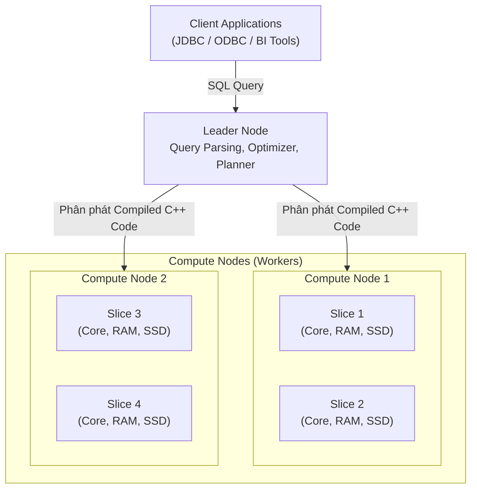
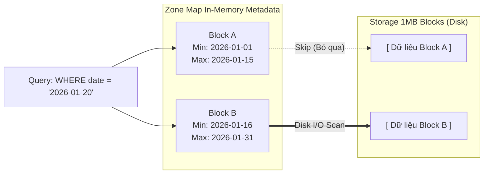

Amazon Redshift là hệ thống Enterprise Data Warehouse thế hệ đầu tiên trên Cloud sở hữu kiến trúc xử lý song song khổng lồ (MPP - Massively Parallel Processing). Dù được fork (Tách nhánh) từ lõi mã nguồn PostgreSQL, Redshift đã được AWS đập đi xây lại hoàn toàn Hệ thống lưu trữ (Storage Engine) theo định dạng cột (Columnar) để tối ưu hóa đặc thù cho các truy vấn phân tích (OLAP).

Bài viết này bỏ qua các định nghĩa mang tính Marketing và đi sâu vào cách Redshift thực thi truy vấn vật lý, cách lưu trữ dữ liệu dưới đĩa cứng, và những rủi ro vận hành (Operational Risks) khốc liệt khi thiết kế Data Warehouse ở quy mô Petabyte.

---

## 1. Kiến trúc Thực thi Vật lý (MPP Physical Architecture)

Một Cụm (Cluster) Redshift không phải là một cỗ máy đơn lẻ, mà là một mạng lưới máy tính phân tán chặt chẽ. Cơ chế này gọi là **Shared-Nothing Architecture**.



- **Leader Node**: Nút "Đầu não" điều phối. Nó tiếp nhận truy vấn SQL từ người dùng, Parse (Phân tích cú pháp), xây dựng Execution Plan, và Compile (Biên dịch) mã SQL ra mã máy C++ tĩnh để tăng tốc thực thi. Sau đó, nó đẩy Code xuống các Worker Nodes.
- **Compute Nodes**: Nơi thực sự cày ải dữ liệu. Mỗi Node vật lý được chia thành nhiều **Slices** (Lát cắt logic). Mỗi Slice sở hữu 1 phần CPU Core, RAM và không gian đĩa vật lý tách biệt hoàn toàn. Khi chạy truy vấn, Slice 1 không bao giờ đụng vào RAM hay Disk của Slice 2 (Shared-Nothing). Mọi sự trao đổi dữ liệu giữa các Slice phải đi qua mạng (Network Shuffle).

---

## 2. Redshift Storage Engine & Zone Maps Pruning

Khác với OLTP đọc từng dòng (Row-based), Redshift áp dụng lưu trữ dạng Cột (Columnar) và tổ chức thành các Block cố định, bất biến (Immutable).

### 2.1. Cấu trúc 1MB Immutable Blocks
Dữ liệu vật lý trong Redshift được băm nhóm theo từng Cột và chia thành các Block có kích thước cố định **1MB**. Tại sao lại là 1MB? 
- Quá nhỏ (Vài KB): Tốn Metadata để quản lý, tốn chi phí Disk I/O nhảy cóc (Random I/O).
- Quá to (Vài GB): Gây Overhead tràn RAM vì phải đẩy toàn bộ khối lượng vào Memory dù User chỉ cần đọc 1 phần nhỏ.
1MB là "Điểm ngọt" (Sweet Spot) cực kỳ hiệu quả cho Sequential I/O. Vì cùng 1 Cột chỉ chứa 1 Datatype (Ví dụ `INT`), hệ thống áp dụng các thuật toán nén chuyên dụng cao độ (như LZO, Zstandard, hoặc thuật toán nội bộ AZ64), giúp mỗi Block 1MB có thể chứa hàng triệu giá trị thay vì vài nghìn như Row-based.

### 2.2. Zone Maps (Cơ chế Data Pruning In-Memory)
Làm sao Redshift duyệt Petabyte dữ liệu trong vài giây? Bí quyết nằm ở Metadata có tên là **Zone Maps**. 
Zone Maps nằm hoàn toàn trên RAM của Compute Node. Với mỗi Block 1MB lưu dưới đĩa, Zone Maps tự động lưu giữ 2 giá trị siêu nhỏ: `Min_Value` và `Max_Value`.



Khi có Query: `SELECT amount FROM orders WHERE order_date = '2026-01-20'`, Optimizer sẽ duyệt Zone Map trên RAM trước. Nó nhận thấy '2026-01-20' không nằm trong khoảng của Block A, do đó bỏ qua hoàn toàn Block A (Skip) mà không tiêu tốn 1 byte Disk I/O hay CPU giải nén nào. Khái niệm này gọi là **Data Pruning**.

---

## 3. Kiến Trúc Decoupled: RA3 Nodes, Managed Storage & AQUA

Kiến trúc thế hệ cũ của Redshift (Các dòng máy DS2, DC2) gắn cứng Compute và Storage trên cùng một phần cứng (Direct-Attached Storage). Khi lượng Data phình to lên, kỹ sư bắt buộc phải "Scale out" mua thêm máy chủ mới dù CPU đang rảnh rỗi. Điều này gây lãng phí hàng triệu Đô-la. 

AWS giải quyết bài toán này bằng kiến trúc **Redshift RA3** (Decoupled Compute & Storage):

1. **Managed Storage (RMS)**: Lưu trữ dữ liệu thực tế và dài hạn (Cold Data) vĩnh viễn trên Amazon S3 với chi phí cực rẻ và dung lượng vô hạn. Giờ đây bạn có thể Scale Storage mà không cần mua thêm CPU.
2. **Local SSD Cache (Hot Data)**: Các Compute Nodes RA3 vẫn có ổ cứng SSD siêu tốc cục bộ đóng vai trò làm Cache. Dữ liệu truy cập thường xuyên sẽ nằm đây. Nếu Query cần Data chưa có ở Cache, nó sẽ kéo thẳng từ S3 qua mạng 100 Gbps.
3. **AQUA (Advanced Query Accelerator)**: Một phần cứng tăng tốc độ phân tán đỉnh cao của AWS. Thay vì kéo toàn bộ Data từ S3 lên Compute Node để tính toán, AQUA mang "Compute xuống tận Storage". Nó sử dụng Chip AWS Nitro (FPGA/ASIC) để thực hiện các phép lọc (`LIKE`, `SIMILAR TO`) và giải nén ngay tại tầng S3 Storage, giảm thiểu dữ liệu phải gửi qua mạng. AQUA miễn phí trên các node RA3.

---

## 4. Systemic Trade-offs & Troubleshooting (Sự cố Thực chiến)

Dù có phần cứng mạnh, Redshift sẽ biến thành thảm họa nếu Data Engineer thiết kế Lược đồ (Schema) sai. Đây là những rủi ro Production chí mạng:

### 4.1. Sự cố Data Skew (Lệch dữ liệu) và Network Shuffle
Khi tạo bảng, bạn BẮT BUỘC phải chọn **Distribution Key (Dist Key)** - Cột dùng để băm (Hashing) và chia bài (Phân tán) dữ liệu vật lý vào các Slice.

```sql
-- VÍ DỤ: Lựa chọn tồi tệ nếu hệ thống có Siêu người bán (Data Skew)
CREATE TABLE fact_sales (
    sale_id BIGINT,
    seller_id INT, -- Một số Seller cực lớn chiếm 80% khối lượng giao dịch
    amount DECIMAL(10,2)
) DISTSTYLE KEY DISTKEY (seller_id);
```
**Trade-off Risk (Đánh đổi):** 
- Nếu chọn `seller_id` làm Key, và Shopee có 1 siêu người bán chiếm 80% giao dịch, 80% dữ liệu vật lý sẽ bị dồn vào đúng **Slice 1**. 
- Khi Query `GROUP BY seller_id`, Slice 1 phải gánh 80% khối lượng xử lý (CPU 100%), RAM không đủ nên tràn ra đĩa cứng (**Spill-to-disk**). Toàn cụm bị treo (Bottleneck) trong khi các Slice khác thì nhàn rỗi ngồi chơi.
- **Giải pháp:** Đổi Dist Key sang cột có độ phân tán đều (High Cardinality) như `sale_id`. Nếu đổi sang `DISTSTYLE EVEN` (Chia bài Round-robin đều tăm tắp cho mọi Slice), bạn sẽ loại bỏ triệt để Data Skew.
- **Cái giá phải trả của EVEN:** Khi JOIN bảng, các Node không tìm thấy dữ liệu trùng khớp ở Local, chúng buộc phải liên tục phát sóng dữ liệu qua mạng cho nhau (Broadcast / Network Shuffle). Mạng bị nghẽn (Congestion) làm truy vấn chậm đi hàng chục lần.
- **Quy tắc Vàng (Rule of Thumb):** Luôn chọn Dist Key là cột vừa phân phối đều, vừa đóng vai trò cốt lõi trong các mệnh đề `JOIN` lớn nhất.

### 4.2. Khủng hoảng Phân mảnh (Z-Ordering / Sort Key Fragmentation)
Để Zone Maps Pruning hiệu quả (Mục 2.2), dữ liệu vật lý dưới đĩa **PHẢI** được sắp xếp theo một trật tự. Trật tự đó là **Sort Key**.

```sql
-- Định nghĩa Sort Key vật lý
CREATE TABLE events (
    event_id VARCHAR(50),
    user_id INT,
    event_time TIMESTAMP
) COMPOUND SORTKEY (event_time);
```
**Vấn đề vận hành:**
- Vì Block 1MB là *Bất biến (Immutable)*, khi bạn chạy `UPDATE` hoặc `DELETE`, Redshift KHÔNG xóa vật lý bản ghi. Nó chỉ lưu Metadata đánh dấu bản ghi đó thành "Tombstone" (Rác).
- Khi bạn `INSERT` row mới hằng ngày, dữ liệu mới ghi đè vào phía đuôi file mà không thèm quan tâm đến trật tự `event_time` cũ.
- Hậu quả: Dữ liệu bị phân mảnh (Fragmentation). Các khoảng `Min_Value`/`Max_Value` trong Zone Maps bị chồng chéo (Overlapping) loạn xạ qua hàng nghìn Block. Data Pruning mất tác dụng, Redshift buộc phải Scan toàn bộ Ổ đĩa (Full Table Scan) khiến I/O lên mức báo động đỏ, Query chạy mất hàng giờ.
- **Giải pháp:** Bạn phải chạy lệnh `VACUUM` thường xuyên vào ban đêm. Lệnh này sẽ dừng hệ thống để dọn dẹp các "Tombstone", nhặt dữ liệu và Tái sắp xếp [Re-sort] toàn bộ đĩa cứng vật lý.

### 4.3. Giới hạn Đồng thời (Concurrency Limits) & WLM
Redshift là OLAP tối ưu để xử lý Data siêu bự, KHÔNG PHẢI sinh ra để chịu tải người dùng khổng lồ (High Concurrency) như MySQL.
Nếu có 100 User mở BI Dashboard cùng Refresh lúc 8h sáng, Redshift sẽ xếp hàng các truy vấn (Queueing Lock).
- **Giải pháp:** Cấu hình **WLM (Workload Management)** chia Queue hợp lý. Ví dụ: Queue cho Data Engineer chạy ETL ban đêm chiếm 70% RAM, Queue cho BI Team chiếm 30% RAM. Kích hoạt tính năng *Concurrency Scaling* (AWS tự động spin-up cụm phụ để gánh tải tạm thời tính phí theo giây).

---

## 5. Nguồn Tham Khảo (References)
1. **AWS Architecture:** [Amazon Redshift System Architecture][https://docs.aws.amazon.com/redshift/latest/dg/c_high_level_system_architecture.html]
2. **Sách chuyên môn:** *Designing Data-Intensive Applications* (Martin Kleppmann) - Chương 3: Column-Oriented Storage.
3. **AWS Big Data Blog:** [Amazon Redshift RA3 with Managed Storage][https://aws.amazon.com/blogs/big-data/use-amazon-redshift-ra3-with-managed-storage-in-your-modern-data-architecture/]
4. **AWS AQUA:** [Advanced Query Accelerator (AQUA] for Amazon Redshift](https://docs.aws.amazon.com/redshift/latest/dg/aqua-accelerator.html)
