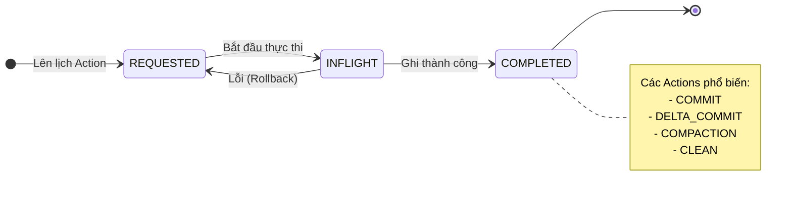

Apache Hudi (Hadoop Upserts Deletes and Incrementals) là một Open Table Format (định dạng bảng mở) được tạo ra bởi Uber vào năm 2016 để giải quyết bài toán xử lý lượng lớn dữ liệu log sự kiện của họ. Hiện nay, Hudi là một dự án cấp cao (Top-Level Project) của Apache Software Foundation. 

Thế mạnh lớn nhất của Hudi so với các định dạng khác như Apache Iceberg hay Delta Lake là khả năng xử lý **Streaming** cực mạnh, tối ưu cho các tác vụ Upsert/Delete liên tục, và cung cấp các cơ chế Indexing tinh vi giúp thay đổi dữ liệu với độ trễ thấp (low latency). Hudi không chỉ cung cấp định dạng lưu trữ mà còn đem lại một "Data Platform" mini ngay trong hệ sinh thái Data Lake của bạn.

---

## 1. Kiến trúc cốt lõi (Core Architecture)


Để hiểu rõ cách Hudi hoạt động, chúng ta cần đi sâu vào 3 khái niệm nền tảng: Timeline, File Layout và Table Types.

### 1.1 Hudi Timeline (Dòng thời gian)
Đây là "trái tim" của Hudi. Timeline duy trì một lịch sử (log) của tất cả các thao tác (actions) đã được thực hiện trên bảng tại các thời điểm khác nhau (instants). Nhờ Timeline, Hudi cung cấp khả năng đảm bảo giao dịch ACID, Snapshot Isolation, và các tính năng mạnh mẽ như Time Travel (truy vấn dữ liệu trong quá khứ) hay Incremental Queries (truy vấn tăng dần).

Mỗi action trên Timeline có thể ở một trong 3 trạng thái:
*   `REQUESTED`: Thao tác đã được lên lịch nhưng chưa bắt đầu.
*   `INFLIGHT`: Thao tác đang được thực thi.
*   `COMPLETED`: Thao tác đã hoàn thành và dữ liệu sẵn sàng để đọc.



### 1.2 Tổ chức File (File Layout & Management)
Hudi tổ chức dữ liệu thành các cấu trúc phân cấp tinh vi để tối ưu hóa việc đọc và ghi:
*   **Partition (Phân vùng):** Tương tự như Hive, Hudi chia dữ liệu thành các thư mục phân vùng (VD: `date=2023-10-01/`).
*   **File Group:** Bên trong mỗi phân vùng, dữ liệu được chia thành các File Group, mỗi File Group được định danh bằng một ID duy nhất.
*   **File Slice:** Mỗi File Group chứa nhiều File Slice, tương ứng với các phiên bản theo thời gian.
    *   Mỗi File Slice bao gồm 1 **Base File** (thường là định dạng Parquet dạng cột) tạo tại một `commit_time`.
    *   Kèm theo đó là các **Log Files** (định dạng Avro dựa trên hàng) chứa các thao tác Upsert/Delete xảy ra sau khi Base File được tạo.

### 1.3 Các loại bảng (Table Types)
Hudi hỗ trợ quản lý dữ liệu thông qua 2 loại bảng chính, nhằm đáp ứng các kịch bản sử dụng (workloads) khác nhau:

| Tiêu chí | Copy On Write (CoW) | Merge On Read (MoR) |
| :--- | :--- | :--- |
| **Định dạng file** | Chỉ sử dụng Base files (Parquet) | Kết hợp Base files (Parquet) và Log files (Avro) |
| **Hành vi khi Update** | Viết lại (Rewrite) toàn bộ Base file chứa record đó | Nối (Append) các thay đổi vào Log files |
| **Độ trễ ghi (Write latency)** | Cao (Do phải rewrite file) | Rất thấp (Do chỉ append logs) |
| **Độ trễ đọc (Read latency)** | Rất thấp (Chỉ đọc file Parquet nguyên khối) | Cao hơn (Phải merge Parquet và Avro on-the-fly) |
| **Use Case lý tưởng** | Read-heavy workloads, Batch Processing | Write-heavy, Streaming Ingestion, CDC |

> [!TIP]
> Nếu bạn đồng bộ dữ liệu từ RDBMS (MySQL, Postgres) qua CDC vào Data Lake mỗi 5 phút một lần, bảng **MoR** là sự lựa chọn duy nhất để tránh bị "nghẽn" I/O do rewrite liên tục. Nếu bạn chỉ cập nhật dữ liệu 1 lần vào cuối ngày, hãy dùng bảng **CoW**.

---

## 2. Các cơ chế Indexing (Chỉ mục)

Để thực hiện Upsert/Delete với hiệu suất cao (thay vì phải quét - scan toàn bộ các files trong Data Lake để tìm xem record cũ nằm ở đâu), Hudi sử dụng hệ thống Index pluggable để ánh xạ nhanh chóng một `record_key` tới đúng `File Group ID`.

*   **Bloom Filter Index (Mặc định):** Được tạo tự động và nhúng vào footers của các file base (Parquet). Khi có dữ liệu mới tới, Hudi đọc các Bloom Filters để kiểm tra xem `record_key` đã tồn tại ở file nào chưa. Rất hiệu quả nhưng có thể chậm nếu dung lượng dữ liệu quá lớn (False Positive rate).
*   **Record Level Index (HBase Index):** Ánh xạ trực tiếp tỉ lệ 1-1 giữa Record Key và File Group ID, lưu trên một cluster HBase bên ngoài. Cực nhanh cho các tập dữ liệu khổng lồ nhưng đòi hỏi quản lý infrastructure phức tạp.
*   **Bucket Index:** Phân bổ các bản ghi vào số lượng "buckets" (thùng) cố định bằng thuật toán băm (hashing). Tốc độ Upsert siêu nhanh và ổn định, rất phổ biến cho các kiến trúc hiện đại không muốn duy trì HBase.

> [!NOTE]
> Hudi phân loại Index thành **Global** và **Non-Global**. 
> - **Global Index** đảm bảo tính duy nhất của một record trên toàn bộ bảng. Quá trình Upsert sẽ tìm kiếm trong tất cả partitions (chi phí cao).
> - **Non-Global Index** chỉ đảm bảo tính duy nhất trong nội bộ một partition. Upsert chỉ tìm kiếm record cũ ở phân vùng mà record mới sắp đi vào (nhanh hơn nhiều).

---

## 3. Tính năng cốt lõi làm nên sức mạnh Hudi

### 3.1 Khả năng Mutability (Update & Delete)
Trong Data Lake truyền thống (sử dụng Hive), việc sửa hoặc xóa một vài dòng dữ liệu đồng nghĩa với việc bạn phải đọc toàn bộ partition, thay đổi dữ liệu trong bộ nhớ, và ghi lại (rewrite) toàn bộ partition vô cùng tốn kém (vi phạm nguyên tắc bất biến của HDFS/S3). Hudi cung cấp các toán tử `UPSERT` và `DELETE` hiệu quả ngay trên nền tảng Object Storage ở cấp độ bản ghi (record-level).

### 3.2 Incremental Processing (Xử lý dữ liệu tăng dần)
Đây là tính năng làm nên thương hiệu của Hudi. Thay vì phải xử lý lại toàn bộ bảng mỗi ngày, Hudi cho phép truy xuất lượng dữ liệu đã thay đổi (CDC) kể từ một mốc thời gian cụ thể.

Giả sử bạn có Data Pipeline: Bảng A -> Bảng B -> Bảng C. Bằng Incremental Processing, bạn chỉ lấy ra dòng dữ liệu "vừa được thêm vào hoặc thay đổi" tại Bảng A trong 1 giờ qua để tính toán và cập nhật vào Bảng B, giảm chi phí Compute tới 90%.

### 3.3 Concurrency Control (Kiểm soát đồng thời)
Hudi cung cấp khả năng nhiều writer và reader (Multi-writers, Multi-readers) cùng hoạt động đồng thời:
*   **MVCC (Multi-Version Concurrency Control):** Readers không bao giờ bị block bởi Writers. Readers luôn nhìn thấy bản snapshot nhất quán của dữ liệu.
*   **Optimistic Concurrency Control (OCC):** Cho phép nhiều Writers ghi đồng thời. Trước khi commit, Hudi sẽ kiểm tra xem có 2 writers nào ghi chồng lên cùng một file hay không. Nếu có, writer thứ 2 sẽ fail và thử lại (retry). Cơ chế này yêu cầu cấu hình Lock Provider (Zookeeper, DynamoDB, HDFS).

### 3.4 Table Services (Dịch vụ quản trị bảng tự động)
Hudi tự động hóa hoàn toàn các thao tác bảo trì dữ liệu mà thông thường Data Engineer phải viết script chạy thủ công:
*   **Compaction (Chỉ cho MoR):** Hợp nhất các file log (Avro) chứa các bản update vào file cơ sở (Parquet) theo lịch trình (thường chạy không đồng bộ - Async).
*   **Clustering:** Sắp xếp, gom nhóm các file nhỏ (small files) thành các file lớn hơn để tránh lỗi quá tải metadata cho NameNode hoặc giảm số request S3. Bạn cũng có thể sắp xếp dữ liệu (Z-Ordering) để tăng tốc độ Query theo các cột cụ thể.
*   **Cleaning:** Tự động dọn dẹp các phiên bản file cũ để giải phóng dung lượng lưu trữ Cloud.

---

## 4. Hands-on PySpark: Làm việc với Apache Hudi

Dưới đây là một ví dụ trực quan về cách sử dụng PySpark để khởi tạo, Upsert và truy vấn bảng Hudi.

### 4.1. Khởi tạo Spark Session với Hudi

Bạn cần tải thư viện Hudi đính kèm vào Spark (Ví dụ dùng Spark 3.3 và Hudi 0.13.1):

```python
from pyspark.sql import SparkSession

spark = SparkSession.builder \
    .appName("Hudi_Hands_On") \
    .config("spark.serializer", "org.apache.spark.serializer.KryoSerializer") \
    .config("spark.sql.extensions", "org.apache.spark.sql.hudi.HoodieSparkSessionExtension") \
    .config("spark.jars.packages", "org.apache.hudi:hudi-spark3.3-bundle_2.12:0.13.1") \
    .getOrCreate()
```

### 4.2. Ghi dữ liệu lần đầu (Insert)

Giả sử chúng ta có tập dữ liệu khách hàng. Chú ý các tùy chọn cấu hình quan trọng của Hudi:

```python
data = [
    (1, "Alice", 25, "New York", "2023-01-01T10:00:00Z"),
    (2, "Bob", 30, "San Francisco", "2023-01-01T10:05:00Z"),
]
columns = ["emp_id", "emp_name", "age", "city", "update_ts"]
df = spark.createDataFrame(data, columns)

hudi_options = {
    'hoodie.table.name': 'employees',
    'hoodie.datasource.write.recordkey.field': 'emp_id', # Primary Key
    'hoodie.datasource.write.partitionpath.field': 'city', # Phân vùng theo thành phố
    'hoodie.datasource.write.precombine.field': 'update_ts', # Nếu có nhiều bản ghi trùng key, lấy bản ghi có update_ts mới nhất
    'hoodie.datasource.write.operation': 'upsert',
    'hoodie.table.type': 'COPY_ON_WRITE' # Hoặc MERGE_ON_READ
}

base_path = "/tmp/hudi_employees"

df.write.format("hudi"). \
    options(**hudi_options). \
    mode("overwrite"). \
    save(base_path)
```

### 4.3. Cập nhật dữ liệu (Upsert)

Alice chuyển từ "New York" sang "Los Angeles" và có nhân viên mới là Charlie. Chúng ta tiếp tục dùng lệnh Upsert:

```python
updates = [
    (1, "Alice", 26, "Los Angeles", "2023-02-01T10:00:00Z"), # Cập nhật tuổi và thành phố của Alice
    (3, "Charlie", 28, "Chicago", "2023-02-01T11:00:00Z")  # Insert Charlie
]
df_updates = spark.createDataFrame(updates, columns)

df_updates.write.format("hudi"). \
    options(**hudi_options). \
    mode("append"). \
    save(base_path)
```

### 4.4. Truy vấn Incremental (Chỉ lấy dữ liệu thay đổi)

Chỉ lấy các bản ghi thay đổi từ commit '20230101100000' (Ví dụ):

```python
spark.read \
  .format("hudi") \
  .option("hoodie.datasource.query.type", "incremental") \
  .option("hoodie.datasource.read.begin.instanttime", "20230101100000") \
  .load(base_path) \
  .show()
```

---

## 5. So sánh Hudi vs Iceberg vs Delta Lake

Mặc dù cả 3 đều là Open Table Formats cho Data Lakehouse, mỗi công cụ có thiết kế cốt lõi khác nhau:

| Tính năng | Apache Hudi | Apache Iceberg | Delta Lake |
| :--- | :--- | :--- | :--- |
| **Mục tiêu thiết kế** | Tối ưu Upsert/Streaming/CDC | Quản lý Metadata bảng khổng lồ, chuẩn hóa | ACID Transactions, gắn liền Data Databricks |
| **Cập nhật dữ liệu** | Rất mạnh (Record-level index, MoR) | Tốt (MoR hỗ trợ qua Delete files) | Tốt (nhưng phải dùng Databricks để có hiệu năng cao nhất) |
| **Khả năng Incremental** | Siêu việt, thiết kế ngay từ đầu | Hỗ trợ qua changelog/time travel | Có cấu trúc CDC riêng, rất tốt |
| **Quản lý Small Files** | Tự động Clustering/Compaction | Quản lý thủ công qua lệnh (hoặc dịch vụ bên thứ 3) | Tối ưu hóa qua `OPTIMIZE` (thường cần Databricks) |
| **Hệ sinh thái** | Apache Spark, Flink, Presto, Trino | Spark, Trino, Dremio, Snowflake | Spark, Databricks ecosystem |

> [!IMPORTANT]
> Lựa chọn công cụ nào phụ thuộc vào hệ sinh thái hiện tại của bạn. Nếu hệ thống nặng về Streaming (Kafka, Flink, Spark Streaming) và CDC từ cơ sở dữ liệu, **Hudi** là vô đối. Nếu bạn muốn bảng của mình lưu trữ petabytes mà việc truy vấn metadata vẫn nhanh chóng, **Iceberg** là số 1. Nếu hệ thống hoàn toàn chạy trên Databricks, hãy ở lại với **Delta Lake**.

---

## 6. Kịch bản thực tế (Real-world Scenarios)

*   **Streaming Ingestion:** Uber (nơi sinh ra Hudi) phải xử lý hàng trăm tỷ event một ngày. Họ dùng Hudi để đẩy dữ liệu liên tục từ Kafka thẳng vào Hadoop/S3 với độ trễ cực thấp để tài xế và hành khách có trải nghiệm theo thời gian thực (real-time ETA).
*   **Change Data Capture (CDC):** Nhiều doanh nghiệp dùng Hudi làm kho dữ liệu trung tâm, đồng bộ tự động từ các nguồn RDBMS (MySQL, PostgreSQL, Oracle) qua Debezium. Việc cập nhật và xóa khách hàng trong Data Lake trở nên trong suốt và dễ dàng.
*   **Tuân thủ GDPR/CCPA:** Khi luật bảo vệ quyền riêng tư yêu cầu "Right to be Forgotten" (Quyền được lãng quên), các tổ chức cần xóa vĩnh viễn thông tin user cụ thể. Nhờ Hudi, họ có thể dùng câu lệnh SQL `DELETE FROM table WHERE user_id = 'X'` trực tiếp trên Data Lake mà không phải tốn thời gian tính toán lại dữ liệu của hàng triệu user khác.

---

## 7. Các Best Practices (Thực hành tốt nhất)

Khi vận hành Apache Hudi trên môi trường Production, bạn cần lưu ý:
1.  **Chiến lược Partitioning:** Tránh tạo quá nhiều partition nhỏ (over-partitioning) dẫn đến số lượng file metadata khổng lồ, làm chậm quá trình Query. Nên chọn trường thời gian (VD: `ngày`, `tháng`) kết hợp với một cấp độ logic đủ lớn.
2.  **Lựa chọn Key (Record Key và Pre-combine Key):** `Record Key` nên là Unique Key để phục vụ Upsert, và `Pre-combine Key` thường là trường `timestamp` cập nhật cuối cùng để Hudi biết bản ghi nào là mới nhất khi có xung đột (duplicate).
3.  **Tự động hóa Clustering và Compaction:** Cấu hình Async Compaction (dành cho bảng MoR) và Inline Clustering để không làm chậm luồng ghi Streaming chính.

---

## 8. Tài Liệu Tham Khảo

*   [Trang chủ Apache Hudi](https://hudi.apache.org/)
*   [Apache Hudi Core Concepts](https://hudi.apache.org/docs/concepts)
*   **Kiến trúc nền tảng CDC với Apache Hudi**
*   [Comparison of Data Lake Table Formats: Iceberg, Hudi, Delta Lake](https://lakefs.io/blog/hudi-iceberg-and-delta-lake-data-lake-table-formats-compared/)
