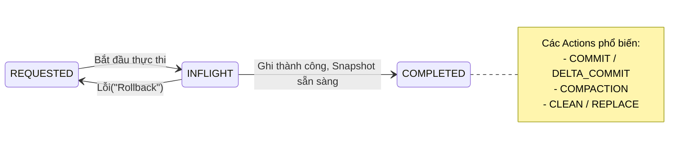
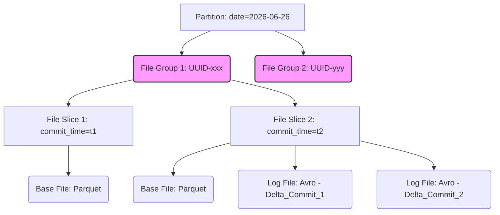

Thế giới Data Lakehouse hiện đại xoay quanh ba ông lớn: **Apache Hudi**, **Apache Iceberg** và **Delta Lake**. Nếu Iceberg sinh ra từ Netflix để giải quyết vấn đề quản lý Metadata khổng lồ, thì **Hudi (Hadoop Upserts Deletes and Incrementals)** được Uber thiết kế từ năm 2016 với một triết lý duy nhất: **Streaming-first và Upsert-heavy**.

Bài viết này sẽ bỏ qua những định nghĩa cơ bản để đi sâu vào kiến trúc thực thi vật lý (Physical Execution) của Hudi, cách nó quản lý các File Groups, sự đánh đổi giữa các cơ chế Indexing, và những tình huống sập hệ thống thực tế (Real-world Incidents) mà bạn sẽ gặp phải khi vận hành cụm Hudi ở scale Petabyte.

---

## 1. Kiến trúc Lõi: Timeline và File Layout

Sức mạnh của Hudi đến từ việc nó ánh xạ thành công các khái niệm của Relational Database (Log-structured merge-tree) xuống hệ thống lưu trữ tĩnh (Object Storage như S3/GCS hoặc HDFS).

### 1.1. Hudi Timeline (Source of Truth)

Mọi giao dịch ACID trong Hudi đều xoay quanh **Timeline**. Đây là một danh sách sự kiện (event log) lưu trữ tất cả các *actions* xảy ra trên bảng theo thời gian (instants).



*   `REQUESTED`: Một tiến trình (ví dụ: Compaction) đã được lên lịch.
*   `INFLIGHT`: Đang ghi dữ liệu xuống disk.
*   `COMPLETED`: Dữ liệu đã an toàn và các Readers có thể đọc được snapshot mới nhất.

Nhờ Timeline, Hudi hỗ trợ **Time Travel** và **Incremental Queries** (chỉ đọc những file thay đổi từ thời điểm `T1` đến `T2`) với chi phí cực thấp, thay vì phải tính toán lại (recompute) toàn bộ pipeline.

### 1.2. Physical File Layout: Phá vỡ cấu trúc thư mục tĩnh

Hudi không đơn thuần vứt file Parquet vào thư mục Partition như Hive. Cấu trúc của nó chặt chẽ hơn nhiều để tránh vấn nạn "Small Files Problem".



1.  **File Group:** Nhóm các phiên bản của cùng một tập hợp records. Mỗi File Group có dung lượng mục tiêu (ví dụ 120MB). Hudi sẽ cố gắng pack dữ liệu vào đúng dung lượng này để tối ưu I/O.
2.  **File Slice:** Là phiên bản cụ thể của File Group tại một thời điểm (Instant). Một File Slice luôn chứa một **Base File (Parquet dạng cột)** và có thể kèm theo một hoặc nhiều **Log Files (Avro dạng hàng)** chứa các thao tác Upsert/Delete sau đó.

---

## 2. Table Types & Systemic Trade-offs

Hudi cung cấp 2 loại bảng. Việc chọn sai loại bảng sẽ dẫn đến hậu quả nghiêm trọng về chi phí Compute (EC2/Databricks) hoặc Storage (S3 API Costs).

### 2.1. Copy On Write (CoW)
- **Cơ chế:** Khi có 1 record cần UPDATE, Hudi sẽ đọc toàn bộ Base File (Parquet) chứa record đó vào bộ nhớ, cập nhật record, và viết ra (Rewrite) một Base File hoàn toàn mới với `commit_time` mới.
- **Đánh đổi (Trade-off):**
  - **Read Latency:** Rất thấp. Reader chỉ việc đọc file Parquet thuần túy.
  - **Write Amplification (Khuếch đại ghi):** CỰC KỲ CAO. Sửa 1 byte trong file 120MB đồng nghĩa với việc I/O phải write lại 120MB.
- **Use Case:** Phù hợp với batch pipelines (chạy 1 lần/ngày), dữ liệu dạng append-only, hoặc read-heavy BI dashboards.

### 2.2. Merge On Read (MoR)
- **Cơ chế:** Khi có UPDATE, thay vì rewrite file Parquet, Hudi ghi các thay đổi vào một **Log File (Avro)** nhỏ nhắn đính kèm với Base File hiện tại. 
- **Đánh đổi (Trade-off):**
  - **Write Latency:** Cực thấp, phù hợp với Streaming (Kafka -> Hudi).
  - **Read Amplification:** Cao. Khi query, Engine (Spark/Presto) phải tải cả Base File (Parquet) và quét qua các Log Files (Avro) để merge dữ liệu on-the-fly trên RAM.
  - **Maintenance Overhead:** Đòi hỏi dịch vụ **Compaction** chạy ngầm để hợp nhất Log Files vào Base File định kỳ.
- **Real-world Incident (Compaction Backlog):** Nếu Ingestion Rate quá cao nhưng Compaction Thread chạy không kịp (do thiếu executor memory), số lượng Log files (Avro) sẽ phình to. Khi Reader (Presto/Trino) query, việc merge hàng ngàn file Avro trong bộ nhớ sẽ gây ra lỗi `JVM OOMKilled` (Hết RAM).
  *Khắc phục:* Phải tune lại `hoodie.compact.inline.max.delta.commits` và cấu hình Async Compaction riêng biệt (chạy trên một cụm Compute khác biệt với luồng Ingestion).

---

## 3. Hệ thống Indexing: Tránh "Full Table Scan"

Làm sao Hudi biết record ID `user_123` nằm ở File Group nào để update mà không phải quét toàn bộ S3? Câu trả lời là Indexing.

### 3.1. Bloom Filter Index (Default)
Hudi nhúng trực tiếp một màng lọc Bloom (Probabilistic Data Structure) vào footer của các file Parquet.
- **Cơ chế:** Khi Upsert, Hudi lấy các keys mới và check qua các Bloom filters. 
- **Trade-off:** Rẻ tiền, không cần hệ thống ngoài. Tuy nhiên, nó có tỷ lệ **False Positives** (báo có tồn tại nhưng thực chất không). Điều này gây ra những lượt đọc đĩa (Disk Reads) dư thừa. Khi file quá lớn hoặc keys phân tán đều (Random UUIDs), Bloom Filter sẽ gây thắt cổ chai I/O.

### 3.2. Record Level Index (RLI) - *Khuyến nghị cho Scale lớn*
Được ra mắt từ bản 0.14.0, RLI duy trì một bảng metadata nội bộ lưu trữ chính xác map `[Record Key -> File Group ID]`.
- **Cơ chế:** $O(1)$ Lookup. Cực kỳ nhanh chóng.
- **Trade-off:** Đánh đổi bằng Storage và Memory để duy trì bảng Metadata (nhưng vẫn tốt hơn nhiều so với việc dựng hẳn cụm HBase bên ngoài).

| Tiêu chí | Bloom Filter Index | Record Level Index (RLI) |
| :--- | :--- | :--- |
| **Bản chất** | Xác suất (False Positives) | Chính xác ($O(1)$) |
| **Storage Overhead** | Thấp (nằm trong Parquet Footer) | Cao hơn (cần Metadata Table riêng) |
| **Best For** | Cập nhật tập trung vào phân vùng mới nhất (time-based) | Dữ liệu khổng lồ, phân tán (Random UUID Updates) |

---

## 4. Concurrency Control: Cuộc chiến của những Writers

Hudi đảm bảo **Snapshot Isolation** để Reader không bao giờ đọc phải dữ liệu rác đang ghi dở. Tuy nhiên, khi có nhiều Writers (Multi-writers), Hudi quản lý bằng cơ chế nào?

1. **Optimistic Concurrency Control (OCC):** 
   - Hudi không lock (khóa) từ đầu. Cứ ghi thoải mái. Lúc chuẩn bị Commit, Hudi mới check xem có Writer nào khác vừa commit vào cùng một File Group hay không.
   - Nếu có Conflict, transaction thứ hai sẽ bị Abort và Retry.
   - **Real-world Incident (Retry Storms):** Nếu 10 luồng Flink cùng cập nhật vào một partition `status=active`, OCC sẽ gây ra hàng loạt Rollback & Retry. Hệ thống bị kẹt trong một vòng lặp vĩnh cửu (Live-lock) gây lãng phí Compute khổng lồ. Lúc này, bạn phải dùng **Non-Blocking Concurrency Control (NBCC)** hoặc quy hoạch lại partitioning key.
2. **Multiversion Concurrency Control (MVCC):**
   - Áp dụng giữa Writer và các dịch vụ chạy ngầm (Table Services như Compaction/Clustering). Compaction cứ việc tạo Base File mới, Writer cứ việc append Log File. Trạng thái Timeline giúp 2 bên không giẫm chân lên nhau.

---

## 5. Show Me The Code: PySpark Hudi Upsert

Dưới đây là cấu hình Pipeline kinh điển dùng PySpark để thực hiện Upsert dữ liệu Streaming (CDC) vào bảng MoR. Chú ý các tham số cấu hình (Configurations) được giải thích kỹ.

```python
from pyspark.sql import SparkSession

# Yêu cầu tải đúng package hudi-spark (ví dụ: Spark 3.3, Hudi 0.14.0)
spark = SparkSession.builder \
    .appName("Hudi_Staff_Pipeline") \
    .config("spark.serializer", "org.apache.spark.serializer.KryoSerializer") \
    .config("spark.sql.extensions", "org.apache.spark.sql.hudi.HoodieSparkSessionExtension") \
    .config("spark.sql.catalog.spark_catalog", "org.apache.spark.sql.hudi.catalog.HoodieCatalog") \
    .getOrCreate()

# Dữ liệu CDC (Change Data Capture) từ Debezium Kafka
updates_data = [
    (101, "Alex", "Senior DE", "2026-06-26T10:00:00Z", False),
    (102, "Bob", "Staff DE", "2026-06-26T10:05:00Z", False),
    (101, "Alex", "Principal DE", "2026-06-26T10:15:00Z", False), # Bản ghi mới nhất của Alex
]
columns = ["emp_id", "name", "title", "updated_at", "is_deleted"]
df_cdc = spark.createDataFrame(updates_data, columns)

# Cấu hình Hudi Hardcore
hudi_options = {
    'hoodie.table.name': 'hr_employees',
    'hoodie.table.type': 'MERGE_ON_READ',           # Tối ưu cho Streaming/CDC
    
    # Core Keys
    'hoodie.datasource.write.recordkey.field': 'emp_id', 
    'hoodie.datasource.write.precombine.field': 'updated_at', # Xử lý duplicate trong cùng batch: Lấy timestamp lớn nhất
    'hoodie.datasource.write.partitionpath.field': '', # Unpartitioned hoặc chọn theo 'department'
    
    # Operation Type
    'hoodie.datasource.write.operation': 'upsert',
    'hoodie.datasource.write.payload.class': 'org.apache.hudi.common.model.DefaultHoodieRecordPayload',
    
    # Indexing Tuning (Khuyến nghị dùng RLI cho scale lớn trên bản 0.14+)
    'hoodie.metadata.enable': 'true',
    'hoodie.metadata.record.index.enable': 'true',
    
    # Tuning Small Files & Compaction (Chống OOMKilled)
    'hoodie.parquet.max.file.size': '125829120',    # 120MB
    'hoodie.compact.inline': 'false',               # KHÔNG chạy compaction chung luồng write (chạy Async riêng)
    'hoodie.compact.inline.max.delta.commits': '5', # Báo hiệu cần compact sau 5 commits
}

# Thực thi Upsert
df_cdc.write.format("hudi"). \
    options(**hudi_options). \
    mode("append"). \
    save("s3://data-lake/raw/hr_employees")
```

**Phân tích Trade-off đoạn code trên:**
- Chúng ta set `hoodie.compact.inline = 'false'` vì quá trình Compaction (merge Log + Base) rất tốn CPU và Memory. Nếu bắt luồng Ingestion Spark Streaming làm việc này, nó sẽ gây ra độ trễ (Spike Latency) cho luồng đọc từ Kafka. Thay vào đó, ta sẽ launch một Spark Job chạy ngầm định kỳ chỉ để làm nhiệm vụ Async Compaction.

---

## 6. Nguồn Tham Khảo (References)

1. **Uber Engineering Blog:** [Apache Hudi™ at Uber: Engineering for Trillion-Record-Scale Data Lake Operations](https://www.uber.com/en-VN/blog/apache-hudi-trillion-record-data-lake/) - Bài viết kinh điển giải thích chi tiết động lực Uber chuyển từ kiến trúc Bulk Load sang Incremental Processing bằng Hudi.
2. **Apache Hudi Official Docs:** [Concurrency Control (OCC vs MVCC)](https://hudi.apache.org/docs/concurrency_control) - Tài liệu mổ xẻ về cơ chế khóa (Locking) và xử lý tranh chấp Multi-writers.
3. **Record Level Index (RLI):** [Introducing Multimodal Index in Apache Hudi](https://hudi.apache.org/blog/2023/11/01/multimodal-index/) - Giải thích về chi phí Storage và lợi ích $O(1)$ Lookup khi Hudi nâng cấp hệ thống Index.
4. **Lakehouse Comparisons:** [Scaling Complex Data Workflows at Uber Using Apache Hudi](https://www.uber.com/blog/scaling-complex-data-workflows-using-apache-hudi/) - Phân tích cách Hudi giảm thiểu Read/Write Amplification trong hệ thống thực tế.
