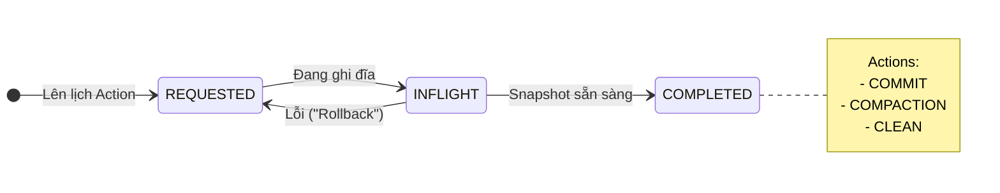
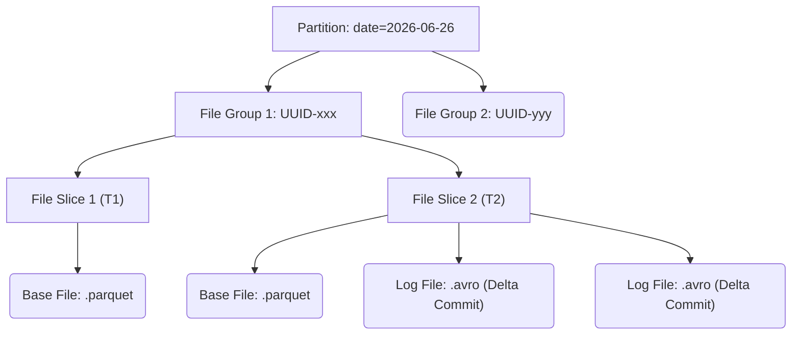

Thế giới Data Lakehouse hiện đại được thống trị bởi ba ông lớn: **Apache Hudi**, **Apache Iceberg** và **Delta Lake**. Nếu Iceberg được sinh ra tại Netflix để giải quyết vấn đề quản lý Metadata khổng lồ, thì **Hudi [Hadoop Upserts Deletes and Incrementals]** được Uber thiết kế với một triết lý duy nhất: **Streaming-first và Upsert-heavy**.

Bài viết này sẽ đi sâu vào kiến trúc thực thi vật lý (Physical Execution) của Hudi, cách nó quản lý các File Groups, sự đánh đổi giữa các định dạng lưu trữ (CoW vs MoR), và các cấu hình PySpark thực chiến.

---

## 1. Kiến trúc Lõi: Timeline và File Layout

Sức mạnh của Hudi đến từ việc nó mang các khái niệm của Database (LSM-Tree) xuống Object Storage (S3/GCS).

### 1.1. Hudi Timeline (Source of Truth)
Mọi giao dịch ACID trong Hudi đều xoay quanh **Timeline**. Đây là một danh sách sự kiện (Event Log) lưu trữ tất cả các hành động xảy ra trên bảng.


Nhờ Timeline, Hudi hỗ trợ **Incremental Queries** cực kỳ mạnh mẽ: Hệ thống chỉ đọc những file thực sự thay đổi từ thời điểm `T1` đến `T2` thay vì quét lại toàn bộ bảng.

### 1.2. Phân lớp Vật lý (Physical File Layout)
Hudi không ném file Parquet lộn xộn vào thư mục. Cấu trúc của nó được quy hoạch chặt chẽ để chống lại "Small File Problem".


- **File Group:** Nhóm các phiên bản của cùng một tập hợp bản ghi. Hudi luôn cố pack dữ liệu vào đúng dung lượng mục tiêu [ví dụ 120MB] cho một File Group.
- **File Slice:** Là phiên bản của File Group tại một thời điểm. Nó luôn chứa một **Base File (Parquet dạng cột)** và có thể kèm theo một hoặc nhiều **Log Files (Avro dạng hàng)** chứa các thao tác Update/Delete phát sinh sau đó.

---

## 2. Copy-On-Write (CoW) vs Merge-On-Read (MoR)

Đây là quyết định kiến trúc quan trọng nhất khi thiết kế bảng Hudi.

### 2.1. Copy On Write (CoW)
- **Cơ chế:** Khi có 1 record cần UPDATE, Hudi đọc toàn bộ Base File (Parquet) cũ vào bộ nhớ, cập nhật record, và ghi ra (Rewrite) một Base File hoàn toàn mới.
- **Trade-off:**
  - *Read Latency:* Cực thấp. Reader chỉ việc đọc file Parquet thuần túy.
  - *Write Amplification (Khuếch đại ghi):* CỰC CAO. Sửa 1 byte cũng phải ghi lại file 120MB.
- **Use Case:** Phù hợp với Batch pipelines, dữ liệu Append-only, hệ thống Read-heavy.

### 2.2. Merge On Read (MoR)
- **Cơ chế:** Khi có UPDATE, thay vì rewrite file Parquet, Hudi ghi các thay đổi vào **Log File (Avro)** siêu nhẹ.
- **Trade-off:**
  - *Write Latency:* Rất thấp. Phù hợp cho Streaming CDC (Debezium/Kafka).
  - *Read Amplification:* Cao. Khi query, Engine phải tải Base File và trộn (Merge) với Log Files ngay trên RAM.
  - *Maintenance:* Đòi hỏi tiến trình **Compaction** chạy ngầm để hợp nhất Log Files vào Base File.
- **Sự cố Vận hành (Compaction Backlog):** Nếu luồng Streaming xả dữ liệu quá nhanh mà Compaction chạy không kịp, hàng vạn file Avro sẽ phình to. Khi Reader query, việc merge dữ liệu sẽ gây tràn RAM (JVM OOMKilled).

---

## 3. Hệ thống Indexing

Làm sao Hudi Upsert đúng `user_123` mà không phải quét toàn bảng?

1. **Bloom Filter Index (Default):** Nhúng trực tiếp màng lọc Bloom vào footer của file Parquet. Xác định nhanh file *có thể* chứa key. Tuy nhiên, nó sinh ra *False Positives* (báo có nhưng không có), gây dư thừa Disk Reads khi keys phân tán ngẫu nhiên.
2. **Record Level Index (RLI):** Hudi duy trì một bảng Metadata ẩn chứa mapping `[Record Key -> File Group ID]`. Tốc độ tra cứu là $O(1]$. Khuyến nghị bắt buộc cho các bảng cực lớn.

---

## 4. Xử Lý Xung Đột (Concurrency Control)

Khi nhiều Writers cùng ghi vào bảng:
- **Optimistic Concurrency Control (OCC):** Hudi cho phép ghi đĩa thoải mái, đến phút chót (trước khi ghi Timeline) mới kiểm tra xung đột. Nếu 2 luồng cùng sửa 1 File Group, 1 luồng sẽ bị Rollback và Retry.
- *Rủi ro (Retry Storms):* Nếu hàng chục job Streaming cùng update vào partition hot, OCC sẽ gây bão Retry vô tận. Hudi hỗ trợ MVCC cho các Table Services (Compaction) chạy song song với Writer mà không bị đụng độ.

---

## 5. Thực Chiến Code: Streaming CDC PySpark

Kiến trúc PySpark tiêu chuẩn để đồng bộ dữ liệu CDC từ Kafka vào Hudi MoR:

```python
from pyspark.sql import SparkSession

spark = SparkSession.builder \
    .appName("Hudi_CDC_Pipeline") \
    .config("spark.serializer", "org.apache.spark.serializer.KryoSerializer") \
    .getOrCreate()

# Dữ liệu CDC cập nhật liên tục
df_cdc = spark.createDataFrame([
    (101, "Alex", "Senior DE", "2026-06-26T10:00:00Z"),
    (101, "Alex", "Principal DE", "2026-06-26T10:15:00Z"), # Record mới đè record cũ
], ["emp_id", "name", "title", "updated_at"])

hudi_options = {
    'hoodie.table.name': 'hr_employees',
    'hoodie.table.type': 'MERGE_ON_READ',           # Tối ưu cho Streaming CDC
    
    # Core Keys
    'hoodie.datasource.write.recordkey.field': 'emp_id', 
    'hoodie.datasource.write.precombine.field': 'updated_at', # Lấy record có timestamp lớn nhất nếu trùng
    
    # Indexing Tuning (Record Level Index cho scale lớn)
    'hoodie.metadata.enable': 'true',
    'hoodie.metadata.record.index.enable': 'true',
    
    # Tuning Compaction & OOM Prevention
    'hoodie.compact.inline': 'false',               # Bắt buộc False trên Streaming. Chạy Compaction Async riêng.
    'hoodie.compact.inline.max.delta.commits': '5', # Đánh dấu cần compact sau 5 lần commit
    'hoodie.parquet.max.file.size': '125829120',    # Target File Group 120MB
}

df_cdc.write.format("hudi"). \
    options(**hudi_options). \
    mode("append"). \
    save("s3://data-lake/hudi/hr_employees")
```
*Lưu ý cốt lõi:* Trong môi trường Streaming Production, LUÔN set `hoodie.compact.inline = 'false'`. Nếu ép luồng Streaming phải cõng thêm việc Compaction [Merge file tốn CPU/RAM], nó sẽ tạo ra độ trễ cực lớn (Spike Latency). Hãy dành một Spark Job riêng biệt chỉ làm nhiệm vụ Async Compaction.

---

## Nguồn Tham Khảo (References)
* [Uber Engineering: Apache Hudi at Trillion-Record-Scale][https://www.uber.com/en-VN/blog/apache-hudi-trillion-record-data-lake/]
* [Apache Hudi Docs: Concurrency Control (OCC vs MVCC]][https://hudi.apache.org/docs/concurrency_control]
* [Introducing Multimodal Index in Apache Hudi](https://hudi.apache.org/blog/2023/11/01/multimodal-index/]
