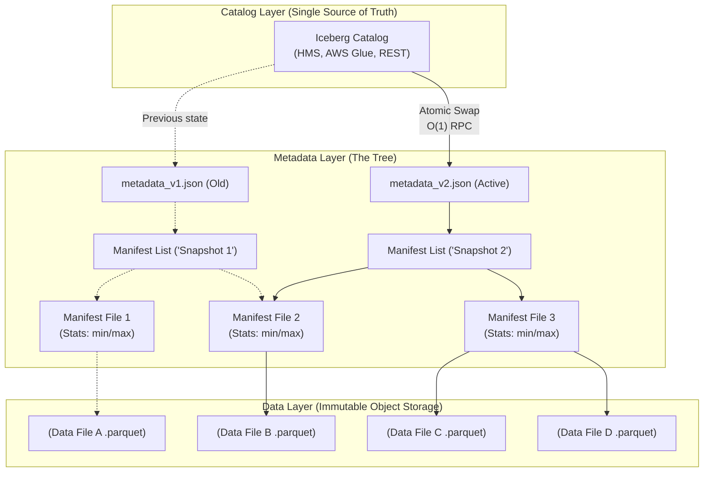

Khi vận hành Data Lake ở quy mô siêu khổng lồ (Petabyte-scale) tại các Big Tech như Netflix hay Apple, kiến trúc "Directory-based" truyền thống của Apache Hive nhanh chóng bộc lộ điểm yếu chí mạng: **Directory Listing Problem**. Việc engine tính toán phải gọi S3/GCS `List` API hàng triệu lần để quét các thư mục con tạo ra độ trễ (latency) khổng lồ trước khi truy vấn thực sự bắt đầu. 

Apache Iceberg, được khởi nguồn từ Netflix, giải quyết triệt để bài toán này bằng cách chuyển đổi từ "theo dõi thư mục" sang "theo dõi chính xác từng file vật lý" (File-level tracking) thông qua một cấu trúc Metadata Tree.

Dưới góc nhìn của một Staff Engineer, Iceberg không phải là phép màu. Nó là một hệ thống phân tán giải quyết bài toán Data Discovery bằng cách dời gánh nặng từ Storage I/O sang Metadata Management. Bài viết này sẽ mổ xẻ kiến trúc vật lý, **Hidden Partitioning**, và những đánh đổi hệ thống (Systemic Trade-offs) phức tạp về Compaction và OOM.

---

## 1. Kiến trúc Thực thi Vật lý: Cây Siêu Dữ Liệu (Metadata Tree)

Linh hồn của Iceberg nằm ở cấu trúc **Metadata Tree**. Iceberg tuyệt đối không bao giờ sửa đổi dữ liệu trực tiếp (Immutable Data). Mỗi thao tác Write/Update/Delete đều sinh ra các file dữ liệu mới và một cây Metadata mới, sau đó thực hiện trỏ con trỏ (Pointer Swap) một cách nguyên tử (Atomic).



### 1.1. Luồng thực thi truy vấn (Query Execution Flow) với Data Skipping
Khi User gõ `SELECT * FROM table WHERE created_at = '2023-01-01'`, engine (Spark/Trino) không đụng đến các file `.parquet` cho đến bước cuối cùng. Quá trình diễn ra hoàn toàn trên RAM:
1.  **Catalog Swap (O(1)):** Engine gọi Catalog xem file `metadata.json` mới nhất nằm ở đâu.
2.  **Snapshot Resolution:** Đọc `metadata.json` lấy Snapshot ID và trỏ tới `Manifest List`.
3.  **Manifest Pruning:** Đọc `Manifest List` (chứa range phân vùng của từng Manifest). Loại bỏ ngay lập tức các `Manifest File` không chứa dữ liệu ngày `2023-01-01`.
4.  **Data File Skipping (Min/Max Filtering):** Đọc các `Manifest File` còn sót lại. Dựa vào metadata cột `min_value`, `max_value`, `null_count` được lưu sẵn, vứt bỏ tiếp các Data file không thỏa mãn điều kiện.
5.  **Physical Read:** Chỉ mở và đọc đúng các `.parquet` file chứa dữ liệu cần thiết qua mạng. 

*Đánh đổi hệ thống:* Chiến lược này giảm 90-99% lượng file quét trên Cloud Storage, nhưng đổi lại, Spark Driver/Trino Coordinator phải dùng lượng lớn RAM để nạp và xử lý Metadata Tree. Nếu bảng có hàng triệu file nhỏ, quá trình đọc Metadata sẽ gây ra **JVM OOMKilled**.

---

## 2. Vũ khí bí mật: Hidden Partitioning (Phân vùng ẩn)

Trong Apache Hive, nếu bạn phân vùng bảng theo Tháng, kỹ sư dữ liệu phải tự tạo một cột vật lý mới (ví dụ `month_partition`) và User khi truy vấn bắt buộc phải nhớ thêm mệnh đề `WHERE month_partition = '2023-01'` để tránh Full Table Scan.

Iceberg giải quyết triệt để sự lố bịch này bằng **Hidden Partitioning**. Partitioning trở thành một khái niệm thuộc về Metadata (Biến đổi - Transforms), không phải cấu trúc thư mục vật lý.

```sql
-- DDL tạo bảng Iceberg với Hidden Partitioning
CREATE TABLE prod.data_lake.events (
    event_id STRING,
    user_id STRING,
    event_timestamp TIMESTAMP,
    payload STRING
)
USING iceberg
-- Áp dụng phép biến đổi 'days()' lên cột timestamp gốc.
-- Bảng vật lý sẽ chia phân vùng theo Ngày, nhưng User không cần biết điều đó!
PARTITIONED BY (days(event_timestamp));
```

**Systemic Benefit:** Users chỉ cần viết SQL tự nhiên: `WHERE event_timestamp > '2023-01-01 10:00:00'`. Iceberg tự động dịch điều kiện này sang Partition Filter để Prune (cắt tỉa) Manifest Files.
Thêm vào đó, Iceberg cho phép **Partition Evolution**: Bạn có thể đổi chiến lược chia phân vùng từ `days()` sang `hours()` on-the-fly mà không cần rewrite lại toàn bộ dữ liệu lịch sử.

---

## 3. Đánh đổi trong thao tác Ghi (COW vs. MOR)

Khi có lệnh `UPDATE`, `DELETE` hoặc `MERGE`, Iceberg cung cấp 2 chế độ kiến trúc vật lý. Việc chọn sai sẽ dẫn đến hiện tượng chóp nghẽn I/O (I/O Bottleneck) hoặc tràn RAM.

### 3.1. Copy-on-Write (COW) - Tối ưu cho Đọc
-   **Cơ chế:** Khi có 1 row bị update, Iceberg đọc toàn bộ file Parquet gốc lên RAM, sửa đúng 1 row đó, và ghi đè ra một file Parquet hoàn toàn mới.
-   **Trade-off:** Khuyếch đại ghi (Write Amplification) cực cao. Thay đổi 1 bytes có thể kéo theo việc ghi lại file 512MB. Tuy nhiên, tốc độ Đọc (Read Performance) đạt mức tối đa. Phù hợp cho Batch Jobs (dữ liệu tĩnh).

### 3.2. Merge-on-Read (MOR) - Tối ưu cho Ghi
-   **Cơ chế:** Dữ liệu cũ giữ nguyên. Row mới/sửa được ghi vào Data File mới, và các Row ID bị xóa được ghi vào một file "Delete File" (Positional/Equality Deletes).
-   **Trade-off:** Ghi cực nhanh, lý tưởng cho Streaming (Flink CDC). Nhưng khi Query, Engine phải nạp cả Data File và Delete File vào RAM để thực hiện Merge-on-the-fly. Nếu Delete file quá lớn, query latency sẽ tăng vọt.

```sql
-- Chuyển đổi chiến lược cho bảng Fact có tần suất update liên tục
ALTER TABLE prod.data_lake.events SET TBLPROPERTIES (
    'write.update.mode'='merge-on-read',
    'write.delete.mode'='merge-on-read',
    'write.merge.mode'='merge-on-read'
);
```

---

## 4. Rủi ro Vận hành: Compaction & Thảm họa Small Files

Iceberg không có phép thuật để miễn nhiễm với vật lý. Nếu bạn push dữ liệu từ Kafka/Flink vào Iceberg mỗi phút, bạn sẽ đối mặt với thảm họa **Small Files Problem**. S3 sẽ bị throttle (giới hạn băng thông) vì số lượng `GET` request quá lớn, và Metadata Tree sẽ phình to đến mức không thể đọc nổi.

### 4.1. Compaction: Bin-Packing vs Sorting (Z-Ordering)
Để cứu hệ thống, Data Engineer phải thiết lập các Job chạy ngầm để Compaction (gom file).

*   **Bin-Packing:** Lấy các file nhỏ 1MB ghép lại thành file lớn (Target 512MB) mà *không sắp xếp lại dữ liệu* bên trong. Rất rẻ tiền về mặt Compute (Cost-efficient).
*   **Z-Ordering (Sorting):** Gom cụm các dòng có cùng `user_id` vào chung một file Parquet, giúp thu hẹp chỉ số Min/Max. Khi query `user_id`, cơ chế Data Skipping sẽ bỏ qua được 99% các file.

**Systemic FinOps Trade-off:** 
Z-Ordering bắt buộc hệ thống phải thực hiện **Network Shuffle** toàn bộ dữ liệu trên Cluster để sắp xếp lại (Global Sort). Nó cực kỳ tốn CPU và RAM. Nếu bạn Z-Order dữ liệu Streaming mỗi giờ, hóa đơn Cloud sẽ thổi bay ngân sách dự án.
*Quy tắc thực chiến:* Chỉ chạy Z-Ordering vào cuối tuần trên các vách dữ liệu "nguội" (Cold data) không còn bị update nữa. Luôn sử dụng Bin-Packing cho dữ liệu "nóng" (Hot data).

```python
# Thực thi Bin-Packing cực rẻ cho dữ liệu nóng thông qua Airflow & Spark
spark.sql("""
CALL prod.system.rewrite_data_files(
  table => 'data_lake.events',
  strategy => 'binpack',
  options => map('target-file-size-bytes', '536870912') -- 512MB
)
""")

# Dọn dẹp Metadata rác (Xóa các snapshot quá 7 ngày để tránh Metadata Bloat)
spark.sql("""
CALL prod.system.expire_snapshots(
  table => 'data_lake.events',
  older_than => timestamp '2024-01-01 00:00:00',
  retain_last => 5
)
""")
```

---

## Nguồn Tham Khảo (References)

1.  **Apache Iceberg: An Architectural Look Under the Covers** - *Dremio Engineering*.
2.  **Data Engineering with Iceberg** - *Netflix TechBlog*.
3.  **Hidden Partitioning in Apache Iceberg** - *Iceberg Official Documentation*.
4.  **Optimizing Iceberg with Compaction (Bin-packing vs Sorting)** - *Tabular Engineering (now Databricks)*.
