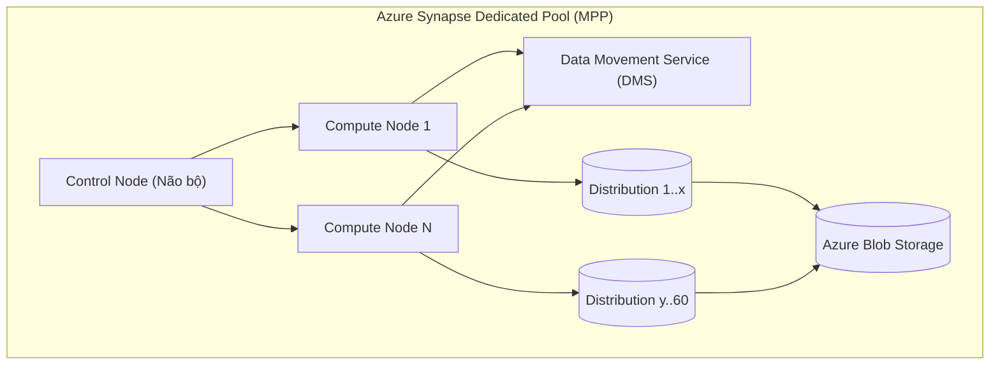

Trong các doanh nghiệp Enterprise, dữ liệu thường bị phân mảnh: Dữ liệu có cấu trúc ổn định nằm trong Data Warehouse (phục vụ BI/Report), còn dữ liệu phi cấu trúc khổng lồ nằm rải rác trên Data Lake (phục vụ Data Science/AI). **Azure Synapse Analytics** ra đời với tham vọng hợp nhất (Unified) hai thế giới này vào chung một Studio. 

Tuy nhiên, đằng sau lớp vỏ bọc giao diện "All-in-one" (Synapse Workspace), Synapse thực chất vận hành dựa trên các Engine điện toán hoàn toàn khác biệt nhau về mặt kiến trúc vật lý. Đối với một Kỹ sư Hệ thống (Staff Data Engineer), việc hiểu nhầm hoặc chọn sai Engine / Chiến lược phân bổ dữ liệu sẽ dẫn đến thảm họa về hiệu năng (Performance Degradation) và chi phí (Bill Shock).

---

## 1. Kiến trúc Vật lý: Hai thế giới của Synapse SQL

Thay vì cung cấp một Engine duy nhất như Snowflake, Synapse phân mảnh sức mạnh tính toán của mình thành các Pool chuyên biệt. Trong phạm vi xử lý SQL, Synapse tồn tại hai kiến trúc cốt lõi với triết lý thiết kế đối lập nhau:

1. **Dedicated SQL Pool (Di sản từ Azure SQL DW):** Kiến trúc **MPP (Massively Parallel Processing)** kinh điển, yêu cầu cấp phát tài nguyên tĩnh (Provisioned) qua các Đơn vị sức mạnh (Data Warehouse Units - DWUs). Compute và Storage được tách biệt, nhưng Compute nodes là cố định và quản lý trạng thái cục bộ (Local TempDB).
2. **Serverless SQL Pool:** Thế hệ Engine phân tán mới mang tên **Polaris Engine**. Nó hoàn toàn phi máy chủ (Serverless), thu phóng động (Auto-scaling) theo từng câu truy vấn và đọc dữ liệu trực tiếp từ Data Lake (Data Lakehouse architecture).

---

## 2. Dedicated SQL Pool: Kiến trúc MPP và Bài toán "60 Phân vùng"

Để tối ưu hóa Dedicated SQL Pool, Kỹ sư bắt buộc phải hiểu cơ chế hoạt động của kiến trúc MPP. Không giống như SMP (Symmetric Multiprocessing) trên SQL Server truyền thống (chỉ dùng chung RAM/Disk), MPP chia nhỏ khối lượng công việc cho một bầy Compute Nodes.

### 2.1. Giải phẫu Kiến trúc MPP



*   **Control Node:** Não bộ của hệ thống. Chịu trách nhiệm nhận câu T-SQL, biên dịch qua Cost-Based Optimizer (CBO] thành Kế hoạch thực thi phân tán (Distributed Execution Plan) và điều phối công việc xuống các Compute Nodes.
*   **Compute Nodes:** Các công nhân xử lý dữ liệu. Số lượng Node phụ thuộc vào mức DWU bạn mua.
*   **Data Movement Service (DMS - Nút thắt cổ chai):** DMS là dịch vụ điều phối việc di chuyển dữ liệu (Network Shuffle) giữa các Compute Nodes khi thực hiện các phép JOIN/GROUP BY phức tạp không nằm trên cùng một Node. Quá nhiều DMS Operations sẽ làm hệ thống chậm như rùa bò.
*   **60 Distributions (Phân vùng vật lý cố định):** Bất kể bạn cấp phát bao nhiêu Compute Node, dữ liệu trong Synapse Dedicated Pool **luôn luôn được chia thành 60 Logical Distributions** (Vùng phân bổ). Các Compute Node sẽ chia nhau quản lý 60 vùng này (Ví dụ: Có 6 Compute Nodes thì mỗi Node quản lý 10 Distributions).

### 2.2. Chiến lược Phân phối (Distribution Strategies) & Trade-offs

Việc bạn Map dữ liệu vào 60 Distributions này quyết định 90% sinh mạng của hệ thống. Đây là lúc Data Engineer thể hiện trình độ thiết kế Data Model:

1.  **Hash Distribution (Băm theo cột):** Dữ liệu được băm (Hash) dựa trên một cột khóa (Distribution Key) và rải vào 60 vùng.
    *   *Best for:* Bảng Fact khổng lồ (hàng tỷ dòng).
    *   *Trade-off:* Nếu chọn sai cột khóa (ví dụ cột có nhiều giá trị `NULL` hoặc độ phân tán thấp - Low Cardinality), sẽ xảy ra hiện tượng **Data Skew**. Một Compute Node sẽ ôm đồm quá nhiều dữ liệu và trở thành *Straggler* (Kẻ chậm chạp), kéo lùi toàn bộ hệ thống.
2.  **Round-Robin (Xoay vòng đều):** Dữ liệu được chia đều vào 60 vùng một cách ngẫu nhiên.
    *   *Best for:* Bảng Staging tạm thời, ưu tiên Ingestion tải dữ liệu nhanh.
    *   *Trade-off:* Khi JOIN, hệ thống bắt buộc phải kích hoạt DMS để Broadcast hoặc Shuffle dữ liệu qua mạng, gây tốn Network I/O và tăng Latency đột biến.
3.  **Replicated (Nhân bản):** Copy (Broadcast) toàn bộ dữ liệu ra tất cả các Compute Nodes.
    *   *Best for:* Bảng Dimension nhỏ (dưới 2GB).
    *   *Trade-off:* Tốn dung lượng lưu trữ và chi phí cập nhật. Khi UPDATE bảng Replicate, hệ thống phải đồng bộ trên tất cả các Node. Tuy nhiên, nó loại bỏ hoàn toàn Network Shuffle DMS khi JOIN với bảng Fact (Colocated Join).

---

## 3. Rủi ro Vận hành: Data Skew và OOM TempDB (Spill-to-disk)

Một trong những sự cố (Production Incidents) tồi tệ nhất khi vận hành Dedicated SQL Pool là **Tràn bộ nhớ tạm (TempDB Spill)**.

### Kịch bản sập hệ thống (The Incident)
Bạn thực hiện một lệnh `HASH JOIN` giữa bảng `FactSales` (Hash phân phối theo `Store_ID`) và bảng `DimCustomers` (Hash phân phối theo `Region_ID`).
1. Vì khóa phân phối không khớp nhau (`Store_ID` vs `Region_ID`), Control Node buộc phải gọi DMS thực hiện lệnh `ShuffleMove` để gom dữ liệu lại trước khi JOIN. 
2. Đồng thời, bảng `FactSales` bị **Skew cực nặng** (Một Store khổng lồ ở New York chiếm 40% doanh thu toàn quốc).
3. Hậu quả: Compute Node phụ trách Store ở New York bị cạn kiệt RAM được cấp phát. Nó buộc phải tràn dữ liệu xuống ổ đĩa cục bộ (Spill-to-disk vào TempDB).
4. Thảm họa: TempDB đầy 100%. Toàn bộ Data Warehouse bị kẹt (Lock/Blocked), các tác vụ của User khác cũng văng lỗi *"Out of space in TempDB"*.

### Cách khắc phục & Bắt lỗi bằng SQL
**Tuyệt đối không cấp phát thêm DWU ngay lập tức** (Đó là ném tiền qua cửa sổ). Cần check Data Skew bằng Query Audit:

```sql
-- Dành cho Data Engineer: Truy vấn DMV để xem dữ liệu có dồn cục vào Distribution nào không
SELECT 
    pnp.pdw_node_id,
    pnp.distribution_id,
    COUNT(*) as row_count,
    SUM(row_count) OVER() as total_rows,
    CAST(COUNT(*) * 100.0 / SUM(row_count) OVER() AS DECIMAL(5,2)) AS percentage_of_total
FROM sys.pdw_nodes_partitions pnp
JOIN sys.pdw_nodes_tables pnt 
    ON pnp.object_id = pnt.object_id 
    AND pnp.pdw_node_id = pnt.pdw_node_id
JOIN sys.pdw_table_mappings ptm 
    ON pnt.name = ptm.physical_name
WHERE ptm.object_id = OBJECT_ID('dbo.FactSales')
GROUP BY pnp.pdw_node_id, pnp.distribution_id
ORDER BY row_count DESC;
```
**Action (Tuning):** Nếu thấy `percentage_of_total` của một vài Node lên tới 10-20% (thay vì ~1.6% lý tưởng cho 1/60), hãy dùng lệnh `CREATE TABLE AS SELECT (CTAS)` để đổi Distribution Key sang một cột có độ phân tán cao hơn (Ví dụ: `Transaction_ID` hoặc phối hợp nhiều cột).

---

## 4. Serverless SQL Pool: Kiến trúc Polaris Engine (The Future)

Nhận thấy hạn chế của việc cấp phát phần cứng tĩnh, giới hạn 60 Distributions cứng nhắc và Local TempDB ở Dedicated Pool, Microsoft đã thiết kế ra **Polaris Engine** – động cơ điện toán đám mây gốc (Cloud-native) cung cấp sức mạnh cho Serverless SQL.

### 4.1. Tách biệt Compute và State hoàn toàn
Trong Polaris, các Worker Nodes hoàn toàn không lưu trạng thái (Stateless). Chúng không có TempDB cục bộ gắn liền với phần cứng vật lý. Dữ liệu trung gian được đổ ngược ra một lớp Storage phân tán tốc độ cao. Nếu một Worker Node bị chết giữa chừng, Control Node chỉ việc giao Task đó cho Node khác làm lại mà không làm hỏng toàn bộ Query.

### 4.2. Khái niệm "Cell" Abstraction (Gỡ rối Data Skew)
Polaris chia nhỏ khối lượng công việc thành các **Cells** (Các tác vụ cực nhỏ). Khi bạn Query một file Parquet 100GB, Polaris không gán tĩnh file đó cho 1 Node như MPP cũ. Nó chia file thành hàng ngàn Cells. Một cụm hàng trăm Worker Nodes (Auto-scaled) sẽ liên tục "nhặt" các Cells này để xử lý. 
$\rightarrow$ **Kết quả:** Nếu dữ liệu bị lệch (Skew), kiến trúc Cell sẽ tự động cân bằng tải (Dynamic Load Balancing) – Node nào rảnh sẽ nhặt thêm Cell, giải quyết triệt để vấn đề Data Skew kinh niên của kiến trúc MPP.

### 4.3. Trade-offs của Serverless SQL
*   **Pros:** Khởi động lập tức (Zero-warmup), chi phí cực thấp (Tính tiền theo TB dữ liệu quét, ~$5/TB), truy vấn thẳng vào Data Lake (Lakehouse Pattern).
*   **Cons:** Phụ thuộc vào tốc độ mạng (Network I/O) và định dạng File. Nếu bạn Query hàng triệu file `.csv` nhỏ (Small Files Problem) thay vì file `.parquet` được nén ZSTD, Polaris sẽ phải quét qua toàn bộ siêu dữ liệu từng file, khiến Query chạy chậm như rùa bò và tốn hàng đống tiền do phí Scan Metadata.

---

## 5. Synapse Link: The Zero-ETL (HTAP) Paradigm

Bên cạnh SQL Pools, Azure giới thiệu **Synapse Link** để giải quyết bài toán độ trễ của Batch ETL. Đây là kiến trúc **HTAP (Hybrid Transactional/Analytical Processing)**.

Synapse Link sử dụng định dạng **Analytical Store** ẩn đằng sau các Operational DB (Như Azure Cosmos DB, Azure SQL). Khi có thay đổi (Transaction), dữ liệu tự động được Columnar hóa (Replicated) xuống Analytical Store ở gần thời gian thực (Near Real-time) mà không ảnh hưởng tới Compute của DB gốc. 
$\rightarrow$ Spark Pool hoặc Serverless SQL có thể chọc thẳng vào Analytical Store để làm báo cáo, bỏ qua hoàn toàn các Airflow DAGs hay ADF Pipelines phức tạp.

---

## 6. Tổng kết: Bước đệm tiến tới Microsoft Fabric

Azure Synapse Analytics là một cỗ máy khổng lồ chứa đựng cả MPP, Spark và HTAP. Tuy nhiên, kiến trúc Dedicated SQL Pool (MPP) đang dần trở thành "Di sản" [Legacy] do chi phí duy trì High-Compute cao và độ khó trong việc tinh chỉnh thủ công.

Nhận thấy tương lai nằm ở sự linh hoạt, Microsoft đã lấy **Polaris Engine** của Synapse Serverless, nâng cấp nó, và cho ra mắt **Microsoft Fabric**. Trong Fabric, bạn có được hiệu năng của Dedicated Pool nhưng với sự tự động hóa thu phóng (Auto-scaling) phi máy chủ của Polaris, tất cả chạy trên một chuẩn dữ liệu mở duy nhất: OneLake (Delta/Parquet).

Việc am hiểu sự đánh đổi giữa Network Shuffle DMS, Data Skew và TempDB Spill trong Synapse sẽ trang bị cho bạn tư duy thiết kế hệ thống vững chắc để chinh phục bất kỳ Data Platform nào.

---

## Nguồn Tham Khảo
1. [Azure Synapse Analytics Dedicated SQL pool (MPP Architecture]][https://learn.microsoft.com/en-us/azure/synapse-analytics/sql-data-warehouse/massively-parallel-processing-mpp-architecture]
2. [Polaris: The Distributed SQL Engine in Azure Synapse (VLDB Paper]][https://vldb.org/pvldb/vol13/p3204-saborit.pdf] - Chi tiết kỹ thuật về kiến trúc State/Compute Separation và Cell Abstraction.
3. [Troubleshooting TempDB errors in Dedicated SQL Pool][https://learn.microsoft.com/en-us/azure/synapse-analytics/sql-data-warehouse/sql-data-warehouse-manage-monitor#monitor-tempdb]
4. [Azure Synapse Link for HTAP Analytics](https://learn.microsoft.com/en-us/azure/cosmos-db/synapse-link]
