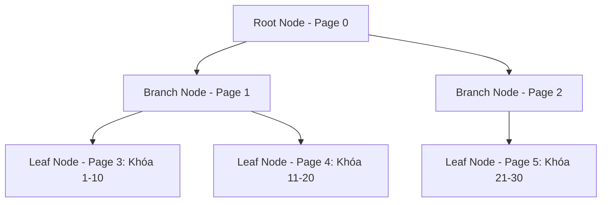
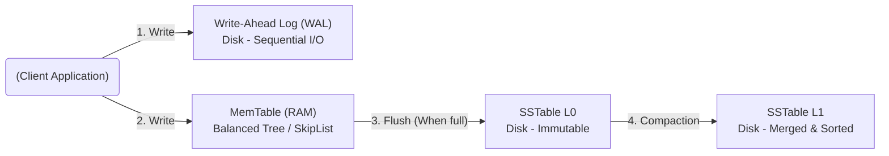

Lựa chọn Storage Engine là quyết định thiết kế kiến trúc (Architecture Design) quan trọng bậc nhất, ảnh hưởng trực tiếp đến hiệu năng, chi phí vận hành (FinOps) và tính ổn định của toàn bộ hệ thống dữ liệu. Ở tầng vật lý, gần như tất cả các cơ sở dữ liệu hiện đại đều dựa trên một trong hai họ cấu trúc dữ liệu cốt lõi: **B-Tree** (và các biến thể như B+Tree) hoặc **LSM-Tree** (Log-Structured Merge-Tree).

Bài viết này không dừng lại ở định nghĩa cơ bản, mà mổ xẻ sâu vào **Kiến trúc Thực thi Vật lý (Physical Execution)**, **Amplification Triad (Hệ số khuếch đại ba chiều)**, và các **Rủi ro Vận hành (Operational Risks)** từ góc nhìn của một Kỹ sư Hệ thống (Staff Data Engineer).

---

## 1. Kiến Trúc Thực Thi Vật Lý (Physical Execution)

### 1.1. B-Tree: Triết lý "Cập nhật tại chỗ" (In-place Updates)

B-Tree (đặc biệt là B+Tree) là xương sống của các hệ quản trị cơ sở dữ liệu quan hệ (RDBMS) truyền thống như MySQL (InnoDB), PostgreSQL, và Oracle. Thiết kế của nó nhắm đến việc tối ưu hóa **độ trễ đọc (Read Latency)** và hỗ trợ cực tốt các truy vấn dải (Range Queries).

**Cơ chế hoạt động ở tầng đĩa (Disk-level Execution):**

B-Tree chia không gian đĩa thành các khối (Blocks) hoặc trang (Pages) có kích thước cố định (Thường là 4KB đến 16KB). Các node của cây được ánh xạ trực tiếp vào các pages vật lý này. 

Khi một truy vấn `UPDATE` hoặc `INSERT` diễn ra:
1. Hệ thống tìm Page chứa dữ liệu trên đĩa bằng cách duyệt từ Root node xuống Leaf node.
2. Tải Page đó vào RAM (Buffer Pool).
3. Sửa đổi dữ liệu trực tiếp trên Page trong RAM.
4. Ghi đè (Overwrite) toàn bộ Page đó xuống đĩa cứng.



**Tại sao In-place update lại đắt đỏ (The Write Penalty)?**
Do các Page có kích thước cố định, nếu bạn chèn thêm một bản ghi vào một Page đã đầy, B-Tree bắt buộc phải chia Page đó làm hai (hiện tượng **Page Split**). Điều này kéo theo việc cập nhật lại các con trỏ ở node cha. Thao tác này sinh ra rất nhiều Random I/O trên đĩa cơ học hoặc SSD, làm suy giảm nghiêm trọng thông lượng ghi (Write Throughput) khi hệ thống chịu tải cao.

---

### 1.2. LSM-Tree: Triết lý "Ghi nối tiếp" (Append-only)

Khi đối mặt với các tải dữ liệu khổng lồ (High Write-throughput) như Event Logging, Time-Series Data, hay hệ thống nhắn tin (Nơi lượng Insert áp đảo lượng Read), B-Tree nhanh chóng trở thành nút thắt cổ chai do Random Disk I/O. **LSM-Tree** ra đời để giải bài toán này bằng cách biến mọi thao tác ghi (kể cả Update và Delete) thành thao tác ghi nối tiếp (Sequential I/O).

Các Database tiêu biểu dùng LSM-Tree: Apache Cassandra, RocksDB, ScyllaDB, InfluxDB, HBase.

**Luồng dữ liệu (Data Pipeline) của LSM-Tree:**



1. **Write-Ahead Log (WAL):** Dữ liệu đến được ghi nối tiếp vào cuối một file log trên đĩa. Thao tác này cực nhanh vì nó là Sequential I/O, mục đích duy nhất là để chống mất dữ liệu khi sập nguồn (Crash Recovery).
2. **MemTable:** Dữ liệu được đưa vào một cấu trúc cây cân bằng (như Red-Black Tree hoặc Skip List) nằm trên RAM. 
3. **SSTable (Sorted String Table):** Khi MemTable đạt kích thước ngưỡng (ví dụ 64MB), nó bị đóng băng và xả (Flush) xuống đĩa thành một file SSTable. File này là **Bất biến (Immutable)**. Bất kỳ bản ghi UPDATE hay DELETE (Tombstone) nào cũng chỉ đơn giản là Append thêm một dòng mới.
4. **Compaction (Dọn dẹp):** Theo thời gian, hệ thống sẽ sinh ra hàng ngàn SSTable. Một tiến trình chạy nền (Compaction) sẽ liên tục đọc các SSTable cũ, trộn chúng lại (Merge Sort), loại bỏ các bản ghi bị xóa (Tombstones) hoặc bị ghi đè, và tạo ra các SSTable lớn hơn ở tầng sâu hơn.

---

## 2. Hệ Số Khuếch Đại (The Amplification Triad)

Khi tinh chỉnh hệ thống lưu trữ, Data Engineer phải cân bằng giữa 3 loại hệ số khuếch đại (Amplification). Không có cấu trúc nào hoàn hảo ở cả 3 mặt. Nó là một sự đánh đổi vật lý cứng rắn.

| Loại Amplification | Ý nghĩa hệ thống | B-Tree | LSM-Tree |
| :--- | :--- | :--- | :--- |
|" **Write Amplification (Khuếch đại Ghi)** "| Lượng byte ghi xuống đĩa / Lượng byte logic cần ghi. Ảnh hưởng tuổi thọ SSD và băng thông đĩa. |" **Vừa phải**. Khi sửa 1 byte, hệ thống phải ghi đè cả Page (4-16KB) + ghi WAL. "| **Cao đến Rất Cao**. Do quá trình Compaction, một dòng dữ liệu có thể bị đọc lên và ghi xuống (Merged) hàng chục lần ở các Level khác nhau. |
| **Read Amplification (Khuếch đại Đọc)** |" Số lượng Disk Reads / Lượng đọc logic. Ảnh hưởng trực tiếp đến Read Latency (Độ trễ truy vấn). "| **Rất Thấp**. Tối đa bằng độ sâu của cây (Thường 3-4 thao tác I/O cho một query). | **Cao**. Có thể phải đọc nhiều file SSTables, kiểm tra Bloom Filters, và dò MemTable mới tìm ra dữ liệu mới nhất. |
|" **Space Amplification (Khuếch đại Không gian)** "| Kích thước vật lý / Kích thước logic. Ảnh hưởng tới FinOps (Chi phí lưu trữ SSD). |" **Cao**. Do hiện tượng phân mảnh (Fragmentation) và các khoảng trống dự phòng trong Page. "| **Thấp**. File SSTable bất biến được nén (Snappy, LZ4, ZSTD) rất chặt chẽ, tối đa hóa mật độ dữ liệu. |

---

## 3. Rủi Ro Vận Hành & Tình Huống Sập Hệ Thống

Là một Staff Engineer, bạn không chỉ thiết kế hệ thống chạy được, mà phải thiết kế hệ thống **sống sót được khi vỡ tải**.

### 3.1. B-Tree: Rủi ro Phân mảnh (Fragmentation)

Trong các hệ thống RDBMS (như PostgreSQL) chạy lâu năm với cường độ DELETE/UPDATE lớn, các Page của B-Tree sẽ bị "rỗ". Không gian trống bên trong Page (Internal Fragmentation) tăng lên, dẫn đến Disk I/O tăng cao do hệ thống phải đọc nhiều Page hơn để lấy cùng một lượng bản ghi.

*   **Triệu chứng:** Câu lệnh `SELECT` tốn nhiều I/O hơn, độ trễ tăng dần theo thời gian dù số lượng bản ghi không tăng.
*   **Cách khắc phục:** Cần thực hiện `VACUUM FULL` (PostgreSQL) hoặc `OPTIMIZE TABLE` (MySQL). **Đánh đổi:** Các thao tác này thường Block Table (Khóa bảng hoàn toàn) hoặc tiêu tốn tài nguyên khổng lồ. Chỉ được chạy vào cuối tuần hoặc giờ thấp điểm.

### 3.2. LSM-Tree: Ác Mộng Cổ Chai Compaction (Compaction Stalls)

Đây là cơn ác mộng kinh điển của các hệ thống dùng Cassandra hoặc RocksDB. 
Khi tốc độ xả MemTable xuống đĩa (Flush) nhanh hơn khả năng tiến trình Compaction có thể gộp các file SSTable, số lượng SSTable ở Level 0 (L0) sẽ tăng vọt.

*   **Triệu chứng (Write Stall):** Khi số lượng L0 SSTable vượt ngưỡng nguy hiểm, hệ thống sẽ cố tình bóp nghẹt tốc độ ghi (Throttling) hoặc từ chối hoàn toàn thao tác ghi (Stop-the-world) để tiến trình Compaction đuổi kịp. Hệ quả là API chèn dữ liệu bị Timeout hàng loạt, Kafka Consumer Lag tăng đột biến lên hàng triệu message.
*   **Triệu chứng Read (Read Amplification Spike):** Số file SSTable rác quá nhiều khiến các câu truy vấn Read phải dò qua hàng tá file, làm tăng độ trễ đọc (P99 Latency) một cách chóng mặt.

**Khắc phục bằng cấu hình thực chiến (RocksDB Tuning Example):**

Thay vì để mặc định, Kỹ sư phải can thiệp vào RocksDB properties để cân bằng tốc độ Flush và Compaction:

```ini
# Tăng số lượng thread chạy Compaction và Flush (Đánh đổi: Tốn CPU)
max_background_compactions=4
max_background_flushes=2

# Tăng kích thước MemTable để giảm tần suất flush (Đánh đổi: Tốn RAM)
write_buffer_size=134217728 # 128MB
max_write_buffer_number=4

# FinOps & Performance: Mở rộng ngưỡng gây Write Stall để chịu tải đột biến (Burst Traffic)
level0_slowdown_writes_trigger=20
level0_stop_writes_trigger=36
```

### 3.3. LSM-Tree: Tối ưu Read bằng Bloom Filters và Block Cache

Vì LSM-Tree phải dò tìm qua nhiều SSTable, nó dùng **Bloom Filters** - một cấu trúc dữ liệu xác suất trên RAM - để kiểm tra xem "Key này có khả năng tồn tại trong file SSTable này không?". Nếu Bloom Filter trả lời "Không", hệ thống Skip file đó (Tiết kiệm Disk I/O). Nếu trả lời "Có", hệ thống mới đọc file.

Mọi cấu trúc LSM-Tree đều duy trì MemTable và Block Cache trên RAM. Nếu không khống chế giới hạn cấp phát bộ nhớ (Đặc biệt trong môi trường Kubernetes container), tiến trình Database sẽ bị hệ điều hành "bắn bỏ" (OOMKilled - Out Of Memory). 

---

## 4. Tổng Kết Kiến Trúc Đánh Đổi (Systemic Trade-offs)

Quyết định chọn B-Tree hay LSM-Tree không nằm ở việc cái nào "nhanh hơn", mà nằm ở việc bạn **chấp nhận hy sinh điều gì (Trade-off)**:

1.  **Latency vs Throughput:**
    *   **B-Tree** hy sinh thông lượng ghi (Write Throughput) để đảm bảo độ trễ đọc siêu thấp và cực kỳ ổn định (Predictable Latency). Nó là trái tim của hệ thống OLTP, Payment Gateways (Cổng thanh toán).
    *   **LSM-Tree** hy sinh sự ổn định của độ trễ (sinh ra Latency Spikes do quá trình Compaction) để đạt được băng thông ghi khổng lồ (High Write Throughput). Nó sinh ra cho Data Ingestion từ IoT, Clickstream, Logs.
2.  **Storage Cost vs Compute Cost:**
    *   **B-Tree** tiêu tốn nhiều dung lượng đĩa hơn (Space Amplification cao) nhưng ít hao tốn CPU chạy nền.
    *   **LSM-Tree** lưu trữ cực kỳ tối ưu, nén dữ liệu rất chặt (tiết kiệm SSD hiệu quả - Tốt cho FinOps), nhưng đổi lại nó "đốt" CPU liên tục cho quá trình gộp [Compaction].

Việc hiểu sâu đến tầng vật lý giúp Data Engineer không chỉ chọn đúng Database (PostgreSQL vs Cassandra) ngay từ đầu, mà còn làm chủ được hệ thống khi phải đối mặt với các sự cố vỡ tải trong thực tế.

---

## Nguồn Tham Khảo (References)
*   [Designing Data-Intensive Applications - Chapter 3: Storage and Retrieval][https://dataintensive.net/]
*   [RocksDB Tuning Guide - GitHub Wiki][https://github.com/facebook/rocksdb/wiki/RocksDB-Tuning-Guide]
*   [How we use RocksDB at Cloudflare][https://blog.cloudflare.com/how-we-use-rocksdb-at-cloudflare/]
*   [ScyllaDB Architecture: LSM-Tree](https://docs.scylladb.com/stable/architecture/architecture-lsm.html]
