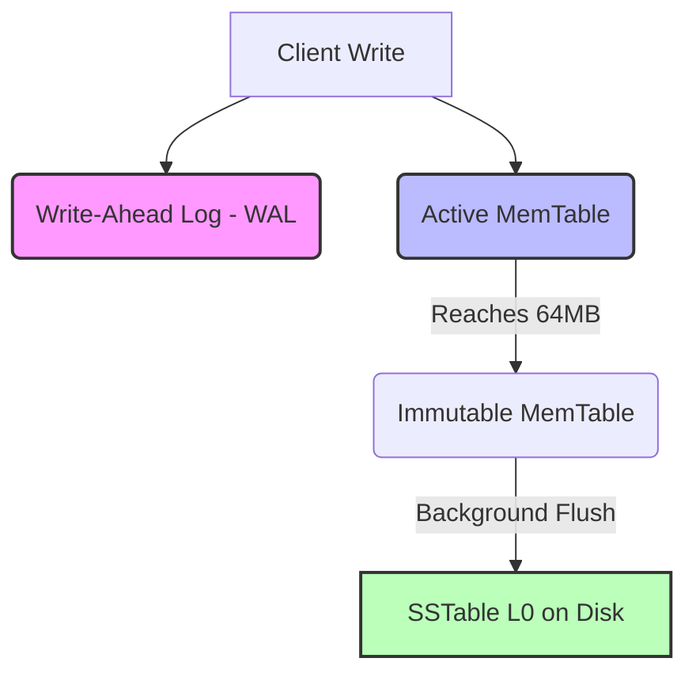
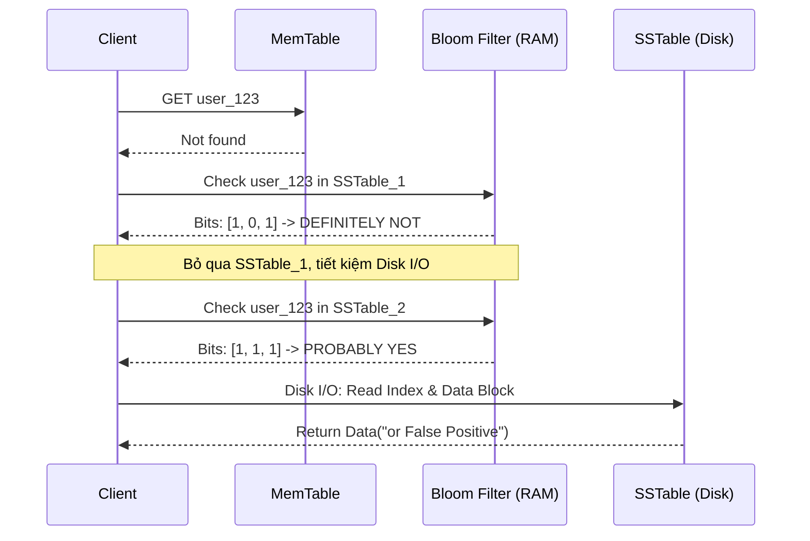

SSTables (Sorted String Tables) và LSM-Trees (Log-Structured Merge-Trees) là kiến trúc lưu trữ nền tảng đằng sau các hệ thống phân tán yêu cầu Write-Throughput khổng lồ như Cassandra, RocksDB, HBase, và Kafka Streams. Khác với B-Trees truyền thống (thường sinh ra Random I/O do cập nhật tại chỗ), LSM-Trees chuyển đổi toàn bộ tác vụ Write thành **Sequential I/O** (Ghi tuần tự). 

Tuy nhiên, định luật bảo toàn của hệ thống luôn tồn tại: "Bạn tối ưu cho Write, bạn sẽ phải trả giá ở Read". Bài viết này sẽ mổ xẻ kiến trúc vật lý của LSM-Trees, giải phẫu nút thắt cổ chai Read Amplification, và cách Bloom Filters can thiệp ở tầng vật lý để cứu rỗi hệ thống khỏi việc sập nguồn do quá tải Disk I/O.

## 1. Kiến trúc Thực thi Vật lý (Physical Execution Architecture)

### 1.1. The Write Path: WAL và MemTable
Mọi tác vụ ghi (Insert/Update/Delete) trong LSM-Trees đều diễn ra hoàn toàn trên RAM trước khi chạm vào ổ cứng.

1. **Write-Ahead Log (WAL):** Tác vụ ghi đầu tiên được append tuần tự vào file WAL trên đĩa. Đây là cơ chế *Durability*, đảm bảo dữ liệu không bị mất nếu Crash/OOM.
2. **MemTable:** Dữ liệu sau đó được đẩy vào MemTable - một cấu trúc dữ liệu trên RAM luôn duy trì trạng thái **đã sắp xếp (Sorted)** theo Key (thường là Red-Black Tree hoặc Skip List). Tại đây, Update đè lên giá trị cũ, Delete thêm một bản ghi "Tombstone" (Bia mộ).
3. **Flush:** Khi MemTable đạt ngưỡng cấu hình (ví dụ: `write_buffer_size = 64MB`), nó trở thành Immutable (không thể thay đổi) và một thread dưới nền (Background Thread) sẽ flush nó xuống đĩa thành một file **SSTable**.



### 1.2. Giải phẫu SSTable (Sorted String Table)
Một SSTable trên đĩa hoàn toàn **Immutable** (Chỉ đọc). Bạn không bao giờ seek đến giữa file để sửa một byte.
Cấu trúc vật lý của nó bao gồm:
- **Data Blocks:** Chứa dữ liệu thực tế dạng Key-Value đã sắp xếp. RocksDB mặc định block size là 4KB.
- **Index Block:** Lưu trữ mốc giới hạn (First Key, Last Key) của từng Data Block kèm theo Offset. Nằm ở cuối file (Footer).

## 2. Nút thắt cổ chai: Read Amplification

Vì dữ liệu bị phân mảnh thành nhiều file SSTable qua các lần Flush, tác vụ Read (`GET key="user_123"`) trở thành một cơn ác mộng.
Thứ tự quét bắt buộc: `Active MemTable -> Immutable MemTable -> SSTable mới nhất -> ... -> SSTable cũ nhất`.

**Sự cố Vận hành (Incident):** Giả sử Key bạn tìm kiếm **không tồn tại** trong DB. Để xác nhận điều này, Database phải mở hàng chục file SSTable, nạp Index Block của từng file vào RAM, tìm kiếm nhị phân, và sau cùng lôi Data Block từ đĩa lên chỉ để trả về `NULL`. Hiện tượng một tác vụ Read logic sinh ra hàng chục lệnh Random Disk I/O vật lý được gọi là **Read Amplification**. Nếu bị quét bởi một truy vấn lớn, hệ thống sẽ cạn kiệt IOPS của ổ cứng và sập.

## 3. Bloom Filters: Cứu tinh của Disk I/O

Để giải quyết Read Amplification, hệ thống cần một cách để trả lời nhanh câu hỏi: *"Key này CÓ KHẢ NĂNG nằm trong file SSTable này không?"* mà không cần chạm vào ổ đĩa. Đó là nhiệm vụ của **Bloom Filter**.

### 3.1. Cơ chế Toán học cốt lõi
Bloom Filter là một mảng bit (`Bit Array`) và sử dụng `k` hàm băm (Hash Functions).
- Khi ghi `Key` vào SSTable, băm `Key` qua `k` hàm, thu được `k` vị trí, bật các bit tại vị trí đó lên `1`.
- Khi cần tìm `Key`, băm `Key` và kiểm tra `k` vị trí tương ứng:
  - Nếu **CÓ BẤT KỲ BIT NÀO = 0**: Chắc chắn 100% Key **KHÔNG CÓ** trong file. Trực tiếp bỏ qua file này. (Zero Disk I/O).
  - Nếu **TẤT CẢ BIT = 1**: Key **CÓ THỂ CÓ** (Do có thể xảy ra Hash Collision - Dương tính giả/False Positive). Lúc này hệ thống mới chịu phạt Disk I/O để xác minh.

### 3.2. Vòng đời trong Kiến trúc
Mảng bit Bloom Filter được xây dựng trong quá trình Flush và nhúng trực tiếp vào **Footer của SSTable**. Khi hệ thống khởi động hoặc file được truy cập, toàn bộ khối Bloom Filters của mọi SSTable được nạp cứng vào RAM (Block Cache).



## 4. Đánh đổi Hệ thống & Rủi ro Vận hành (Systemic Trade-offs)

Làm Kỹ sư Dữ liệu, bạn không cấu hình bừa bãi mà phải hiểu sự đánh đổi (Trade-offs).

### 4.1. Cấu hình Bits Per Key vs Memory Pressure
Trong RocksDB, độ chính xác của Bloom Filter được cấu hình qua tham số `bits_per_key`.
- `bits_per_key = 10` mang lại False Positive Probability (FPP) khoảng 1%.
- Nếu nâng lên để giảm FPP, Bloom Filter sẽ to ra.

**Rủi ro JVM OOMKilled:** Trong hệ thống như Apache Spark, Cassandra hoặc HBase, nếu số lượng file SSTable quá lớn và `bits_per_key` cao, Block Cache chứa Bloom Filters sẽ ăn cạn JVM Heap. Hậu quả là GC Pause kéo dài (Stop-the-world) và OOMKilled.
*Giải pháp:* Tối ưu Background Compaction (gộp SSTable nhỏ thành lớn để giảm số lượng Bloom Filter) hoặc giảm `bits_per_key` nếu workload thiên về Read các dữ liệu chắc chắn tồn tại.

### 4.2. Compaction Storm & Write Amplification
Để dọn dẹp các Tombstones và gộp SSTables, LSM-Trees phải chạy quá trình **Compaction** ở chế độ nền. 
Quá trình này giải nén dữ liệu từ nhiều file, sắp xếp lại, và ghi xuống file mới, đồng thời tạo lại Bloom Filter mới.
**Rủi ro:** Nếu Write Ingestion rate quá nhanh, Compaction sẽ chạy liên tục, chiếm trọn CPU và I/O băng thông (hiện tượng *Compaction Storm*). Hệ thống bị đẩy vào trạng thái **Write Amplification** (ghi 1 byte logic, nhưng disk phải ghi lại 10-30 bytes vật lý do compaction nhiều lần).

## 5. Code Thực chiến & Ứng dụng Data Engineering

### 5.1. RocksDB Column Family Configuration
Dưới đây là đoạn code cấu hình BlockBasedTable để ép RocksDB dùng Bloom Filter ở mức 10 bits/key, chuẩn mực cho C++ / Java (Kafka Streams / Flink State Backend):

```java
// Java - RocksDB Tuning cho High Read/Write throughput
Options options = new Options();
options.setCreateIfMissing(true);

BlockBasedTableConfig tableOptions = new BlockBasedTableConfig();
// Cấu hình Bloom Filter với 10 bits per key (~1% False Positive)
BloomFilter filter = new BloomFilter(10, false);
tableOptions.setFilterPolicy(filter);
// Cache cả Index và Filter vào Block Cache để chống read disk lẻ tẻ
tableOptions.setCacheIndexAndFilterBlocks(true); 

options.setTableFormatConfig(tableOptions);
RocksDB db = RocksDB.open(options, "/path/to/data");
```

### 5.2. Parquet/ORC & Spark Dynamic Bloom Filters
Trong Data Lake (S3/GCS), định dạng Parquet/ORC chia file thành các Row Groups. Bạn có thể ép Spark tạo Bloom Filter ở phần Footer của Parquet cho cột `user_id` để lợi dụng **Predicate Pushdown**.

```python
# Cấu hình lưu Parquet với Bloom Filter trên PySpark
df.write \
  .mode("overwrite") \
  .option("parquet.bloom.filter.enabled#user_id", "true") \
  .option("parquet.bloom.filter.expected.ndv#user_id", "1000000") \
  .parquet("s3a://data-lake/users/")
```
Khi đọc lại với câu lệnh `WHERE user_id = 123`, Spark Executor sẽ chỉ tải byte range chứa Footer. Nếu Bloom Filter trả về FALSE, Executor sẽ BỎ QUA toàn bộ Row Group đó, giảm thiểu chi phí Network Shuffle và S3 API GET cost.

Bên cạnh đó, trong kiến trúc MPP, Spark 3.x sử dụng **Dynamic Bloom Filter Runtime Routing**. Khi JOIN một Bảng Lớn (Fact) và Bảng Nhỏ (Dim), Spark sẽ xây một Bloom Filter từ Bảng Nhỏ, Broadcast nó tới mọi Executor đang đọc Bảng Lớn. Bất kỳ dòng nào ở Bảng Lớn không lọt qua được Bloom Filter sẽ bị Drop tại chỗ trước khi Network Shuffle xảy ra.

## 6. Tổng Kết

LSM-Trees được sinh ra để thống trị các Workload Write-Intensive. Sự kết hợp giữa bộ đệm trên RAM (MemTable), I/O Tuần tự (SSTables), quy trình dọn rác (Compaction), và lá chắn Xác suất (Bloom Filters) đã tạo nên một kiến trúc hoàn mỹ cho Big Data.
Nắm vững các config của RocksDB hay Parquet Footer không chỉ giúp hệ thống chạy nhanh hơn, mà còn là công cụ "cứu mạng" khi bạn phải đối mặt với các lỗi Spill-to-disk hay OOMKilled trong thực chiến.

## Nguồn Tham Khảo (References)
* [RocksDB Wiki - Bloom Filter](https://github.com/facebook/rocksdb/wiki/RocksDB-Bloom-Filter)
* [RocksDB Wiki - LSM Tree Architecture](https://github.com/facebook/rocksdb/wiki/Leveled-Compaction)
* [Designing Data-Intensive Applications (Chapter 3) - Martin Kleppmann](https://dataintensive.net/)
* [Apache Parquet Format Specifications](https://parquet.apache.org/docs/file-format/bloomfilter/)
* [Databricks - Apache Spark 3.0 Dynamic Partition Pruning](https://databricks.com/blog/2020/06/18/introducing-apache-spark-3-0-now-available-in-databricks-runtime-7-0.html)
