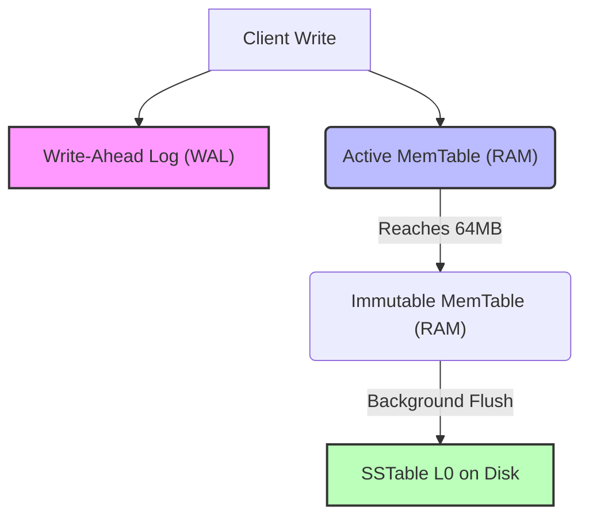
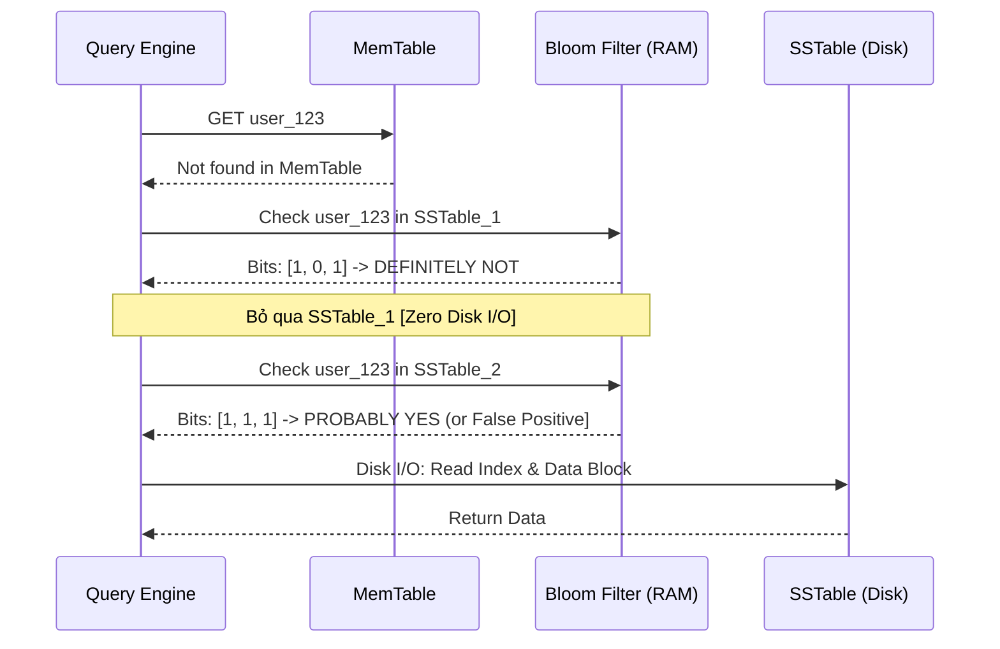

SSTables (Sorted String Tables) và LSM-Trees (Log-Structured Merge-Trees) là kiến trúc lưu trữ nền tảng đằng sau các hệ cơ sở dữ liệu phân tán yêu cầu Write-Throughput khổng lồ như Apache Cassandra, RocksDB, HBase, và Kafka Streams. Khác với B-Trees truyền thống (sinh ra Random I/O do cơ chế In-place Updates), LSM-Trees chuyển đổi toàn bộ tác vụ Ghi (Write) thành **Sequential I/O (Ghi tuần tự)** trên đĩa.

Tuy nhiên, định luật bảo toàn của Kỹ thuật Hệ thống luôn tồn tại: *"Bạn tối ưu tột cùng cho Write, bạn sẽ phải trả giá đắt ở Read"*. Bài viết này mổ xẻ kiến trúc vật lý của LSM-Trees, giải phẫu nút thắt cổ chai **Read Amplification**, và cách **Bloom Filters** can thiệp ở tầng vật lý để cứu rỗi hệ thống khỏi việc sập nguồn do quá tải Disk I/O.

---

## 1. Kiến trúc Thực thi Vật lý (Physical Execution Architecture)

### 1.1. Luồng Ghi Dữ Liệu (The Write Path: WAL và MemTable)
Mọi tác vụ ghi (Insert / Update / Delete) trong LSM-Trees đều diễn ra hoàn toàn trên RAM trước khi chạm vào ổ cứng.

1. **Write-Ahead Log (WAL):** Tác vụ ghi đầu tiên được append tuần tự vào file WAL trên đĩa. Đây là cơ chế *Durability*, đảm bảo dữ liệu không bao giờ bị mất nếu Server bị Crash/OOM đột ngột.
2. **MemTable:** Cùng lúc, dữ liệu được đẩy vào MemTable - một cấu trúc dữ liệu trên RAM luôn duy trì trạng thái **đã sắp xếp (Sorted)** theo Key (thường là Red-Black Tree hoặc Skip List). Tại đây, lệnh Update đè lên giá trị cũ, lệnh Delete thêm một bản ghi "Tombstone" (Bia mộ). Tốc độ ghi trên RAM tính bằng Micro-giây.
3. **Flush:** Khi MemTable đạt ngưỡng cấu hình (ví dụ: `write_buffer_size = 64MB`), nó trở thành Immutable (Bất biến) và một luồng ngầm (Background Thread) sẽ flush (ghi) nó xuống đĩa thành một file **SSTable**.



### 1.2. Giải phẫu SSTable (Sorted String Table)
Một SSTable trên đĩa hoàn toàn **Immutable** (Chỉ đọc). Hệ thống không bao giờ seek đến giữa file để sửa lại một byte (như cách B-Tree làm). Cấu trúc vật lý của nó bao gồm:
*   **Data Blocks:** Chứa dữ liệu thực tế dạng Key-Value đã sắp xếp chặt chẽ. (RocksDB mặc định block size là 4KB).
*   **Index Block:** Lưu trữ mốc giới hạn (First Key, Last Key) của từng Data Block kèm theo Offset byte. Nằm ở cuối file (Footer).

---

## 2. Nút thắt cổ chai: Read Amplification

Vì dữ liệu liên tục bị phân mảnh thành nhiều file SSTable riêng rẽ qua các lần Flush, tác vụ Read (`GET key="user_123"`) trở thành một cơn ác mộng I/O.
Thứ tự quét bắt buộc: `Active MemTable -> Immutable MemTable -> SSTable Level 0 (mới nhất) -> ... -> SSTable Level N (cũ nhất)`.

**Sự cố Vận hành (Incident):** Giả sử Key bạn tìm kiếm **không tồn tại** trong Database. Để đưa ra kết luận này, DB Engine phải mở hàng chục file SSTable, nạp Index Block của từng file vào RAM, tìm kiếm nhị phân, và sau cùng lôi Data Block từ đĩa cứng lên chỉ để trả về `NULL`. Hiện tượng một tác vụ Read logic phải sinh ra hàng chục lệnh Random Disk I/O vật lý được gọi là **Read Amplification (Khuếch đại Đọc)**. Nếu bị dội bom bởi hàng ngàn truy vấn như vậy, hệ thống sẽ cạn kiệt IOPS của ổ cứng và treo cứng (Hang).

---

## 3. Bloom Filters: Cứu tinh của Disk I/O

Để giải quyết Read Amplification, kiến trúc hệ thống cần một cơ chế để trả lời câu hỏi: *"Key này CÓ KHẢ NĂNG nằm trong file SSTable này không?"* mà không cần chạm vào ổ đĩa. Đó là sự ra đời của **Bloom Filter**.

### 3.1. Cơ chế Toán học Xác suất cốt lõi
Bloom Filter là một cấu trúc dữ liệu xác suất [Probabilistic Data Structure], bao gồm một mảng bit (`Bit Array`) và sử dụng `k` hàm băm (Hash Functions). Thuật toán băm **MurmurHash3** cực kỳ phổ biến ở đây nhờ tốc độ cực nhanh và phân phối bit đồng đều.

*   **Khi ghi `Key` vào SSTable:** Băm `Key` qua `k` hàm (vd: `k=3`), thu được 3 vị trí (ví dụ bit 2, 7, 10). Bật các bit tại vị trí đó trong Array lên `1`.
*   **Khi tìm kiếm `Key` (Lookup):** Băm `Key` và kiểm tra 3 vị trí:
    *   Nếu **CÓ BẤT KỲ BIT NÀO = 0**: Chắc chắn 100% Key **KHÔNG CÓ** trong file. Trực tiếp bỏ qua file này. (True Negative -> Cứu sống Disk I/O).
    *   Nếu **TẤT CẢ BIT ĐỀU = 1**: Key **CÓ THỂ CÓ**. Có tỷ lệ xảy ra **Hash Collision (Dương tính giả / False Positive)**, nơi các key khác vô tình bật trùng các bit đó. Lúc này hệ thống mới chịu phạt Disk I/O để mở file xác minh.

### 3.2. Vòng đời trong Kiến trúc
Mảng bit Bloom Filter được tính toán ngay trong quá trình Flush và được nhúng cứng trực tiếp vào **Footer của mỗi file SSTable**. Khi hệ thống khởi động (hoặc file được mở), toàn bộ khối Bloom Filters của mọi SSTable được nạp lên RAM (Block Cache) vĩnh viễn.



---

## 4. Đánh đổi Hệ thống & Rủi ro Vận hành (Systemic Trade-offs)

### 4.1. Sự cố JVM OOMKilled (Cấu hình Bits Per Key vs Memory Pressure)
Trong RocksDB/Cassandra, độ chính xác (Accuracy) của Bloom Filter được cấu hình qua tham số `bits_per_key`.
*   `bits_per_key = 10` mang lại tỷ lệ False Positive (FPP) ở mức lý tưởng là khoảng 1%.
*   Nếu bạn nâng lên để giảm FPP, mảng Bloom Filter sẽ to ra theo cấp số nhân.

**Rủi ro:** Trong các hệ thống chạy Java (như Apache Cassandra, HBase), nếu Data Ingestion quá lớn (sinh ra hàng vạn file SSTable) và `bits_per_key` cấu hình cao, Block Cache chứa Bloom Filters sẽ ăn cạn JVM Heap. Hậu quả là tiến trình dọn rác bộ nhớ (GC - Garbage Collection) phải chạy liên tục (Stop-the-world) và cuối cùng bị Kernel bắn tín hiệu `OOMKilled`.
*Giải pháp:* Duy trì mức `10 bits`, hoặc tăng tốc quá trình Background Compaction để gộp các SSTable nhỏ lại (giảm số lượng Bloom Filters tổng cộng).

### 4.2. Compaction Storm & Write Amplification
Để dọn dẹp các Tombstones và gộp SSTables, LSM-Trees phải chạy quá trình **Compaction** (Nén tệp) ở chế độ nền. 
*   **Sự cố:** Nếu Write Ingestion rate đập vào hệ thống quá dữ dội, Compaction sẽ phải chạy liên tục, chiếm trọn 100% CPU và I/O băng thông (hiện tượng *Compaction Storm*). 
*   Hệ thống bị đẩy vào trạng thái **Write Amplification cực đoan** (Ghi 1 byte logic, nhưng ổ đĩa phải thực hiện thao tác ghi đè gộp file vật lý lên tới 10-30 bytes).

---

## 5. Show Code: Thực chiến với RocksDB & Spark

### 5.1. Cấu hình RocksDB Column Family (Java)
Dưới đây là đoạn mã tối ưu `BlockBasedTableConfig` để ép RocksDB dùng Bloom Filter ở mức 10 bits/key. Đây là chuẩn mực cho các ứng dụng Flink State Backend hoặc Kafka Streams:

```java
// Java - RocksDB Tuning cho High Read/Write throughput
Options options = new Options();
options.setCreateIfMissing(true);

BlockBasedTableConfig tableOptions = new BlockBasedTableConfig();
// Cấu hình Bloom Filter với 10 bits per key (~1% False Positive)
BloomFilter filter = new BloomFilter(10, false);
tableOptions.setFilterPolicy(filter);
// Cache toàn bộ Index Block và Bloom Filter vào RAM để chống read disk lẻ tẻ
tableOptions.setCacheIndexAndFilterBlocks(true); 

options.setTableFormatConfig(tableOptions);
RocksDB db = RocksDB.open(options, "/path/to/data");
```

### 5.2. Parquet/ORC & Spark Dynamic Bloom Filters
Trong Data Lake (S3/GCS), Parquet chia file thành các Row Groups. Khác với B-Tree, Parquet Footer hoàn toàn hỗ trợ gắn Bloom Filter vào. Bạn có thể ép PySpark tạo Bloom Filter trên cột `user_id` để tận dụng tính năng **Predicate Pushdown**.

```python
# Cấu hình lưu Parquet với Bloom Filter trên PySpark
df.write \
  .mode("overwrite") \
  .option("parquet.bloom.filter.enabled#user_id", "true") \
  .option("parquet.bloom.filter.expected.ndv#user_id", "1000000") \
  .parquet("s3a://data-lake/users/")
```
Khi đọc lại với lệnh `SELECT * FROM users WHERE user_id = 123`, Spark Executor sẽ tải phần Footer chứa Bloom Filter trước tiên. Nếu Bloom Filter trả về FALSE, Executor sẽ BỎ QUA toàn bộ Row Group đó, giảm thiểu triệt để chi phí S3 API GET và Network Shuffle.

---

## 6. Tổng Kết

LSM-Trees được thiết kế tinh xảo để thống trị các Workload Write-Intensive. Sự kết hợp giữa bộ đệm trên RAM [MemTable], I/O Tuần tự (SSTables), quy trình dọn rác tàn nhẫn (Compaction), và lá chắn Toán học Xác suất (Bloom Filters) đã tạo nên một kiến trúc lưu trữ hoàn mỹ cho kỷ nguyên Big Data. Nắm vững các cấu hình vật lý của chúng không chỉ giúp hệ thống của bạn chạy nhanh hơn mà còn cứu bạn khỏi những đêm trực sự cố (OOM/Disk Treo) chết người.

## Nguồn Tham Khảo (References)
*   [RocksDB Wiki - Bloom Filter Configuration][https://github.com/facebook/rocksdb/wiki/RocksDB-Bloom-Filter]
*   [RocksDB Wiki - LSM Tree Architecture & Leveled Compaction][https://github.com/facebook/rocksdb/wiki/Leveled-Compaction]
*   [Designing Data-Intensive Applications (Chapter 3] - Martin Kleppmann][https://dataintensive.net/]
*   [Apache Parquet Format Specifications (Bloom Filter]](https://parquet.apache.org/docs/file-format/bloomfilter/)
