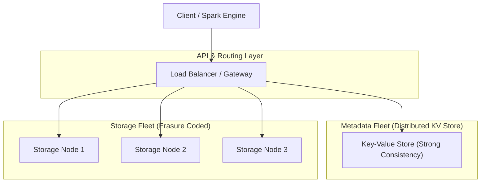

Cloud Object Storage (Amazon S3, GCS, Azure Blob) đã trở thành "trái tim" của Modern Data Stack, thay thế hoàn toàn kiến trúc HDFS nguyên thủy. Tuy nhiên, đằng sau giao diện API RESTful đơn giản là những hệ thống phân tán khổng lồ với hàng trăm microservices xử lý hàng chục triệu request mỗi giây. 

Dưới góc nhìn của một **Staff Data Engineer / Systems Architect**, S3 không chỉ là một cái "ổ cứng đám mây". Bài viết này mổ xẻ Cloud Object Storage dưới góc độ kỹ thuật hệ thống (System Architecture), tập trung vào thiết kế bên trong (Internals), cơ chế đánh đổi (Trade-offs), và các sự cố vận hành (Operational Incidents) thực tế.

---

## 1. Kiến trúc phân tách Metadata và Payload (S3 Internals)

Không giống như File System (POSIX) cấp phát ổ đĩa qua các Block, Object Storage là một không gian phẳng (flat namespace). Dưới nền tảng vật lý, S3 phân tách hoàn toàn việc lưu trữ **Metadata (Siêu dữ liệu)** và **Payload (Dữ liệu thực tế)** thành hai hệ thống độc lập.



-   **Metadata Fleet:** Lưu trữ ánh xạ giữa `Object Key` (ví dụ: `s3://bucket/data.parquet`] và vị trí vật lý của nó trên các Data Nodes. Nó là một Distributed Key-Value Store cực kỳ tốc độ cao, đảm nhận việc khóa (locking) và tính quán (consistency).
-   **Storage Fleet:** Lưu trữ payload. Payload được ghi trực tiếp xuống Storage Fleet thành các chunk nhỏ mà không qua Metadata Fleet để tránh nghẽn cổ chai (Bottleneck).

### 1.1. Erasure Coding: Đạt 11 số 9 (119s) Độ bền mà không tốn kém
Nếu dùng chuẩn HDFS cũ (Replication Factor = 3), một file 1TB sẽ tiêu tốn 3TB dung lượng đĩa vật lý (Overhead 200%). Đối với quy mô Exabytes của S3, việc này là quá đắt đỏ.

Thay vào đó, S3 và GCS sử dụng thuật toán **Erasure Coding** (Reed-Solomon). Dữ liệu được chia thành $k$ phần (Data chunks), hệ thống tính toán thêm $m$ phần (Parity chunks) và phân tán ra nhiều Availability Zones (AZs).

**Systemic Trade-off:**
-   **Pros (Độ bền và FinOps):** Đạt 99.999999999% (11 số 9) độ bền trong khi Storage Overhead chỉ khoảng 20-50%. Chịu được $m$ ổ cứng hoặc cả 1 AZ chết cùng lúc.
-   **Cons (Compute & Latency):** Tốn CPU (Compute-intensive) để mã hóa/khôi phục dữ liệu. Khi đọc dữ liệu, nếu một node chết, hệ thống phải đọc các mảnh khác qua mạng và dùng CPU để suy luận (reconstruct) lại phần hỏng $\rightarrow$ Tăng Tail Latency.

---

## 2. Cuộc cách mạng "Strong Consistency" trên S3

Trước tháng 12/2020, Amazon S3 chỉ đảm bảo **Eventual Consistency** [Nhất quán cuối] cho các thao tác ghi đè (PUT/DELETE). 
-   **Nỗi đau hệ thống:** Một Spark Job ghi đè file `part-01.parquet`, ngay sau đó một Job khác vào đọc (GET) có thể vẫn thấy nội dung cũ, hoặc LIST thư mục chưa thấy file mới. Các kỹ sư phải dựng một bảng Amazon DynamoDB (`S3Guard`) làm Metadata layer phụ để khóa (lock).

Từ cuối 2020, S3 chính thức hỗ trợ **Strong Read-After-Write Consistency** (Nhất quán mạnh).
Để làm được điều này mà không tăng độ trễ (latency), hệ thống Metadata của S3 phải triển khai các thuật toán đồng thuận (Consensus Protocols) kết hợp với các cơ chế Witness node và Time synchronization cực kỳ phức tạp để đảm bảo mọi node trong Metadata Fleet đều đồng ý với phiên bản mới nhất trước khi trả về HTTP `200 OK`. AWS đã gánh vác toàn bộ sự phức tạp (Complexity) thay cho Client.

:::tip
**Conditional Writes (Mới ra mắt T8/2024]:** 
AWS vừa cung cấp khả năng Conditional Writes (`Put-If-Absent`). Bạn có thể dùng Boto3 để yêu cầu S3 chỉ ghi file nếu file đó chưa tồn tại. Đây là "chén thánh" cho phép Delta Lake và Apache Iceberg thực hiện Optimistic Concurrency Control (OCC) trực tiếp trên S3 mà không cần DynamoDB.
:::

**Thực chiến (Code Python/Boto3 cho Conditional Write):**
```python
import boto3
from botocore.exceptions import ClientError

s3_client = boto3.client('s3')

try:
    # Chỉ ghi nếu file chưa tồn tại (Atomic Put-If-Absent)
    response = s3_client.put_object(
        Bucket='my-data-lake',
        Key='transactions/log_0002.json',
        Body=b'{"status": "committed"}',
        IfNoneMatch='*' # Critical HTTP Header cho Conditional Write
    )
    print("Ghi thành công!")
except ClientError as e:
    if e.response['Error']['Code'] == 'PreconditionFailed':
        print("Xung đột! File đã tồn tại. Chạy lại (Retry).")
```

---

## 3. Tại sao S3 đánh bại HDFS? (Decoupling Compute & Storage)

Hadoop (HDFS) sử dụng kiến trúc **Coupled Compute & Storage** (Tính toán và Lưu trữ gắn liền trên cùng DataNode).
-   Nếu CPU hết công suất, bạn phải mua thêm máy chủ chứa cả Ổ cứng.
-   Nếu hết Storage, bạn phải mua máy chủ chứa cả CPU. $\rightarrow$ Lãng phí tài nguyên khủng khiếp.

Kiến trúc hiện đại (Modern Data Stack) sử dụng S3 làm trung tâm, tạo ra sự **Tách biệt (Separation of Compute and Storage)**.

**Systemic Trade-offs:**
-   **Pros:** S3/GCS có thể mở rộng lên Exabytes vô hạn với giá rất rẻ. Các cluster Compute (Spark, Snowflake) chỉ bật lên khi query, chạy xong thì tự hủy (Ephemeral), tối ưu FinOps triệt để.
-   **Cons (Network Bottleneck):** Dữ liệu phải đi qua mạng lưới thay vì đọc thẳng từ đĩa local (Data Locality). Nếu VPC không đủ băng thông, Compute node dễ bị **OOMKilled** do tải khối lượng khổng lồ vào RAM.

---

## 4. Rủi ro Vận hành & Troubleshooting thực chiến

### 4.1. Sự cố thắt cổ chai: The Small Files Problem
S3 có giới hạn (Hard Limit) về số lượng I/O mỗi giây (IOPS) dựa trên tiền tố thư mục (Prefix): **3,500 PUT/DELETE** và **5,500 GET** requests mỗi giây trên một prefix.

Nếu hệ thống Kafka Connect ghi hàng triệu file JSON tí hon (10KB) vào một thư mục:
1.  Metadata Fleet bị quá tải request.
2.  S3 trả về lỗi **HTTP 503 Slow Down (Throttling)**.
3.  Spark queries bị chậm gấp 100 lần vì phải mở hàng triệu HTTP TCP connection để GET file.

**Khắc phục (Staff-level Tuning):**
-   Thiết kế Prefix Hashing để rải đều tải S3.
-   Bắt buộc chạy Compaction Job (Delta/Iceberg) định kỳ để gom file 10KB thành 128MB-512MB.

### 4.2. Kiến trúc Hạ tầng Infrastructure as Code (Terraform)
Cấu hình S3 cho Data Lake không chỉ là tạo bucket. Nó đòi hỏi Versioning (tránh xóa nhầm), Lifecycle Policies (đẩy data cũ sang lớp rẻ hơn) để tối ưu FinOps.

```hcl
resource "aws_s3_bucket" "data_lake" {
  bucket = "company-datalake-prod"
}

# Bắt buộc lưu Version để audit và phục hồi thảm họa
resource "aws_s3_bucket_versioning" "versioning" {
  bucket = aws_s3_bucket.data_lake.id
  versioning_configuration {
    status = "Enabled"
  }
}

# Tự động đẩy file cũ sang lớp rẻ hơn (Tối ưu FinOps)
resource "aws_s3_bucket_lifecycle_configuration" "tiering" {
  bucket = aws_s3_bucket.data_lake.id
  rule {
    id     = "archive-cold-data"
    status = "Enabled"
    filter { prefix = "bronze_layer/" }
    
    transition {
      days          = 90
      storage_class = "STANDARD_IA" # Tiết kiệm 40% chi phí
    }
    transition {
      days          = 365
      storage_class = "GLACIER"     # Cold storage
    }
  }
}
```

---

## Nguồn Tham Khảo
1.  [Amazon S3 Strong Read-After-Write Consistency][https://aws.amazon.com/s3/consistency/] - AWS Official Documentation
2.  [Amazon S3 Conditional Writes (2024]][https://aws.amazon.com/about-aws/whats-new/2024/08/amazon-s3-conditional-writes/]
3.  *Designing Data-Intensive Applications (Chapter 3: Storage and Retrieval)* - Martin Kleppmann
4.  [Erasure Coding in Distributed Storage Systems](https://www.usenix.org/system/files/conference/atc12/atc12-final181.pdf] - USENIX Papers
