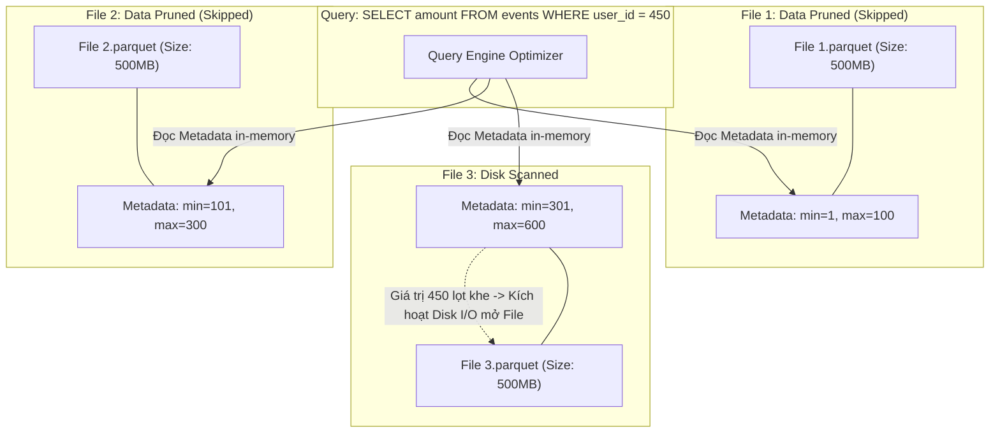
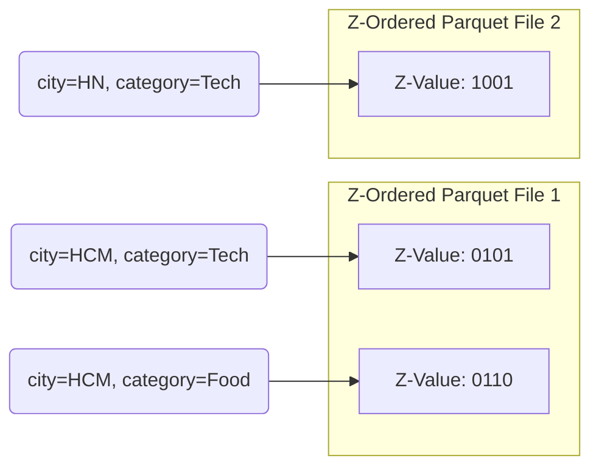

Clustering (Phân cụm dữ liệu) thường bị các kỹ sư mới vào nghề hiểu lầm đơn giản là hành động "sắp xếp dữ liệu" (Sorting data) cho gọn gàng. Dưới góc nhìn của một Staff Data Engineer, Clustering là một kỹ thuật **tối ưu hóa Data Layout (Bố cục Dữ liệu) vật lý**, quyết định chính xác cách hàng tỷ bản ghi được nhóm lại thành các khối (Blocks/Files) trên ổ cứng vật lý hoặc Cloud Storage. 

Sức mạnh thực sự của Clustering không nằm ở bản thân dữ liệu được sắp xếp, mà nằm ở chỗ nó tạo ra một **Metadata cực kỳ hiệu quả**, cho phép các Query Engine (như Dremel của BigQuery, Spark của Databricks, hoặc Snowflake) thực thi cơ chế **Data Skipping** (Bỏ qua dữ liệu) ở tốc độ kinh hoàng, giảm thiểu tối đa chi phí I/O (Input/Output) và Compute Cost.

---

## 1. Kiến Trúc Thực Thi Vật Lý (Physical Execution & Data Skipping)

Trong các định dạng lưu trữ dạng Cột (Columnar Formats) như Apache Parquet, ORC, hay cấu trúc ngầm của Snowflake, dữ liệu không chỉ được nén lại dưới dạng Binary mà còn luôn đi kèm với một cấu trúc Footer chứa Metadata cực kỳ quan trọng ở cấp độ File hoặc Row-group: `min_value`, `max_value`, và `null_count`.

### Cơ chế Data Skipping hoạt động ra sao?

Giả sử bạn thiết lập Clustering cho một Bảng (Table) theo cột định danh `user_id`. Engine (Spark/Snowflake) sẽ cố gắng ghi các bản ghi có `user_id` gần giống nhau vào chung một file vật lý. Nhờ việc "Phân cụm" này, khoảng cách giữa `min` và `max` trong Metadata của mỗi File trở nên rất hẹp và ít bị chồng chéo (Non-overlapping) với File khác.

Khi câu lệnh `WHERE user_id = 450` được gửi xuống, Engine không dại gì đi cày nát 1.5GB ổ cứng. Nó chỉ cần đọc Metadata (chỉ tốn vài KB RAM) và lập tức **Loại bỏ (Prune/Skip)** hoàn toàn File 1 và File 2. Nó chỉ tiêu tốn chi phí Disk I/O và CPU Decompression (Giải nén) cho duy nhất File 3. Nếu bạn trả tiền theo Data Scanned (như BigQuery hay Athena), bạn vừa tiết kiệm được 66% hóa đơn Cloud.

---

## 2. Clustering vs. Partitioning: Bài Toán Đánh Đổi

Nhiều kỹ sư nhầm lẫn nghiêm trọng vai trò của Partitioning (Phân vùng) và Clustering (Phân cụm). Chúng giải quyết bài toán Data Pruning ở hai lớp vật lý hoàn toàn khác nhau.

*   **Partitioning** là tạo ra **Hard Boundaries (Ranh giới cứng)** bằng các cấu trúc Thư mục vật lý (Ví dụ: `s3://bucket/table/year=2026/month=06/`). Nó cực kỳ hiệu quả cho các cột có **Cardinality Thấp** (Số lượng giá trị phân biệt ít, như ngày tháng, quốc gia, phòng ban).
*   **Clustering** là tạo ra **Soft Boundaries (Ranh giới mềm)** bên trong nội bộ các file dữ liệu. Nó được thiết kế riêng cho các cột có **Cardinality Cao** (Như `user_id`, `session_id`, `email`, mã sản phẩm).

### Rủi ro Vận hành: Sự cố Sập NameNode & OOMKilled
Nếu bạn ngây thơ dùng Partitioning cho một cột có Cardinality cao (Ví dụ: `PARTITION BY user_id` với 10 triệu User), hệ thống sẽ tạo ra 10 triệu thư mục con siêu nhỏ. Mỗi thư mục chứa một vài file dung lượng vài KB (Small Files Problem).
*   **Hệ quả Vật lý:** Spark Driver (Hoặc NameNode trong HDFS) sẽ bị **OOMKilled (Out of Memory)** khi cố gắng nạp hàng triệu Metadata File Paths đó vào RAM để lên kế hoạch truy vấn (Query Planning). Hơn nữa, việc mở hàng triệu kết nối mạng tới S3 để quét từng File vài KB sẽ làm tốc độ truy vấn chậm đi hàng trăm lần so với việc quét bừa (Full Table Scan).

**Quy tắc Vàng (Best Practice):** Luôn kết hợp cả hai. Partition theo Thời gian (Ví dụ `event_date`) và Cluster theo Định danh có độ nhiễu cao (`user_id`).

---

## 3. Các Kiến Trúc Clustering Đỉnh Cao Của Big Tech

Để tối ưu Data Skipping, các hãng công nghệ lớn liên tục tiến hóa thuật toán phân cụm. Dưới đây là 3 trường phái kinh điển.

### 3.1. Snowflake Micro-partitions (Phân cụm Tự động & Ẩn danh)
Khác với Databricks (Iceberg/Delta), Snowflake không để người dùng thấy File Parquet. Dữ liệu trong Snowflake được tự động chia cắt thành các **Micro-partitions** (Kích thước nén 50MB-500MB).
- **Tự động hóa hoàn toàn:** Bạn không cần định nghĩa Partition theo ngày tháng hay tạo thư mục. Snowflake tự động duy trì Min/Max Metadata của mọi cột cho từng Micro-partition.
- **Clustering Key:** Nếu một bảng đủ lớn (Thường > 1TB), bạn có thể gán `CLUSTER BY (date, user_id)`. Snowflake sẽ chạy ngầm một dịch vụ (Automatic Clustering) liên tục theo dõi và sắp xếp lại các Micro-partitions này ở Background để duy trì hiệu năng. 
- *Đánh đổi:* Bạn phải trả tiền Compute (Cloud Services Credit) cho dịch vụ chạy ngầm này.

### 3.2. Z-Ordering: Khắc phục điểm mù của Sắp xếp Tuyến tính (Linear Sorting)
Sắp xếp tuyến tính (Linear Sorting / `ORDER BY`) hoạt động cực tốt nếu bạn chỉ phân cụm theo 1 cột. Nhưng nếu bạn phân cụm theo hai cột `(city, category)`, dữ liệu sẽ ưu tiên xếp theo `city` trước, rồi bên trong mỗi `city` mới xếp theo `category`. Lúc này, nếu truy vấn của bạn chỉ Filter theo `category`, hiệu quả Data Skipping gần như bằng 0, vì `category` đã bị xé lẻ và nằm rải rác khắp các file.

Để giải quyết, Databricks (Delta Lake) và Apache Hudi áp dụng **Z-Ordering** (Dựa trên thuật toán đường cong Morton Space-filling curve).

Z-Ordering nhóm các điểm dữ liệu đa chiều (Multi-dimensional) thành một dải số tuyến tính 1 Chiều sao cho **Tính liên kết không gian (Spatial Locality)** được bảo toàn. Nhờ Z-Ordering, dữ liệu có cùng `city` HOẶC cùng `category` đều có xác suất rất cao nằm chung trong một file. Bạn có thể Query theo cột nào hệ thống cũng Skip Data hiệu quả.
- *Đánh đổi:* Kiến trúc cứng nhắc. Để duy trì Z-Order, bạn phải tốn tiền Compute chạy lại lệnh `OPTIMIZE ... ZORDER BY` liên tục. Càng nạp Data Streaming mới, Z-Order càng bị phá vỡ nhanh (Data Skewness).

### 3.3. Liquid Clustering (Kỷ Nguyên Phân Cụm Động Của Databricks)
Nhận thấy nỗi đau bảo trì của Z-Ordering và Hive Partitioning, Databricks giới thiệu **Liquid Clustering** cho Delta Lake, thay thế hoàn toàn cả hai kỹ thuật cũ.
- **Bố cục Động (Dynamic Layout):** Engine tự động gom dữ liệu thành các khối linh hoạt gọi là **Z-Cubes** (Bằng đường cong Hilbert Curve). Nó có khả năng tự động phân tích Query Workload và định tuyến lại dữ liệu.
- **Tính năng Incremental:** Khi bạn chạy `OPTIMIZE`, Liquid Clustering chỉ chạy thuật toán trên phần Dữ liệu mới chưa được phân cụm (Unoptimized data), thay vì phải gồng mình phân tích và Rewrite toàn bộ lịch sử Bảng như Z-Ordering.
- **Tính uyển chuyển:** Bạn có thể thay đổi Clustering Key (`ALTER TABLE`) bất kỳ lúc nào để phản hồi thay đổi Business, mà dữ liệu cũ không hề bị hỏng hóc hay bắt buộc phải ghi lại.

---

## 4. Rủi ro Vận hành & Trade-offs (Sự đánh đổi)

Kiến trúc nào cũng có cái giá vật lý của nó. Khi quyết định áp dụng Clustering, bạn đang **Đánh đổi Compute/Write Cost để lấy Read Performance**.

### 4.1. Write Amplification (Khuếch đại Ghi & Spill-to-Disk)
Để có thể "nhặt" và sắp xếp hàng Tỷ dòng dữ liệu trên ổ cứng theo đúng cụm (Sorting/Clustering), Spark Engine phải thực hiện lệnh `Network Shuffle` toàn bộ dữ liệu qua các Executor. Tác vụ Sort này bào mòn 100% CPU và RAM. 
Nếu kích thước Bảng quá lớn và RAM không đủ, Spark sẽ phải thực hiện **Spill-to-disk** (Đổ dữ liệu đang tính dở ra ổ cứng mạng), làm chậm quá trình Ghi (Ingestion) lên hàng chục lần.
*   **Giải pháp (Best Practice):** Cần tách biệt rạch ròi luồng Ghi và luồng Tối ưu. Ingest dữ liệu thô (Raw/Bronze) vào hệ thống càng nhanh càng tốt theo cơ chế Append-only, sau đó mới dùng một Job Airflow lập lịch chạy vào ban đêm (Ví dụ lệnh `OPTIMIZE` hoặc Iceberg `rewriteDataFiles`) để dồn cụm dữ liệu.

### 4.2. Suy giảm hiệu suất dần đều (Clustering Degradation)
Trong thế giới Streaming, dữ liệu mới bơm vào liên tục. Ban đầu Bảng được Cluster cực đẹp, nhưng sau 1 tuần, dữ liệu bị xé nát. 
Các hệ thống như BigQuery, Snowflake giải quyết bằng tính năng **Automatic Clustering** chạy ngầm ở Background. Tuy nhiên, điều này đi kèm với rủi ro **FinOps khốc liệt**: Bạn sẽ phải trả hóa đơn bằng tiền thật cho các Compute Background Tasks vô hình này. Đã có rất nhiều công ty "Shock Bill" khi Snowflake liên tục tự động Re-cluster một Bảng khổng lồ có tần suất Update Data quá dữ dội.

---

## Nguồn Tham Khảo [References]
1. **Databricks:** [Liquid Clustering for Delta Lake](https://docs.databricks.com/en/delta/clustering.html)
2. **Snowflake:** [Understanding Micro-partitions and Data Clustering](https://docs.snowflake.com/en/user-guide/tables-micro-partitions)
3. **Delta Lake:** [Z-Ordering Multi-Dimensional Clustering](https://docs.delta.io/latest/optimizations-oss.html#z-ordering-multi-dimensional-clustering)
4. **Sách Kinh Điển:** *Designing Data-Intensive Applications* (Martin Kleppmann) - Chương 3: Storage and Retrieval.
