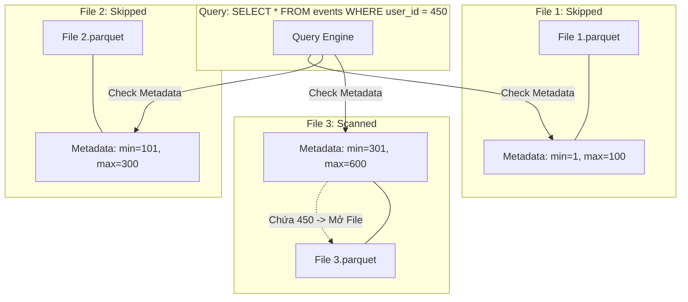

Clustering (Phân cụm dữ liệu) thường bị hiểu lầm đơn giản là "sắp xếp dữ liệu" (sorting data). Ở góc nhìn của một Kỹ sư Dữ liệu, Clustering là một kỹ thuật **tối ưu hóa Data Layout (Bố cục Dữ liệu) vật lý**, quyết định cách các bản ghi được gom nhóm thành các khối (blocks/files) trên ổ cứng (Cloud Storage). 

Sức mạnh thực sự của Clustering không nằm ở bản thân việc dữ liệu được sắp xếp, mà nằm ở việc nó tạo ra một **Metadata cực kỳ hiệu quả**, cho phép các Query Engine (như Dremel của BigQuery, Spark của Databricks) thực thi **Data Skipping** (hoặc Predicate Pushdown) ở tốc độ kinh hoàng, giảm thiểu tối đa chi phí I/O (Input/Output).

---

## 1. Kiến trúc Thực thi Vật lý (Physical Execution)

Trong các định dạng lưu trữ dạng cột (Columnar Formats) như Parquet hay ORC, dữ liệu không chỉ được lưu dưới dạng binary mà còn đi kèm với một Footer chứa metadata cực kỳ quan trọng ở cấp độ File hoặc Row-group: `min_value`, `max_value`, và `null_count`.

### Cơ chế Data Skipping hoạt động ra sao?

Khi bạn thiết lập Clustering cho một bảng (ví dụ theo cột `user_id`), engine sẽ cố gắng ghi các bản ghi có `user_id` gần nhau vào chung một file Parquet.



Nhờ Clustering, khoảng cách giữa `min` và `max` trong mỗi file trở nên rất hẹp và không chồng chéo (non-overlapping). Khi truy vấn `WHERE user_id = 450` được gửi xuống, Engine chỉ cần đọc Metadata (chỉ vài KB) và lập tức **loại bỏ (Prune)** File 1 và File 2 mà không cần tốn chi phí Disk I/O hay Network I/O để kéo nội dung file về bộ nhớ.

---

## 2. Clustering vs. Partitioning: Bài toán Đánh đổi Hệ thống

Nhiều kỹ sư nhầm lẫn vai trò của Partitioning và Clustering. Chúng giải quyết bài toán Data Pruning ở hai lóp vật lý hoàn toàn khác nhau.

*   **Partitioning (Phân vùng)** là tạo ra **Hard Boundaries** (Ranh giới cứng) bằng các thư mục vật lý (Ví dụ: `s3://bucket/table/date=2026-06-26/`). Nó cực kỳ hiệu quả cho các cột có **Cardinality thấp** (như ngày tháng, quốc gia).
*   **Clustering (Phân cụm)** là tạo ra **Soft Boundaries** (Ranh giới mềm) bên trong các file dữ liệu. Nó được thiết kế riêng cho các cột có **Cardinality cao** (như `user_id`, `session_id`, `email`).

### Rủi ro Vận hành: Sự cố "Small Files Problem" & Sập Metadata Server

Nếu bạn dùng Partitioning cho một cột có Cardinality cao (ví dụ: Partition theo `user_id`), hệ thống sẽ tạo ra hàng triệu thư mục nhỏ, mỗi thư mục chứa một vài file dung lượng chỉ vài KB. 
*   **Hệ quả:** Spark Driver hoặc NameNode (trong HDFS) sẽ bị **OOMKilled (Out of Memory)** khi cố gắng nạp hàng triệu metadata file paths vào RAM. Tốc độ đọc lúc này thậm chí còn chậm hơn việc quét toàn bộ dữ liệu (Full Table Scan) do chi phí mở kết nối file (File Open Overhead) quá lớn.

Để giải quyết, kiến trúc chuẩn (Best Practice) là: **Partition theo thời gian (ví dụ `event_date`) và Cluster theo định danh (`user_id`).**

---

## 3. Z-Ordering: Khắc phục điểm mù của Linear Sorting

Sắp xếp tuyến tính (Linear Sorting) hoạt động tốt nếu bạn chỉ phân cụm theo một cột. Nhưng nếu bạn phân cụm theo hai cột `(city, category)`, dữ liệu sẽ được sắp xếp hoàn toàn theo `city`, và trong cùng một `city` mới sắp xếp theo `category`. Lúc này, nếu truy vấn của bạn chỉ filter theo `category`, hiệu quả Data Skipping gần như bằng 0 (vì `category` bị phân tán ngẫu nhiên trên toàn bộ các blocks chứa các `city` khác nhau).

Để giải quyết, Databricks (Delta Lake) và Apache Hudi áp dụng **Z-Ordering** (dựa trên thuật toán đường cong Morton/Hilbert Space-filling curve).

### Cơ chế Ánh xạ Đa chiều

Z-Ordering nhóm các điểm dữ liệu đa chiều vào một dải một chiều (1D) sao cho **tính liên kết không gian (spatial locality)** được bảo toàn tối đa. 

```mermaid
graph LR
    A("city=HCM, category=Tech") --> Z1["Z-Value: 0101"]
    B("city=HCM, category=Food") --> Z2["Z-Value: 0110"]
    C("city=HN, category=Tech") --> Z3["Z-Value: 1001"]
    
    subgraph "File A("Z-Ordered")"
        Z1
        Z2
    end
    
    subgraph "File B("Z-Ordered")"
        Z3
    end
```

Với Z-Ordering, dữ liệu có cùng `city` HOẶC cùng `category` đều có xác suất cao nằm chung trong một số lượng nhỏ các files. Điều này giúp Data Skipping hoạt động hiệu quả bất kể bạn query theo cột nào trong Z-Order clause.

**Ví dụ cấu hình trên Delta Lake:**
```sql
-- Dồn các file nhỏ (Compaction) và Z-Order dữ liệu
OPTIMIZE user_events ZORDER BY (city, category);
```

---

## 4. Liquid Clustering: Kỷ nguyên Phân cụm Động

Dù Z-Ordering mạnh mẽ, nó vẫn có những nhược điểm chí mạng:
1.  **Overhead bảo trì:** Data Engineer phải lên lịch chạy `OPTIMIZE ZORDER` định kỳ.
2.  **Độ cứng nhắc:** Nếu business thay đổi pattern truy vấn, việc đổi cột Z-Order yêu cầu viết lại toàn bộ lịch sử dữ liệu (Rewrite).
3.  **Data Skewness:** Dữ liệu bị phân mảnh dần theo thời gian khi có các luồng Streaming insert liên tục.

Cuối năm 2023, Databricks giới thiệu **Liquid Clustering** cho Delta Lake, thay thế hoàn toàn tư duy Partition tĩnh và Z-Ordering.

*   **Bố cục Động (Dynamic Layout):** Engine (cùng với thuật toán Predictive Optimization) tự động phân tích query workload và định tuyến lại dữ liệu ở background. Bạn có thể thay đổi Clustering Key bất kỳ lúc nào mà không cần rewrite toàn bộ bảng.
*   **Thuật toán lõi:** Sử dụng thuật toán đường cong **Hilbert (Hilbert Curve)** thay vì Z-curve, cho phép gom cụm các khoảng dữ liệu liền kề chặt chẽ hơn.

```sql
-- Tạo bảng với Liquid Clustering (Không cần PARTITION BY)
CREATE TABLE user_events (
  event_id STRING,
  user_id STRING,
  event_date DATE,
  payload STRING
) CLUSTER BY (user_id, event_date);

-- Thay đổi khóa phân cụm một cách nhẹ nhàng (Không rewrite table)
ALTER TABLE user_events CLUSTER BY (event_id, event_date);
```

---

## 5. Rủi ro Vận hành & Trade-offs (Sự đánh đổi)

Kiến trúc nào cũng có cái giá của nó. Khi áp dụng Clustering, bạn đang **đánh đổi Compute/Write Cost để lấy Read Performance**.

### 5.1. Write Amplification (Chi phí ghi khuếch đại)
Để sắp xếp dữ liệu trên ổ cứng, Engine phải thực hiện `Network Shuffle` toàn bộ dữ liệu qua các executor/nodes. Tác vụ Sort cực kỳ tốn CPU và RAM. Nếu RAM không đủ, Spark sẽ phải thực hiện **Spill-to-disk** (đổ dữ liệu tạm ra ổ cứng), làm chậm quá trình Ingestion lên hàng chục lần.
*   **Giải pháp:** Tách biệt luồng Ghi và Tối ưu. Ingest dữ liệu thô (raw) càng nhanh càng tốt, sau đó chạy một job background (ví dụ `OPTIMIZE`) vào ban đêm để phân cụm.

### 5.2. Suy giảm hiệu suất (Clustering Degradation)
Ở các hệ thống như Google BigQuery hay Snowflake, nếu dữ liệu mới liên tục được nạp vào, các file mới sẽ nằm ngoài cụm ban đầu. 
BigQuery và Snowflake xử lý vấn đề này bằng tính năng **Automatic Clustering** chạy ngầm. Tuy nhiên, điều này đi kèm với rủi ro **FinOps (Tối ưu chi phí)**: Bạn sẽ phải trả tiền cho Compute Background Tasks. Nhiều công ty từng bị "shock bill" khi Snowflake liên tục re-cluster một bảng bị update quá nhiều.

---

## Nguồn Tham Khảo (References)

1. [Databricks: Liquid Clustering for Delta Lake](https://docs.databricks.com/en/delta/clustering.html)
2. [BigQuery Architecture: Partitioning and Clustering](https://cloud.google.com/bigquery/docs/clustered-tables)
3. [Delta Lake Optimization: Z-Ordering](https://docs.delta.io/latest/optimizations-oss.html#z-ordering-multi-dimensional-clustering)
4. Kleppmann, M. (2017). *Designing Data-Intensive Applications*. O'Reilly Media (Chương 3: Storage and Retrieval). 
5. [AWS Big Data Blog: Optimize query performance with Z-Order clustering](https://aws.amazon.com/blogs/big-data/optimize-query-performance-and-reduce-costs-in-amazon-athena-with-z-order-clustering/)
