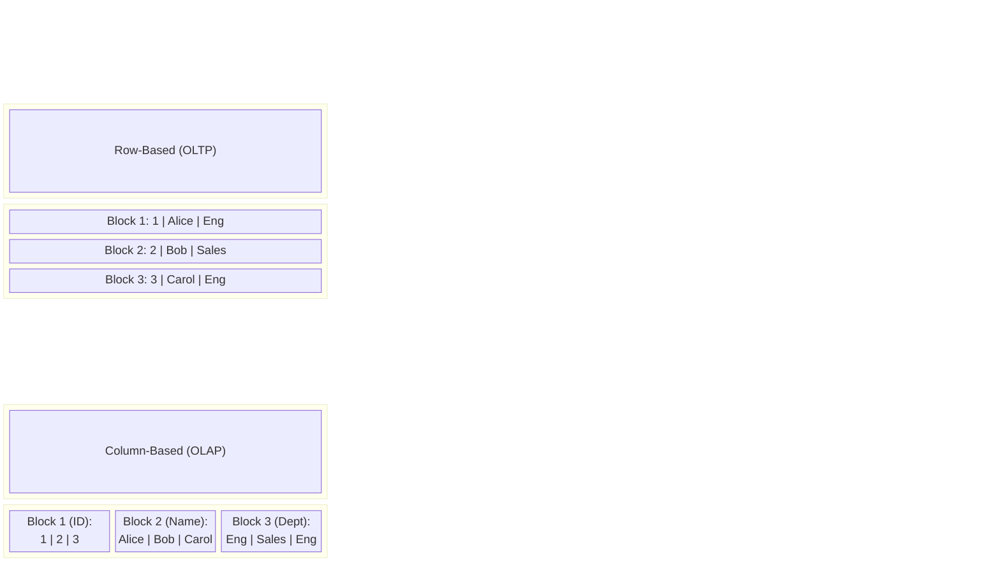

Columnar Storage không đơn thuần là "lưu dữ liệu theo chiều dọc". Ở tầng hệ thống, đó là một sự thay đổi hoàn toàn về cách tổ chức Layout trên đĩa (Disk Layout), cách CPU nạp dữ liệu vào Cache (Memory Layout), và cơ chế thực thi truy vấn. 

Mọi Data Warehouse (BigQuery, Snowflake) hay Data Lakehouse (Delta Lake, Iceberg) hiện đại đều phụ thuộc vào Columnar Storage (tiêu biểu là **Apache Parquet**) để giải bài toán I/O Bottleneck khi quét (scan) hàng Terabyte dữ liệu.

---

## 1. Kiến trúc Vật lý (Physical Disk Layout)

Để hiểu tại sao Columnar Storage lại tối ưu cho các workload phân tích (Read-heavy, Analytical), hãy nhìn vào cách dữ liệu được ghi xuống đĩa (Disk). 

Giả sử chúng ta có một khối dữ liệu người dùng (`ID`, `Name`, `Department`).



### Tại sao OLAP yêu thích Columnar?

Trong một hệ thống Data Warehouse, câu lệnh thường thấy là:
```sql
SELECT Department, COUNT(*) 
FROM employees 
GROUP BY Department;
```

- **Với Row-based (như CSV, PostgreSQL Heap):** Ổ cứng phải quét qua Block 1, Block 2, Block 3. Hệ thống buộc phải đọc cả `ID` và `Name` từ đĩa lên RAM, đẩy qua Bus, vào CPU Cache, sau đó CPU mới tiến hành lọc lấy `Department`. Điều này gây ra **I/O Amplification** (khuếch đại I/O) nghiêm trọng.
- **Với Column-based (như Parquet, ORC):** Ổ cứng chỉ cần thực hiện thao tác Seek đến đúng Offset của `Block 3 (Dept)` và chỉ quét duy nhất block đó. `ID` và `Name` hoàn toàn bị bỏ qua ở cấp độ I/O (I/O Minimization).

---

## 2. Giải phẫu kiến trúc Apache Parquet

Apache Parquet (dựa trên paper **Dremel** của Google) là tiêu chuẩn *de facto* của Columnar Storage. Nó áp dụng một kiến trúc lưu trữ lai (Hybrid) cực kỳ thông minh để cân bằng giữa việc đọc cột và tái tạo lại dòng (Tuple Reconstruction).

```mermaid
graph TD
    File["Parquet File"] --> RG1["Row Group 0("e.g. 10,000 rows")"]
    File --> RG2["Row Group 1("e.g. 10,000 rows")"]
    File --> Footer["File Footer(Metadata)"]
    
    RG1 --> CC1["Column Chunk 1(ID)"]
    RG1 --> CC2["Column Chunk 2(Name)"]
    RG1 --> CC3["Column Chunk 3(Dept)"]
    
    CC3 --> P1["Data Page 1"]
    CC3 --> P2["Data Page 2"]
    
    P1 -.-> DP["Page Header("Zone Maps: Min/Max/Nulls") <br> + <br> Encoded/Compressed Values"]
```

1. **Row Group:** File Parquet được chia ngang thành các Row Group (thường từ 128MB đến 1GB). Điều này giúp hệ thống phân tán (như Spark) có thể đọc song song nhiều Row Group trên các Node khác nhau.
2. **Column Chunk:** Trong mỗi Row Group, dữ liệu lại được chia dọc thành các Column Chunk. Đảm bảo mọi giá trị của một cột trong 1 Row Group nằm liền kề nhau về mặt vật lý.
3. **Data Page:** Đơn vị lưu trữ nhỏ nhất (thường 1MB - 8MB). Đây là nơi dữ liệu thực sự được nén và mã hóa.
4. **File Footer:** Nơi chứa Schema và toàn bộ Metadata (Offsets của các Row Group, Zone Maps). Khi Spark đọc Parquet, thao tác đầu tiên là đọc Footer (ở cuối file) để lấy bản đồ dữ liệu, sau đó mới seek đến các Row Group cần thiết.

---

## 3. Các Cơ chế Thực thi Lõi (Core Mechanics)

### 3.1. Predicate Pushdown & Zone Maps

Nhờ việc lưu trữ Metadata (Zone Maps) chứa `Min`, `Max`, `Null Count` ở cấp độ File, Row Group và Page, engine (như Trino, Spark) có thể thực hiện **Data Skipping** (bỏ qua dữ liệu).

Khi chạy `SELECT * FROM sales WHERE amount > 1000`:
- Engine đọc Metadata của Row Group 1. Nếu `Max(amount) = 800`, engine bỏ qua toàn bộ Row Group này mà không cần hit vào Disk I/O để đọc các Data Pages.
- Thao tác đẩy điều kiện `amount > 1000` xuống thẳng lớp Storage File để lọc trước khi load vào Memory được gọi là **Predicate Pushdown**.

### 3.2. Hiệu suất nén (Compression) siêu việt

Bởi vì một cột chỉ chứa một kiểu dữ liệu duy nhất (Homogeneous data), Columnar Storage áp dụng được các thuật toán mã hóa (Encoding) siêu nhẹ trước khi nén bằng các thuật toán nặng (như Snappy, Zstd).

- **Run-Length Encoding (RLE):** `[US, US, US, VN, VN]` -> `[US:3, VN:2]`. Hiệu quả tối đa khi dữ liệu được sort (Z-Ordering / Liquid Clustering).
- **Dictionary Encoding:** Thay vì lưu hàng triệu chuỗi `Engineering`, hệ thống lưu từ điển `{0: 'Engineering'}` và mã hóa cột thành các số nguyên `[0, 0, 0]`. Số nguyên nhỏ (Integer) chiếm cực kỳ ít RAM và CPU xử lý nhanh hơn chuỗi (String).
- **Delta Encoding:** Lưu độ lệch thay vì giá trị gốc. Dãy timestamp `[1000, 1005, 1008]` trở thành `[1000, +5, +3]`.

### 3.3. Late Materialization & Vectorized Processing

- **Late Materialization:** Trong quá trình xử lý, dữ liệu được giữ nguyên ở dạng nén (ví dụ: mảng số nguyên của Dictionary Encoding) càng lâu càng tốt đi qua các phép `JOIN`, `FILTER`. Việc giải mã và "ráp" lại thành chuỗi ban đầu chỉ diễn ra ở Node cuối cùng trước khi trả về cho Client. Điều này tiết kiệm RAM đáng kể.
- **Vectorized Processing:** Thay vì CPU xử lý từng dòng một (Volcano Iterator Model), các Columnar Engine sử dụng tập lệnh SIMD (Single Instruction, Multiple Data) của CPU để thực thi một phép cộng/nhân trên một mảng (vector) 1024 giá trị chỉ trong một vài chu kỳ xung nhịp (clock cycles).

---

## 4. Rủi ro Vận hành và Trade-offs (Real-world Incidents)

Đừng nghĩ rằng Columnar Storage là "viên đạn bạc". Việc lạm dụng hoặc không hiểu bản chất của nó thường dẫn đến những lỗi sập hệ thống kinh điển.

### 4.1. OOMKilled (Exit Code 137) vì thói quen `SELECT *`

**Tình huống:** Một Data Scientist dùng PySpark chạy câu lệnh `SELECT * FROM user_events` (bảng có 200 cột) trên cụm Kubernetes, và Pod liên tục bị chết với trạng thái `OOMKilled` (Out of Memory Killed).

**Giải phẫu nguyên nhân:** 
Columnar Storage tối ưu cho việc đọc *ít cột*. Khi bạn `SELECT *`, hệ thống phải:
1. Disk I/O phải seek liên tục đến 200 vị trí khác nhau (200 Column Chunks) trên ổ đĩa.
2. **Tuple Reconstruction Overhead:** Engine phải nạp 200 mảng dữ liệu riêng biệt vào RAM và "khâu" (stitch) chúng lại thành một Row hoàn chỉnh. Thao tác này tiêu tốn cực kỳ nhiều CPU và RAM.
3. Khi Memory vượt qua giới hạn cấp phát của K8s Pod, Linux Kernel sẽ gửi tín hiệu `SIGKILL` (Exit Code 137) để tiêu diệt tiến trình ngay lập tức.

**Khắc phục:** Tuyệt đối chỉ `SELECT` đúng cột cần dùng. Phân quyền và tạo các Data Marts hẹp hơn để giới hạn scope truy cập.

### 4.2. Cartesian Explosion lúc Shuffle (Memory Spill)

**Tình huống:** Khi JOIN 2 bảng Parquet khổng lồ, Spark Job treo ở giai đoạn Reduce (Shuffle) hàng giờ liền, sau đó rớt vì `Disk space exhausted` hoặc `OOM`.

**Giải phẫu nguyên nhân:**
Bất kể Parquet đọc nhanh đến đâu, nếu điều kiện JOIN thiếu `ON clause` chặt chẽ, hoặc có Data Skew (một giá trị khóa xuất hiện quá nhiều), hệ thống sẽ tạo ra **Cartesian Explosion**. 
Hai phân vùng 10,000 dòng gặp nhau sinh ra 100 triệu dòng trong RAM. Dữ liệu này không thể nén lại bằng Parquet (vì đang nằm trong Shuffle buffer của RAM) -> Gây tràn bộ nhớ (Spill-to-disk) -> Treo ổ cứng cục bộ của Worker.

**Khắc phục:**
- Kiểm tra Data Skew trước khi JOIN.
- Filter (Pushdown) quyết liệt dữ liệu của cả 2 bảng trước khi bước vào giai đoạn Shuffle.

### 4.3. Nỗi ám ảnh Small Files (Small File Problem)

Columnar Storage ghét file nhỏ. Nếu bạn ingest dữ liệu streaming và cứ 1 giây tạo ra 1 file Parquet 10KB, hệ thống sẽ sụp đổ.
- Lượng Metadata (File Footer) phình to hơn cả dữ liệu thực. NameNode của HDFS hoặc Index của bảng Delta/Iceberg sẽ bị quá tải (Metadata Bottleneck).
- Engine không thể áp dụng Vectorized Processing cho các lô dữ liệu quá bé.
- **Khắc phục:** Luôn có các tiến trình **Compaction (OPTIMIZE)** chạy ngầm để gom các file Parquet nhỏ thành file lớn (128MB - 512MB).

---

## 5. Nguồn Tham Khảo (References)

1. **Dremel Paper (Google Research):** [Dremel: Interactive Analysis of Web-Scale Datasets](https://research.google/pubs/dremel-interactive-analysis-of-web-scale-datasets/) - Bài báo nền tảng đằng sau kiến trúc của Parquet và BigQuery.
2. **Databricks Engineering:** [What is Parquet? (Columnar Storage)](https://www.databricks.com/glossary/what-is-parquet)
3. **Designing Data-Intensive Applications** - *Martin Kleppmann* (Chapter 3: Storage and Retrieval - Column-Oriented Storage).
4. **ClickHouse Tech Blog:** [Columnar storage formats: Parquet, ORC, and Arrow explained](https://clickhouse.com/blog/columnar-storage-formats-parquet-orc-arrow)
5. **Kubernetes Troubleshooting:** Khắc phục lỗi [OOMKilled (Exit Code 137)](https://sysdig.com/blog/troubleshoot-kubernetes-oom/) trong xử lý dữ liệu lớn.
