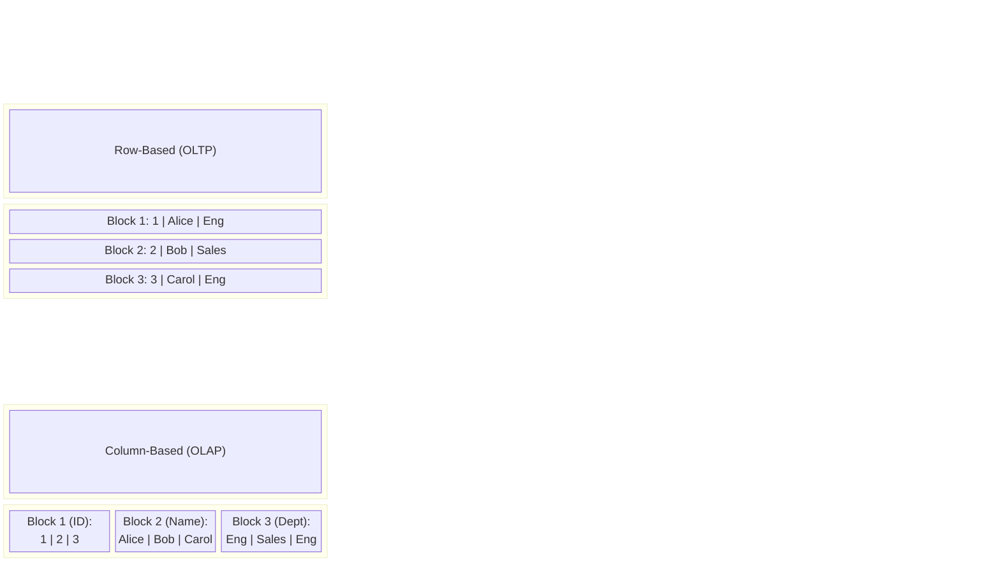
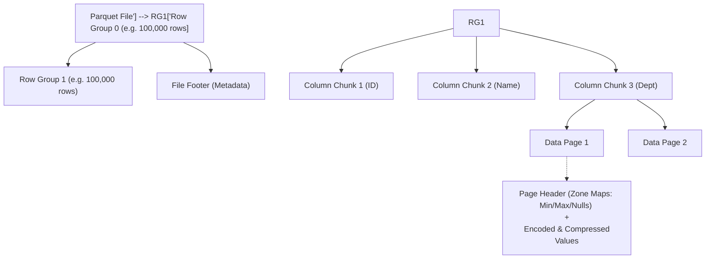

Columnar Storage (Lưu trữ dạng cột) không đơn thuần là "lưu dữ liệu theo chiều dọc". Ở cấp độ Kỹ thuật Hệ thống (Systems Engineering), đó là một sự thay đổi hoàn toàn về cách tổ chức bộ nhớ trên đĩa (Disk Layout), cách CPU nạp dữ liệu vào Cache (Memory Layout), và cơ chế thực thi truy vấn (Execution Model). 

Mọi Data Warehouse (BigQuery, Snowflake) hay Data Lakehouse (Delta Lake, Iceberg) hiện đại đều phụ thuộc vào Columnar Storage (tiêu biểu là **Apache Parquet**) để giải quyết nút thắt cổ chai I/O khi quét (scan) hàng Terabyte dữ liệu.

---

## 1. Kiến trúc Vật lý (Physical Disk Layout)

Để hiểu tại sao Columnar Storage lại thống trị các workload phân tích (Read-heavy, Analytical/OLAP), hãy nhìn vào cách dữ liệu được serialize (tuần tự hóa) xuống đĩa cứng. 

Giả sử chúng ta có một bảng dữ liệu `employees` với các cột (`ID`, `Name`, `Department`).



### Tại sao OLAP yêu thích Columnar?

Trong một hệ thống Data Warehouse, truy vấn điển hình thường là các phép Aggregation trên một vài cột cụ thể:
```sql
SELECT Department, COUNT(*) 
FROM employees 
GROUP BY Department;
```

- **Với Row-based (CSV, PostgreSQL Heap):** Ổ cứng phải quét tuần tự qua Block 1, Block 2, Block 3. Hệ thống buộc phải nạp cả `ID` và `Name` từ đĩa lên RAM, đẩy qua Bus, vào CPU Cache, sau đó CPU mới tiến hành lọc lấy `Department`. Điều này gây ra sự lãng phí băng thông I/O khổng lồ (**I/O Amplification**).
- **Với Column-based (Parquet, ORC):** Ổ cứng chỉ cần thực hiện thao tác Seek đến đúng Offset của `Block 3 (Dept)` và chỉ đọc duy nhất block đó. Các cột `ID` và `Name` hoàn toàn bị bỏ qua ở cấp độ phần cứng (**I/O Minimization**).

---

## 2. Giải phẫu kiến trúc Apache Parquet

Apache Parquet (được thiết kế dựa trên báo cáo **Dremel** của Google) là tiêu chuẩn *de facto* của Columnar Storage. Nó áp dụng một kiến trúc lưu trữ lai (Hybrid) cực kỳ thông minh để cân bằng giữa việc quét cột nhanh chóng và tái tạo lại dòng (Tuple Reconstruction) hiệu quả.



1. **Row Group:** File Parquet được cắt ngang thành các Row Group (kích thước thường từ 128MB đến 1GB). Điều này cho phép các hệ thống phân tán (Spark/Trino) giao mỗi Row Group cho một worker node đọc song song độc lập.
2. **Column Chunk:** Trong mỗi Row Group, dữ liệu lại được chia dọc thành các Column Chunk. Điều này đảm bảo mọi giá trị của một cột nằm liền kề nhau về mặt vật lý.
3. **Data Page:** Đơn vị lưu trữ nhỏ nhất (thường 1MB - 8MB). Đây là nơi dữ liệu thực sự được mã hóa và nén.
4. **File Footer:** Nơi chứa Schema và toàn bộ Metadata (Offsets của Row Groups, Zone Maps). Khi Spark đọc Parquet, thao tác đầu tiên là đọc Footer (ở cuối file) để lấy "bản đồ", sau đó mới Seek tới đúng Row Group cần thiết.

---

## 3. Bí Mật Tối Ưu CPU [Execution Mechanics]

Sự vượt trội của Columnar Storage không chỉ dừng ở Disk I/O. Khi dữ liệu đã nằm trên RAM, cách nó tương tác với CPU Cache mới là yếu tố quyết định tốc độ.

### 3.1. Predicate Pushdown & Zone Maps (Data Skipping)
Nhờ việc lưu trữ Metadata (Zone Maps) chứa `Min`, `Max`, `Null Count` ở cấp độ File, Row Group và Page, các query engine có thể thực hiện **Data Skipping** xuất sắc.

Khi chạy `SELECT * FROM sales WHERE amount > 1000`:
- Engine kiểm tra Metadata của Row Group 1. Nếu `Max(amount) = 800`, engine lập tức bỏ qua toàn bộ Row Group này mà không cần hit vào Disk I/O.
- Khái niệm đẩy điều kiện lọc xuống thẳng lớp Storage để loại trừ dữ liệu rác trước khi load vào Memory được gọi là **Predicate Pushdown**.

### 3.2. Mã hóa siêu nhẹ (Lightweight Encoding)
Bởi vì một cột chỉ chứa một kiểu dữ liệu duy nhất, hệ thống có thể áp dụng các thuật toán mã hóa (Encoding) siêu nhẹ nhưng cực kỳ hiệu quả, trước khi áp dụng thuật toán nén chung (như Snappy/Zstd).
- **Run-Length Encoding (RLE):** Chuỗi `[US, US, US, VN, VN]` được nén thành `[US:3, VN:2]`.
- **Dictionary Encoding:** Thay vì lưu hàng triệu chuỗi `Engineering`, hệ thống tạo từ điển `{0: 'Engineering'}` và lưu một mảng số nguyên `[0, 0, 0]`. Số nguyên nhỏ (Integer] chiếm cực ít RAM và giúp CPU tính toán nhanh hơn nhiều lần.

### 3.3. CPU Cache Locality & Vectorized Execution (SIMD)
- **CPU Cache Locality:** Vì dữ liệu cột nằm liền kề (contiguous) trên RAM, khi CPU truy xuất một giá trị, luồng dữ liệu tiếp theo sẽ được load trước (prefetch) vào L1/L2 Cache của CPU. Tỷ lệ Cache Miss cực thấp, giữ cho CPU luôn "bận rộn" tính toán thay vì phải chờ đợi (Stall) dữ liệu từ RAM.
- **Vectorized Execution & SIMD:** Thay vì xử lý từng dòng một (Volcano Iterator Model - gọi hàm cho mỗi record), các engine hiện đại xử lý dữ liệu theo lô (Batch/Vector). Điều này cho phép CPU tận dụng tập lệnh **SIMD (Single Instruction, Multiple Data)** (ví dụ: AVX-512) để thực thi một phép cộng/nhân trên mảng hàng ngàn giá trị chỉ trong một xung nhịp (Clock cycle).
- **Late Materialization:** Để bảo toàn sức mạnh của SIMD, query engine giữ nguyên dữ liệu ở dạng cột nén (mảng số nguyên) đi qua các phép `JOIN`, `FILTER` càng lâu càng tốt. Việc giải mã và "ráp" lại thành chuỗi ban đầu (Row Reconstruction) chỉ diễn ra ở Node cuối cùng trước khi trả về cho Client.

---

## 4. Rủi ro Vận hành và Trade-offs (Real-world Incidents)

Columnar Storage không phải là "viên đạn bạc". Việc sử dụng sai cách sẽ dẫn đến những hậu quả vận hành khốc liệt.

### 4.1. OOMKilled (Exit Code 137) vì thói quen `SELECT *`
* **Tình huống:** Một Data Scientist dùng PySpark chạy `SELECT * FROM user_events` (bảng có 200 cột) trên cụm Kubernetes. Pod liên tục chết với trạng thái `OOMKilled` (Out of Memory Killed).
* **Giải phẫu nguyên nhân:** Columnar Storage tối ưu cho việc đọc *ít cột*. Khi bạn `SELECT *`, hệ thống phải Seek liên tục đến 200 vị trí khác nhau (200 Column Chunks) trên ổ đĩa. Tệ hơn, engine phải thực hiện **Tuple Reconstruction Overhead**: Nạp 200 mảng dữ liệu rời rạc vào RAM và "khâu" [stitch] chúng lại thành một Row hoàn chỉnh. Thao tác này ngốn CPU và RAM đến mức vượt giới hạn cấp phát của K8s Pod, khiến Linux Kernel gửi tín hiệu `SIGKILL` ngay lập tức.
* **Khắc phục:** Tuyệt đối chỉ `SELECT` đúng cột cần dùng. Tạo các Data Marts hẹp hơn để giới hạn scope.

### 4.2. Cartesian Explosion lúc Shuffle (Memory Spill)
* **Tình huống:** Khi JOIN 2 bảng Parquet khổng lồ, Spark Job treo ở giai đoạn Reduce (Shuffle) hàng giờ liền, sau đó rớt vì `Disk space exhausted` hoặc `OOM`.
* **Khắc phục:** Bất kể Parquet đọc nhanh đến đâu, nếu có Data Skew (Dữ liệu bị lệch khóa), hệ thống sẽ tạo ra **Cartesian Explosion**. Hai phân vùng 10.000 dòng sinh ra 100 triệu dòng trong RAM. Dữ liệu này *không thể* nén lại bằng Parquet (do đang nằm trong Shuffle buffer) -> Gây tràn bộ nhớ (Spill-to-disk). Hãy đẩy (Pushdown) các bộ lọc (Filter) một cách quyết liệt trước giai đoạn Shuffle.

### 4.3. Nỗi ám ảnh Small Files (Metadata Bottleneck)
Columnar Storage cực ghét các file nhỏ. Nếu bạn ingest dữ liệu streaming và cứ 1 giây tạo ra 1 file Parquet 10KB:
- Lượng Metadata (File Footer) sẽ phình to hơn cả dữ liệu thực. NameNode của HDFS hoặc Catalog của bảng Delta/Iceberg sẽ bị quá tải (Metadata Bottleneck).
- CPU không thể áp dụng Vectorized Processing (SIMD) cho các lô dữ liệu lắt nhắt.
* **Khắc phục:** Bắt buộc phải có các tiến trình **Compaction (OPTIMIZE)** chạy ngầm để gom các file Parquet nhỏ thành file lớn (Tối ưu nhất là 128MB - 512MB).

---

## Nguồn Tham Khảo (References)
* **Dremel Paper (Google Research):** [Dremel: Interactive Analysis of Web-Scale Datasets][https://research.google/pubs/dremel-interactive-analysis-of-web-scale-datasets/] - Nền tảng đằng sau Parquet và BigQuery.
* **Databricks Engineering:** [What is Parquet? (Columnar Storage]][https://www.databricks.com/glossary/what-is-parquet]
* **Designing Data-Intensive Applications** - *Martin Kleppmann* (Chapter 3: Storage and Retrieval - Column-Oriented Storage).
* [The Data Pelago: Vectorized Execution and Cache Locality](https://datapelago.ai/]
