Trong các hệ thống phân tán xử lý Dữ liệu lớn (Big Data) hay các NoSQL Databases (như Cassandra, RocksDB), việc đẩy dữ liệu từ các luồng Streaming (Kafka, Kinesis) hoặc Micro-batching tần suất cao sẽ tạo ra hàng triệu tệp tin siêu nhỏ. Vấn đề **Small Files Problem** không chỉ làm chậm tốc độ quét dữ liệu mà còn có khả năng đánh sập hệ thống Metadata quản lý cấp phát (Ví dụ HDFS NameNode hoặc S3 API Limits). 

Để giải quyết, các Data Engineer phải thiết lập **Compaction** (Quá trình dồn nén tệp). Tuy nhiên, dưới góc độ thiết kế hệ thống (System Design), Compaction không đơn giản là "Gom file lại với nhau". Nó là một cuộc chiến vật lý khốc liệt để cân bằng giữa **Write Amplification (Độ khuếch đại Ghi)**, **Read Amplification (Độ khuếch đại Đọc)**, **Compute Cost (Chi phí Máy tính)**, và **Memory (Bộ nhớ RAM)**.

---

## 1. Bản Chất Vật Lý của "Small Files Problem"

Khi dữ liệu được ghi liên tục, các Framework xử lý song song như Apache Spark, Flink hay Kafka Connect sinh ra hằng hà sa số các tệp tin nhỏ vì những nguyên nhân cốt lõi sau:

- **Over-parallelism (Phân mảnh do song song hóa):** Nếu một Job Spark có 200 *Shuffle Partitions* (`spark.sql.shuffle.partitions=200`) nhưng lượng dữ liệu ghi ra đĩa ở mỗi Micro-batch chỉ vỏn vẹn 10MB. 200 Worker (Executors) này sẽ ghi ra 200 tệp tin Parquet siêu nhỏ (Mỗi tệp cỡ 50KB) trong cùng một lúc.
- **Over-partitioning (Phân mảnh theo thư mục vật lý):** Chia Partition Table theo kiểu Hive-style truyền thống (`year/month/day/hour/minute`) tạo ra độ chia nhỏ quá mức, dẫn đến bên trong một thư mục `minute` chỉ chứa 1-2 tệp tin.

### Hậu quả hệ thống (Systemic Impact)
1. **Cạn kiệt Memory Metadata:** HDFS lưu Metadata của từng File Block trực tiếp trên RAM của NameNode. Hàng triệu File nhỏ sẽ khiến NameNode rơi vào trạng thái dọn rác bộ nhớ (Garbage Collection) liên tục, giật lag hoặc OOM (Out-Of-Memory) toàn cục. Với AWS S3/GCS, số lượng File rác quá nhiều làm tiền phí gọi API `LIST` và `GET` tăng theo cấp số nhân (API Cost Explosion).
2. **I/O Latency Overhead (Độ trễ Mạng và Đĩa):** Thời gian để CPU thiết lập kết nối mạng HTTP (Handshake), đọc file Header/Footer, khởi tạo bộ giải mã Parquet/ORC (Deserializer) cho 10,000 file 1MB tốn thời gian gấp hàng trăm lần so với việc đọc mượt mà 10 file 100MB nối tiếp nhau.
3. **Vô hiệu hóa Thuật toán Nén (Compression Bypass):** Các thuật toán nén dạng Block-based (Zstd, Snappy) cần một lượng dữ liệu Text đủ dài để xây dựng từ điển nén (Dictionary) hiệu quả. Khi File quá bé, kích thước cục Metadata chèn vào File Parquet thậm chí còn lớn hơn cả Payload dữ liệu thật.

---

## 2. Nền tảng Lý thuyết: LSM-Tree và Các Chiến Lược Compaction

Các Table Format hiện đại (Iceberg, Delta Lake) và hệ cơ sở dữ liệu (Cassandra, RocksDB) đều kế thừa tư tưởng dồn nén từ cấu trúc dữ liệu **LSM-Tree (Log-Structured Merge-Tree)**. Dữ liệu mới luôn được ghi tuần tự xuống đĩa (Append-only) thành các tệp SSTable bất biến (Immutable), và Compaction sẽ chạy ngầm để dọn dẹp.

Có 2 chiến lược kinh điển quyết định cách chúng ta dồn nén:

### 2.1. Size-Tiered Compaction Strategy (STCS)
- **Cơ chế:** Khi có đủ số lượng File (Ví dụ 4 File) cùng một kích thước nhỏ (Tier 1), hệ thống gộp chúng lại thành 1 File lớn hơn ở Tier 2. Cứ tiếp tục như vậy.
- **Ưu điểm:** **Tối ưu cực độ cho tốc độ Ghi (Write-Heavy)**. Write Amplification (Hệ số khuếch đại Ghi) thấp vì hệ thống ít phải trộn dữ liệu lại nhiều lần.
- **Nhược điểm:** Read Amplification (Hệ số khuếch đại Đọc) rất cao. Vì một Key (ví dụ `user_id = 5`) có thể nằm rải rác ở nhiều File thuộc nhiều Tier khác nhau, truy vấn Đọc phải mở và dò tìm qua tất cả các File đó. Gây lãng phí dung lượng đĩa do dữ liệu rác (Tombstones) lâu bị xóa.

### 2.2. Leveled Compaction Strategy (LCS)
- **Cơ chế:** Tổ chức dữ liệu thành các Tầng (Level L0, L1, L2...). Dung lượng Tầng sau gấp 10 lần Tầng trước. Các File trong cùng một Tầng L1 trở lên **không bao giờ được phép chứa dải Key chồng lấn nhau (Non-overlapping Key Range)**.
- **Ưu điểm:** **Tối ưu cho tốc độ Đọc (Read-Heavy)**. Khi tìm một Key, thuật toán chỉ cần mở tối đa 1 File ở mỗi Tầng. Read Amplification cực thấp.
- **Nhược điểm:** Write Amplification khổng lồ. Để duy trì nguyên tắc "Không chồng lấn Key", mỗi khi dữ liệu từ L0 đẩy xuống L1, hệ thống phải liên tục bóc tách, sắp xếp và trộn lại (Merge/Rewrite) dữ liệu vật lý rất ác liệt.

---

## 3. Cuộc Chiến Data Lakehouse: CoW vs MoR

Khi áp dụng Compaction vào Data Lakehouse, bài toán tương đương với cuộc chiến xử lý các lệnh `UPDATE/DELETE`.

```mermaid
graph TD
    subgraph Copy_On_Write["Copy-on-Write (CoW)"]
        A1["File Gốc: 1GB"] -->|Update 1 Dòng| B1["Đọc toàn bộ lên RAM"]
        B1 --> C1("Ghi file Mới: 1GB")
        C1 -.->|Write Amplification 1000x| D1["Ưu: Tốc độ đọc rất nhanh"]
    end

    subgraph Merge_On_Read["Merge-on-Read (MoR)"]
        A2["File Gốc: 1GB"] -->|Update 1 Dòng| B2["Ghi Delta Log: 1KB"]
        B2 -.->|Write Amplification 1x| C2["Nhược: Phải MERGE khi truy vấn"]
        C2 -.->|Read Amplification lớn| D2["Yêu cầu Background Compaction"]
    end
```



- **Copy-on-Write [CoW]:** Cập nhật 1 dòng dữ liệu đòi hỏi Engine phải Load nguyên File Parquet 512MB lên RAM, sửa 1 dòng, và Ghi lại một File 512MB mới tinh. Mặc định của Delta Lake/Iceberg. Phù hợp cho Batch Jobs ban đêm.
- **Merge-on-Read (MoR):** Cập nhật/Xóa được ghi nhanh vào một File Log phụ (Delete Vector). Cực nhanh cho luồng Ghi Streaming (Write-heavy). Nhưng lúc Đọc, CPU phải tự ráp nối File gốc và File Log lại. Bắt buộc phải chạy **Background Compaction** (Gom File Gốc và Log thành File Mới chuẩn) để phục hồi tốc độ Đọc. Apache Hudi là vua của mô hình này.

---

## 4. Tối Ưu Hóa Phân Cụm (Clustering) Trong Compaction

Khi dồn File nhỏ thành File to (Bin-packing), dữ liệu bên trong vẫn lộn xộn. Kỹ sư dùng thêm các thuật toán dồn cụm để tối ưu hóa Data Skipping.

### 4.1. Z-Ordering (Sắp xếp không gian đa chiều)
- Sử dụng đường cong Z-Curve (Space-filling curve) để biến các truy vấn lọc đa chiều (Ví dụ: `WHERE city = 'Hanoi' AND category = 'Tech'`) thành một chiều tuyến tính trên đĩa cứng. 
- **Đánh đổi:** Cứng nhắc. Mọi dữ liệu mới thêm vào sẽ phá vỡ Z-Order. Bạn phải tốn tiền chạy hàm `OPTIMIZE ... ZORDER BY` dọn dẹp lại liên tục để duy trì hiệu năng.

### 4.2. Liquid Clustering (Bước tiến của Databricks)
- Thay vì Z-Order cứng nhắc, Liquid Clustering gom dữ liệu thành các **Z-Cubes** linh động. 
- **Ưu điểm Incremental:** Nó duy trì sơ đồ Clustering ở mức Metadata. Khi chạy Optimize, nó chỉ chạy thuật toán trên phần Dữ liệu bị phân mảnh (Unoptimized data) thay vì rà soát lại toàn bộ Table, giúp tiết kiệm cực lớn chi phí Compute trên Databricks. Data Engineer cũng có thể linh hoạt thêm bớt cột Clustering mà không cần Rewrite lịch sử.

---

## 5. Tình Huống Sập Hệ Thống (Operational Risks) & Khắc Phục OOMKilled

Compaction ngốn rất nhiều RAM. Dưới đây là cách phòng tránh sự cố sập cụm Spark.

### Sự cố 1: JVM OOMKilled khi chạy Iceberg `rewriteDataFiles`
**Tình huống:** Staff Engineer kích hoạt lệnh dọn dẹp cuối tuần: `SparkActions.get(spark).rewriteDataFiles(table)` với tùy chọn `strategy = 'sort'`. Đột nhiên cụm Spark cháy khét vì Executor bị Out-Of-Memory (OOM).
**Bản chất vật lý (Root Cause):** 
1. **Shuffle Data Skew:** Chiến lược `Sort` ép Spark phải xáo trộn (Network Shuffle) toàn bộ dữ liệu qua mạng. Nếu một Partition (Ví dụ ngày Black Friday) lớn bất thường, khi nạp lên Memory của một Task để sắp xếp (Global Sort), nó sẽ đánh sập Heap Space.
2. **Driver Metadata Bloat:** Driver của Spark phải đọc Manifest của hàng triệu file nhỏ để lên kế hoạch (Planning). Danh sách này quá dài làm Driver nổ tung RAM.

**Giải pháp (Mitigation):**
- **Quay về Bin-pack:** Nếu không cần Data Skipping quá ngặt nghèo, hãy đổi Strategy về `binpack`. Nó nhét các file lại với nhau rẻ tiền hơn, không yêu cầu Shuffle toàn cục.
- **Chia để trị (Scope the Rewrite):** Tuyệt đối KHÔNG gõ lệnh Compaction toàn bộ Bảng. Hãy cắt nhỏ theo từng Partition hoặc số ngày:
  ```java
  CALL catalog.system.rewrite_data_files(
    table => 'db.sales_table',
    where => 'event_date >= CURRENT_DATE - INTERVAL 7 DAYS'
  )
  ```
- **Tuning Spark Memory:** Tăng `spark.executor.memoryOverhead` lên 2-4GB (Đặc biệt nếu chạy trên Kubernetes). Thư viện giải nén Parquet và Java NIO sử dụng Off-heap Memory chứ không dùng Heap.

### Sự cố 2: Hóa Đơn S3 Tăng Vọt (Storage Cost Explosion)
**Tình huống:** Job Compaction chạy xong rất mượt, số lượng File giảm. Nhưng hóa đơn AWS S3 tháng sau tăng gấp đôi.
**Nguyên nhân:** Các định dạng Lakehouse duy trì tính Bất biến (Immutable) và Time Travel. Compaction tạo ra một bộ File 1GB MỚI TINH, nhưng các tệp tin nhỏ CŨ KHÔNG HỀ BỊ XÓA (Nó bị gán nhãn Tombstoned ẩn đi).
**Giải pháp:** Compaction bắt buộc phải đi kèm với quá trình **Garbage Collection (Dọn rác vật lý)**:
- Trên Delta Lake: Đặt lịch chạy lệnh `VACUUM` (Mặc định xóa file rác cũ hơn 7 ngày).
- Trên Iceberg: Chạy procedure `expire_snapshots` kết hợp `remove_orphan_files`.

---

## Nguồn Tham Khảo (References)
1. **Apache Iceberg Maintenance:** [Compaction & RewriteDataFiles][https://iceberg.apache.org/docs/latest/maintenance/]
2. **Sách Kinh Điển:** *Designing Data-Intensive Applications* (Martin Kleppmann) - Phân tích chi tiết về kiến trúc SSTables và LSM-Trees.
3. **Databricks:** [Liquid Clustering Documentation][https://docs.databricks.com/en/delta/clustering.html]
4. **Wikipedia:** [Log-structured merge-tree (STCS vs LCS]][https://en.wikipedia.org/wiki/Log-structured_merge-tree]
5. **Apache Hudi:** [Compaction Architecture (CoW vs MoR]](https://hudi.apache.org/docs/compaction/)
