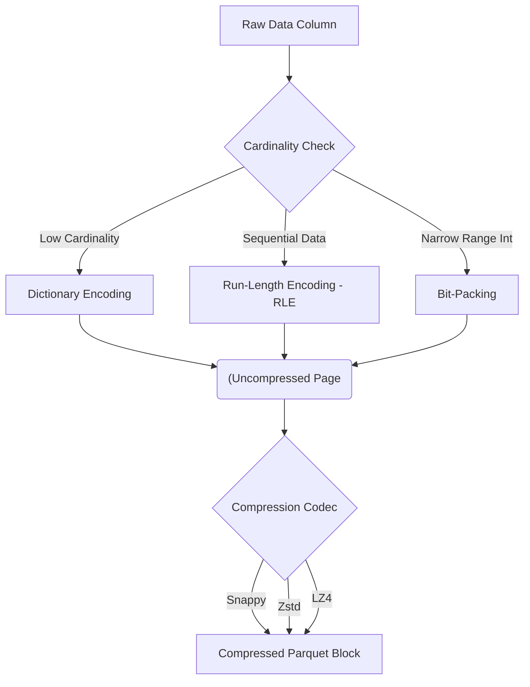

Trong thiết kế hệ thống dữ liệu lớn (Big Data), việc tối ưu hóa dung lượng lưu trữ đôi khi chỉ là lợi ích thứ cấp. Mục tiêu tối thượng của các thuật toán nén (Compression Algorithms) là **giảm thiểu I/O bottleneck** ở các tầng Network và Storage, bằng cách đánh đổi một lượng chu kỳ tính toán của CPU (CPU Cycles). 

Đối với một Kỹ sư Hệ thống (Staff Data Engineer), việc lựa chọn thuật toán nén không bao giờ dừng lại ở câu hỏi ngây ngô "Thuật toán nào nén nhỏ nhất?". Nó là bài toán đánh đổi hệ thống (Systemic Trade-offs): **Tỉ lệ nén (Compression Ratio)** vs. **Thông lượng giải nén (Decompression Throughput)** vs. **Khả năng phân mảnh (Splittability)**.

---

## 1. Bản chất Vật lý của Nén dữ liệu trong Distributed Systems

Trong các Data Warehouse/Data Lakehouse hiện đại (BigQuery, Databricks, Snowflake), nút thắt cổ chai (bottleneck) phổ biến nhất hiếm khi nằm ở CPU, mà nằm ở **Disk I/O** (Đọc từ S3/NVMe) hoặc **Network Bandwidth** (Băng thông mạng nội bộ).

Tại sao nén dữ liệu lại làm hệ thống tính toán (Compute Engine) chạy nhanh hơn, mặc dù CPU phải tốn thời gian "vô ích" để giải nén? 
Lý do nằm ở sự chênh lệch vật lý: Băng thông mạng từ S3/GCS về Compute Node thường bị giới hạn (ví dụ 1-2 GB/s), trong khi một CPU Core hiện đại có thể giải nén dữ liệu trên RAM ở tốc độ 3-5 GB/s. 
Việc đọc 1GB dữ liệu đã nén từ AWS S3 sau đó giải nén trên RAM bằng CPU luôn nhanh hơn rất nhiều so với việc phải chờ hệ thống mạng tải 4GB dữ liệu chưa nén.

Hơn nữa, trong các pha **Network Shuffle** (xáo trộn và trao đổi dữ liệu giữa hàng trăm Node trong lúc chạy `JOIN` hoặc `GROUP BY`), việc nén dữ liệu giúp giảm trực tiếp lưu lượng mạng, tránh nghẽn cổ chai tại các Card Mạng (NIC - Network Interface Card) và giảm hiện tượng RAM tràn xuống đĩa cứng cục bộ (*Spill-to-disk*).

---

## 2. Parquet Compression Pipeline: Encoding vs. Compression

Rất nhiều kỹ sư nhầm lẫn giữa hai khái niệm **Encoding** (Mã hóa hạng nhẹ) và **Compression** (Nén hạng nặng). Trong các định dạng Columnar Storage như Parquet, Iceberg hay ORC, dữ liệu không được nén "nguyên cục". Nó trải qua một Pipeline phức tạp gồm nhiều bước ở mức độ Data Page.



*   **Dictionary Encoding:** Nếu cột `city` có 10 triệu dòng nhưng chỉ có 50 thành phố duy nhất (Low Cardinality), Parquet sẽ lập một từ điển siêu nhỏ (vd: `0 = "Hanoi"`, `1 = "HCM"`). Dữ liệu thực tế chỉ lưu một mảng các số nguyên `0`, `1` thay vì lưu chuỗi string trùng lặp.
*   **Run-Length Encoding (RLE):** Nếu dữ liệu lặp lại liên tiếp nhau (thường có được sau lệnh `ORDER BY` hoặc Z-Ordering), chuỗi `M, M, M, M, F, F` được mã hóa thành `4M, 2F`.
*   **Compression Codec:** Sau khi các encoding hạng nhẹ đã loại bỏ triệt để sự dư thừa cấu trúc, một thuật toán "hạng nặng" [như Zstd, Snappy] mới được áp dụng lên Data Page đó để nén byte-level (thu nhỏ dung lượng file cuối cùng).

:::tip
**Performance Tip:** Để tối đa hóa tỉ lệ nén, hãy dùng `ORDER BY` (Sorting] hoặc `Z-ORDER` theo các cột có Cardinality thấp trước khi ghi (Write) ra Parquet. Việc này dồn các giá trị giống nhau nằm cạnh nhau, giúp RLE phát huy sức mạnh 100%, có thể giảm dung lượng file xuống còn 1/10 mà không tiêu tốn thêm bất kỳ chu kỳ CPU nào cho Codec nén.
:::

---

## 3. Cuộc chiến của các Heavy-weight Codecs

Dưới đây là bức tranh toàn cảnh về 4 thuật toán nén cốt lõi trong Big Data.

### 3.1. LZ4: Kẻ thống trị Thông lượng (Extreme Speed)
*   **Đặc điểm:** Tốc độ giải nén siêu tưởng (đạt nhiều GB/s trên mỗi lõi CPU). LZ4 sẵn sàng hi sinh tỉ lệ nén để lấy tốc độ tối đa.
*   **Kiến trúc hệ thống:** Là chuẩn vàng cho các luồng dữ liệu **In-memory** và **Network Streaming**. Trong Apache Spark, LZ4 được chọn làm thuật toán nén mặc định cho quá trình **Shuffle** và dọn dẹp các RDD tạm thời. Khi hàng trăm Executor đẩy dữ liệu qua mạng cho nhau, chúng dùng LZ4 để giảm tải cho Network I/O mà không làm CPU quá tải.

### 3.2. Snappy: Lựa chọn an toàn (Legacy Standard)
*   **Đặc điểm:** Do Google phát triển, Snappy từng là thuật toán mặc định của Parquet và Kafka trong thập kỷ trước. Nó cung cấp sự cân bằng giữa tốc độ rất tốt và tỉ lệ nén vừa phải (thường nén file xuống còn 50-60%).
*   **Ứng dụng:** Ingestion (ghi dữ liệu thô) ở lớp Bronze/Landing. Khi bạn cần đẩy event logs từ Kafka xuống S3 cực nhanh (Latency-sensitive) và không quá khắt khe về chi phí lưu trữ S3.

### 3.3. Zstandard (Zstd): Tiêu chuẩn của Lakehouse hiện đại
*   **Đặc điểm:** Do Yann Collet (tại Meta/Facebook) phát hành, Zstd đã tạo ra cuộc cách mạng kiến trúc lưu trữ. Nó cung cấp tỉ lệ nén ngang ngửa Gzip nhưng tốc độ giải nén lại nhanh gấp 3-5 lần, tiệm cận với Snappy. Tính năng "chí mạng" của Zstd là hỗ trợ mức độ nén (Compression Levels) tùy chỉnh từ 1 đến 22, cho phép kiến trúc sư tự do xoay núm điều chỉnh (knob) CPU vs I/O.
*   **Ứng dụng:** Trở thành codec mặc định cho Apache Iceberg, Delta Lake và Parquet v2. Zstd tối ưu nhất cho khu vực Datalake tĩnh (Silver/Gold layers), nơi dữ liệu được đọc (Read-heavy) hàng triệu lần bởi các engine phân tích.

### 3.4. Gzip: Tàn dư của thời đại cũ
*   **Đặc điểm:** Tỉ lệ nén cực kỳ cao, nhưng ngốn CPU kinh khủng khiếp và giải nén rất chậm. 
*   **Tử huyệt (Khả năng Splittability):** Gzip **TUYỆT ĐỐI KHÔNG** thể chia cắt (Splittable) khi nén các file văn bản tuyến tính (như CSV, JSON). Nếu bạn có một file `logs.json.gz` nặng 20GB, Spark không thể chia cho 100 CPU Cores đọc song song. Nó bắt buộc phải khởi tạo 1 Executor duy nhất để cày ải giải nén file từ đầu đến cuối một cách tuần tự (Sequential).

---

## 4. Systemic Trade-offs & Troubleshooting (Sự cố Thực chiến)

### 🚨 Incident 1: Spark OOMKilled do Gzip Data Skew
*   **Ngữ cảnh:** Một Data Engineer nén file log JSON xuất từ MongoDB bằng Gzip để tiết kiệm vài đô la tiền AWS S3. File `users_dump.json.gz` nặng 50GB (sau khi nén).
*   **Triệu chứng:** Khi chạy Spark ETL Job trên EMR, 99 Tasks hoàn thành nhanh chóng trong 10 giây. Duy nhất 1 Task bị treo liên tục trong 2 giờ, sau đó Executor báo lỗi chết chóc `java.lang.OutOfMemoryError: Java heap space` (hoặc bị K8s bắn tín hiệu `OOMKilled`).
*   **Phân tích Nguyên nhân (Root Cause):** File Gzip không có cơ chế "sync markers" (Điểm đánh dấu đồng bộ) ở giữa file. Spark không thể chia (split) file này cho các Worker đọc song song. Nó phải nhồi toàn bộ khối lượng 50GB thô (cộng thêm hàng trăm GB dung lượng phình to khi bung nén dạng đối tượng JSON trên RAM) vào một Executor duy nhất. Hiện tượng này sinh ra **Data Skew** phần cứng cực đoan.
*   **Giải pháp Cứu mạng:** 
    1. Tránh xa Gzip đối với file văn bản khổng lồ.
    2. Chuyển đổi định dạng ngay từ đầu nguồn: Đọc file thô và ghi lại thành định dạng Parquet kết hợp Snappy/Zstd. Bên trong cấu trúc Parquet, thuật toán nén được áp dụng cô lập ở mức độ từng Block/Row Group (thường là 128MB), do đó Spark có thể "nhảy" (seek) đến các Row Group khác nhau và chia việc đọc song song hoàn toàn trơn tru.

### 🚨 Incident 2: Hiệu ứng "Zstd Level 19" cắn nát Cloud Bill (FinOps)
*   **Ngữ cảnh:** Một team Data quyết định chuyển toàn bộ kho dữ liệu sang Zstd với cấu hình cực đoan `compressionLevel = 19` (mức cao nhất) nhằm giảm hóa đơn lưu trữ S3 Storage.
*   **Đánh đổi (The Trade-off):** Mức độ nén 19 sử dụng các thuật toán Window Search phức tạp và tiêu tốn một lượng khổng lồ CPU & RAM. Kết quả thực tế: Chi phí lưu trữ S3 giảm được \$500/tháng, nhưng hóa đơn tính toán (Compute Cost) của Databricks/EMR lại phình to thêm \$3000/tháng do các Cluster phải chạy lâu hơn và sử dụng nhiều node đắt tiền hơn chỉ để thực hiện việc nén/giải nén.
*   **Giải pháp (The Sweet Spot):** Chuyển về Zstd Level 3. Các Benchmark thực tế trên Facebook và Uber chứng minh Zstd Level 3 là điểm "Cân bằng vàng". Nó tiết kiệm dung lượng hơn Snappy ~15% mà tốc độ giải nén hầu như không làm tăng độ trễ (Latency) tổng thể.

---

## 5. Thực thi qua Code (Infrastructure as Code)

Thay vì phó mặc cho cấu hình Default, một Kỹ sư giỏi phải kiểm soát trực tiếp các thuật toán nén trong hệ thống.

**Apache Spark (PySpark): Tối ưu Shuffle và Parquet Write**
```python
# Tối ưu cho quá trình Network Shuffle: 
# Dùng LZ4 để giải tỏa tắc nghẽn mạng tốc độ cực cao, giảm tải CPU.
spark.conf.set("spark.shuffle.compress", "true")
spark.conf.set("spark.shuffle.spill.compress", "true")
spark.conf.set("spark.io.compression.codec", "lz4")

# Tối ưu cho Storage (Lakehouse): 
# Dùng Zstd làm chuẩn đầu ra (Gold Layer) cho Parquet/Iceberg
spark.conf.set("spark.sql.parquet.compression.codec", "zstd")

# Ghi dữ liệu với Z-Ordering để tính năng RLE (Run-Length Encoding) hoạt động tối đa
df.sort("tenant_id", "created_date") \
  .write \
  .format("parquet") \
  .mode("overwrite") \
  .save("s3://datalake-bucket/gold/users/")
```

**Apache Kafka (Producer): Tối ưu Ingestion cho Streaming**
```properties
# Sử dụng LZ4 hoặc Snappy để tối ưu Latency nhưng tăng thông lượng ghi mạng.
# Producer tốn một chút ít CPU để nén, đổi lại giảm lượng lớn dung lượng mạng đẩy đến Broker
compression.type=lz4
linger.ms=50
batch.size=131072
```

---

## 6. Tổng Kết (The Codec Cheat Sheet)

Bảng quyết định kiến trúc nhanh gọn dành cho Data Engineer:

|" Kịch bản sử dụng (Use Case) "| Định dạng (Format) | Lựa chọn Codec | Lý do Kiến trúc |
| :--- | :--- | :--- | :--- |
|" **Real-time Streaming (Kafka)** "| JSON / Avro | `LZ4` / `Snappy` | Độ trễ (Latency) là ưu tiên số một. Giảm nhẹ tải mạng mà không vắt kiệt CPU. |
| **Spark Intermediate Shuffle** | Spark internal | `LZ4` | Tốc độ nén/giải nén siêu thanh, triệt tiêu nút thắt cổ chai ở Network Card. |
|" **Datalake Landing (Bronze)** "| Parquet / JSON | `Snappy` | Chiến lược "Set and forget", tốc độ ingest nhanh, tương thích ngược với mọi hệ thống cũ. |
| **Warehouse / Lakehouse [Gold]**| Parquet / Iceberg | `Zstd` (Level 3) | Sự cân bằng hoàn hảo. Dung lượng bé hơn Snappy, CPU tiêu thụ hợp lý, đọc cực nhanh. |
|" **Cold Data Archival (Glacier)** "| Parquet / CSV |" `Zstd` (Level 9+) hoặc `Gzip` "| Dữ liệu Write-Once, Read-Rarely. Tối ưu cực hạn chi phí lưu trữ phần cứng. |

## Nguồn Tham Khảo (References)
*   [Zstandard - Real-time data compression algorithm (Meta Open Source]][https://facebook.github.io/zstd/]
*   [Apache Parquet Format Specifications (File Format & Encoding]][https://parquet.apache.org/docs/file-format/]
*   [Designing Data-Intensive Applications (Chapter 3: Storage and Retrieval] - Martin Kleppmann](https://dataintensive.net/)
