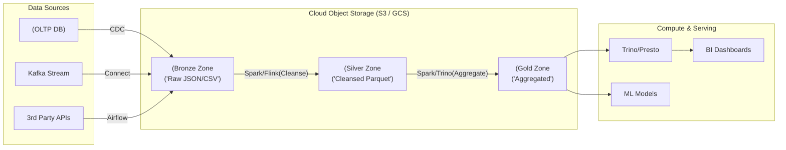

Data Lake không đơn thuần là một "cái kho" hay bãi rác để ném mọi dữ liệu thô vào. Dưới góc độ Kỹ thuật Hệ thống (System Design), Data Lake là một hệ thống lưu trữ phân tán (Distributed Storage) tách rời hoàn toàn với tầng tính toán (Compute), tận dụng tối đa sức mạnh của Cloud Object Storage (S3, GCS) để đạt khả năng mở rộng vô hạn với chi phí thấp nhất. 

Bài viết này đi thẳng vào kiến trúc thực thi vật lý, khái niệm *Data Gravity*, các rủi ro vận hành và sự đánh đổi (Trade-offs) khi triển khai Data Lake ở quy mô Enterprise.

---

## 1. Kiến trúc Thực thi Vật lý (Physical Architecture)

### 1.1. Tách biệt Compute và Storage (Decoupled Architecture)
Sự tiến hóa lớn nhất của Cloud Data Lake so với hệ sinh thái Hadoop truyền thống nằm ở việc tách rời Đĩa cứng (Disk) và Vi xử lý (CPU).

- **Hadoop (HDFS):** Kiến trúc *Coupled* (Gắn kết). Data Node chứa cả ổ cứng lưu dữ liệu và CPU/RAM để chạy các task MapReduce. Điều này khiến việc mở rộng rất tốn kém (Bạn không thể chỉ mua thêm ổ cứng mà không phải mua thêm CPU).
- **Cloud Data Lake:** Dữ liệu nằm hoàn toàn trên Object Storage. Compute Cluster (Spark, Trino) là các hệ thống Stateless (Không trạng thái). Bạn có thể bật/tắt hàng ngàn node Compute bất cứ lúc nào để tiết kiệm tiền, trong khi dữ liệu vẫn an toàn tuyệt đối trên S3.

**Kiến trúc Huy chương (Medallion Architecture)**


### 1.2. Object Storage KHÔNG PHẢI là File System
S3 hay GCS không có khái niệm thư mục (Directory). Đường dẫn `s3://my-lake/year=2026/data.parquet` bản chất chỉ là một Chuỗi khóa duy nhất (Key-Value store). 
- **Lợi ích:** Không bị nghẽn ở Metadata Server (như NameNode của HDFS), Scale-out vô hạn.
- **Tử huyệt:** Phép toán `RENAME` hoặc `MOVE` một "thư mục" thực chất là thao tác `COPY` toàn bộ files và `DELETE` files cũ. Nó tốn cực nhiều thời gian và chi phí API. Đừng bao giờ thiết kế luồng ETL phụ thuộc vào lệnh Move thư mục.

---

## 2. Rủi ro Vận hành (Operational Risks)

### 2.1. Sự cố Tệp Nhỏ (The Small File Problem)
Khi hệ thống Ingestion (như Kafka) liên tục xả dữ liệu Streaming xuống S3 mỗi vài giây, nó tạo ra hàng triệu file Parquet/JSON có kích thước siêu nhỏ (vài KB).

**Sự cố Hệ thống (Incident):**
1. **S3 API Rate Limits:** Vượt quá giới hạn 5,500 `GET/HEAD` requests mỗi giây trên một prefix của S3, gây ra lỗi HTTP `503 Slow Down` làm sập cụm đọc.
2. **I/O Bottleneck:** Thời gian để thiết lập kết nối mạng HTTP đọc metadata lớn hơn gấp trăm lần thời gian thực sự đọc dữ liệu trong file 1KB.
3. **OOMKilled:** Spark Driver bị cạn kiệt bộ nhớ Heap chỉ vì cố gắng `list` hàng triệu file.

**Cách khắc phục (Compaction):**
Cần lên lịch gom cụm (Compaction) định kỳ hoặc dùng tính năng tự động của Databricks:
```python
# Tự động gộp file nhỏ thành file lớn (~128MB) khi ghi
spark.conf.set("spark.databricks.delta.autoCompact.enabled", "true")
```

### 2.2. Over-Partitioning & Cú nổ Đề-các
Phân vùng bằng các thư mục như `year=../month=../day=..` giúp giảm lượng dữ liệu bị quét (Partition Pruning). Tuy nhiên, nếu bạn partition theo một cột có Cardinatily cực lớn (ví dụ: `customer_id` với hàng triệu người dùng).

**Sự cố:** Thay vì đọc một file Parquet 1GB, Spark phải phát ra 1 triệu API calls quét qua 1 triệu prefix S3, mỗi prefix chứa 1 file 1KB. Quá trình Query Planning sẽ treo vô thời hạn (Cartesian Explosion).

**Guardrails:**
- Kích thước tối thiểu của một file Parquet nên là 128MB.
- Chỉ Partition theo trường có độ biến thiên thấp (Low Cardinality) như Ngày/Tháng hoặc Khu vực.

---

## 3. Lực Hấp Dẫn Dữ Liệu (Data Gravity) & Đầm Lầy (Data Swamp)

### 3.1. Schema-on-Read và Data Swamp
Khác với Database truyền thống ép buộc cấu trúc trước khi ghi (Schema-on-Write), Data Lake sử dụng **Schema-on-Read**: Cứ ném dữ liệu thô vào, lúc nào đọc thì mới ép kiểu.
Tính năng này tạo ra sự linh hoạt vô tiền khoáng hậu cho team Data Ingestion. Tuy nhiên, nếu lạm dụng mà không có hệ thống Data Catalog (như AWS Glue hay Amundsen) để quản lý, Data Lake sẽ nhanh chóng thối rữa và biến thành **Data Swamp (Đầm lầy dữ liệu)** - nơi chứa hàng Petabyte rác không ai dám xóa vì không biết nó dùng để làm gì.

### 3.2. Data Gravity
Thuật ngữ này ám chỉ việc dữ liệu càng phình to, nó càng tạo ra lực hấp dẫn hút các ứng dụng và Compute Engines về phía nó. Một khi bạn đã đẩy 10 Petabyte dữ liệu lên AWS S3, việc chuyển sang Google Cloud gần như bất khả thi do chi phí Egress Bandwidth khổng lồ. 
Vì vậy, **bạn phải mang Compute đến nơi chứa Data**, chứ không thể di chuyển Data tới nơi có Compute.

---

## 4. Tối Ưu Chi Phí (FinOps) Bằng IaC

Lưu trữ 1 Petabyte trên S3 Standard tốn khoảng 23,000 USD/tháng. Một Data Engineer xuất sắc phải thiết kế **Lifecycle Policies** để tự động đẩy dữ liệu lạnh (Cold Data) xuống Storage Class rẻ hơn.

**Terraform Code (S3 Lifecycle Policy):**
```hcl
resource "aws_s3_bucket_lifecycle_configuration" "lake_lifecycle" {
  bucket = aws_s3_bucket.data_lake_raw.id

  rule {
    id     = "archive_cold_data"
    status = "Enabled"

    filter { prefix = "raw_events/" }

    # Chuyển xuống S3 Standard-IA sau 30 ngày (Dữ liệu ít đọc, tiết kiệm 40%)
    transition {
      days          = 30
      storage_class = "STANDARD_IA"
    }

    # Chuyển xuống Glacier Deep Archive sau 90 ngày (Lưu trữ vĩnh viễn cực rẻ)
    transition {
      days          = 90
      storage_class = "DEEP_ARCHIVE"
    }
  }
}
```

---

## 5. Sự Tiến Hóa: Data Lakehouse
Để giải quyết tận gốc hạn chế của Data Lake thuần túy [Không có giao dịch ACID, không thể `UPDATE`/`DELETE` dễ dàng, Data Swamp], các Open Table Formats như **Apache Iceberg**, **Delta Lake** đã ra đời. Chúng bổ sung một lớp Transaction Log (Control Plane) nằm giữa S3 và Compute, định hình kỷ nguyên mới mang tên **Data Lakehouse**.

## Nguồn Tham Khảo (References)
* [Martin Fowler: Data Lake][https://martinfowler.com/bliki/DataLake.html]
* [AWS Architecture Blog: Data Lakes and Analytics](https://aws.amazon.com/blogs/architecture/]
* *Designing Data-Intensive Applications* - Martin Kleppmann.
