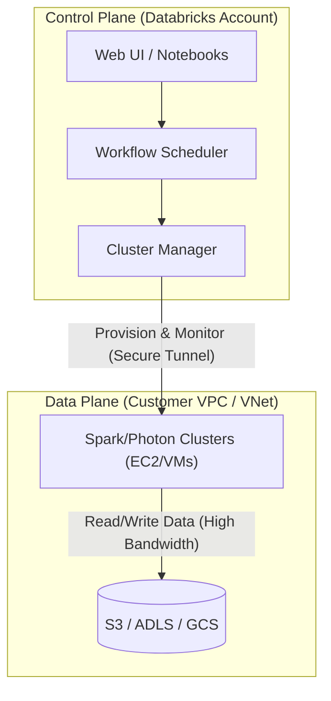

Bỏ qua các định nghĩa mang tính tiếp thị về "Data Intelligence Platform", ở góc độ của một **Staff Data Engineer**, Databricks bản chất là một hệ thống phân tán mạnh mẽ kết hợp giữa năng lực điều phối cụm (Cluster Orchestration) và lõi xử lý dữ liệu được tinh chỉnh khốc liệt (Spark/Photon) chạy trực tiếp trên Cloud Object Storage.

Bài viết này sẽ mổ xẻ kiến trúc vật lý của Databricks, các engine thực thi cốt lõi, quản trị layout dữ liệu (Liquid Clustering), và những đánh đổi (Trade-offs) khốc liệt về tài chính khi vận hành hệ sinh thái này ở quy mô Petabyte.

---

## 1. Kiến trúc Vật lý (Physical Execution Architecture)

Kiến trúc Databricks tuân thủ mô hình bảo mật chia sẻ (Shared Security Model) trên Cloud (AWS/Azure/GCP), phân tách rạch ròi giữa **Control Plane** và **Data Plane**. Sự phân tách này đảm bảo nguyên tắc tối thượng: *Databricks quản lý Compute, nhưng Khách hàng (Bạn) nắm quyền sinh sát với Data.*



### 1.1. Control Plane (Quản lý bởi Databricks)
Đây là bộ não điều phối chạy trên tài khoản Cloud của Databricks.
*   **Cluster Manager:** Giao tiếp với Cloud API của nhà cung cấp (ví dụ AWS EC2 API) để khởi tạo, mở rộng (auto-scale) hoặc hủy các Spot/On-Demand Instances.
*   **Job Scheduler:** Trình kích hoạt DAG, quản lý luồng thực thi.
*   Dữ liệu truyền qua Control Plane chỉ là Metadata, Logs và Code. Dữ liệu thô (Raw Data) tuyệt đối không bao giờ rời khỏi VPC của bạn (ngoại trừ cấu hình Serverless Compute).

### 1.2. Data Plane (VPC của Khách hàng)
Nơi xảy ra các tác vụ tính toán nặng (Heavy Lifting).
*   **Compute Layer:** Các Node Worker (Databricks Runtime) được cấp phát ngay trong VPC của bạn.
*   **Storage Layer:** Dữ liệu hoàn toàn nằm trên S3/ADLS bucket. Compute Node sẽ mount hoặc truy cập qua IAM Roles.

**Systemic Trade-off (Đánh đổi hệ thống):** High Availability vs. Network Cost. Nếu bạn cấu hình cluster trải dài trên nhiều Availability Zones (Multi-AZ) để chống sập data center, thao tác Shuffle (xáo trộn dữ liệu qua mạng khi JOIN/GROUP BY) giữa các node khác AZ sẽ sinh ra cước phí **Network Egress Tax** vô cùng đắt đỏ từ nhà cung cấp Cloud.

---

## 2. Compute Layer: Photon Engine (C++) vs. JVM Spark

Spark truyền thống chạy trên **JVM (Java Virtual Machine)**. Dù có Tungsten Engine (Whole-stage code generation), JVM vẫn phải chịu Overhead kinh hoàng về Garbage Collection (GC) khi xử lý hàng tỷ records và không tận dụng được triệt để phần cứng CPU.

Databricks đã viết lại engine bằng C++ gọi là **Photon**.

### 2.1. Vectorized Execution (Thực thi Vector hóa)
Thay vì xử lý từng dòng (row-by-row), Photon xử lý dữ liệu theo các **Columnar Batches** (lô cột). Nó gọi trực tiếp các tập lệnh **SIMD (Single Instruction, Multiple Data)** của CPU (như AVX-512). CPU có thể cộng hàng chục phần tử trong cùng một chu kỳ xung nhịp (clock cycle), tối ưu cache L1/L2.

### 2.2. Trade-off: Performance vs. DBU Cost
Photon không phải là phép màu miễn phí.
*   **Cost Premium:** Kích hoạt Photon sẽ làm tăng giá DBU (Databricks Unit). Nó chỉ thực sự sinh lời (ROI dương) cho các workloads có tính toán cực nặng (Heavy SQL, Complex Joins, Massive Aggregations). Với các job nhẹ hoặc I/O bound (chỉ đọc và copy data), bật Photon là ném tiền qua cửa sổ.
*   **Fallback Mechanism:** Nếu Catalyst Optimizer gặp một tác vụ mà Photon chưa hỗ trợ (ví dụ Python UDF tự viết), engine sẽ "rơi về" (fallback) Spark JVM. Quá trình serialize/deserialize data giữa C++ (Off-heap) và Java Heap sẽ sinh ra độ trễ.

**Code cấu hình:** Bạn có thể force tắt/bật Photon ở cấp độ Session (mặc dù nên cấu hình ở cấp Cluster):
```sql
-- Cấu hình Spark kiểm tra việc fallback của Photon (Debugging)
SET spark.databricks.photon.fallback.explain = true;
```

---

## 3. Storage Layout: Z-Ordering vs. Liquid Clustering

Tối ưu hóa layout file (cách dữ liệu sắp xếp vật lý trong Object Storage) là chìa khóa để Data Skipping hoạt động hiệu quả. 

### 3.1. Nỗi đau của Z-Ordering
Z-Ordering sử dụng đường cong Z-curve để gom cụm dữ liệu. Tuy nhiên, nó gây ra hiện tượng **Write Amplification (Khuếch đại ghi)**. Mỗi lần chạy `OPTIMIZE ... ZORDER BY`, hệ thống đọc lại toàn bộ dữ liệu, sắp xếp, và ghi đè hàng loạt file. Nếu thay đổi chiến lược cột (Partition Keys), bạn phải rewrite lại cả table.

### 3.2. Liquid Clustering: Dynamic Layout
Liquid Clustering sử dụng thuật toán gom cụm động. Nó tự động cân bằng file size và điều chỉnh layout khi dữ liệu đến (Ingestion) mà không cần rewrite toàn bộ bảng cũ.

```sql
-- DDL tạo bảng sử dụng Liquid Clustering hiện đại
CREATE TABLE prod.finance.transactions (
  transaction_id STRING,
  user_id STRING,
  amount DECIMAL(18,2),
  transaction_date DATE
)
USING DELTA
-- Không dùng PARTITIONED BY nữa, dùng CLUSTER BY
CLUSTER BY (user_id, transaction_date);

-- Chạy OPTIMIZE sẽ tự động phân phối lại dữ liệu động
OPTIMIZE prod.finance.transactions;
```

---

## 4. Unity Catalog: Data Governance & Security

Ở môi trường Data Lake truyền thống, Data Engineer quản lý phân quyền qua các ACL (Access Control List) rời rạc như AWS S3 Policies. Khi Scale up tới hàng trăm team, điều này tạo ra "địa ngục bảo mật". **Unity Catalog (UC)** ra đời như một lớp Meta-store tập trung và độc lập.

**Kiến trúc Gatekeeper:**
1.  User chạy query `SELECT * FROM prod.finance.revenue`.
2.  Compute Engine kiểm tra quyền với Unity Catalog Server.
3.  Nếu hợp lệ, UC cấp một **Temporary Credentials** (Token hết hạn cực ngắn) để Node đọc trực tiếp từ S3.

**Systemic Trade-off:** UC mang lại khả năng quản trị tuyệt đối (Fine-grained Access Control, Row/Column-level Security, Lineage), nhưng đổi lại là **Architectural Rigidity** (Sự cứng nhắc về kiến trúc). Khách hàng phải tuân thủ nghiêm ngặt mô hình cấu trúc phân cấp (3-level Namespace: `catalog.schema.table`) và quản lý gắt gao Managed vs. External Locations.

**Thực chiến Code (Phân quyền):**
```sql
-- Thay vì cấp quyền IAM Roles nguy hiểm, ta cấp quyền trên Unity Catalog
GRANT SELECT ON TABLE prod.finance.transactions TO `marketing_team`;

-- Cấp quyền Row-level Security (RLS) bằng Filter Function
CREATE FUNCTION prod.finance.region_filter(region_code STRING)
RETURN IF(IS_ACCOUNT_GROUP_MEMBER('admin'), true, region_code = 'US');

ALTER TABLE prod.finance.transactions 
SET ROW FILTER prod.finance.region_filter ON (region);
```

---

## 5. Rủi ro Vận hành: OOMKilled và Shuffle Spill

Hệ thống mạnh đến mấy cũng sẽ sập nếu bị bóp nghẹt tài nguyên.

### OOMKilled (Exit Code 137)
Xảy ra khi bộ dọn rác GC làm việc liên tục không nghỉ (GC Stall) khiến Node bị treo, YARN/K8s sẽ thẳng tay kill container. Đặc biệt nguy hiểm khi dùng Photon vì bộ nhớ cấp cho C++ là **Off-heap Memory**. Nếu bạn cấp quá nhiều On-heap cho JVM mà quên chừa lại RAM cho hệ điều hành và C++, OOMKilled ở cấp độ OS (Kernel) sẽ kích hoạt.

**Khắc phục (Troubleshooting Code):**
```python
# Tăng Off-heap memory (Memory Overhead) để cấp thêm RAM cho Photon C++ Engine
# Tăng từ 0.1 (10% mặc định) lên 0.3 (30%)
spark.conf.set("spark.executor.memoryOverheadFactor", "0.3")

# Kích hoạt Adaptive Query Execution (AQE) để chia nhỏ Skew Data
spark.conf.set("spark.sql.adaptive.enabled", "true")
spark.conf.set("spark.sql.adaptive.skewJoin.enabled", "true")
```

---

## Nguồn Tham Khảo [References]

1.  [Databricks Blog: Photon Vectorized Query Engine][https://www.databricks.com/blog/2021/06/17/announcing-photon-public-preview-the-next-generation-query-engine-on-the-databricks-lakehouse-platform.html]
2.  [Databricks Blog: Liquid Clustering][https://www.databricks.com/blog/2023/10/24/announcing-general-availability-liquid-clustering.html]
3.  [Unity Catalog Architecture & Security](https://docs.databricks.com/en/data-governance/unity-catalog/index.html]
4.  *Designing Data-Intensive Applications* - Martin Kleppmann.
