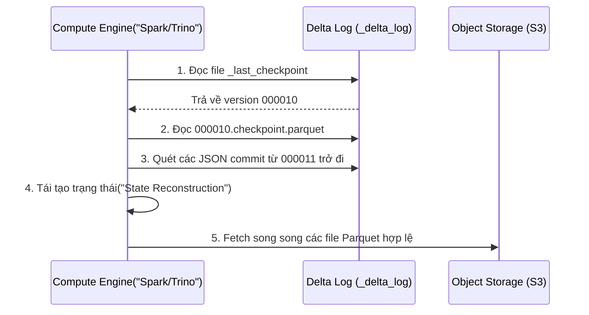
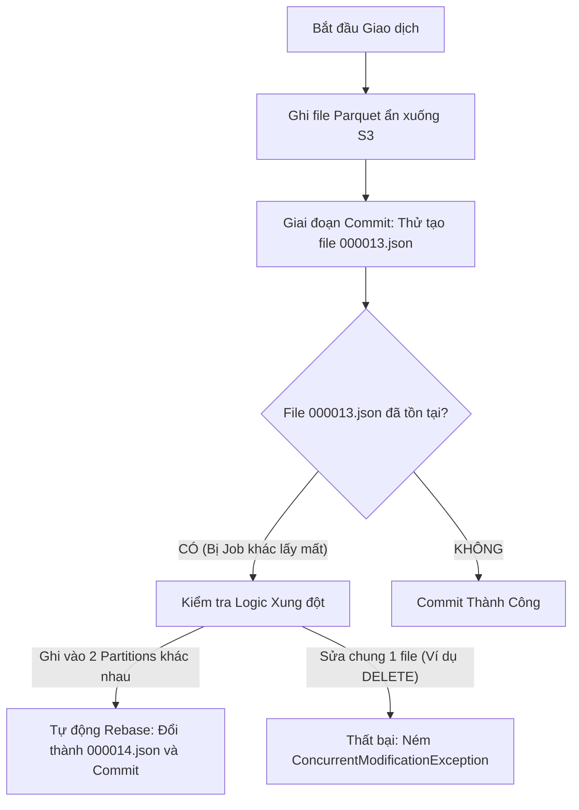

Lưu trữ dữ liệu thô bằng Parquet hoặc CSV trên Amazon S3 hay Google Cloud Storage từng là tiêu chuẩn vàng của kỷ nguyên Data Lake. Tuy nhiên, ở quy mô doanh nghiệp, hệ thống này bộc lộ những tử huyệt chí mạng: Thiếu giao dịch ACID dẫn đến việc đọc phải dữ liệu rác (Partial reads) khi job đang ghi dở, thao tác Cập nhật (UPDATE) đòi hỏi phải ghi đè lại toàn bộ bucket, và hiện tượng "Rác Metadata" (Small File Problem) đánh sập các cụm tính toán.

Delta Lake ra đời để giải quyết bài toán này. Khái niệm **Open Table Format** (cùng với Apache Iceberg và Hudi) bản chất là biến Object Storage thành một hệ quản trị cơ sở dữ liệu phân tán bằng cách tiêm (Inject) một lớp **Transaction Log** ở giữa Compute Engine và Data Files.

---

## 1. Giải Phẫu Kiến Trúc: Lớp Siêu Dữ Liệu (Metadata Layer)

Delta Lake không thay thế Parquet; nó **bao bọc (Wrap)** Parquet bằng một cơ chế kiểm soát siêu dữ liệu chặt chẽ.

### 1.1. Transaction Log (`_delta_log`)
`_delta_log` là bộ não của Delta Lake, hoạt động theo cơ chế **Write-Ahead Log (WAL)**. Mọi thay đổi đối với bảng đều sinh ra một file JSON tuần tự gọi là **Commit**.

```text
s3://my-data-bucket/transactions_table/
├── _delta_log/
│   ├── 00000000000000000000.json
│   ├── 00000000000000000001.json
│   ├── 00000000000000000010.checkpoint.parquet
│   ├── _last_checkpoint
│   └── ...
├── part-00000-xxxx.snappy.parquet
└── part-00001-yyyy.snappy.parquet
```

- **JSON Commit Files:** Chứa mảng các hành động (Actions). Quan trọng nhất là cờ `add` (thêm file Parquet mới vào bảng, kèm theo thống kê min/max) và `remove` (đánh dấu xóa logic file Parquet cũ khỏi version hiện tại). 
- **Checkpoint Files:** Để tránh việc Spark phải quét hàng vạn file JSON khi truy vấn, cứ mỗi 10 commits, Delta tự động gộp (Compact) trạng thái vào một file `.checkpoint.parquet`.

### 1.2. Luồng Thực Thi Truy Vấn (Read Protocol)
Khi Spark/Trino đọc bảng Delta, nó tuân thủ giao thức sau:



---

## 2. Kiểm Soát Đồng Thời: Optimistic Concurrency Control (OCC)

Làm sao Delta Lake cho phép hàng trăm Spark jobs cùng ghi vào một bảng S3 mà không bị dính khóa (Deadlock) toàn cục? Câu trả lời là **Optimistic Concurrency Control (OCC) - Kiểm soát đồng thời lạc quan**.

Thay vì "Khóa bi quan" (Pessimistic Locking) như RDBMS truyền thống, OCC giả định phần lớn các luồng ghi sẽ không xung đột. Nó cứ ghi thẳng file Parquet ra Object Storage, và chỉ kiểm tra xung đột ở phút chót (Lúc cố gắng tạo file JSON commit vào thư mục `_delta_log`).



**Sự đánh đổi (Systemic Trade-off):** 
- **Lợi ích:** Throughput ghi cực cao, không bị I/O Wait do cơ chế khóa.
- **Rủi ro (Retry Storm):** Nếu bạn có hàng chục job Streaming cùng liên tục chạy lệnh `UPDATE/MERGE` vào cùng một Partition (hoặc bảng không được partition), các job sẽ liên tục sinh ra xung đột ở phút chót, phải bỏ file Parquet vừa tạo, tính toán lại và Retry, gây ra một cơn bão đốt sạch tài nguyên Compute.

---

## 3. Tối Ưu Hóa & Rủi Ro Vận Hành

### 3.1. Rác file nhỏ (Small File Problem) & Data Skipping
Các luồng Streaming thường sinh ra hàng triệu file Parquet dung lượng vài KB. Quá trình tái tạo `_delta_log` sẽ làm phình to RAM của Spark Driver dẫn đến **OOM (Out of Memory)**.
Đồng thời, khi User chạy câu lệnh `WHERE age > 30`, engine phải đọc footer của hàng vạn file để lấy metadata.

**Giải pháp (Data Skipping & Z-Ordering):**
Khi ghi file, Delta tự động lưu thống kê Min/Max của các cột vào log. Để kỹ thuật Data Skipping hoạt động hiệu quả tối đa, bạn phải dùng lệnh `OPTIMIZE ... ZORDER BY` để phân cụm vật lý các dữ liệu liên quan lại gần nhau.

```python
# Kịch bản bảo trì Delta Lake hàng ngày (Airflow DAG)
spark.sql("OPTIMIZE s3_events_table ZORDER BY (user_id, event_date)")
```

*Lưu ý OOM khi Optimize:* Bảng nặng 50TB khi chạy Z-Order sẽ đòi hỏi Global Shuffle [Sắp xếp đa chiều toàn cục], rất dễ đánh sập Cluster. Databricks hiện nay đã chuyển sang **Liquid Clustering** (Incremental Clustering) để thay thế Z-Order cho các bảng siêu lớn.

### 3.2. Time Travel vs. FinOps (Lạm phát Storage)
Delta Lake hỗ trợ Time Travel `SELECT * FROM table VERSION AS OF 10`. Nó làm được vì nó không xóa vật lý file Parquet cũ khi chạy `UPDATE/DELETE`.
- **Rủi ro FinOps:** Nếu bạn cập nhật bảng hàng ngày, sau 1 tháng, dung lượng S3 có thể tăng gấp 30 lần.
- **Khắc phục:** Chạy lệnh `VACUUM` thường xuyên (Xóa vật lý các file rác cũ hơn 7 ngày). *Lưu ý: Đã Vacuum thì không thể Time Travel ngược về trước thời điểm đó.*

```sql
VACUUM s3_events_table RETAIN 168 HOURS;
```

---

## 4. Thực Chiến Change Data Capture (CDC)

Để đồng bộ dữ liệu OLTP (MySQL/PostgreSQL) lên Delta Lake, lệnh `MERGE INTO` (Upsert) là xương sống. Dưới đây là kiến trúc mã SQL cực kỳ quan trọng để bảo vệ hiệu năng:

```sql
MERGE INTO target_delta_table AS T
USING cdc_stream_updates AS S
ON T.user_id = S.user_id 
-- CỰC KỲ QUAN TRỌNG: Partition Pruning
AND T.event_date = S.event_date 
WHEN MATCHED AND (T.email != S.email OR T.status != S.status) THEN 
  UPDATE SET 
    T.email = S.email, 
    T.updated_at = current_timestamp()
WHEN NOT MATCHED THEN 
  INSERT (user_id, email, status, event_date) 
  VALUES (S.user_id, S.email, S.status, S.event_date);
```

**Tại sao dòng `AND T.event_date = S.event_date` lại mang tính sống còn?** 
Nếu bạn chỉ JOIN bằng khóa chính (`user_id`), cơ chế quét của Delta Lake sẽ phải tải metadata và quét qua toàn bộ lịch sử bảng để tìm `user_id` đó. Việc thêm giới hạn thời gian (Partition Key) giúp Engine chặn đứng (Prune) việc quét 99% các file rác, giảm I/O và Compute xuống hàng trăm lần.

---

## Nguồn Tham Khảo
1. **Databricks Engineering:** [Delta Lake: High-Performance ACID Table Storage over Cloud Object Stores (VLDB Paper]][https://www.databricks.com/wp-content/uploads/2020/08/p975-armbrust.pdf]
2. **Delta Lake Documentation:** [Concurrency Control](https://docs.delta.io/latest/concurrency-control.html]
3. **Designing Data-Intensive Applications:** Martin Kleppmann - Chương 3 & 7 (Lý thuyết cơ bản về WAL và ACID).
