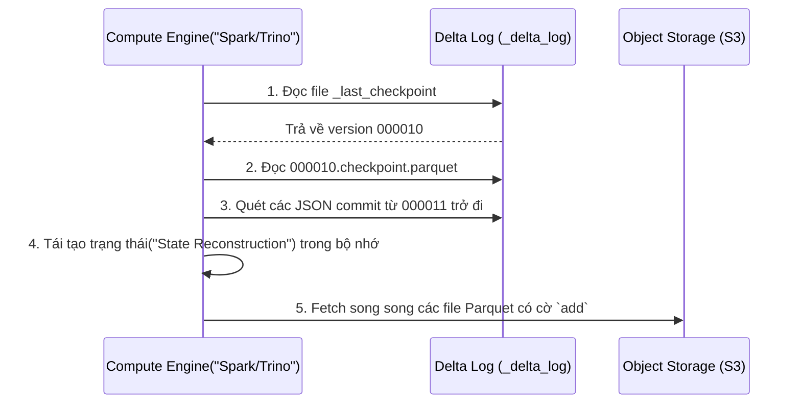

Lưu trữ dữ liệu thô (raw data) bằng Parquet hoặc CSV trên Amazon S3 hay Google Cloud Storage từng là tiêu chuẩn của Data Lake. Tuy nhiên, hệ thống này bộc lộ những tử huyệt chí mạng khi vận hành ở quy mô doanh nghiệp: Thiếu vắng giao dịch ACID dẫn đến đọc phải dữ liệu rác (partial reads) trong quá trình ghi, việc cập nhật (UPDATE/DELETE) đòi hỏi quét lại toàn bộ bucket, và hiện tượng rác metadata (Small File Problem) đánh sập hiệu năng tính toán. 

Delta Lake ra đời để giải quyết bài toán này. Về bản chất, nó biến Object Storage (S3/GCS/ADLS) thành một hệ quản trị cơ sở dữ liệu phân tán bằng cách tiêm (inject) một lớp Transaction Log ở giữa Compute Engine (Spark, Trino) và Data Files (Parquet).

---

## 1. Kiến trúc Thực thi Vật lý (Physical Execution)

Delta Lake không thay thế Parquet; nó **bao bọc (wrap)** Parquet bằng một cơ chế siêu dữ liệu (metadata) chặt chẽ. Cấu trúc vật lý của một bảng Delta được chia làm hai phần rõ rệt: Data Files và Transaction Log.

### 1.1. Giải phẫu Transaction Log (`_delta_log`)

`_delta_log` là bộ não của Delta Lake, hoạt động theo cơ chế **Write-Ahead Log (WAL)** nhưng được tối ưu cho hệ thống lưu trữ phân tán. 

Mọi thay đổi đối với bảng (INSERT, UPDATE, DELETE, đổi Schema) đều sinh ra một file JSON tuần tự gọi là **Commit**.

```text
s3://my-data-bucket/transactions_table/
├── _delta_log/
│   ├── 00000000000000000000.json
│   ├── 00000000000000000001.json
│   ├── 00000000000000000010.checkpoint.parquet
│   ├── _last_checkpoint
│   └── ...
├── part-00000-xxxx.snappy.parquet
└── part-00001-yyyy.snappy.parquet
```

- **JSON Commit Files:** Chứa mảng các hành động (Actions). Chủ yếu là `add` (thêm file Parquet mới vào bảng) và `remove` (đánh dấu xóa logic file Parquet cũ khỏi version hiện tại). 
- **Checkpoint Files:** Nếu cứ mỗi lần đọc bảng, Spark phải quét qua hàng ngàn file JSON để tìm ra file Parquet hợp lệ thì I/O sẽ trở thành nút thắt cổ chai. Do đó, cứ sau mỗi 10 commits, Delta tự động gộp (compact) trạng thái của 10 file JSON đó thành một file `.checkpoint.parquet`.
- **`_last_checkpoint`:** Trỏ đến version checkpoint mới nhất.

### 1.2. Luồng thực thi Truy vấn (Read Protocol)

Khi một Compute Engine truy vấn bảng Delta, nó không bao giờ quét trực tiếp thư mục chứa Parquet. Nó tuân thủ giao thức sau:



---

## 2. Kiểm soát Đồng thời (Concurrency Control)

Làm sao Delta Lake cho phép hàng trăm Spark jobs cùng ghi vào một bảng trên S3 mà không bị khóa (lock) toàn cục? Câu trả lời là **Optimistic Concurrency Control (OCC) - Kiểm soát đồng thời lạc quan**.

OCC giả định rằng phần lớn các giao dịch sẽ không xung đột. Thay vì khóa bảng trước khi ghi, nó cứ ghi dữ liệu ra file vật lý, rồi mới kiểm tra xung đột ở phút chót (lúc commit vào `_delta_log`).

```mermaid
flowchart TD
    A["Bắt đầu Giao dịch"] --> B["Ghi dữ liệu tính toán ra file Parquet ẩn"]
    B --> C["Giai đoạn Commit: Cố tạo file 000013.json"]
    C --> D{"Object Storage báo lỗi file đã tồn tại?"}
    D -- CÓ (Xung đột version) --> E["Kiểm tra Logic Xung đột"]
    E -- Các job ghi vào file/partition khác nhau --> F["Rebase: Đổi tên commit thành 000014.json và thử lại"]
    E -- Các job sửa cùng một file("ví dụ MERGE") --> G["Thất bại: Ném ConcurrentAppendException"]
    D -- KHÔNG("Chưa ai lấy version này") --> H["Commit thành công"]
```

**Systemic Trade-off:** 
- **Được lợi:** Throughput ghi dữ liệu khổng lồ vì không có rào cản I/O Wait do Locking.
- **Đánh đổi:** Nếu thiết kế kiến trúc để nhiều Streaming jobs cùng liên tục UPDATE vào cùng một Partition (hoặc Unpartitioned table), tỷ lệ Retry Storms sẽ tăng vọt. Các job sẽ liên tục tạo file Parquet, xung đột tại log, xóa bỏ file vừa tạo, tính toán lại và retry, gây bùng nổ chi phí Compute.

---

## 3. Tối ưu hóa I/O và Rủi ro Vận hành (Operational Risks)

### 3.1. Bài toán File Nhỏ (The Small File Problem) & Compaction

Dữ liệu streaming (như Kafka -> Spark -> Delta) cứ vài giây/phút lại tạo ra một lô Parquet vài KB. Khi số lượng file lên tới hàng triệu, quá trình "Tái tạo trạng thái" ở `_delta_log` sẽ làm sập Driver của Spark vì quá tải RAM (OOM - Out of Memory).

**Giải pháp:** Sử dụng lệnh `OPTIMIZE` để Bin-packing (gom file nhỏ thành file lớn ~1GB). Kết hợp **Z-Ordering** để sắp xếp dữ liệu phân cụm (clustering) giúp Data Skipping hoạt động hiệu quả khi truy vấn `WHERE`.

```python
# Ví dụ cấu hình thực chiến cho Job bảo trì Delta Lake định kỳ (Airflow DAG)
from pyspark.sql import SparkSession

spark = SparkSession.builder \
    .appName("Delta_Maintenance_Job") \
    .config("spark.databricks.delta.retentionDurationCheck.enabled", "false") \
    .config("spark.sql.files.maxRecordsPerFile", 1000000) \
    .getOrCreate()

# 1. Gom file và Z-Order theo 2 cột hay được filter nhất
spark.sql("OPTIMIZE s3_events_table ZORDER BY (user_id, event_date)")

# 2. Xóa vật lý các file rác (đã bị gỡ khỏi log) cũ hơn 7 ngày
spark.sql("VACUUM s3_events_table RETAIN 168 HOURS")
```

### 3.2. Real-world Incident: OOMKilled khi chạy OPTIMIZE
- **Triệu chứng:** Khi chạy `OPTIMIZE` trên một bảng Delta chưa được partition nặng 50TB, Spark Executor (hoặc Driver) liên tục báo lỗi `java.lang.OutOfMemoryError: Java heap space` và bị YARN/Kubernetes kill.
- **Root Cause (Nguyên nhân lõi):** Lệnh `OPTIMIZE` Z-Ordering đòi hỏi xáo trộn toàn cục (Global Sort/Shuffle). Nó đẩy toàn bộ dữ liệu lên bộ nhớ để sắp xếp đa chiều (Z-curve). Bảng quá to khiến Spill-to-disk không cứu nổi hoặc Shuffle Block quá lớn.
- **Cách khắc phục:** 
  1. Thay vì Z-Order toàn bộ bảng, hãy khoanh vùng: `OPTIMIZE table WHERE date > '2023-01-01' ZORDER BY (user_id)`.
  2. Bật tính năng **Liquid Clustering** (nếu dùng Databricks >= 13.3 LTS). Kỹ thuật này tự động mở rộng cụm dữ liệu phân tán (Incremental clustering) thay vì phải sắp xếp lại toàn cục như Z-Ordering cứng nhắc, giúp loại bỏ hoàn toàn các lỗi OOM khi Optimize bảng lớn.

### 3.3. Đánh đổi với Time Travel (Cost vs. History)

Delta Lake cung cấp tính năng **Time Travel**, cho phép bạn truy vấn `SELECT * FROM table TIMESTAMP AS OF '...'`. Nó làm được điều này bằng cách không xóa vật lý (hard-delete) các file Parquet cũ khi chạy `UPDATE`/`DELETE`, mà chỉ ghi vào JSON log là file đó đã bị `remove`.

- **Trade-off:** Giữ lịch sử càng dài, chi phí lưu trữ S3/GCS càng phình to chóng mặt (Storage Inflation). Bạn không bao giờ nên coi Delta Lake là một hệ thống sao lưu dài hạn.
- **Thực hành tốt:** Luôn lên lịch chạy lệnh `VACUUM` thường xuyên (mặc định giữ lại 7 ngày). Tuy nhiên, hãy nhớ: **Một khi đã VACUUM, bạn không thể Time Travel về trước thời điểm đó nữa.**

---

## 4. Xử lý CDC với Delta Lake (Change Data Capture)

Để đồng bộ dữ liệu từ OLTP (PostgreSQL, MySQL) lên Delta Lake qua Debezium/Kafka, bạn thường dùng câu lệnh `MERGE` (SCD Type 1 hoặc Type 2). Dưới đây là kiến trúc mã thực thi Spark SQL tối ưu để Upsert dữ liệu, hạn chế ghi đè lại dữ liệu nếu không thay đổi:

```sql
MERGE INTO target_delta_table AS T
USING cdc_stream_updates AS S
ON T.user_id = S.user_id 
-- Tối ưu: Thêm điều kiện Partition Pruning để tránh quét toàn bảng
AND T.event_date = S.event_date 
WHEN MATCHED AND (T.email != S.email OR T.status != S.status) THEN 
  UPDATE SET 
    T.email = S.email, 
    T.status = S.status,
    T.updated_at = current_timestamp()
WHEN NOT MATCHED THEN 
  INSERT (user_id, email, status, event_date, updated_at) 
  VALUES (S.user_id, S.email, S.status, S.event_date, current_timestamp());
```

*Lưu ý kiến trúc:* Mệnh đề `AND T.event_date = S.event_date` là một kỹ thuật sống còn (Partition Pruning trong Merge). Nếu bạn chỉ JOIN bằng khóa chính (`user_id`), Delta Lake sẽ phải tải metadata của toàn bộ bảng (có thể hàng vạn Parquet files) để tìm `user_id`. Bằng cách giới hạn thời gian (hoặc partition key), Engine chỉ quét một vài file cụ thể, giảm I/O xuống hàng trăm lần.

---

## Nguồn Tham Khảo (References)

1. **Databricks Engineering Blog:** [Delta Lake: High-Performance ACID Table Storage over Cloud Object Stores (VLDB Paper)](https://www.databricks.com/wp-content/uploads/2020/08/p975-armbrust.pdf) - Báo cáo khoa học phân tích kiến trúc của `_delta_log` và cơ chế giải quyết xung đột trên S3.
2. **Delta Lake Official Documentation:** [Concurrency Control](https://docs.delta.io/latest/concurrency-control.html) - Giải thích chi tiết về Optimistic Concurrency Control và các loại Exception khi ghi đè file.
3. **AWS Architecture Blog:** [Build a Data Lakehouse on AWS](https://aws.amazon.com/blogs/architecture/build-a-data-lakehouse-on-aws/) - Ứng dụng Open Table Format trên hạ tầng đám mây.
4. **Kleppmann, M. (2017).** *Designing Data-Intensive Applications*. O'Reilly Media - Chương 3 & 7 (Tham chiếu lý thuyết nền tảng cho Write-Ahead Log và ACID trên hệ thống phân tán).
