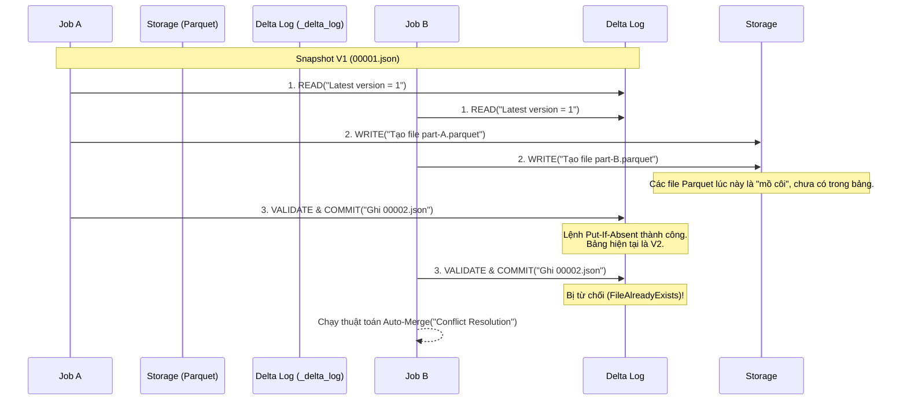

Khi chuyển dịch từ Data Warehouse (RDBMS) sang kiến trúc Data Lakehouse, một trong những thách thức lớn nhất là vấn đề **Concurrency (Đồng thời)**. Các hệ thống Object Storage (như Amazon S3, ADLS Gen2) vốn được thiết kế cho thao tác *append-only* và không hề có khái niệm "Row-level lock" hay "Table lock" như PostgreSQL hay MySQL. 

Vậy, điều gì xảy ra nếu có hai job Spark cùng lúc chạy lệnh `UPDATE` hoặc `MERGE INTO` trên cùng một bảng Delta Lake? Để đảm bảo tính ACID, Delta Lake sử dụng cơ chế **Optimistic Concurrency Control (OCC - Kiểm soát đồng thời lạc quan)**. 

Bài viết này mổ xẻ cách OCC hoạt động ở tầng vật lý, sự đánh đổi hệ thống (trade-offs) và các "tai nạn" thường gặp (Operational Risks) khi vận hành ở quy mô lớn.

---

## 1. Physical Execution của OCC

Thay vì sử dụng phương pháp **Pessimistic Locking** (Khóa bi quan - chặn ngay từ đầu, khiến toàn bộ pipeline phải đứng đợi như trong RDBMS truyền thống gây thắt cổ chai throughput), Delta Lake sử dụng **Optimistic Concurrency Control**. 

Nguyên lý cơ bản: *Cứ để tất cả các job cùng đọc và xử lý tính toán song song. Xung đột chỉ được kiểm tra ở khoảnh khắc "commit" cuối cùng vào Transaction Log.*

Mọi giao dịch ghi trong Delta Lake đều trải qua 3 pha (3-Phase Protocol):



1. **READ (Đọc Snapshot):** Giao dịch đọc phiên bản mới nhất của bảng (ví dụ: `000001.json`). Nó lấy danh sách các file dữ liệu mà nó cần đọc. Hệ thống ghi nhận (record) snapshot `V1`.
2. **WRITE (Ghi Dữ liệu):** Job (ví dụ Spark) tiến hành xử lý phân tán và đẩy các file `.parquet` mới lên Storage. Ở bước này, dữ liệu đã nằm trên S3/ADLS nhưng *tuyệt đối vô hình* với người dùng vì chưa có commit log nào ghi nhận chúng. (Tốn chi phí Compute và Storage IO).
3. **VALIDATE & COMMIT (Xác nhận & Ghi Log):** Job cố gắng đẩy một file log mới `000002.json` vào thư mục `_delta_log`. 
   - Nếu thành công, giao dịch hoàn tất.
   - Nếu file `000002.json` đã tồn tại (do một Job khác nhanh tay hơn), Delta Lake sẽ ném ra lỗi xung đột và bước vào pha **Conflict Resolution**.

---

## 2. Atomic Commit trên Các Nền Tảng Lưu Trữ Khác Nhau

Sự thành bại của OCC phụ thuộc 100% vào khả năng hệ thống lưu trữ có hỗ trợ **Atomic Commit** (Ghi nguyên tử) hay không. Delta Lake dựa vào tính năng `Put-If-Absent` (Chỉ tạo file nếu file đó chưa tồn tại).

- **Azure Data Lake Storage (ADLS Gen2) & HDFS:** Có hỗ trợ Atomic Rename hoặc các cơ chế tạo file nguyên tử một cách tự nhiên.
- **Google Cloud Storage (GCS):** Sử dụng *Precondition checks* (Ví dụ: `If-Generation-Match: 0`) để đảm bảo không ai ghi đè lên file log đang được tạo.
- **Amazon S3:** Trong quá khứ, S3 chỉ có mô hình *Eventual Consistency* và thiếu thao tác `Put-If-Absent`. Các team Data Engineer thường phải dựng một bảng Amazon DynamoDB (`LogStore`) làm cơ chế Locking riêng để phối hợp các ghi chép Delta Log. Từ khi S3 bổ sung tính năng **Conditional Writes (PutObject kèm điều kiện)** và *Strong Consistency*, Delta Lake đã được tái cấu trúc để sử dụng trực tiếp S3 mà không cần DynamoDB (giảm đáng kể chi phí vận hành - FinOps).

---

## 3. Conflict Resolution: Cơ chế Auto-Merge và Các Exceptions

Khi hai Job cùng cố gắng ghi log `000002.json`, Job chậm chân hơn sẽ bị Storage từ chối. Thay vì ném lỗi (crash pipeline) ngay lập tức, thuật toán của Delta sẽ tự động kiểm tra xem những thay đổi có mâu thuẫn hay không.

### 3.1. Logical Auto-Merge (Gộp Tự Động)

Nếu Job B bị lỗi, nó sẽ tự đọc file log `000002.json` mà Job A vừa tạo ra và thực hiện **Compatibility Check**:
- *Kịch bản 1:* Job A `INSERT` dữ liệu. Job B cũng `INSERT`. Hai Job ghi vào 2 file Parquet độc lập. **(Tương thích)**.
- *Kịch bản 2:* Job A cập nhật dữ liệu của user ở `Country='US'`. Job B cập nhật user ở `Country='UK'` (khác Partition). **(Tương thích)**.

Lúc này, Delta Lake sẽ tự động gộp sự thay đổi và thử commit lại lần nữa ở log `000003.json`. Quá trình diễn ra trong tích tắc và trong suốt (transparent) với người dùng.

### 3.2. Operational Exceptions (Khi Auto-Merge Thất Bại)

Nếu sự mâu thuẫn xảy ra trên cùng một tập file (Ví dụ: Cùng UPDATE lên cùng 1 file Parquet), Delta Lake bắt buộc phải hủy toàn bộ Job B và ném ra Exception để bảo vệ tính nhất quán.

* **`ConcurrentAppendException`**: Job A `OVERWRITE` hoặc xóa một partition, trong khi Job B đang cố `INSERT` vào partition đó.
* **`ConcurrentDeleteReadException`**: Xảy ra cực kỳ phổ biến trong các kiến trúc Lambda/Kappa khi chạy `MERGE INTO`. Job A vừa `DELETE` một file, nhưng Job B lại đang quét chính file đó để tính toán.
* **`MetadataChangedException`**: Job A thay đổi Schema (ALTER TABLE ADD COLUMN) trong khi Job B vẫn chạy với schema cũ.
* **`ConcurrentDeleteDeleteException`**: Cả hai cùng `DELETE` một tập file giống hệt nhau.

---

## 4. Xóa Bỏ False Positives bằng Row-Level Concurrency

Một điểm yếu chết người của OCC truyền thống là nó khóa ở **cấp độ File (File-level isolation)**. 
Nếu một file Parquet có 1 triệu dòng, và Job A chỉ `UPDATE` dòng 1, Job B chỉ `UPDATE` dòng 1,000,000. Dù về mặt business (logic) hai Job không dẫm chân lên nhau, nhưng về mặt vật lý, cả hai Job đều sinh ra phiên bản mới của cùng 1 file Parquet $\rightarrow$ Dẫn đến **False Positive Conflict** và ném lỗi `ConcurrentUpdateException`.

Để giải quyết vấn đề này, các phiên bản mới của Delta Lake (Databricks) giới thiệu **Deletion Vectors** và **Liquid Clustering**.

```sql
-- Kích hoạt Deletion Vectors (Phiên bản Databricks Runtime 14.1+)
ALTER TABLE events SET TBLPROPERTIES ('delta.enableDeletionVectors' = true);
```

**Cách hoạt động của Deletion Vectors:**
Thay vì phải chép lại toàn bộ file Parquet sang 1 file mới khi có 1 dòng bị thay đổi, Delta Lake tạo ra một file siêu nhỏ (`.bin`) gọi là Deletion Vector. File này hoạt động giống như một Tombstone bitmap, đánh dấu *chỉ mục (index)* của dòng bị xóa/cập nhật. Nhờ đó, Delta Lake chuyển từ File-level concurrency sang **Row-level concurrency**. Hai Job hoàn toàn có thể cập nhật cùng 1 file Parquet, miễn là chúng không sửa cùng một dòng.

---

## 5. Rủi Ro Vận Hành (Operational Risks) & System Trade-offs

Dù OCC có tốt đến đâu, việc lạm dụng nó trong kiến trúc Data Engineering sẽ dẫn đến thảm họa.

### 5.1. The "Retry Storm" (Bão thử lại)
Khi Job B gặp lỗi xung đột, hầu hết các Data Engineer sẽ cấu hình `Task Retry` trong Airflow. Nhưng ở bước 2 của OCC (phần WRITE), Job phải tính toán và tạo lại file Parquet. Nếu bạn có 50 pipeline chạy đồng thời, chúng sẽ liên tục đánh nhau, liên tục fail, và liên tục kích hoạt lại bước WRITE.
$\rightarrow$ Hậu quả: Tiêu tốn cực kỳ nhiều Compute Cost (Tiền thuê Cloud) nhưng dữ liệu thì vẫn không thể ghi thành công, dẫn đến **Job Starvation**.

**Cách khắc phục:** 
* Sử dụng thuật toán **Exponential Backoff with Jitter** (Lùi bước theo cấp số nhân kèm độ nhiễu) khi cấu hình Retry.
* Không bao giờ nên cấu hình số lần retries vượt quá 3 lần với các lỗi Concurrency.

### 5.2. Micro-batching thay vì Single-Row Updates
Data Lake (S3, GCS) không phải là cơ sở dữ liệu OLTP (như PostgreSQL). Bạn không thể cho 1000 message từ Kafka đập thẳng `MERGE INTO` vào Delta Table mỗi giây, nếu không hệ thống sẽ sập vì tràn ngập file log (Metadata Overhead) và Lock Contention.

**Kiến trúc đúng:**
* Gom dữ liệu (Micro-batching) vào một lớp Staging/Bronze.
* Dùng Spark Structured Streaming hoặc Databricks Auto Loader chạy `MERGE INTO` theo từng batch 1 phút/lần hoặc 5 phút/lần.
* Tổ chức các pipeline theo chiều dọc (Vertical separation): Tách biệt các Job cập nhật dựa trên thời gian hoặc khu vực (Partitioning) để tránh việc chúng chạm chung vào một tập hợp File.

### 5.3. Tối ưu hóa định kỳ (OPTIMIZE vs Writes)
May mắn là nhờ Snapshot Isolation (MVCC) và cấu trúc của OCC, thao tác gom file nhỏ thành file lớn (Compaction/`OPTIMIZE`) chạy hoàn toàn độc lập và không bao giờ cản trở hoặc lock các pipeline đang `INSERT/UPDATE` dữ liệu. Đây là một lợi thế tuyệt đối của Delta Lake so với các hệ thống Hadoop/Hive truyền thống.

---

## Tài Liệu Tham Khảo

* [Databricks: Concurrency Control in Delta Lake](https://docs.delta.io/latest/concurrency-control.html)
* [Databricks: What is Deletion Vectors in Delta Lake?](https://docs.databricks.com/en/delta/deletion-vectors.html)
* [Amazon S3 Conditional Writes](https://aws.amazon.com/about-aws/whats-new/2024/08/amazon-s3-conditional-writes/)
* Kleppmann, M. (2017). *Designing Data-Intensive Applications: The Big Ideas Behind Reliable, Scalable, and Maintainable Systems.* O'Reilly Media. (Chapter 7: Transactions & OCC).

