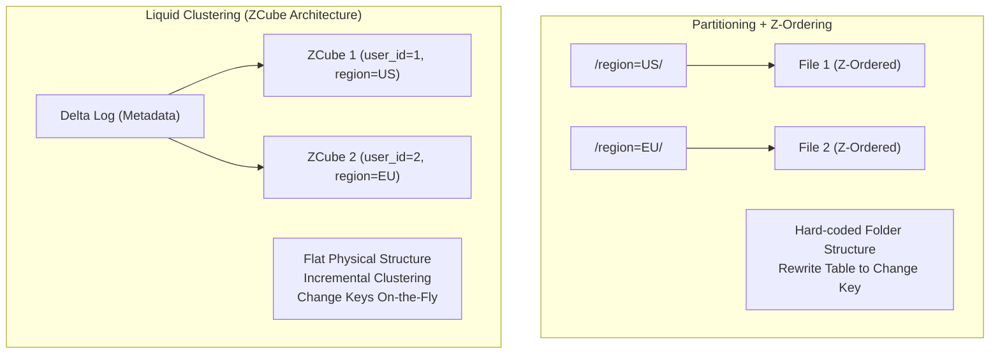

Hiệu năng của hệ thống Data Lakehouse có thể suy giảm nghiêm trọng dù tổng lượng dữ liệu không tăng đáng kể. Vấn đề này thường bắt nguồn từ hai yếu tố vật lý cơ bản nhất của kiến trúc phân tán: **Small Files Syndrome** (Hội chứng tệp siêu nhỏ) và **Tombstone Accumulation** (Tích tụ rác lịch sử trong Transaction Log).

Trong môi trường Production, việc vận hành hiệu quả hai công cụ `OPTIMIZE` (Chống phân mảnh) và `VACUUM` (Thu gom rác) là yêu cầu bắt buộc đối với một **Staff Data Engineer** để duy trì chi phí I/O ở mức tối ưu. 

---

## 1. Bản chất Vật lý của "Small Files Syndrome" & I/O Bottleneck

Trong luồng Streaming Ingestion hoặc Micro-batching liên tục, Spark Workers liên tục flush xuống Object Storage (S3, GCS) các tệp Parquet có dung lượng cực nhỏ (chỉ vài chục Kilobyte).

Sự tích tụ này tạo ra hai nút thắt cổ chai (Bottlenecks) chết người:
1.  **I/O Overhead cực lớn:** Để đọc một file Parquet, Spark phải mở (Open) kết nối mạng TCP, đọc Metadata (Header/Footer), rồi mới đọc nội dung thực sự. Khi quét 100,000 file 10KB, thời gian metadata lấn át hoàn toàn thời gian xử lý dữ liệu.
2.  **Delta Log Bloat (Phình to Transaction Log):** Khi Spark Driver cố gắng đọc metadata của hàng vạn file vào bộ nhớ để lên kế hoạch thực thi (Query Planning), nó dễ dàng bị tràn RAM (`Spill-to-disk`) hoặc crash với lỗi **JVM OOMKilled**.

---

## 2. Kiến trúc Thực thi Vật lý: Từ Z-Ordering đến Liquid Clustering

### 2.1. Nỗi đau của Partitioning và Z-Ordering
Kiến trúc truyền thống sử dụng `PARTITIONED BY` chia dữ liệu thành các thư mục vật lý (ví dụ `/year=2023/month=01/`). Khi truy vấn cột không nằm trong Partition Key, hệ thống vẫn phải quét toàn bảng (Full Scan).
Giải pháp cũ là **Z-Ordering**: Gộp file (`OPTIMIZE`) và sắp xếp dữ liệu (Sort) theo đường cong Z-Curve để các dữ liệu liên quan nằm cạnh nhau.

**Systemic Trade-off (Z-Ordering):** 
Z-Ordering đòi hỏi **Network Shuffle** và **Global Sort** toàn bộ dữ liệu. Đây là thao tác tiêu tốn Memory và CPU cực lớn (Write-heavy). Hơn nữa, nó không linh hoạt: nếu bạn đổi chiến lược Z-Order, bạn phải Rewrite lại toàn bộ bảng.

### 2.2. Liquid Clustering (The Modern Standard)
Databricks giới thiệu **Liquid Clustering** để thay thế hoàn toàn Partitioning cứng nhắc và Z-Ordering. Nó sử dụng cấu trúc **ZCubes** (Metadata-managed groupings) để nhóm file một cách thông minh mà không bị khóa vào cấu trúc thư mục.



**Thực chiến (Code):**
```sql
-- Tạo bảng với Liquid Clustering, không còn PARTITIONED BY
CREATE TABLE prod.finance.transactions (
  transaction_id STRING,
  user_id STRING,
  region_id STRING,
  amount DECIMAL(18,2),
  transaction_date DATE
) USING DELTA
CLUSTER BY (region_id, transaction_date); -- Cột thường dùng trong Filter/Join

-- Đổi chiến lược Cluster bất cứ lúc nào (Chỉ tác động data tương lai)
ALTER TABLE prod.finance.transactions CLUSTER BY (user_id, region_id);

-- Hệ thống tự động thực hiện Incremental Clustering, chỉ động vào file chưa tối ưu
OPTIMIZE prod.finance.transactions;
```

---

## 3. VACUUM: Dọn dẹp Tombstones & FinOps Trap

**Sự thật về Storage Cost:** Lệnh `OPTIMIZE` **KHÔNG xóa file vật lý cũ**. 
Nhờ cơ chế MVCC, `OPTIMIZE` tạo ra file 1GB mới và ghi vào Delta Log một thao tác: *"Đánh dấu các file vụn 10KB là Đã xóa logic (Tombstones)"*. Hậu quả: Sau khi chạy `OPTIMIZE`, dung lượng S3 của bạn sẽ **TĂNG LÊN**.

Để giải phóng dung lượng vật lý (FinOps), bạn phải gọi `VACUUM`. Quá trình này quét Delta Log, tìm các file Tombstones cũ hơn một khoảng Retention Period (mặc định 7 ngày - 168 giờ) và thực hiện **Hard Delete**.

### 3.1. The "7-Day Rule" Trade-off [Safety vs. Storage Cost]
Tại sao Databricks thiết lập mặc định Retention là 7 ngày? Đó là sự đánh đổi giữa **Chi phí Lưu trữ** và **Khả năng chịu lỗi / Time Travel**.

> [!CAUTION] 
> **Incident: FileNotFoundException & Job Crash dây chuyền**
> Nếu bạn chạy `VACUUM events RETAIN 0 HOURS` để xóa sạch rác. Cùng lúc đó, một Pipeline ML cực lớn đã chạy được 10 tiếng, vô tình cần đọc tới một file mà bạn vừa ép xóa. Pipeline ML lập tức văng lỗi `FileNotFoundException` và sập toàn bộ hệ thống. Xóa Time Travel history cũng có thể vi phạm các quy định Audit.

```sql
-- Lệnh chuẩn mực dọn dẹp hệ thống [An toàn]
VACUUM prod.finance.transactions RETAIN 168 HOURS;
```

---

## 4. Cấu hình Vận hành Nâng cao (Staff-level Tuning)

Với các bảng dữ liệu quy mô Petabyte, các thiết lập mặc định sẽ bộc lộ yếu điểm.

### 4.1. Vacuum Parallel Delete
Mặc định, `VACUUM` chạy single-threaded trên Driver node. Nếu bảng có hàng triệu tệp Tombstones, Driver sẽ chạy rất chậm và dễ timeout. Bật cờ này để phân phối lệnh xóa (delete commands) cho tất cả các Worker nodes:
```text
SET spark.databricks.delta.vacuum.parallelDelete.enabled = true;
```

### 4.2. Điều chỉnh kích thước File mục tiêu của OPTIMIZE
Mặc định Delta Lake nhắm mục tiêu 1GB/tệp. Nếu hệ thống downstream của bạn (ví dụ Serverless Trino) cần đọc song song cực lớn bằng nhiều worker siêu nhỏ, file 1GB tạo ra sự mất cân bằng. Bạn có thể hạ xuống 128MB:
```sql
ALTER TABLE prod.finance.transactions SET TBLPROPERTIES (
  'delta.targetFileSize' = '134217728' -- 128 MB
);
```

### 4.3. Tự động hóa: Predictive Optimization
Thay vì tự viết DAG trên Airflow để canh giờ chạy `OPTIMIZE` và `VACUUM`, Data Lakehouse hiện đại cung cấp **Predictive Optimization** (trên Unity Catalog). Engine sẽ liên tục phân tích Delta Log ngầm, đo đạc mức độ phân mảnh, dự đoán Query Pattern và tự kích hoạt các background tasks vào lúc Cloud rảnh rỗi.
```sql
ALTER TABLE main.default.events ENABLE PREDICTIVE OPTIMIZATION;
```

---

## Nguồn Tham Khảo

1.  [Databricks Official Docs: Liquid Clustering][https://docs.databricks.com/en/tables/clustering.html]
2.  [Optimize and Z-Order Performance][https://docs.databricks.com/en/delta/optimize.html]
3.  [Vacuum functionality and Delta Lake retention](https://docs.databricks.com/en/delta/vacuum.html]