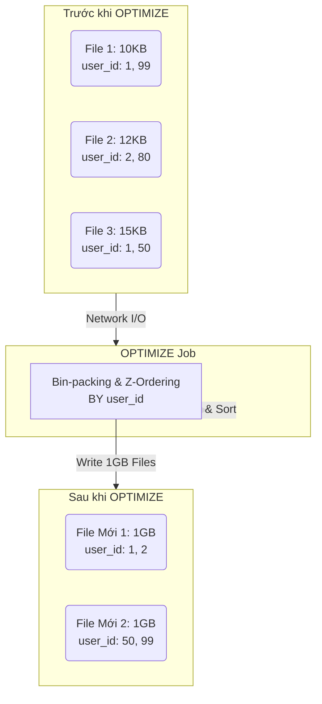
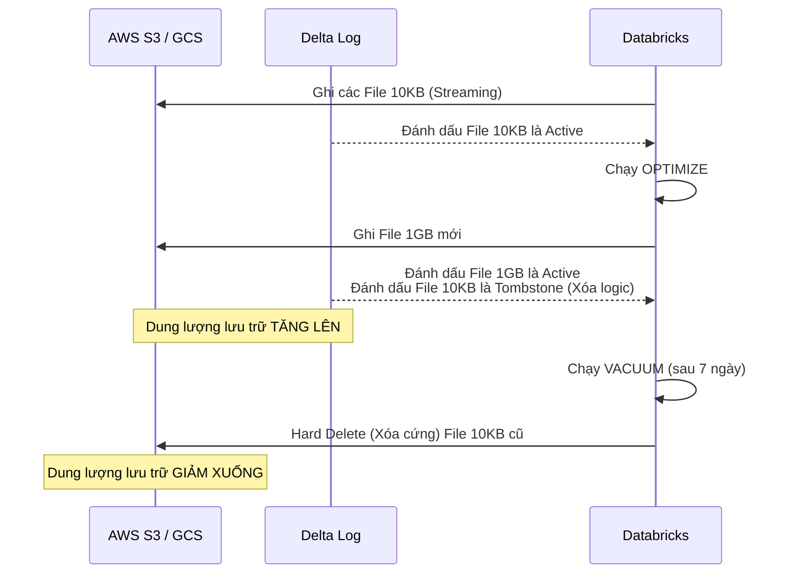

Hiệu năng của hệ thống Data Lakehouse có thể suy giảm nghiêm trọng dù tổng lượng dữ liệu không tăng đáng kể. Vấn đề này thường bắt nguồn từ hai yếu tố vật lý cơ bản nhất của kiến trúc phân tán: **Small Files Syndrome** (Hội chứng tệp siêu nhỏ) và **Tombstone Accumulation** (Tích tụ rác lịch sử trong Transaction Log).

Trong môi trường Production, việc vận hành hiệu quả hai công cụ `OPTIMIZE` (Chống phân mảnh) và `VACUUM` (Thu gom rác) là yêu cầu bắt buộc đối với Staff Data Engineer để duy trì chi phí I/O (Input/Output) ở mức tối ưu. 

---

## 1. Bản chất Vật lý của "Small Files Syndrome" & I/O Bottleneck

Trong luồng Streaming Ingestion hoặc Micro-batching liên tục (ví dụ: chạy Spark Structured Streaming mỗi 1 phút), Spark Workers liên tục flush xuống Object Storage (S3, GCS) các tệp Parquet có dung lượng cực nhỏ (chỉ vài chục Kilobyte).

Sự tích tụ này tạo ra hai nút thắt cổ chai (Bottlenecks) chết người:
1. **I/O Overhead cực lớn:** Để đọc một file Parquet, Spark phải mở (Open) kết nối mạng, đọc Metadata (Header/Footer), rồi mới đọc nội dung thực sự. Khi quét 100,000 file 10KB, thời gian tạo kết nối TCP và mở file áp đảo hoàn toàn thời gian xử lý dữ liệu.
2. **Delta Log Bloat (Phình to Transaction Log):** Delta Lake theo dõi mọi file bằng thư mục `_delta_log/`. Càng nhiều file, Delta Log càng lớn. Khi Spark Driver cố gắng đọc metadata của hàng vạn file vào bộ nhớ để lên kế hoạch thực thi (Query Planning), nó dễ dàng bị tràn RAM (`Spill-to-disk`) hoặc thậm chí crash với lỗi `java.lang.OutOfMemoryError: Java heap space` (OOMKilled).

---

## 2. Kiến trúc Thực thi Vật lý: OPTIMIZE & Z-Ordering

`OPTIMIZE` không đơn thuần là lệnh gom file. Phía sau nó là một Spark Job chạy thuật toán **Bin-packing** (Đóng thùng) hạng nặng và tổ chức lại dữ liệu (Data Skipping).

### 2.1. Bin-Packing (Thuật toán Đóng thùng)
Hệ thống tải các file vụn từ S3 vào bộ nhớ của Spark Workers, thực hiện trộn (Shuffle) và ghi ra các tệp Parquet mới với kích thước tối ưu (Databricks mặc định nhắm mục tiêu 1GB/tệp).

### 2.2. Z-Ordering (Tối ưu hóa đa chiều)
Nếu dữ liệu chỉ được gộp to ra thì khi filter `WHERE user_id = 'A'`, Spark vẫn phải quét qua file 1GB đó. **Z-Ordering** giải quyết bài toán này bằng cách sắp xếp (sort) lại dữ liệu bên trong các file Parquet theo một hoặc nhiều cột, tạo ra các khối dữ liệu liền kề (Colocated) mang giá trị giống nhau. Nhờ vậy, Spark có thể đọc Parquet min/max statistics (Data Skipping) và bỏ qua toàn bộ file không chứa `user_id = 'A'`.



**Thực thi SQL:**
```sql
-- Chạy gộp tệp & sắp xếp theo user_id, giới hạn ở những phân vùng mới (Tiết kiệm Compute)
OPTIMIZE events 
WHERE date >= current_date() - INTERVAL 1 DAY
ZORDER BY (user_id);
```

### 2.3. Liquid Clustering (The Modern Replacement)
Z-Ordering bộc lộ điểm yếu lớn: Khi truy vấn thay đổi, bạn không thể thay đổi cột Z-Order mà không phải viết lại (rewrite) toàn bộ dữ liệu lịch sử.

Để khắc phục, Databricks giới thiệu **Liquid Clustering**. Liquid Clustering thay thế hoàn toàn Partitioning truyền thống và Z-Ordering. Nó hoạt động liên tục (incremental), tự động điều chỉnh layout khi có dữ liệu mới tới mà không cần chạy job `OPTIMIZE` toàn bảng đắt đỏ.

```sql
-- Tạo bảng với Liquid Clustering
CREATE TABLE events (
  id STRING,
  user_id STRING,
  event_name STRING,
  ts TIMESTAMP
) USING DELTA
CLUSTER BY (user_id, event_name);

-- Tự động tối ưu layout
OPTIMIZE events;
```

---

## 3. VACUUM: Dọn dẹp Tombstones & Giải phóng Storage

**Sự thật về Storage Cost:** Lệnh `OPTIMIZE` **KHÔNG xóa file vật lý cũ**. 
Nhờ cơ chế MVCC (Multi-Version Concurrency Control), `OPTIMIZE` chỉ tạo ra file Parquet mới (1GB) và ghi vào Delta Log một thao tác: *"Đánh dấu các file vụn 10KB là Đã xóa logic (Tombstones)"*. 
Hậu quả: Sau khi chạy `OPTIMIZE`, dung lượng S3/GCS của bạn sẽ **TĂNG LÊN** chứ không giảm.

Để giải phóng dung lượng vật lý, bạn phải gọi `VACUUM`. Quá trình này quét Delta Log, tìm các file Tombstones cũ hơn một khoảng Retention Period (mặc định 7 ngày) và thực hiện **Hard Delete** khỏi Object Storage.



**Thực thi SQL:**
```sql
-- Dọn dẹp Tombstones cũ hơn 7 ngày (An toàn tuyệt đối)
VACUUM events;
```

---

## 4. Systemic Trade-offs & Real-world Incidents

### The "7-Day Rule" Trade-off (Safety vs. Storage Cost)
Tại sao Databricks thiết lập mặc định Retention của VACUUM là 7 ngày (168 giờ)? 
Đó là sự đánh đổi giữa **Lưu trữ** và **Khả năng chịu lỗi / Time Travel**.

> [!WARNING] 
> **Incident: FileNotFoundException & Job Crash dây chuyền**
> Bạn thấy bill S3 quá cao, quyết định chạy `VACUUM events RETAIN 0 HOURS` để xóa sạch file rác ngay lập tức. Cùng lúc đó, một Pipeline ML cực lớn đã chạy được 10 tiếng, đang đọc chậm rãi từng chunk dữ liệu, vô tình cần đọc tới một file mà bạn vừa ép xóa. Pipeline ML lập tức văng lỗi `FileNotFoundException` và sập toàn bộ hệ thống. 

Databricks chủ động ném lỗi nếu bạn set Retention dưới 168 giờ để làm "Khóa An Toàn". Để bypass (cực kỳ nguy hiểm, chỉ dùng trong môi trường Dev/Test), bạn phải can thiệp cấu hình JVM:
```text
SET spark.databricks.delta.retentionDurationCheck.enabled = false;
VACUUM events RETAIN 0 HOURS;
```

### Z-Ordering Compute Overhead
Z-Ordering đòi hỏi **Shuffle** và **Sort** toàn bộ dữ liệu theo các cột chỉ định. Đây là thao tác tiêu tốn Memory và CPU cực lớn.
* **Trade-off:** Bạn đổi Compute Cost (phải cấp Cluster to để chạy `OPTIMIZE ZORDER`) lấy Query Cost (các truy vấn `SELECT` sau này chạy siêu nhanh).
* **Best Practice:** Đừng bao giờ Z-Order trên các cột có High-Cardinality (quá nhiều giá trị Unique như `uuid`) hoặc nhiều hơn 3-4 cột. Thuật toán Z-Order sẽ bị pha loãng (diluted) và mất tác dụng Data Skipping, trong khi job `OPTIMIZE` vẫn tiêu tốn hàng ngàn đô la tiền Compute.

---

## 5. Cấu hình Vận hành Nâng cao (Advanced Configurations)

Với các bảng dữ liệu quy mô hàng trăm Terabyte, các thiết lập mặc định sẽ mất nhiều giờ để hoàn thành. Bạn có thể sử dụng các cờ (flags) dưới đây để phân bổ thêm tài nguyên:

### Vacuum Parallel Delete
Mặc định, `VACUUM` chỉ chạy single-threaded (một luồng duy nhất trên Driver node). Nếu bảng có hàng triệu tệp Tombstones, Driver sẽ chạy rất chậm và dễ bị timeout. Bật cờ này để phân phối lệnh xóa (delete commands) cho tất cả các Worker nodes:
```text
SET spark.databricks.delta.vacuum.parallelDelete.enabled = true;
```

### Điều chỉnh kích thước File mục tiêu của OPTIMIZE
Mặc định Delta Lake nhắm mục tiêu 1GB/tệp. Tuy nhiên, nếu luồng xử lý downstream của bạn cần đọc song song cực lớn (nhiều executor nhỏ), file 1GB có thể là quá to. Bạn có thể hạ xuống 128MB hoặc 256MB:
```sql
ALTER TABLE events SET TBLPROPERTIES (
  'delta.targetFileSize' = '134217728' -- 128 MB
);
```

### Predictive Optimization (Giải pháp Tự động hóa)
Thay vì tự viết DAG trên Airflow để canh giờ chạy `OPTIMIZE` và `VACUUM`, Databricks hiện đại khuyến nghị giao phó cho **Predictive Optimization** (chỉ có trên Unity Catalog). Engine sẽ liên tục phân tích Delta Log ngầm, đo đạc mức độ phân mảnh, dự đoán Query Pattern và tự kích hoạt các background tasks vào thời điểm hệ thống rảnh rỗi nhất.

```sql
-- Bật Predictive Optimization ở mức Bảng
ALTER TABLE main.default.events ENABLE PREDICTIVE OPTIMIZATION;
```

---

## Nguồn Tham Khảo (References)

* [Databricks Official Docs: Optimize data file layout](https://docs.databricks.com/en/delta/optimize.html)
* [Databricks Official Docs: Vacuum unused data files](https://docs.databricks.com/en/delta/vacuum.html)
* [Databricks Blog: Predictive Optimization for Delta Lake](https://www.databricks.com/blog/predictive-optimization-delta-lake)
* [Databricks Official Docs: Liquid Clustering](https://docs.databricks.com/en/delta/clustering.html)
