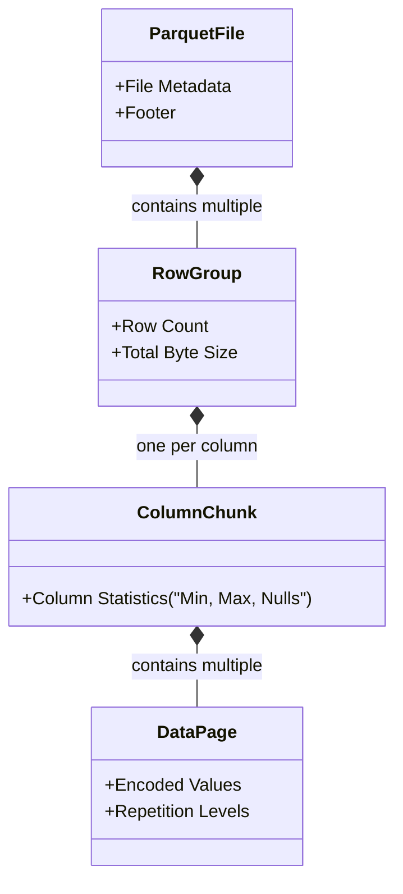

Trong hệ thống dữ liệu quy mô lớn (Data-Intensive Applications), việc chọn định dạng file không chỉ dừng ở câu chuyện "đọc nhanh hay ghi nhanh". Nó quyết định kiến trúc của toàn bộ luồng I/O (Input/Output), chi phí quét đĩa cứng, và lượng RAM mà các worker node (Spark/Trino) sẽ ngốn. Chọn sai định dạng lưu trữ có thể dẫn đến hiện tượng **Spill-to-disk**, **OOMKilled** (Out of Memory), hoặc đẩy hóa đơn AWS S3 API/Athena của bạn tăng lên gấp hàng chục lần.

Bài viết này mổ xẻ cấu trúc vật lý (Physical Execution) dưới đĩa cứng của các định dạng Row-based và Columnar, cùng với các rủi ro vận hành.

---

## 1. Kiến trúc Thực thi Vật lý: Row-based vs Columnar

Thay vì hiểu một cách trừu tượng, hãy nhìn vào cách CPU và đĩa cứng xử lý dữ liệu.

### Row-based Storage (Lưu trữ theo dòng)
Dữ liệu của một bản ghi được ghi tuần tự và liền kề nhau trên đĩa.
* **Đại diện:** CSV, JSON, Apache Avro.
* **Đánh đổi hệ thống (Trade-offs):**
  * **Tối ưu cho Write-heavy:** Ghi cực nhanh vì thao tác ghi là **Append-only** (ghi nối tiếp vào cuối block đĩa). Không mất chi phí CPU để gom nhóm và nén.
  * **Thảm họa cho OLAP (Analytical):** Nếu bảng có 100 cột và bạn thực thi `SELECT SUM(salary) FROM table`, ổ cứng vật lý vẫn phải quét qua (Scan) và nạp toàn bộ 100 cột vào RAM. Gây ra hiện tượng **I/O Bottleneck** và lãng phí băng thông mạng.

### Columnar Storage (Lưu trữ theo cột)
Dữ liệu của các cột giống nhau được nhóm lại và lưu liền kề.
* **Đại diện:** Apache Parquet, Apache ORC.
* **Đánh đổi hệ thống (Trade-offs):**
  * **Tối ưu cho Read-heavy:** Hỗ trợ **Projection Pushdown** (chỉ đọc đúng cột cần thiết từ đĩa) và **Predicate Pushdown** (lọc dữ liệu ngay từ tầng đĩa cứng thông qua Metadata).
  * **Chi phí ghi (Write-penalty) lớn:** Để ghi một dòng mới, hệ thống phải buffer (đệm) dữ liệu vào RAM cho đến khi đủ lớn (ví dụ 128MB cho một Row Group), sau đó tiến hành chuyển vị (transpose) thành các cột, chạy thuật toán nén, rồi mới xả (flush) xuống đĩa. Quá trình này ngốn rất nhiều CPU và RAM.

```mermaid
graph TD
    subgraph Row_Based ["Row-based("CSV/Avro")"]
        R1["Row 1: [ID_1, Name_1, Age_1]"] --> R2["Row 2: [ID_2, Name_2, Age_2]"]
        R2 --> R3["Row 3: [ID_3, Name_3, Age_3]"]
    end

    subgraph Columnar ["Columnar("Parquet/ORC")"]
        C1["Column ID: [ID_1, ID_2, ID_3]"] --> C2["Column Name: [Name_1, Name_2, Name_3]"]
        C2 --> C3["Column Age: [Age_1, Age_2, Age_3]"]
    end
```

---

## 2. Apache Avro: Tiêu chuẩn vàng của Streaming (Kafka)

Avro là định dạng Row-based nhưng lưu dưới dạng nhị phân (Binary) siêu nén. Nó sinh ra để giải quyết bài toán Data Serialization cho các hệ thống Streaming (như Kafka) và RPC (Remote Procedure Call).

### Kiến trúc File Avro
File Avro tự thân mang cấu trúc (Self-describing). Mỗi file gồm 2 phần:
1. **Header:** Lưu trữ **Schema** định dạng JSON (Reader cần schema này để giải mã khối nhị phân bên dưới) và Codec nén (Snappy, Deflate).
2. **Data Blocks:** Chứa hàng ngàn bản ghi (records) nhị phân nối tiếp.

### Trade-offs & Schema Evolution
Điểm ăn tiền nhất của Avro nằm ở **Schema Resolution** (Sự tiến hóa của Schema). 
* Trong môi trường Microservices, các team Backend liên tục thêm/sửa/xóa cột (cấu trúc JSON thay đổi).
* Avro duy trì 2 schema: **Writer's Schema** (lúc ghi) và **Reader's Schema** (lúc đọc). Khi đọc, Avro sẽ tự động đối chiếu hai bản này:
  * Nếu cột mới được thêm vào, nó dùng Default Value.
  * Nếu cột bị xóa, nó bỏ qua.
* Nhờ cơ chế này kết hợp với **Confluent Schema Registry**, Data Pipeline không bao giờ bị "gãy" (break) khi backend đổi cấu trúc.

---

## 3. Apache Parquet: Cỗ máy phân tích (Data Lakehouse)

Parquet (ra đời từ sự kết hợp của Twitter và Cloudera) là xương sống của mọi kiến trúc Data Lake và Data Lakehouse hiện tại (Delta Lake, Apache Iceberg).

### Kiến trúc phân cấp (Hierarchical Structure)
Parquet chia file thành 3 tầng vật lý:

1. **Row Group:** Chia bảng thành các khối lớn (mặc định 128MB - 1GB). Mỗi Row Group chứa hàng triệu dòng dữ liệu.
2. **Column Chunk:** Trong một Row Group, dữ liệu được tách thành các cột (Column Chunk).
3. **Data Page (Page):** Mức độ vật lý nhỏ nhất để nén và giải nén (thường 1MB - 8MB).



### Tại sao Parquet truy vấn cực nhanh?
- **Dictionary Encoding & RLE (Run-Length Encoding):** Với các cột có Cardinality thấp (như "Thành phố"), Parquet lập bảng từ điển (Hanoi=0, HCM=1). Dữ liệu 100 dòng "Hanoi" liền nhau được lưu bằng RLE là `100x0`. Nén siêu việt.
- **Predicate Pushdown & Data Skipping:** Metadata nằm ở **Footer** của file lưu trữ giá trị `Min/Max` của từng Column Chunk. Khi chạy `SELECT * WHERE Age > 50`, engine (như Spark) đọc Footer trước. Nếu `Max(Age) = 40` trong Row Group đó, toàn bộ Row Group bị bỏ qua (Skipped) không cần load lên RAM. Giảm thiểu I/O disk một cách đáng kinh ngạc.

---

## 4. Apache ORC: Lựa chọn tối ưu cho Hadoop/Hive

ORC (Optimized Row Columnar) có cấu trúc columnar tương tự Parquet nhưng được sinh ra để khắc phục điểm yếu của định dạng RCFile trong hệ sinh thái Hive.

### Cấu trúc Stripes và Lightweight Indexing
* Thay vì Row Group, ORC chia thành các **Stripes** (thường 250MB).
* Cuối mỗi Stripe có một **Index Data** lưu Min/Max/Sum cho từng 10,000 dòng.
* **Sự khác biệt cốt lõi:** ORC hỗ trợ **Bloom Filters** mặc định. Bloom Filter là một cấu trúc dữ liệu xác suất cho phép biết chắc chắn một phần tử "không tồn tại" trong block mà không cần giải nén. Điều này giúp ORC skip data cực gắt khi tìm kiếm theo cấu trúc `WHERE id = 'XYZ'`.

**Parquet vs ORC:** Trừ khi hệ thống của bạn dính chặt (vendor lock-in) vào Hadoop/Hive, Parquet hiện đang là "kẻ chiến thắng" trong hệ sinh thái Cloud (AWS Athena, BigQuery, Snowflake, Spark) nhờ sự tương thích rộng rãi (Interoperability).

---

## 5. Rủi ro Vận hành (Operational Incidents)

Dưới đây là các sự cố thường gặp trong quá trình thiết kế Data Pipeline liên quan đến file format:

### Sự cố 1: Spark JVM OOMKilled khi ghi file Parquet/ORC
- **Triệu chứng:** Container Spark bị OS kill vì lỗi Out Of Memory (OOM).
- **Nguyên nhân:** Ghi dữ liệu Columnar yêu cầu phải đệm (buffer) dữ liệu vào RAM đến khi đủ kích thước Row Group (ví dụ 128MB * số lượng Partition) trước khi xả xuống đĩa. Nếu bảng của bạn có hàng ngàn cột phức tạp (Nested Arrays/Structs) và bạn có 200 concurrent tasks đang ghi, bộ nhớ Heap của JVM sẽ cạn kiệt.
- **Khắc phục:** 
  - Giảm kích thước Row Group (`parquet.block.size`) xuống nhỏ hơn.
  - Kiểm soát số lượng shuffle partitions phù hợp với dung lượng RAM của Executor.

### Sự cố 2: The "Small Files" Problem (Phân mảnh S3)
- **Triệu chứng:** Truy vấn Parquet trên S3/Athena chạy siêu chậm (treo hàng chục phút) dù dữ liệu không nhiều.
- **Nguyên nhân:** Streaming Job (VD: Spark Structured Streaming) ghi dữ liệu mỗi phút một lần tạo ra hàng trăm ngàn file Parquet tí hon (vài chục KB). Mỗi lần truy vấn, Athena/Spark phải thực hiện API call `GET` đến S3 cho từng file, dính I/O Latency của Network, và chi phí S3 List/Get API vọt lên trời. Metadata quét quá lâu.
- **Khắc phục:**
  - Viết Job chạy theo lịch (Cron) thực hiện thao tác **Compaction** (như `OPTIMIZE` trong Delta Lake) để gom hàng vạn file nhỏ thành file 1GB.
  - Tối ưu bằng **Z-Ordering** để sắp xếp lại dữ liệu các cột thường dùng để tận dụng tối đa Data Skipping.

---

## Nguồn Tham Khảo

1. [Apache Parquet Official Documentation](https://parquet.apache.org/docs/overview/)
2. [Designing Data-Intensive Applications (Chapter 3: Storage and Retrieval)](https://dataintensive.net/)
3. [Databricks Blog: What is Parquet?](https://www.databricks.com/glossary/what-is-parquet)
4. [AWS Big Data Blog: Optimizing Serverless Analytical Queries on S3](https://aws.amazon.com/blogs/big-data/)
5. [Confluent: Schema Evolution and Compatibility](https://docs.confluent.io/platform/current/schema-registry/avro.html)
