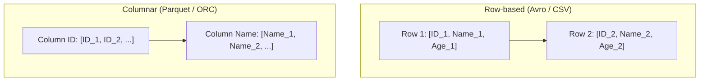
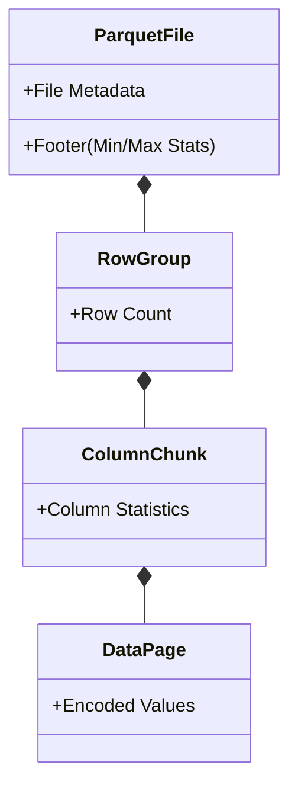

Trong hệ thống xử lý dữ liệu quy mô lớn (Data-Intensive Applications), việc chọn định dạng file không chỉ dừng ở câu chuyện "đọc/ghi nhanh hơn". Định dạng file quyết định kiến trúc của toàn bộ luồng I/O mạng, mức tiêu thụ CPU (nhờ SIMD Vectorization), dung lượng RAM cấp phát cho các worker node, và hóa đơn AWS S3 API hằng tháng.

Chọn sai định dạng lưu trữ có thể dẫn đến hiện tượng **Spill-to-disk**, **OOMKilled (Tràn RAM)**, hoặc nghẽn cổ chai tính toán.

---

## 1. Kiến Trúc Thực Thi: Row-based vs Columnar

Thay vì hiểu một cách trừu tượng, hãy nhìn vào cách CPU và Đĩa cứng xử lý mảng byte.

### Row-based Storage (Lưu Trữ Theo Dòng)
Dữ liệu của một bản ghi được ghi tuần tự và liền kề nhau trên đĩa cứng.
- **Đại diện:** CSV, JSON, Apache Avro.
- **Tối ưu cho Write-heavy (Streaming):** Thao tác ghi là **Append-only** (Ghi nối tiếp thẳng vào cuối file). Không tốn chi phí CPU để gom nhóm và nén.
- **Thảm họa cho OLAP (Analytical):** Nếu bảng có 100 cột và bạn chạy `SELECT SUM(salary) FROM table`, ổ cứng vật lý bắt buộc phải đọc qua *toàn bộ 100 cột* đẩy lên RAM, vứt bỏ 99 cột không dùng, sau đó mới tính tổng. Gây ra hiện tượng I/O Bottleneck.

### Columnar Storage (Lưu Trữ Theo Cột)
Dữ liệu của các cột giống nhau được nhóm lại và lưu liền kề.
- **Đại diện:** Apache Parquet, Apache ORC.
- **Tối ưu cho Read-heavy (OLAP):** Cung cấp **Projection Pushdown** (Chỉ đọc đúng mảng byte của cột cần thiết) và **CPU SIMD** (Vectorized Execution). CPU hiện đại có thể tải nguyên một khối dữ liệu cột (ví dụ 256 integers) vào thanh ghi (SIMD registers) và tính tổng trong 1 lệnh duy nhất.
- **Write Penalty (Chi phí ghi khổng lồ):** Để ghi một file Parquet, Engine (Spark) không thể ghi trực tiếp. Nó phải đệm (Buffer) dữ liệu vào RAM cho đến khi đủ lớn (ví dụ 128MB), sau đó dùng CPU để *chuyển vị (Transpose)* ma trận từ dòng sang cột, chạy thuật toán mã hóa, rồi mới xả (Flush) xuống đĩa.

---

## 2. Apache Avro: Tiêu Chuẩn Streaming (Kafka)

Avro là định dạng Row-based lưu dưới dạng nhị phân siêu nén. Nó sinh ra để giải quyết bài toán Data Serialization cho các hệ thống Streaming (Kafka).

### Kiến Trúc File Avro (Self-describing)
Mỗi file Avro gồm 2 phần:
1. **Header:** Lưu trữ **Schema** định dạng JSON (Bắt buộc phải có để giải mã khối nhị phân bên dưới) và Codec nén (Snappy, Zstandard).
2. **Data Blocks:** Chứa hàng ngàn bản ghi nhị phân.

### Sức Mạnh Của Schema Evolution
Điểm ăn tiền nhất của Avro là **Schema Resolution**.
Trong kiến trúc Microservices, Backend Dev liên tục thêm/xóa cột. Avro xử lý việc này hoàn hảo nhờ việc duy trì 2 schema: **Writer's Schema** (lúc đẩy vào Kafka) và **Reader's Schema** (lúc Data Engineer đọc).
Khi đọc, Avro đối chiếu hai bản:
- Cột mới thêm $\rightarrow$ Điền giá trị Default.
- Cột bị xóa $\rightarrow$ Bỏ qua không báo lỗi.
Hệ thống Pipeline không bao giờ bị "gãy" [Break].

---

## 3. Apache Parquet & Nghệ Thuật Nén

Parquet là cỗ máy đằng sau mọi Data Lakehouse.

### Kiến Trúc Phân Cấp (Hierarchical Layout)
1. **Row Group:** Chia bảng thành các khối (Mặc định 128MB).
2. **Column Chunk:** Trong một Row Group, dữ liệu tách thành các cột.
3. **Data Page:** Mức độ vật lý nhỏ nhất để nén (Thường 1MB).

### Tại Sao Parquet Đọc Siêu Nhanh?
1. **Mã Hóa (Encoding Magic):** Trình tự nén của Parquet là sự kết hợp chết người của:
   - **Dictionary Encoding:** Lập từ điển (Ví dụ: `Hanoi=0`, `HCM=1`). Thay vì lưu chuỗi text dài, nó lưu mã integer.
   - **RLE (Run-Length Encoding):** Nếu có 1 triệu dòng `Hanoi` liên tiếp, thay vì lưu 1 triệu số `0`, nó lưu thành cặp `(0, 1000000)`.
   - **Delta Encoding:** Tối ưu cho chuỗi số tăng dần (Timestamps, ID). Nó chỉ lưu sự chênh lệch (Delta) giữa số sau và số trước.
2. **Predicate Pushdown:** Footer của file lưu trữ giá trị `Min/Max` của từng Column Chunk. Nếu bạn truy vấn `WHERE Age > 50` mà `Max(Age)` trong Row Group là `40`, Engine sẽ **bỏ qua hoàn toàn (Skip)** Row Group đó, không tải lên RAM, tiết kiệm hàng vạn I/O.

---

## 4. Apache ORC

ORC (Optimized Row Columnar) là đối thủ của Parquet, sinh ra cho hệ sinh thái Hadoop/Hive.
Thay vì Row Group, nó dùng khái niệm **Stripes**. Điểm khác biệt lớn nhất là ORC tích hợp sẵn **Bloom Filters**. 
Bloom Filter là cấu trúc dữ liệu xác suất giúp khẳng định chắc chắn 100% một giá trị *không tồn tại* trong Stripe đó, cho phép bỏ qua dữ liệu cực nhanh cho các truy vấn `WHERE id = 'XYZ'`.

*(Tuy nhiên, trên môi trường Cloud hiện đại, Parquet được hỗ trợ tốt hơn bởi hệ sinh thái đa dạng).*

---

## 5. Rủi Ro Vận Hành & Khắc Phục (Incidents)

### Sự Cố 1: JVM OOMKilled Khi Ghi Bảng Rộng (Wide Tables)
- **Triệu chứng:** Spark Executor bị OS Kill vì cạn kiệt RAM.
- **Nguyên nhân cốt lõi:** Khi ghi định dạng Columnar, Spark phải Buffer dữ liệu trên RAM. Giả sử bạn có bảng 2000 cột, kích thước `parquet.block.size` là 128MB. Để đóng gói 1 Row Group, bạn cần $128MB \times 2000 = 250GB$ RAM!
- **Khắc phục:** Giảm `parquet.block.size` xuống (Ví dụ: 32MB) cho các bảng siêu rộng, hoặc tăng cấp phát RAM cho Executor.

### Sự Cố 2: Phân Mảnh S3 (The Small Files Problem)
- **Triệu chứng:** Truy vấn AWS Athena treo hàng chục phút, hóa đơn S3 API tăng gấp 10 lần.
- **Nguyên nhân:** Streaming đẩy mỗi phút hàng chục file Parquet dung lượng 10KB lên S3. Khi đọc, Engine phải thiết lập hàng vạn HTTP Connection để đọc Footer (Metadata) của từng file. Thời gian độ trễ mạng (Network Latency) lớn hơn cả thời gian tải dữ liệu.
- **Khắc phục:** Viết kịch bản Compaction định kỳ (Gom tệp 10KB thành tệp 1GB).

---

## Nguồn Tham Khảo (References)
* [Apache Parquet Official Specs][https://parquet.apache.org/docs/]
* [Confluent: Schema Evolution and Compatibility](https://docs.confluent.io/platform/current/schema-registry/avro.html]
* *Designing Data-Intensive Applications (Chapter 3)* - Martin Kleppmann (Lý thuyết về Column-oriented storage).
