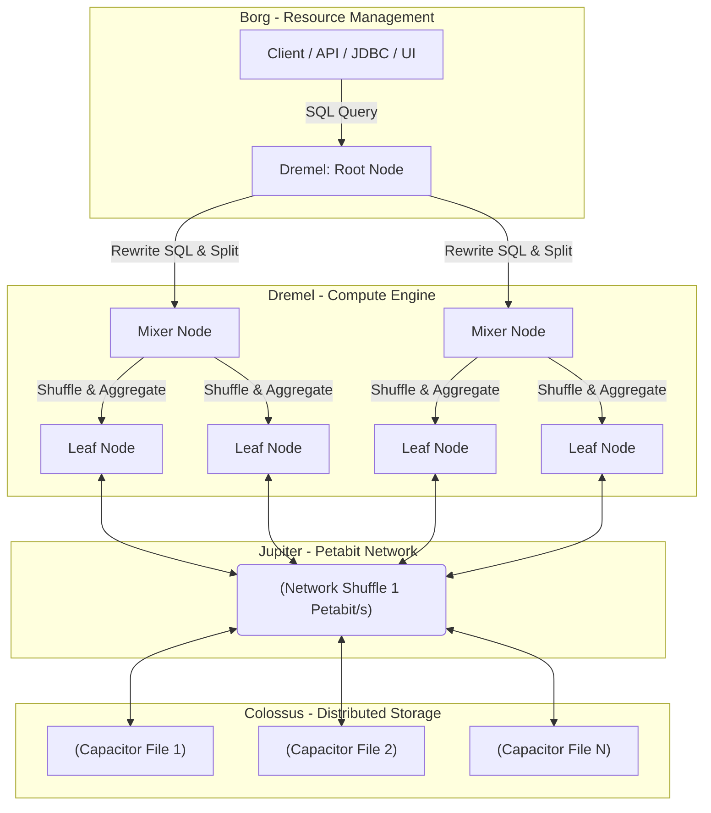

Khác với các hệ thống RDBMS truyền thống (PostgreSQL, MySQL, Oracle) nơi Compute (CPU/RAM) và Storage (Ổ cứng) bị trói buộc chặt chẽ vào cùng một máy chủ vật lý, Google BigQuery là một Enterprise Data Warehouse thế hệ mới theo đuổi triết lý **Decoupled Architecture (Kiến trúc Tách rời Tính toán và Lưu trữ)**. Nó cho phép một Data Analyst ném một câu truy vấn SQL phân tích hàng Petabyte dữ liệu và nhận lại kết quả chỉ trong vài giây, mà không cần quan tâm đến việc cấp phép Node, tuning RAM hay IOPS ổ cứng.

Bài viết này sẽ lật mở "cỗ máy" dưới mui xe của BigQuery, giải thích cách nó vận hành dưới góc độ kiến trúc vật lý (Physical Architecture), cách triển khai hệ thống chuẩn Enterprise bằng mã nguồn Terraform, và quan trọng nhất là các tình huống rủi ro vận hành (Operational Risks) mà một Staff Data Engineer sẽ phải xử lý.

---

## 1. Kiến trúc Vật lý (Physical Execution Architecture)

Tốc độ khủng khiếp của BigQuery không đến từ phép màu phần mềm, mà từ 4 trụ cột cơ sở hạ tầng vật lý độc quyền nội bộ của Google. 



### 1.1. Dremel: Execution Engine [Động cơ Thực thi Tính toán]
Dremel là động cơ xử lý MPP (Massively Parallel Processing) có khả năng scale lên hàng nghìn Node trong chớp mắt. Khi bạn Submit một truy vấn `SELECT`, Dremel biến nó thành một cây thực thi (Execution Tree):
- **Root Node**: Nhận truy vấn, kiểm tra quyền IAM, đọc Metadata (Schema, Phân vùng) để lên kế hoạch tối ưu hóa (Query Plan), sau đó chia nhỏ công việc.
- **Mixer Nodes**: Làm nhiệm vụ gom nhóm dữ liệu trung gian (Aggregation) và xáo trộn dữ liệu (Network Shuffle) giữa các nhánh của cây.
- **Leaf Nodes**: Tầng dưới cùng, chịu trách nhiệm giao tiếp trực tiếp với tầng Storage (Colossus) để quét (Scan), lọc (Filter) hàng tỷ dòng dữ liệu. 

:::note
Khái niệm **BigQuery Slot** chính là một đơn vị tài nguyên ảo hóa (Bao gồm CPU, RAM và Network I/O) được cấp phát cho các tiến trình chạy trên các Mixer và Leaf Node này thông qua hệ thống quản lý Container **Borg** (Tiền thân của Kubernetes).
:::

### 1.2. Colossus: Distributed Storage (Hệ thống Lưu trữ Phân tán)
Hệ thống file phân tán thế hệ thứ 2 của Google (Kế thừa từ Google File System - GFS). Colossus chia dữ liệu thành các Chunk nhỏ, phân mảnh và lưu trữ dự phòng (Erasure Encoding) rải rác qua hàng trăm máy chủ trong nhiều Data Center để tránh mất mát dữ liệu (Durability). BigQuery không bao giờ lưu dữ liệu phân tích trên ổ cứng Local của các máy tính toán Dremel, mọi thứ đều nằm an toàn ở Colossus.

### 1.3. Jupiter: The Network Bottleneck Breaker (Mạng nội bộ siêu tốc)
Nếu Dremel và Colossus bị tách rời về mặt vật lý, thì việc chuyển hàng Terabyte dữ liệu giữa chúng trong quá trình quét (Scan) sẽ gây nghẽn cổ chai mạng cực kỳ nghiêm trọng (Network Bottleneck). Google giải quyết bài toán vật lý này bằng kiến trúc mạng **Jupiter**, cung cấp băng thông hai chiều (Bisection Bandwidth) lên tới **1 Petabit/giây (Pbps)**. Nhờ đó, việc một Node Dremel đọc dữ liệu từ xa trên Colossus diễn ra mượt mà và nhanh như đang đọc từ RAM cục bộ.

### 1.4. Capacitor: Định dạng lưu trữ theo Cột (Columnar Format)
Dữ liệu trên Colossus được nén chặt dưới định dạng **Capacitor** (Phiên bản nội bộ thế hệ mới mạnh mẽ hơn Apache Parquet). 
- **Pushdown Predicates**: Cấu trúc này cho phép đẩy các điều kiện `WHERE` xuống tận cấp độ ổ đĩa lưu trữ vật lý.
- **Data Pruning**: Capacitor lưu trữ sẵn các siêu dữ liệu (Metadata: min, max, count, dictionary, nulls) ở file Header. Nhờ đó, Leaf Nodes có thể loại bỏ ngay lập tức toàn bộ các Block dữ liệu không thỏa mãn điều kiện Query trước cả khi phải tốn CPU để giải nén (Decompress).

---

## 2. Show, Don't Tell: Triển khai với Code Thực Chiến

Thay vì bấm giao diện UI (ClickOps) dễ dẫn đến sai sót, Staff Data Engineer phải quản lý hạ tầng Dữ liệu như một mã nguồn (Infrastructure as Code - IaC). Dưới đây là cấu hình Terraform chuẩn Enterprise để khởi tạo một Bảng dữ liệu có áp dụng **Partitioning** và **Clustering** - Hai vũ khí tối thượng để tiết kiệm chi phí.

```hcl
# main.tf
resource "google_bigquery_dataset" "analytics_dw" {
  dataset_id                  = "enterprise_analytics"
  friendly_name               = "Enterprise Analytics"
  description                 = "Data warehouse for real-time analytics"
  location                    = "US"
  default_table_expiration_ms = 31536000000 # 365 ngày (Tự dọn dẹp bảng rác)
}

resource "google_bigquery_table" "fact_transactions" {
  dataset_id = google_bigquery_dataset.analytics_dw.dataset_id
  table_id   = "fact_transactions"

  # FINOPS CRITICAL: Bắt buộc người dùng phải gõ điều kiện WHERE transaction_date 
  # Để tránh lỗi gõ nhầm SELECT * làm Full-scan tốn hàng ngàn Đô-la
  require_partition_filter = true 

  # Phân vùng vật lý theo Ngày
  time_partitioning {
    type  = "DAY"
    field = "transaction_date"
  }

  # Gom cụm dữ liệu (Sorting) bên trong mỗi Partition để tối ưu tốc độ đọc và JOIN
  clustering = ["merchant_id", "status"]

  schema = <<EOF
[
  {"name": "transaction_id", "type": "STRING", "mode": "REQUIRED"},
  {"name": "transaction_date", "type": "DATE", "mode": "REQUIRED"},
  {"name": "merchant_id", "type": "STRING", "mode": "NULLABLE"},
  {"name": "amount", "type": "NUMERIC", "mode": "NULLABLE"},
  {"name": "status", "type": "STRING", "mode": "NULLABLE"}
]
EOF
}
```

:::tip
Thuộc tính `require_partition_filter = true` là "Chốt chặn an toàn" sống còn của BigQuery. Nếu một Data Analyst hoặc BI Dashboard vô tình quên viết `WHERE transaction_date = '2023-10-01'`, BigQuery sẽ thẳng thừng từ chối chạy truy vấn thay vì âm thầm quét [Scan] 100 TB dữ liệu quá khứ và gửi hóa đơn $500 cho một lần Query duy nhất.
:::

---

## 3. Rủi ro Vận hành và Sự Đánh đổi (Systemic Trade-offs)

BigQuery rất mạnh, nhưng không phải viên đạn bạc (Silver Bullet). Khi kiến trúc mạng và lưu trữ bị lạm dụng, hệ thống sẽ gặp sự cố nghiêm trọng (Production Incidents).

### 3.1. Slot Starvation (Nạn Đói Tài Nguyên)
**Tình huống:** ETL Pipeline dữ liệu vào lúc 8h sáng chạy rất chậm, thỉnh thoảng báo lỗi `Resources exceeded during query execution`. Dashboard của sếp không load được.
**Nguyên nhân gốc rễ (Root Cause):** 
BigQuery mặc định hoạt động theo mô hình Multi-tenant (Dùng chung tài nguyên) nếu bạn chọn *On-demand Pricing*. Số lượng Slots (CPU) chia sẻ chung là hữu hạn. Khi hàng chục Kỹ sư Data chạy các lệnh `SELECT *`, `JOIN` nhiều bảng khổng lồ, hoặc chạy Window functions (`ROW_NUMBER() OVER()`) cùng một lúc, hệ thống dồn ứ và không cấp đủ Slot cho mọi người (Slot Starvation).
**Giải pháp (Trade-off):**
- *Đánh đổi Chi phí lấy Sự Ổn định:* Chuyển sang mô hình **Capacity Pricing (Editions)** để mua đứt (Provision) ví dụ 1,000 Slots chạy độc quyền (Dedicated) cho hệ thống Production, đảm bảo SLA.
- *Tối ưu hóa Code SQL:* Thay vì tính chính xác tuyệt đối (Exact Math) tiêu tốn nhiều RAM trên Mixer Nodes, hãy dùng các hàm xấp xỉ (Approximate Math).

```sql
-- TRƯỚC (Dở): Rất chậm, dễ OOMKilled do Mixer node phải giữ hàng tỷ ID trong RAM
SELECT merchant_id, COUNT(DISTINCT user_id) 
FROM fact_transactions GROUP BY 1;

-- SAU (Giỏi): Cực kỳ nhanh, dùng thuật toán HyperLogLog++, sai số chỉ ~1-2%
SELECT merchant_id, APPROX_COUNT_DISTINCT(user_id) 
FROM fact_transactions GROUP BY 1;
```

### 3.2. Spill-to-Disk (Tràn RAM xuống Ổ đĩa) và OOM
**Tình huống:** Chạy truy vấn `JOIN` 2 bảng Fact quá lớn (Hàng tỷ dòng) không cùng Partition/Cluster keys, truy vấn quay mòng mòng mất 30 phút rồi chết.
**Nguyên nhân:** Khi Mixer Node nhận dữ liệu từ Leaf Node để thực hiện phép `Hash Join`, nếu tổng lượng dữ liệu của 2 bảng vượt quá dung lượng RAM vật lý của Mixer, nó buộc phải xả (Spill) dữ liệu tạm xuống đĩa cứng hoặc qua mạng Jupiter. Phép xáo trộn mạng (Network Shuffle) ở quy mô Petabyte là cực kỳ đắt đỏ về độ trễ. Nếu vượt quá giới hạn thiết kế của Shuffle, truy vấn sẽ ném lỗi Memory (OOM).
**Giải pháp:**
- Tránh tuyệt đối Cartesian Explosion (Cross Join mà không có điều kiện `ON`).
- Lọc (Filter) mạnh tay nhất có thể bằng CTE *trước* khi đưa vào mệnh đề `JOIN`.

### 3.3. DML Updates & Anti-patterns (SCD Type 2)
**Tình huống:** Kỹ sư thiết kế Warehouse cố gắng mô phỏng Slowly Changing Dimension (SCD) Type 2 bằng cách gọi lệnh `UPDATE` từng dòng dữ liệu khách hàng mỗi 5 phút bằng một Job Apache Airflow.
**Nguyên nhân:** BigQuery là một hệ thống OLAP thiết kế tối ưu cho thao tác Đọc (Read-heavy) và Ghi nối thêm (Append-only). Nó KHÔNG PHẢI Database giao dịch OLTP (Như PostgreSQL hay MySQL). Các lệnh `UPDATE/DELETE` rải rác kích hoạt quá trình ghi đè (Rewrite) toàn bộ các Block Capacitor vật lý, làm I/O tăng vọt, hệ thống chậm chạp và bị Google giới hạn Quota (Chỉ cho phép thực hiện vài trăm lệnh DML mỗi bảng một ngày).
**Giải pháp:** Bắt buộc sử dụng câu lệnh `MERGE` để gom lô (Batch) các bản ghi thay đổi theo chu kỳ (Ví dụ mỗi 1-2 giờ một lần), thay vì sửa lắt nhắt.

```sql
-- Dùng MERGE để thực hiện Upsert (Insert/Update) hàng loạt một cách chuẩn xác
MERGE `enterprise_analytics.dim_merchants` T
USING `enterprise_analytics.stg_merchants_cdc` S
ON T.merchant_id = S.merchant_id
WHEN MATCHED AND T.status != S.status THEN
  UPDATE SET status = S.status, updated_at = CURRENT_TIMESTAMP()
WHEN NOT MATCHED THEN
  INSERT (merchant_id, status, created_at, updated_at)
  VALUES (S.merchant_id, S.status, CURRENT_TIMESTAMP(), CURRENT_TIMESTAMP());
```

---

## 4. Tổng kết: Kỹ Sư Dữ Liệu Cần Nhớ Gì?

1. **Compute != Storage:** Bạn không bao giờ cần lo lắng về dung lượng ổ đĩa hay dọn rác. Hãy dồn 100% năng lượng vào việc Dữ liệu đang được **tổ chức vật lý** ra sao để đọc ít Byte nhất có thể (Partitioning + Clustering).
2. **Network is the Computer:** Tốc độ đáng kinh ngạc của BigQuery là nhờ mạng lưới Jupiter. Hạn chế tối đa các lệnh SQL gây xáo trộn mạng (Shuffle lớn như JOIN lệch, Window Functions rộng).
3. **Say No to `SELECT *`:** Trả tiền cho Compute trong mô hình On-demand là trả tiền cho lượng Byte quét từ ổ đĩa Colossus. Định dạng cột Capacitor chỉ phát huy sức mạnh tiết kiệm tiền khi bạn chọn đích danh đúng những cột mình thực sự cần.

---

## 5. Nguồn Tham Khảo (References)
1. **Google Research Paper:** [A Look at Dremel - Interactive Analysis of Web-Scale Datasets](https://research.google/pubs/pub36632/)
2. **Google Cloud Blog:** [BigQuery under the hood - Dremel Compute](https://cloud.google.com/blog/products/data-analytics/new-blog-series-bigquery-under-the-hood)
3. **Google Cloud Blog:** [BigQuery Storage Architecture: Colossus & Capacitor](https://cloud.google.com/blog/products/data-analytics/bigquery-under-the-hood-how-storage-powers-google-clouds-enterprise-data-warehouse)
4. Sách chuyên môn: *Designing Data-Intensive Applications* (Martin Kleppmann) - Chương 3: Storage and Retrieval.
