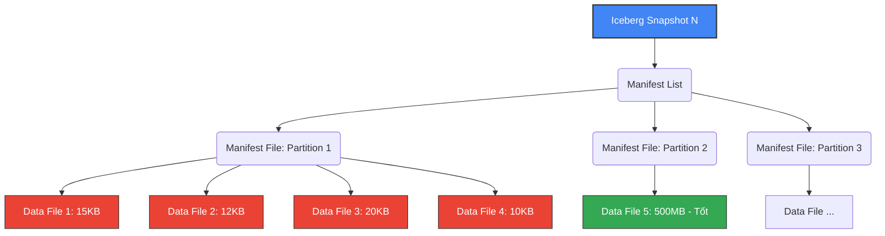
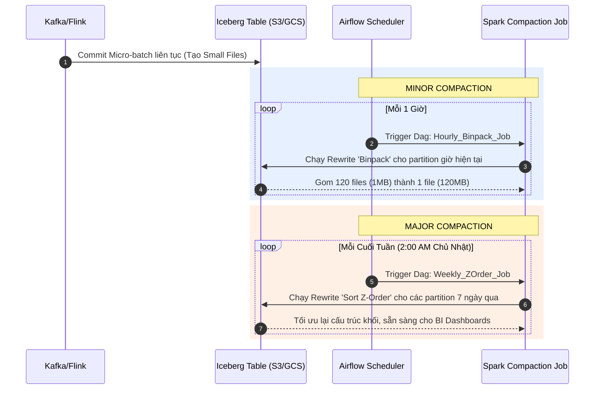

Một trong những thảm họa kinh điển nhất của hệ sinh thái Data Lake và Big Data chính là hội chứng **"Small Files Problem" (Vấn đề file nhỏ)**. Khi bạn stream dữ liệu liên tục vào HDFS hoặc các Cloud Object Storage (như Amazon S3, Google Cloud Storage, Azure Blob Storage) – ví dụ cứ vài giây lại flush một file Parquet dung lượng chỉ vài chục KB – hệ thống sẽ nhanh chóng phình to ra thành hàng triệu, thậm chí hàng tỷ file li ti. 

Lúc này, mỗi lần các execution engine như Apache Spark, Trino, hay AWS Athena chạy một câu truy vấn (query), chúng có thể tốn tới 90% thời gian chỉ để duyệt qua (list) thư mục, xử lý mở và đóng file (Metadata overhead), thay vì thực sự đọc và xử lý dữ liệu lõi.

Apache Iceberg sinh ra để quản lý Data Lake ở quy mô khổng lồ, và cơ chế **Compaction (Gom tụ file)** chính là "vũ khí tối thượng" để tiêu diệt các file nhỏ này, giúp bảo vệ hiệu suất của toàn bộ hệ thống lưu trữ phân tán.

---

## 1. Nguồn Gốc và Hậu Quả Tàn Khốc Của "Vấn Nạn Small Files"

### 1.1. Tại sao lại sinh ra Small Files?
Trong các kiến trúc dữ liệu hiện đại, dữ liệu thường được ingest (đổ vào) Data Lake thông qua các hệ thống Streaming (như Apache Flink, Kafka Connect, Spark Structured Streaming) để đáp ứng yêu cầu Gần thời gian thực (Near Real-time). Để dữ liệu nhanh chóng có mặt cho các báo cáo phân tích, các job streaming buộc phải thực hiện thao tác **commit** (chốt và ghi) các lô dữ liệu (micro-batches) xuống storage định kỳ mỗi vài phút, hoặc thậm chí mỗi vài giây. 

Kết quả tất yếu là hệ thống tạo ra vô số các khối dữ liệu rời rạc có kích thước vô cùng nhỏ, thay vì các file Parquet chuẩn có kích thước lý tưởng từ 128MB đến 512MB.

### 1.2. Hậu quả của File Nhỏ
Việc để mặc tình trạng file nhỏ tiếp diễn sẽ mang lại hậu quả dây chuyền:

> [!WARNING]
> **Vấn đề chi phí Cloud Storage (S3/GCS)**
> Các nền tảng Cloud Storage thường tính phí không chỉ theo dung lượng lưu trữ (GB/tháng) mà còn tính phí theo số lượng API Requests (PUT, GET, LIST). Hàng triệu file nhỏ nghĩa là hàng triệu request API được gọi mỗi lần engine truy xuất dữ liệu, khiến hóa đơn Cloud của bạn tăng phi mã một cách không cần thiết.

1. **Quá tải Hệ thống Metadata:**
   - Nếu Data Lake được xây trên **HDFS**: NameNode lưu trữ metadata của mọi file trực tiếp trên bộ nhớ RAM. Một triệu file nhỏ (mỗi file 10KB) chiếm cùng lượng RAM NameNode như một triệu file lớn (mỗi file 1GB). Việc này dẫn đến cạn kiệt bộ nhớ NameNode nhanh chóng và có thể làm sập toàn bộ cluster Hadoop.
2. **Task Scheduling Overhead trong Spark:** 
   - Apache Spark xử lý mỗi file (hoặc một phần của file lớn) bằng một Task. Nếu có 100,000 file nhỏ, Spark phải tạo lập và phân phối 100,000 tasks. Việc lập lịch (scheduling), khởi động task, serializing task closures và dọn dẹp task mất vài mili-giây, trong khi thời gian thực tế để đọc 10KB dữ liệu bên trong file đó chỉ mất vài micro-giây. Tỷ lệ Overhead/Thực thi hoàn toàn mất cân đối.
3. **Kém hiệu quả nén (Compression Efficiency):** 
   - Các thuật toán nén tiêu chuẩn trong Big Data (như Snappy, ZSTD, GZIP) hoạt động cực kỳ hiệu quả trên các khối dữ liệu lớn vì chúng tìm kiếm các mẫu dữ liệu (patterns) lặp lại để nén. File quá nhỏ khiến tỷ lệ nén sụt giảm nghiêm trọng do không có đủ ngữ cảnh dữ liệu để tối ưu hóa từ điển nén.

---

## 2. Iceberg Metadata Tree & Tác Động Của File Nhỏ

Khác với Hive truyền thống, Apache Iceberg quản lý metadata dưới dạng một cấu trúc cây (Tree structure) nghiêm ngặt tại mức độ tệp tin (File-level metadata). 

Khi có hàng triệu file nhỏ được ghi vào bảng, các file quản lý metadata của Iceberg (được gọi là Manifest Files) cũng sẽ phình to ra tương ứng để theo dõi dải giá trị Min/Max của từng file con.



**Tác động:** Khi thực thi một câu lệnh `SELECT`, quá trình **Query Planning** của Iceberg phải quét qua tất cả các Manifest Files này để quyết định xem những Data File nào thỏa mãn mệnh đề `WHERE` (thông qua cơ chế Data Skipping / Min-Max filtering). Nếu Manifest file quá lớn do chứa quá nhiều file nhỏ, thời gian Planning có thể chậm hơn cả thời gian thực thi (Execution time) của câu truy vấn.

---

## 3. Hành Trình Gom Tụ Dữ Liệu (Compaction) Trong Iceberg

**Compaction** là quá trình một Maintenance Job (thường được chạy bằng Apache Spark) hoạt động ngầm, âm thầm quét các phân vùng dữ liệu, đọc hàng vạn file Parquet nhỏ li ti, gộp chúng lại thành các file lớn hơn với kích thước mục tiêu (thường từ 128MB đến 512MB), sau đó commit một phiên bản mới (Snapshot) của bảng. 

Điều tuyệt vời của kiến trúc **ACID (Atomicity, Consistency, Isolation, Durability)** trong Iceberg là: 
Quá trình Compaction diễn ra hoàn toàn **trong suốt với người dùng (Transparent)** và hỗ trợ **Concurrency (Đồng thời)**. Người dùng hoặc các BI tools đang truy vấn bảng vẫn sẽ an toàn đọc từ snapshot cũ mà không bị treo (lock), không bị lỗi, và không đọc phải dữ liệu bị trùng lặp.

> [!NOTE]
> Thay vì bạn phải tự viết code Spark rườm rà (đọc DataFrame lên -> Repartition -> Ghi đè DataFrame xuống), Apache Iceberg đã cung cấp sẵn Stored Procedure và API tích hợp. Bạn chỉ việc gọi câu lệnh đơn giản là hệ thống tự động xử lý an toàn.

---

## 4. Phân Tích Chuyên Sâu Các Chiến Lược Compaction

Stored procedure `RewriteDataFiles` của Iceberg cung cấp 3 chiến lược gom tụ chính. Mỗi chiến lược được thiết kế để giải quyết một bài toán cụ thể trong kiến trúc lưu trữ.

### 4.1. Chiến Lược Binpack (Gom nhóm đơn thuần)

- **Cơ chế hoạt động:** Iceberg thu thập danh sách các file cần được gom tụ, và "nhồi" chúng vào một file mới một cách tuần tự. Ngay khi dung lượng file mới đạt ngưỡng giới hạn đích (ví dụ: 512MB), Iceberg sẽ đóng gói file đó và tiếp tục mở file tiếp theo. Hành động này tương tự việc dọn dẹp nhà cửa: bạn gom tất cả rác vào một bao tải lớn một cách nhanh chóng mà không cần bận tâm bên trong túi rác được sắp xếp ra sao.
- **Ưu điểm:**
  - Tốc độ thực thi chớp nhoáng.
  - Tiêu tốn cực ít Compute (CPU và RAM) do quá trình này chỉ là I/O bound (đọc/ghi đĩa) và **không** phát sinh thao tác `Shuffle` dữ liệu qua mạng giữa các node Spark.
- **Nhược điểm:**
  - Không sắp xếp lại các bản ghi bên trong, do đó không cải thiện thêm được khả năng Data Skipping nếu dữ liệu ban đầu bị phân mảnh giá trị.
- **Trường hợp sử dụng lý tưởng:** Rất phù hợp làm job chạy tự động thường xuyên (ví dụ: mỗi giờ một lần hoặc mỗi 15 phút) như một quá trình "Minor Compaction" nhằm dọn dẹp cấp tốc các file sinh ra từ Data Streaming.

**Code Thực Hành với Spark SQL:**

```sql
CALL catalog_name.system.rewrite_data_files(
  table => 'my_lakehouse.streaming_events',
  strategy => 'binpack',
  options => map(
    'target-file-size-bytes', '536870912', -- Kích thước đích: 512MB
    'min-file-size-bytes', '104857600',    -- Các file dưới 100MB sẽ được chọn để gom
    'max-file-size-bytes', '1073741824',   -- Các file lớn hơn 1GB sẽ bị cắt nhỏ (split)
    'max-concurrent-file-group-rewrites', '5' -- Chạy song song 5 thread để tăng tốc
  )
);
```

### 4.2. Chiến Lược Sort (Sắp xếp phân cấp - Hierarchical Sort)

- **Cơ chế hoạt động:** Khác với Binpack, chiến lược Sort không chỉ gộp file. Nó mở toàn bộ dữ liệu ra, **Sắp xếp (Sort)** các bản ghi theo một hoặc nhiều cột do người dùng chỉ định (Ví dụ: `Order_Date`, `Customer_ID`), rồi mới tuần tự ghi xuống các block của file Parquet mới.
- **Ưu điểm vượt trội:**
  - Định dạng file Parquet lưu trữ metadata (Giá trị Min/Max) ở phần Footer của từng Block (Row Group). Khi dữ liệu được Sort chặt chẽ, các khối dữ liệu sẽ có dải giá trị Min/Max không bị chồng chéo. Query Engine (Trino/Spark) dựa vào thông tin này để bỏ qua (Skip) hàng loạt file/block không chứa dữ liệu cần tìm, giảm khối lượng I/O từ S3 xuống hàng ngàn lần.
- **Nhược điểm:**
  - Đòi hỏi sức mạnh điện toán lớn và chi phí cao. Quá trình Sort bắt buộc Spark phải thực hiện **Wide Transformation (Shuffle)**, hoán đổi dữ liệu chéo giữa hàng trăm Worker Nodes, gây tắc nghẽn I/O mạng và đòi hỏi bộ nhớ RAM lớn để tránh lỗi `OutOfMemory`.
- **Trường hợp sử dụng lý tưởng:** Sử dụng cho các "Major Compaction" chạy vào thời điểm bảo trì (ví dụ: 2 giờ sáng Chủ Nhật) cho các Bảng Sự thật cốt lõi (Core Fact Tables), giúp tăng tốc cho các Dashboard phân tích ngày đầu tuần.

**Code Thực Hành với Spark SQL:**

```sql
CALL catalog_name.system.rewrite_data_files(
  table => 'my_lakehouse.sales_fact',
  strategy => 'sort',
  sort_order => 'order_date ASC NULLS FIRST, customer_id ASC',
  options => map(
    'target-file-size-bytes', '536870912'
  )
);
```

### 4.3. Nâng cao: Z-Order Clustering (Gom cụm đa chiều)

Khi bạn cấu hình chiến lược `SORT` với nhiều cột (ví dụ `sort_order => 'col_A, col_B, col_C'`), Iceberg mặc định sử dụng Sort phân cấp (Hierarchical/Lexicographical Sort). 
- Dữ liệu sẽ được sắp xếp ưu tiên hoàn toàn theo `col_A`. Chỉ khi `col_A` trùng nhau, hệ thống mới xét tiếp đến `col_B`.
- Vấn đề nảy sinh: Hệ thống chỉ tối ưu được cực tốt cho các query có lọc `WHERE col_A = x`. Tuy nhiên, nếu user chạy một query khác chỉ chứa điều kiện `WHERE col_C = z` (bỏ qua `col_A`), hiệu quả phân mảnh dữ liệu biến mất, query engine vẫn phải quét toàn bảng (Full Table Scan).

Để giải quyết bài toán Data Skipping đa chiều, Iceberg đưa vào thuật toán **Z-Order Clustering** (được cảm hứng từ đường cong không gian Z-curve). Z-Order thực hiện xen kẽ (interleave) các bit nhị phân của các cột tham gia với nhau, tạo ra một không gian lưu trữ "công bằng", bảo toàn tính cục bộ (locality) cho tất cả các chiều dữ liệu.

```sql
-- Compaction mức độ sâu kết hợp Z-Order trên nhiều cột
CALL catalog_name.system.rewrite_data_files(
  table => 'my_lakehouse.sales_fact',
  strategy => 'sort',
  sort_order => 'zorder(customer_id, product_id, store_id)'
);
```

> [!TIP]
> **Best Practice cho Z-Order:** 
> Đừng tham lam đưa tất cả các cột vào cấu trúc Z-Order. Khuyến nghị chuẩn từ Databricks và Iceberg community là chỉ nên dùng Z-Order cho từ **2 đến tối đa 4 cột** thường xuyên xuất hiện nhất trong các mệnh đề `WHERE` hoặc `JOIN`. Đưa quá nhiều cột sẽ làm "loãng" không gian phân cụm, làm giảm độ hiệu quả một cách đáng kể.

---

## 5. Bảng Tóm Tắt & So Sánh Các Chiến Lược

| Tiêu chí | Binpack | Hierarchical Sort | Z-Order Clustering |
|:---|:---|:---|:---|
| **Cơ chế** | Nối file đơn giản theo kích thước | Sắp xếp ưu tiên giảm dần từ trái qua phải | Xen kẽ bit đa chiều, xử lý công bằng |
| **Chi phí Compute** | Rất Thấp | Trung Bình - Cao | Rất Cao (Xử lý toán học nhị phân) |
| **Thời gian chạy** | Cực Nhanh | Chậm | Rất Chậm |
| **Tối ưu Data Skipping** | Kém (Không thay đổi so với gốc) | Rất Tốt (nhưng chỉ cho 1 cột đầu tiên) | Tốt và đồng đều cho mọi cột tham gia |
| **Use-case** | Minor Compaction, Streaming ingestion | Bảng có 1 khóa phân tích cố định (ví dụ: Ngày) | Bảng có các query filters phức tạp, khó đoán |

---

## 6. Kiến Trúc Compaction Trong Thực Tế với Apache Airflow

Để duy trì Lakehouse vận hành trơn tru mà không cần kỹ sư can thiệp thủ công, các đội Data Engineering hiện đại xây dựng mô hình **Maintenance Automation Pipeline** kết hợp giữa Apache Airflow và Spark.



**Thực hành Tối ưu hóa:**
Thay vì chạy lệnh Compaction trên toàn bộ bảng (Table-level) vô cùng đắt đỏ, hãy kết hợp thêm điều kiện `WHERE` để giới hạn khu vực gom tụ chỉ tập trung vào những ngày vừa được ghi thêm dữ liệu mới.

```sql
CALL catalog_name.system.rewrite_data_files(
  table => 'my_lakehouse.sales_fact',
  strategy => 'binpack',
  where => 'date_partition >= current_date() - INTERVAL 1 DAYS'
);
```

---

## 7. Khâu Cuối Cùng Của Chu Trình: Dọn Rác (Garbage Collection)

Một sai lầm "chết người" mà nhiều người mới làm quen Iceberg hay mắc phải: **Họ tin rằng lệnh `rewrite_data_files` sẽ tự động xóa ngay các file nhỏ cũ.**

Thực tế hoàn toàn không phải vậy! Do tính chất "Time Travel" mạnh mẽ của Iceberg, dữ liệu trạng thái cũ (các file nhỏ trước khi bị gom) vẫn được bảo lưu lại nhằm cho phép bạn rollback (quay ngược) hoặc query dữ liệu trong quá khứ. Hệ lụy là nếu bạn chạy Compaction nhiều lần mà không dọn dẹp, tổng dung lượng lưu trữ trên S3 của bạn sẽ tiếp tục nhân lên theo thời gian.

Để đóng lại chu trình quản trị lưu trữ hoàn hảo, bạn cần cấu hình tự động chạy 2 thủ tục dọn rác đi kèm:

### 7.1. Expire Snapshots (Xóa lịch sử không còn cần thiết)
Gỡ bỏ metadata của các trạng thái cũ không còn dùng đến. Lệnh dưới đây dọn dẹp các lịch sử cũ hơn mốc thời gian quy định, giải phóng sự ràng buộc đối với các data file cũ.

```sql
CALL catalog_name.system.expire_snapshots(
  table => 'my_lakehouse.sales_fact', 
  older_than => TIMESTAMP '2023-10-01 00:00:00.000',
  retain_last => 5 -- Rule an toàn: Luôn giữ lại ít nhất 5 snapshots gần nhất để đề phòng
);
```

### 7.2. Remove Orphan Files (Xóa rác vật lý)
Quét toàn bộ thư mục S3 và "xóa vật lý" những Data File mồ côi (những file đang nằm trên đĩa nhưng không thuộc về bất kỳ Snapshot hợp lệ nào của Iceberg). Quá trình này sẽ trực tiếp làm giảm tiền cước Cloud của bạn.

```sql
CALL catalog_name.system.remove_orphan_files(
  table => 'my_lakehouse.sales_fact',
  older_than => TIMESTAMP '2023-10-01 00:00:00.000'
);
```

> [!CAUTION]
> **Quy tắc An Toàn về Remove Orphan Files:** 
> Tuyệt đối không bao giờ cấu hình thời gian `older_than` trỏ vào thời điểm hiện tại `NOW()`. Hãy luôn lùi lại tối thiểu 3 đến 7 ngày. Lý do là vì ở thời điểm hiện tại, có thể có một cụm Spark khác đang copy file Parquet xuống S3 nhưng chưa kịp cập nhật manifest vào Iceberg catalog. Nếu bạn quét Orphan ngay lúc đó, bạn sẽ vô tình xóa nhầm những file "đang thành hình" của tác vụ khác!

---

## Tài Liệu Tham Khảo Mở Rộng
* [Tài liệu chính thức: Apache Iceberg Spark Procedures](https://iceberg.apache.org/docs/latest/spark-procedures/)
* **Tối ưu hóa hiệu suất AWS Athena với Apache Iceberg Compaction**
* [SSTables và LSM-Trees - Trích Designing Data-Intensive Applications (Chương 3)](https://dataintensive.net/)
* **Hiểu về Z-Ordering và Liquid Clustering trên Databricks**
