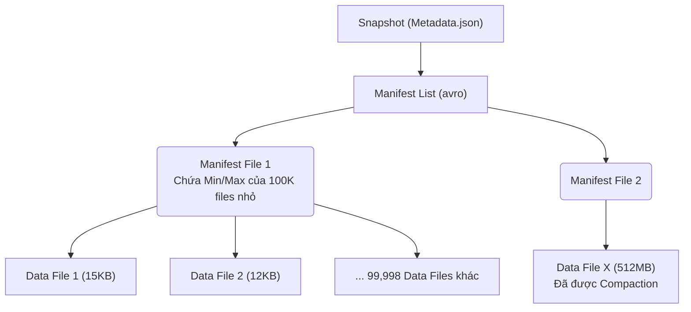

Trong các hệ thống phân tán (Distributed Systems) và Data Lake, "Small Files Problem" (Vấn đề file nhỏ) là một trong những nguyên nhân hàng đầu gây sụp đổ hiệu suất (Performance Degradation) và bùng nổ chi phí Cloud. 

Khi dữ liệu được stream liên tục thông qua Kafka hoặc Flink và flush xuống S3/GCS ở tần suất cao (micro-batching), hệ thống lưu trữ nhanh chóng bị phân mảnh thành hàng triệu file nhỏ (vài chục KB). Bản chất của các Execution Engine như Apache Spark hay Trino được thiết kế để xử lý các block dữ liệu lớn (I/O throughput-optimized) thay vì hàng triệu lời gọi I/O rải rác (I/O latency-bound).

Bài viết này mổ xẻ cơ chế giải quyết vấn đề Small Files thông qua tính năng **Compaction** trong Apache Iceberg, đồng thời phân tích sâu các đánh đổi (trade-offs) về Compute, I/O, và Data Skipping dưới góc nhìn của một **Staff Data Engineer**.

---

## 1. Bản Chất Kỹ Thuật Của Vấn Nạn Small Files

Việc để mặc tình trạng file nhỏ tiếp diễn phá vỡ cấu trúc của hệ thống phân tán ở ba tầng kiến trúc:

1.  **Storage API Overhead & Rate Limiting:**
    Các dịch vụ Object Storage (Amazon S3, Google Cloud Storage) tính phí trên mỗi API Request (`PUT`, `GET`, `LIST`). Việc query 1 triệu file 10KB tốn số lượng API Calls gấp 10,000 lần so với query 100 file 100MB. Hơn nữa, việc bắn quá nhiều request đồng thời có thể kích hoạt cơ chế throttling (Rate Limiting, lỗi HTTP 503 Slow Down) từ phía nhà cung cấp Cloud.

2.  **Task Scheduling Overhead trong Distributed Compute:**
    Trong Apache Spark, mỗi file vật lý nhỏ tương ứng với tối thiểu 1 Partition và 1 Task. Nếu có 100,000 file nhỏ, Spark Driver phải lên lịch trình (schedule), tuần tự hóa (serialize) và đẩy 100,000 tasks xuống các Executor. Thời gian rập khuôn để khởi tạo JVM Task (Metadata overhead) có thể mất vài mili-giây, trong khi thời gian thực thi I/O trên 10KB dữ liệu chỉ mất vài micro-giây. Đây là một sự lãng phí Compute khủng khiếp.

3.  **Vô hiệu hóa Compression & Encoding:**
    Các định dạng Columnar như Parquet sử dụng Run-Length Encoding (RLE) và Dictionary Encoding, kết hợp với các thuật toán nén như ZSTD hoặc Snappy. Những kỹ thuật này chỉ phát huy tối đa sức mạnh khi có đủ ngữ cảnh dữ liệu (Data Context) dài. File quá nhỏ làm từ điển nén bị phân mảnh, khiến tỷ lệ nén rớt thảm hại.

---

## 2. Kiến Trúc Metadata Của Iceberg: Nút Thắt Ở Query Planning

Apache Iceberg quản lý Data Lake thông qua một cấu trúc cây Metadata nghiêm ngặt. Khi số lượng Data Files tăng đột biến, kích thước của các tập tin quản lý (Manifest Files) cũng phình to tỷ lệ thuận.



:::danger
**Query Planning Bottleneck:** 
Trước khi thực thi bất kỳ query nào, Engine (Trino/Spark) phải đọc file Metadata để quyết định loại bỏ (Skip) các file không cần thiết dựa trên mệnh đề `WHERE` (Min/Max filtering). Nếu Manifest File phải lưu trữ metadata của hàng triệu Data Files, giai đoạn Query Planning có thể kéo dài hàng chục phút và làm tràn RAM của Spark Driver (lỗi `java.lang.OutOfMemoryError: Java heap space`).
:::

---

## 3. Kiến Trúc Compaction & Systemic Trade-offs

Iceberg cung cấp tính năng `rewrite_data_files` nhằm gom tụ các file nhỏ thành các block chuẩn (thường 128MB - 512MB). Iceberg cung cấp 3 chiến lược (Strategies) đại diện cho sự đánh đổi khốc liệt giữa **Compute Cost** và **Query Performance**.

### 3.1. Chiến lược BINPACK (Đóng thùng)

**Cơ chế:** Binpack hoạt động như trò chơi Tetris. Nó gom các file dữ liệu nhỏ lại thành file lớn hơn cho đến khi đạt kích thước mục tiêu mà **không quan tâm đến thứ tự** của các bản ghi bên trong.

-   **Systemic Trade-off:** 
    -   **Pros:** Nhanh, rẻ, I/O Bound. Hoàn toàn **KHÔNG** xảy ra Network Shuffle (không chuyển dữ liệu giữa các node), do đó không có nguy cơ OOM. Rất an toàn để chạy thường xuyên.
    -   **Cons:** Không cải thiện Data Skipping. Nếu dữ liệu ban đầu lộn xộn, Min/Max bounds của file mới sẽ rất rộng.
-   **Best Practice:** Dùng làm "Minor Compaction". Chạy tần suất cao (mỗi giờ) cho các bảng Streaming để giảm số lượng file khẩn cấp.

**Thực thi qua Spark SQL:**
```sql
CALL catalog.system.rewrite_data_files(
  table => 'prod.events_log',
  strategy => 'binpack',
  options => map(
    'target-file-size-bytes', '536870912', -- 512MB
    'min-input-files', '10'
  )
);
```

### 3.2. Chiến lược SORT (Sắp xếp)

**Cơ chế:** Sort sẽ bung toàn bộ dữ liệu ra, thực hiện một thao tác phân loại (Wide Transformation), sắp xếp các bản ghi theo thứ tự ưu tiên (VD: `ORDER BY tenant_id`), rồi ghi xuống disk.

-   **Systemic Trade-off:**
    -   **Pros:** Tối ưu hóa cực mạnh cho Data Skipping (Min/Max). Các query `WHERE tenant_id = 'A'` sẽ skip được 99% data files của các tenant khác.
    -   **Cons (Rủi ro OOM):** Đòi hỏi **Wide Network Shuffle**. Quá trình Sort luân chuyển dữ liệu khổng lồ qua mạng. Rủi ro Spill-to-disk rất cao, khiến I/O tăng vọt và thời gian chạy job kéo dài, thậm chí crash hệ thống.

```sql
CALL catalog.system.rewrite_data_files(
  table => 'prod.sales',
  strategy => 'sort',
  sort_order => 'tenant_id ASC, order_date DESC',
  options => map('target-file-size-bytes', '536870912')
);
```

### 3.3. Chiến lược Z-ORDER (Đa chiều)

**Cơ chế:** Sort thông thường bị "thiên vị" [Biased]. Nếu sort theo `(A, B, C)`, query `WHERE A = x` rất nhanh, nhưng `WHERE B = y` phải Full Scan. **Z-Order Clustering** xen kẽ các bit nhị phân của nhiều cột, tạo ra tính cục bộ (Locality) đồng đều cho tất cả các cột tham gia Z-Order.

:::tip
**Best Practice thiết kế Z-Order:** 
Tính toán Z-Order cực kỳ đắt đỏ về mặt CPU. Chỉ nên chọn tối đa **2-4 cột** thường xuyên xuất hiện nhất trong các bộ lọc `WHERE`. Đưa quá nhiều cột sẽ gây ra hiệu ứng pha loãng [Curse of Dimensionality], làm suy giảm hiệu năng.
:::

```sql
CALL catalog.system.rewrite_data_files(
  table => 'prod.events',
  strategy => 'sort',
  sort_order => 'zorder(country_code, platform_id, event_type)'
);
```

---

## 4. Kiến Trúc Maintenance Pipeline Trong Thực Tế

Trong môi trường Production, chạy Z-Order mỗi giờ sẽ đốt sạch ngân sách Cloud (FinOps Disaster). Kiến trúc chuẩn là sử dụng **Tiered Compaction** (Lập lịch qua Airflow/Dagster):

1.  **Minor Compaction (Hourly):** Chạy `BINPACK` để gom nhanh các file do Kafka đổ xuống. Tốn ít Compute, giữ Metadata Tree gọn gàng.
2.  **Major Compaction (Weekly):** Chạy `SORT` hoặc `Z-ORDER` vào cuối tuần (Maintenance Window) trên các phân vùng (partitions) đã đóng băng, chuẩn bị dữ liệu tối ưu nhất cho báo cáo tuần tới.

---

## 5. Dọn Rác Vật Lý (Garbage Collection)

Iceberg sử dụng kiến trúc Copy-On-Write cho Compaction. Lệnh `rewrite_data_files` tạo ra các file mới và commit Snapshot mới, nhưng **TUYỆT ĐỐI KHÔNG XÓA** các file 10KB cũ để phục vụ Time-Travel. Để tránh nổ bill S3, bạn cần chạy 2 bước dọn dẹp:

### Bước 1: Expire Snapshots
Xóa các con trỏ metadata về các trạng thái cũ.
```sql
CALL catalog.system.expire_snapshots(
  table => 'prod.events', 
  older_than => TIMESTAMP '2023-11-01 00:00:00.000',
  retain_last => 5 -- Giữ lại ít nhất 5 versions an toàn
);
```

### Bước 2: Remove Orphan Files
Xóa các file vật lý mồ côi (không nằm trong bất kỳ Snapshot nào).
:::danger
**Rủi ro xóa nhầm In-flight Files:** 
Đừng bao giờ cấu hình `older_than = NOW(]` cho Orphan Files. Nếu một Spark Streaming Job đang ghi file xuống S3 nhưng chưa kịp commit Metadata lên Iceberg, việc quét Orphan ngay lúc đó sẽ xem file này là rác và xóa sổ nó (Data Corruption). Luôn lùi lại tối thiểu 3-5 ngày.
:::

```sql
CALL catalog.system.remove_orphan_files(
  table => 'prod.events',
  older_than => TIMESTAMP '2023-10-25 00:00:00.000'
);
```

---

## Nguồn Tham Khảo
1.  **Apache Iceberg Official Docs: Spark Procedures**
2.  **Dremio: Small Files and Compaction in Apache Iceberg**
3.  **Designing Data-Intensive Applications** - Martin Kleppmann.
