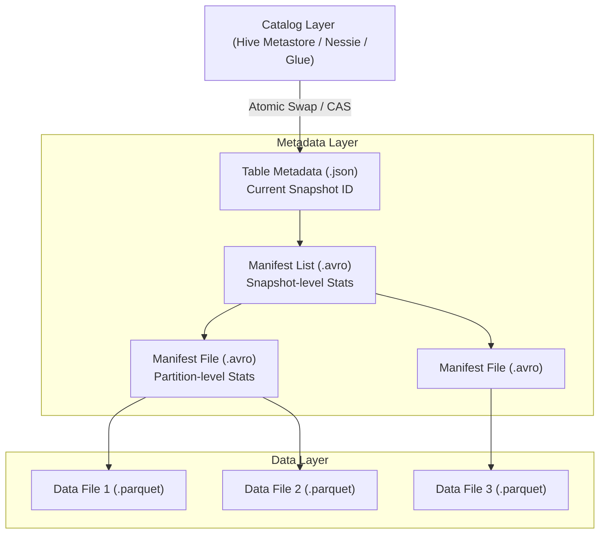

Khác với Data Lake truyền thống (Hive-like) vốn dựa vào cơ chế *File Listing* trên thư mục cực kỳ chậm chạp và thiếu nhất quán, Apache Iceberg được thiết kế xoay quanh một **Metadata Tree (Cây siêu dữ liệu)** khắt khe và cơ chế **Optimistic Concurrency Control (OCC)**.

Nhờ tách biệt hoàn toàn dữ liệu vật lý (Data Layer) và dữ liệu quản lý (Metadata Layer), Iceberg tạo ra các **Snapshots** bất biến (Immutable). Điều này mang lại **Snapshot Isolation**, cho phép nhiều tiến trình đọc/ghi diễn ra đồng thời mà không bị khóa (Lock) hay đọc phải dữ liệu rác (Torn Reads).

Tuy nhiên, dưới góc nhìn hệ thống, OCC mang đến những rủi ro về *Retry Storms* và *Metadata Bloat* mà một Data Engineer phải lường trước.

---

## 1. Kiến Trúc Thực Thi Vật Lý (Physical Architecture)

Iceberg phân tách cấu trúc bảng thành 3 lớp rõ rệt: Catalog Layer, Metadata Layer và Data Layer.



1. **Catalog Layer:** Trái tim của sự nhất quán. Nó lưu đúng một con trỏ [Pointer] duy nhất trỏ đến file Metadata hiện tại của bảng. Đây là nơi diễn ra các thao tác Atomic.
2. **Table Metadata (`.json`):** Chứa Schema, Partition Spec và danh sách toàn bộ các Snapshots. Quan trọng nhất là trường `current-snapshot-id`.
3. **Manifest List (`.avro`):** Mỗi Snapshot trỏ tới một Manifest List. File này quản lý danh sách các Manifest Files, chứa thống kê cấp độ Partition để Query Engine có thể gạt bỏ (Prune) các nhánh không cần thiết.
4. **Manifest File (`.avro`):** Quản lý tập hợp các Data Files vật lý. Nó chứa file path và *Thống kê cấp độ File* (Min/Max/Null-counts của từng cột).
5. **Data Files (`.parquet`):** Các file vật lý bất biến lưu trên Object Storage (S3/GCS).

---

## 2. Optimistic Concurrency Control (OCC)

Iceberg giải quyết bài toán đa luồng ghi (Multiple Writers) bằng OCC. Hệ thống giả định rằng *hầu hết các tiến trình ghi sẽ không đụng độ nhau*, nên không dùng Pessimistic Lock (gây thắt cổ chai).

### Cơ chế Atomic Swap (Compare-And-Swap - CAS)
Quá trình ghi diễn ra theo 3 bước:
1. **Base:** Đọc Table Metadata hiện tại (ví dụ: `v1.json`).
2. **Write:** Ghi các Data Files mới xuống S3 (hoàn toàn cô lập). Ghi các Manifest Files và Manifest List mới.
3. **Commit (CAS):** Tạo file metadata mới `v2.json`. Writer gửi yêu cầu đến Catalog thực hiện Swap con trỏ từ `v1.json` sang `v2.json`.
   - Nếu Catalog vẫn đang trỏ tới `v1.json` $\rightarrow$ Swap thành công.
   - Nếu một Writer khác đã commit chèn vào giữa (Catalog đang trỏ tới `vX.json`) $\rightarrow$ **Conflict Detected!**

### Bão Thử Lại (Retry Storms)
Khi xảy ra Conflict, Iceberg tự động **Retry**: Tải lại `vX.json`, kiểm tra xem 2 luồng ghi có sửa chung một file không. Nếu không, nó cấu trúc lại cây metadata và CAS lần nữa.

*Rủi ro vận hành:* Nếu có 50 Spark Streaming jobs cùng Append liên tục vào bảng, xác suất đụng độ CAS gần như 100%. Các job liên tục Fail và Retry đồng loạt, tạo ra hiệu ứng *Thundering Herd* đập thẳng vào Catalog khiến hệ thống sụp đổ.
*Cách khắc phục:* Chuyển luồng Streaming sang Micro-batching (5-10 phút/lần) hoặc đảm bảo các writers ghi vào các Partitions tách biệt hoàn toàn.

---

## 3. Hidden Partitioning (Phân Vùng Ẩn)

Trong Hive cũ, nếu bạn partition theo ngày, người dùng phải nhớ truy vấn đúng cột partition vật lý (ví dụ: `WHERE date_str = '2023-10-01'`). Nếu họ lỡ truy vấn cột `event_timestamp`, Hive sẽ quét toàn bộ bảng (Full Table Scan).

Iceberg giới thiệu **Hidden Partitioning**. Iceberg tách biệt Schema logic và cấu trúc vật lý.
Bạn chỉ cần khai báo: `PARTITIONED BY (days(event_timestamp))`. 
Khi người dùng chạy `SELECT * FROM table WHERE event_timestamp > '2023-10-01'`, Iceberg sẽ ngầm tự động chuyển đổi logic này để Filter các Manifest Files tương ứng. Người dùng không bao giờ cần biết (hay nhớ) bảng được phân vùng như thế nào bên dưới.

---

## 4. Quản Trị Metadata Bloat (Tràn RAM Driver)

Mỗi thao tác (Insert/Update) sinh ra một Snapshot mới. File `vX.json` sẽ lưu *toàn bộ* lịch sử snapshot này. 
Khi bảng có hàng chục vạn Snapshots, file `.json` có thể phình to lên hàng trăm MB. Lúc này, khi Spark Driver cố gắng Parse file JSON vào Heap Memory để lên kế hoạch truy vấn, nó sẽ chết ngay lập tức vì **OOMKilled (Out of Memory)**.

**Khắc phục:** Chạy định kỳ (Airflow DAG) các lệnh bảo trì để cắt tỉa cây metadata và xóa file vật lý rác.

```sql
-- 1. Xóa các Snapshots quá hạn (Xóa khỏi Metadata Tree)
CALL my_catalog.system.expire_snapshots(
  table => 'database.fact_transactions',
  older_than => TIMESTAMP '2026-06-19 00:00:00',
  retain_last => 10
);
-- 2. Xóa các file vật lý mồ côi (Orphan Files) trên S3
CALL my_catalog.system.remove_orphan_files(
  table => 'database.fact_transactions'
);
```

---

## 5. Mẫu Thiết Kế WAP (Write-Audit-Publish)

Nhờ kiến trúc Snapshot Isolation và khả năng tạo Branch (Nhánh) không tốn chi phí (Zero-copy), Kỹ sư dữ liệu có thể triển khai mẫu thiết kế **WAP (Write-Audit-Publish)**. WAP đảm bảo dữ liệu bẩn (Bad Data) không bao giờ lọt lên Production.

```sql
-- BƯỚC 1 - WRITE: Spark Job ghi dữ liệu vào một nhánh staging riêng biệt
-- Nhánh này hoàn toàn tàng hình với hệ thống đọc hiện tại trên nhánh 'main'
SET spark.wap.branch = 'audit_etl_job_v1';
INSERT INTO my_catalog.db.orders VALUES (1, 100.5), (2, -50.0);

-- BƯỚC 2 - AUDIT: Chạy Data Quality Checks (Great Expectations / dbt test)
-- Quét trực tiếp trên nhánh vừa ghi để phát hiện lỗi (Ví dụ: giá trị âm)
SELECT count(*) FROM my_catalog.db.orders 
FOR VERSION AS OF 'audit_etl_job_v1' 
WHERE amount < 0;

-- BƯỚC 3 - PUBLISH: Nếu Audit Pass, thực hiện Fast-forward nhánh 'main'
CALL my_catalog.system.fast_forward('db.orders', 'main', 'audit_etl_job_v1');
```

Nếu bước Audit thất bại, ta chỉ việc Drop nhánh `audit_etl_job_v1`. Production data không hề bị ảnh hưởng.

---

## Nguồn Tham Khảo (References)
* [Apache Iceberg Official Specs: Table Metadata](https://iceberg.apache.org/spec/#table-metadata)
* [LakeFS: Write-Audit-Publish Pattern for Data Lakes](https://lakefs.io/blog/write-audit-publish/)
* *Designing Data-Intensive Applications (Martin Kleppmann) - Chapter 7: Transactions & Concurrency Control*
