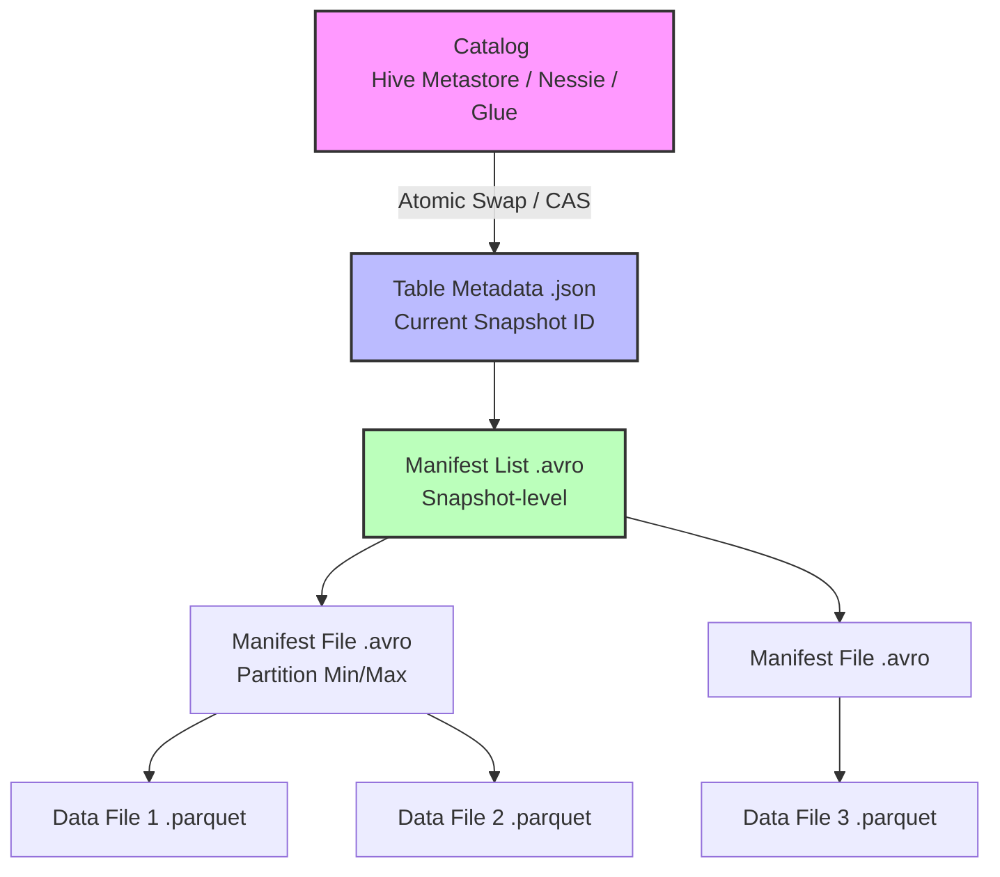

Khác với Data Lake truyền thống (Hive-like) dựa vào cơ chế *File Listing* trên thư mục, Apache Iceberg được thiết kế xoay quanh **Metadata Tree** và cơ chế **Optimistic Concurrency Control (OCC)**. Iceberg không khóa (lock) dữ liệu vật lý, thay vào đó, nó tạo ra các **Snapshots** bất biến (immutable). Điều này giúp nhiều tiến trình đọc/ghi có thể diễn ra đồng thời (Snapshot Isolation) mà không gây ra *Dirty Reads* hay *Torn Reads*.

Tuy nhiên, dưới góc nhìn hệ thống, không có phép màu nào miễn phí. OCC giải quyết được bài toán concurrency nhưng mang đến những rủi ro về *Retry Storms* và *Metadata Bloat* mà một Kỹ sư Dữ liệu phải lường trước.

## Kiến trúc Thực thi Vật lý (Physical Execution)

Để đạt được Snapshot Isolation, Iceberg phân tách hoàn toàn Data Layer và Metadata Layer. Dữ liệu thực tế được quản lý bởi một cây siêu dữ liệu có tính thứ bậc khắt khe.



1. **Catalog Layer:** Nút cổ chai (bottleneck) duy nhất yêu cầu tính chất tuần tự hóa (serialization). Nó chỉ lưu một con trỏ duy nhất đến file Metadata hiện tại của bảng.
2. **Table Metadata (`.json`):** Trái tim của bảng. Chứa schema, partition spec và danh sách toàn bộ các Snapshot hợp lệ. Trường quan trọng nhất là `current-snapshot-id`.
3. **Manifest List (`.avro`):** Một snapshot trỏ tới một Manifest List. File này quản lý danh sách các Manifest Files, chứa metadata ở cấp độ partition (ví dụ: `partition_min_value`, `partition_max_value`) giúp Engine thực hiện *Partition Pruning* mà không cần chạm vào file metadata cấp thấp hơn.
4. **Manifest File (`.avro`):** Quản lý tập hợp các Data Files. Nó chứa file path và *File-level Statistics* (min/max/null-counts của từng cột).
5. **Data Files (`.parquet`, `.orc`):** Các file vật lý bất biến lưu trên Object Storage (S3/GCS/ADLS).

### Đọc Dữ Liệu Đồng Thời (Reader's View)

Khi một truy vấn đọc được kích hoạt, Query Engine (như Spark hoặc Trino) sẽ:
1. Fetch trạng thái Catalog tại thời điểm `t0`.
2. Khóa tầm nhìn (Lock View) vào `current-snapshot-id` hiện tại.
3. Engine tải Manifest List và Manifest Files tương ứng, thực hiện Filter Pushdown.
4. Đọc trực tiếp các Parquet files.

Nhờ tính **bất biến (immutability)** của cây metadata, dù cùng lúc đó có hàng chục Writers đang ghi đè dữ liệu mới (tạo ra các file ẩn), Reader vẫn truy xuất an toàn trên Snapshot cũ. 

## Optimistic Concurrency Control (OCC) dưới góc nhìn Hệ thống

Iceberg giải quyết bài toán Multiple Writers bằng **OCC**. Hệ thống giả định rằng *hầu hết các tiến trình ghi sẽ không xung đột* (Optimistic) trên cùng một phân vùng hoặc dữ liệu, nên không dùng Pessimistic Lock (khóa bi quan gây thắt nút cổ chai).

### Cơ chế Atomic Swap
Quá trình ghi diễn ra theo 3 bước:
1. **Base:** Đọc Table Metadata hiện tại (ví dụ: `v1.json`).
2. **Write:** Ghi các Data Files mới xuống Object Storage (hoàn toàn cô lập). Ghi các Manifest Files và Manifest List mới.
3. **Commit (CAS - Compare And Swap):** Tạo file metadata mới `v2.json`. Writer gửi yêu cầu đến Catalog thực hiện swap con trỏ từ `v1.json` sang `v2.json`.
   - Nếu Catalog vẫn đang trỏ tới `v1.json` -> Swap thành công.
   - Nếu một Writer khác đã commit thành công trước đó (Catalog đang trỏ tới `vX.json`) -> **Conflict Detected!**

### Cơ chế Lùi và Thử lại (Backoff & Retry)
Khi xảy ra conflict, Iceberg không fail job ngay lập tức mà tự động kích hoạt tiến trình **Retry**: Re-fetch `vX.json`, kiểm tra tính tương thích (Validation) xem có sự chồng chéo dữ liệu bị thay đổi không, sau đó cấu trúc lại metadata tree và CAS lần nữa.

```sql
-- Cấu hình Spark SQL để tuning OCC cho các bảng High Concurrency
ALTER TABLE my_catalog.database.iceberg_table SET TBLPROPERTIES (
    'commit.retry.num-retries'='10',      -- Tăng số lần thử lại (Mặc định thường là 4)
    'commit.retry.min-wait-ms'='500',     -- Exponential backoff (tránh DDoSing Catalog)
    'commit.retry.max-wait-ms'='60000',   
    'commit.retry.total-timeout-ms'='1800000' 
);
```

## Rủi ro Vận hành (Operational Risks) & Troubleshooting

Dưới tải trọng lớn, OCC bộc lộ các yếu điểm chí mạng đòi hỏi Kỹ sư Dữ liệu phải can thiệp ở cấp độ kiến trúc.

### 1. Retry Storms (Bão Thử Lại) tại Catalog
- **Sự cố:** Nếu có 50 Spark Streaming jobs cùng append vào một bảng Iceberg liên tục, xác suất đụng độ CAS ở Catalog layer gần như 100%. Các job liên tục fail và retry đồng loạt, tạo ra hiệu ứng *Thundering Herd* đập thẳng vào Catalog (AWS Glue Metastore sẽ văng lỗi `RateExceededException`).
- **Trade-off:** OCC đánh đổi thông lượng ghi liên tục (Write Throughput) lấy sự tự do tuyệt đối của quá trình đọc.
- **Khắc phục:** 
  - **Micro-batching:** Giảm tần suất commit bằng cách tăng khoảng thời gian trigger của Spark Streaming (từ 10 giây lên 5-10 phút).
  - **Phân luồng Partition:** Đảm bảo các writers ghi vào các partition khác nhau, giúp quá trình merge metadata của Iceberg khi retry không gặp lỗi Validation (do không sửa chung data).

### 2. Metadata Bloat & Tràn RAM (JVM OOMKilled)
- **Sự cố:** Mỗi thao tác Data Manipulation (Insert/Update/Delete/Optimize) đều sinh ra một Snapshot mới. File `vX.json` sẽ lưu trữ *toàn bộ* lịch sử snapshot này. Khi bảng có hàng chục ngàn snapshots, file metadata `.json` có thể phình to lên đến hàng trăm MB.
- **Hậu quả:** Khi Spark Driver bắt đầu Query Planning, nó phải parse file `.json` khổng lồ này vào Heap Memory. Hậu quả là Spark Driver bị chết do `java.lang.OutOfMemoryError` (OOMKilled) trước khi kịp chạm vào Data Files.
- **Khắc phục:** Bắt buộc chạy các Maintenance DAGs (như Airflow) định kỳ để cắt tỉa cây metadata.

```sql
-- Chạy định kỳ để xóa các Snapshots cũ hơn 7 ngày
CALL my_catalog.system.expire_snapshots(
  table => 'database.fact_transactions',
  older_than => TIMESTAMP '2026-06-19 00:00:00',
  retain_last => 10
);

-- Dọn dẹp các file rác vật lý (Orphan files) không còn thuộc metadata tree
CALL my_catalog.system.remove_orphan_files(
  table => 'database.fact_transactions'
);
```

### 3. Thiết kế WAP (Write-Audit-Publish)
Iceberg Snapshot Isolation cho phép Data Engineers triển khai mô hình **WAP** (tương tự như Git Branching) để đảm bảo chất lượng dữ liệu khắt khe trước khi đẩy lên production, với độ trễ (latency) của thao tác Publish là `O(1)`.

```sql
-- Kích hoạt WAP Branching trên bảng
ALTER TABLE my_catalog.db.orders SET TBLPROPERTIES (
  'write.wap.enabled'='true'
);

-- BƯỚC 1 - WRITE: Spark Job ghi dữ liệu vào một nhánh staging (ẩn với hệ thống đọc hiện tại)
SET spark.wap.branch = 'audit_etl_job_v1';
INSERT INTO my_catalog.db.orders VALUES (1, 100.5), (2, -50.0);

-- BƯỚC 2 - AUDIT: Chạy Data Quality Checks (Great Expectations/dbt) trên nhánh vừa ghi
SELECT count(*) FROM my_catalog.db.orders FOR VERSION AS OF 'audit_etl_job_v1' WHERE amount < 0;

-- BƯỚC 3 - PUBLISH: Nếu Audit Pass, thực hiện Fast-forward nhánh main tới snapshot của staging
CALL my_catalog.system.fast_forward('db.orders', 'main', 'audit_etl_job_v1');
```

## Tổng Kết

Iceberg thay đổi hoàn toàn cục diện kiến trúc Data Lakehouse bằng cách loại bỏ File Listing và thay bằng một **Metadata Tree** tường minh. Cơ chế OCC là một sự đánh đổi xuất sắc: ưu tiên triệt để tốc độ đọc, cung cấp ACID Transactions nhưng đòi hỏi người kỹ sư phải cấu hình cẩn thận (điều chỉnh Concurrency retries, thiết lập Maintenance procedures định kỳ) để tránh hệ thống sụp đổ khi mở rộng quy mô.

## Nguồn Tham Khảo (References)
* [Apache Iceberg Official Specs: Table Metadata](https://iceberg.apache.org/spec/#table-metadata)
* [LakeFS: Write-Audit-Publish Pattern for Data Lakes](https://lakefs.io/blog/write-audit-publish/)
* [Optimistic Concurrency Control (OCC) Architecture](https://en.wikipedia.org/wiki/Optimistic_concurrency_control)
* *Designing Data-Intensive Applications (Martin Kleppmann) - Chapter 7: Transactions & Concurrency Control*
