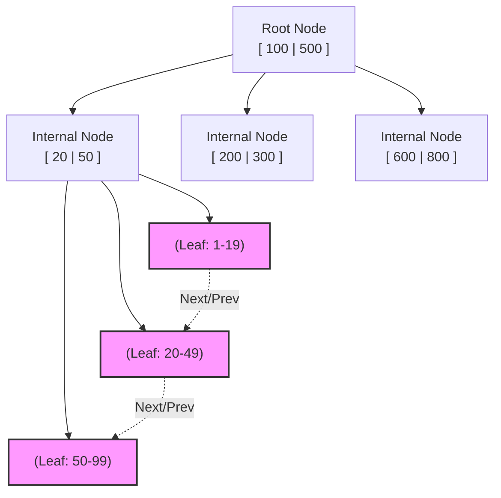
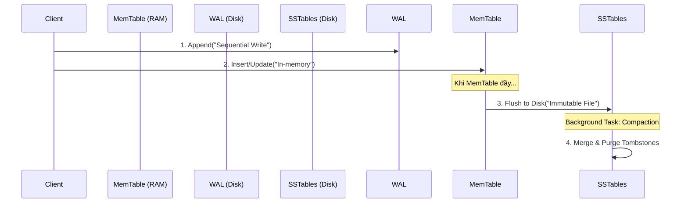

Lưu trữ và truy xuất dữ liệu hiệu quả là bài toán cốt lõi của mọi hệ quản trị cơ sở dữ liệu. Indexing (đánh chỉ mục) không chỉ đơn thuần là việc "tạo một mục lục", mà thực chất là việc lựa chọn **cấu trúc dữ liệu vật lý** để tổ chức dữ liệu trên đĩa (Disk) và bộ nhớ (RAM), nhằm tối ưu hóa một dạng tải (workload) cụ thể. 

Trong Data Engineering, việc hiểu rõ kiến trúc bên dưới của Index giúp chúng ta đưa ra quyết định thiết kế hệ thống chính xác, tránh các thảm họa về hiệu năng (Performance Bottlenecks) khi dữ liệu phình to lên mức Terabytes hay Petabytes.

---

## 1. Kiến trúc B-Tree: Chuẩn mực của Hệ thống Giao dịch (OLTP)

B-Tree (Balanced Tree), đặc biệt là biến thể **B+ Tree**, là cấu trúc dữ liệu nền tảng cho hầu hết các RDBMS (PostgreSQL, MySQL, SQL Server). Nó được thiết kế theo triết lý **Read-Optimized** (tối ưu cho việc đọc), đặc biệt ưu việt cho các ổ đĩa cơ học (HDD) truyền thống và SSD hiện đại.

### 1.1 Cơ chế hoạt động vật lý

B+ Tree tổ chức dữ liệu thành các khối (Blocks/Pages) có kích thước cố định (thường là 4KB, 8KB hoặc 16KB). 

*   **Internal Nodes (Node nội bộ):** Chỉ chứa các khóa (Keys) và con trỏ (Pointers) để định tuyến tìm kiếm. Các node này thường nhỏ gọn và nằm phần lớn trên RAM (Buffer Pool).
*   **Leaf Nodes (Node lá):** Chứa dữ liệu thực tế (hoặc con trỏ đến vị trí vật lý của dòng dữ liệu - Row ID). Các leaf node được liên kết với nhau bằng danh sách liên kết đôi (Doubly Linked List), giúp tối ưu hóa cực tốt cho các truy vấn quét dải (Range Scans).



### 1.2 Đánh đổi hệ thống (Trade-offs)

*   **Ưu điểm (Low Read Latency):** Nhờ cấu trúc cân bằng hoàn hảo, mọi truy vấn tìm kiếm (Point Query) luôn có độ phức tạp thời gian cực kỳ ổn định là $O(\log N)$, tương đương với một số lượng disk seeks rất nhỏ và dự đoán được.
*   **Nhược điểm (Write Amplification):** B-Tree sử dụng cơ chế **In-place Updates** (Cập nhật tại chỗ). Khi một bản ghi được chèn (INSERT) hoặc cập nhật (UPDATE), Database Engine phải nạp toàn bộ Page (ví dụ 16KB) chứa bản ghi đó lên RAM, sửa đổi vài bytes, rồi ghi ngược toàn bộ 16KB đó trở lại đĩa. Hiện tượng này gọi là **Write Amplification** (Khuếch đại Ghi), làm giảm nghiêm trọng băng thông (Throughput) của hệ thống khi tần suất ghi quá lớn.

---

## 2. LSM-Tree: Cứu tinh của Tải trọng Ghi (Write-Heavy Workloads)

Khi đối mặt với các bài toán như Logging, Telemetry, hay Time-series Data, tần suất ghi (Write Throughput) trở thành ưu tiên số một. **Log-Structured Merge-Tree (LSM-Tree)**, được sử dụng trong Cassandra, RocksDB, ScyllaDB và Kafka, ra đời để giải quyết điểm yếu Write Amplification của B-Tree.

### 2.1 Cơ chế Append-Only

LSM-Tree loại bỏ hoàn toàn In-place Updates. Mọi thao tác ghi đều được chuyển thành **Tuần tự (Sequential Writes)**.

1.  **Write-Ahead Log (WAL):** Dữ liệu được ghi nối (append) vào một log file trên đĩa để đảm bảo độ bền (Durability).
2.  **MemTable:** Đồng thời, dữ liệu được ghi vào một cấu trúc cây in-memory (như Red-Black Tree hoặc SkipList) gọi là MemTable. Thao tác này diễn ra trên RAM nên cực kỳ nhanh.
3.  **SSTable (Sorted String Table):** Khi MemTable đầy, nó được flush (đẩy) xuống đĩa thành một file SSTable **bất biến (Immutable)**.
4.  **Compaction (Gộp file):** Theo thời gian, một background process sẽ đọc các SSTable ở các tầng (levels) khác nhau, gộp chúng lại, loại bỏ các bản ghi cũ/bị xóa (Tombstones), và tạo ra SSTable mới.



### 2.2 Đánh đổi hệ thống (Trade-offs)

*   **Ưu điểm (High Write Throughput):** Ghi dữ liệu tuần tự giúp tối đa hóa tốc độ I/O của ổ đĩa. Không có In-place Updates, không có Page Splits.
*   **Nhược điểm (Read Penalty & Compaction Overhead):** Để đọc một bản ghi, hệ thống có thể phải tìm trong MemTable, sau đó quét qua nhiều tầng SSTable trên đĩa (Read Amplification). Ngoài ra, tiến trình Compaction tranh giành tài nguyên I/O và CPU với các luồng đọc/ghi chính.

---

## 3. Indexing trong Modern Data Stack (Data Lakehouse/OLAP)

Trong môi trường OLAP (như Snowflake, BigQuery) hoặc Data Lakehouse (Delta Lake, Apache Iceberg) với dung lượng hàng Petabytes, việc duyệt một cây B-Tree là bất khả thi vì dung lượng Index có thể còn lớn hơn cả dữ liệu gốc. Thay vào đó, kiến trúc chuyển sang **File-level Indexing (Chỉ mục cấp độ tệp)** và **Metadata-driven Data Skipping**.

### 3.1 Min/Max Statistics (Zone Maps)

Dữ liệu (định dạng Parquet, ORC) được lưu thành từng file/block. Tại tầng Metadata, hệ thống lưu trữ các chỉ số thống kê cơ bản cho từng cột trong mỗi file: `min_value`, `max_value`, và `null_count`.

```json
// Ví dụ Metadata của một file Parquet trong Iceberg
{
  "file_path": "s3://lake/data/part-0001.parquet",
  "record_count": 10000,
  "column_stats": {
    "timestamp": {
      "min": "2023-10-01T00:00:00Z",
      "max": "2023-10-01T23:59:59Z"
    },
    "user_id": {
      "min": 100,
      "max": 50000
    }
  }
}
```

**Thực thi Query:** Nếu truy vấn là `WHERE timestamp >= '2023-10-02'`, Query Engine chỉ cần đọc file JSON metadata này và kết luận ngay file `part-0001.parquet` không chứa dữ liệu cần thiết. Toàn bộ file bị bỏ qua mà không cần tải lên RAM (**Data Skipping**). Khối lượng I/O giảm theo cấp số nhân.

### 3.2 Bloom Filters

Bloom Filter là một cấu trúc dữ liệu xác suất (Probabilistic Data Structure). Nó giải quyết bài toán Point Lookup (`WHERE user_id = 'ABC'`) trong môi trường OLAP cực kỳ hiệu quả về mặt bộ nhớ.

*   Hỏi Bloom Filter: "user_id 'ABC' có trong file này không?"
*   Trả lời: **"Chắc chắn không"** (Bỏ qua file).
*   Trả lời: **"Có thể có"** (Tiến hành mở file ra đọc).

Trong Apache Parquet, Bloom Filter có thể được cấu hình ở mức Column/Row Group, giúp giảm tải disk reads (đặc biệt khi lưu trữ trên Cloud Object Storage như S3 có độ trễ lớn).

### 3.3 Z-Ordering & Liquid Clustering (Multi-dimensional Data Skipping)

Sắp xếp tuyến tính (Linear Sorting) thường chỉ hiệu quả cho 1-2 cột đầu tiên. Nếu bạn sort theo `(Country, Date, UserID)`, Data Skipping sẽ rất tốt cho `Country`, nhưng vô dụng nếu chỉ query theo `UserID`.

**Z-Ordering** ánh xạ dữ liệu nhiều chiều vào không gian một chiều trong khi vẫn bảo toàn tính gần gũi về mặt địa lý (Locality). Điều này giúp dữ liệu liên quan ở nhiều cột được nhóm vật lý gần nhau, tối ưu hóa Data Skipping cho **tất cả** các cột tham gia Z-Order.

```sql
-- Databricks Delta Lake Z-Ordering Example
OPTIMIZE events_table 
ZORDER BY (country, event_type, user_tier);
```
*(Lưu ý: Databricks gần đây đã giới thiệu **Liquid Clustering** để tự động hóa quá trình này thay vì phải manual run `OPTIMIZE`)*.

---

## 4. Các Rủi ro Vận hành (Operational Risks & Troubleshooting)

Lựa chọn sai Indexing Strategy có thể dẫn đến hệ thống bị treo hoặc chi phí Cloud tăng vọt. Dưới đây là các sự cố phổ biến:

### 4.1 Index Fragmentation (Phân mảnh B-Tree)
Khi thực hiện UPDATE/DELETE liên tục trên các cột được index, B-Tree sẽ sinh ra các "lỗ hổng" (Dead space) trong các Page, hoặc Page bị chia cắt (Page Split) làm mất đi tính liên tục vật lý.
*   **Triệu chứng:** Câu lệnh `SELECT` ngày càng chậm dù bảng không lớn thêm nhiều. Dung lượng đĩa tăng bất thường.
*   **Khắc phục:** Thực hiện Rebuild/Reorganize Index theo chu kỳ.
```sql
-- SQL Server Rebuild Index
ALTER INDEX idx_user_id ON users REBUILD;
```

### 4.2 OOM (Out Of Memory) với Hash Index trên bảng khổng lồ
Hash Index có độ phức tạp $O(1)$ tuyệt vời cho truy vấn chính xác, nhưng nó yêu cầu nạp bảng băm (Hash Table) vào RAM.
*   **Sự cố:** Nếu một bảng có hàng tỷ bản ghi và bạn tạo Hash Index trên một cột có High Cardinality (như UUID), Hash Table có thể phình to đến hàng trăm GB, dẫn đến tiến trình database bị hệ điều hành "bắn bỏ" (`OOMKilled`).
*   **Khắc phục:** Chuyển về B-Tree nếu RAM là nút thắt, hoặc sử dụng cơ chế Phân vùng (Partitioning) kết hợp với các bộ lọc xác suất (Bloom Filters).

### 4.3 Over-indexing giết chết Throughput
Trong nỗ lực "tune" các câu SELECT chậm, Data Analyst thường tạo index trên mọi cột xuất hiện trong mệnh đề `WHERE`.
*   **Sự cố:** Ghi một bản ghi vào bảng mất 1ms, nhưng phải mất thêm 50ms để cập nhật 10 cái B-Tree khác nhau. Hệ thống bị dội ngược (Backpressure), dẫn đến Retry Storms từ phía ứng dụng (VD: Kafka Producer không nhận được ACKs kịp).
*   **Khắc phục:** Theo dõi chỉ số `Index Usage Stats`. Xóa bỏ các Index hiếm khi được sử dụng cho việc đọc (Read) nhưng lại phải liên tục chịu tải ghi (Write).

## 5. Nguồn Tham Khảo

1.  Kleppmann, M. (2017). *Designing Data-Intensive Applications: The Big Ideas Behind Reliable, Scalable, and Maintainable Systems*. O'Reilly Media. (Chapter 3: Storage and Retrieval)
2.  [Databricks Blog - Processing Petabytes of Data in Seconds with Databricks Delta](https://databricks.com/blog/2018/07/31/processing-petabytes-of-data-in-seconds-with-databricks-delta.html)
3.  [Apache Parquet Format - Bloom Filter Specifications](https://github.com/apache/parquet-format/blob/master/BloomFilter.md)
4.  [Uber Engineering - How Uber Uses RocksDB](https://eng.uber.com/)
5.  [MySQL 8.0 Reference Manual - The InnoDB Storage Engine (B+Tree Indexes)](https://dev.mysql.com/doc/refman/8.0/en/innodb-indexes.html)
