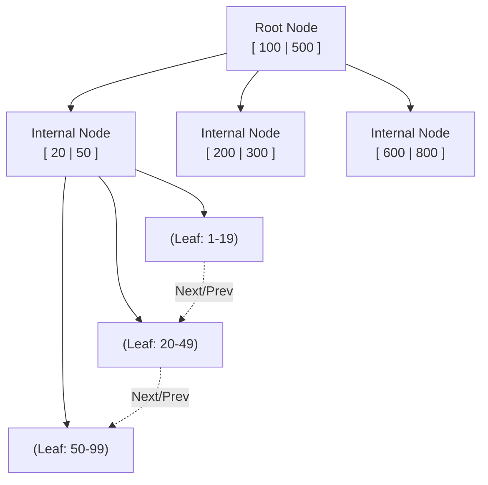
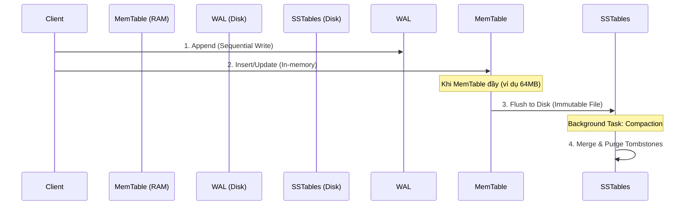

Lưu trữ và truy xuất dữ liệu (Storage & Retrieval) là trái tim của mọi hệ quản trị cơ sở dữ liệu. **Indexing (đánh chỉ mục)** không chỉ đơn thuần là việc "tạo một mục lục sách", mà thực chất là việc lựa chọn một **cấu trúc dữ liệu vật lý** để tổ chức dữ liệu trên Ổ cứng (Disk) và Bộ nhớ (RAM), nhằm tối ưu hóa một dạng tải (workload) cụ thể. 

Đối với một Data Engineer, việc hiểu rõ kiến trúc bên dưới của Index giúp đưa ra các quyết định hệ thống chuẩn xác, tránh các thảm họa sụp đổ hiệu năng (Performance Bottlenecks) khi dữ liệu vượt ngưỡng Terabytes.

---

## 1. Kiến trúc B-Tree: Chuẩn mực của Hệ thống Giao dịch (OLTP)

B-Tree (Balanced Tree), đặc biệt là biến thể **B+ Tree**, là cấu trúc dữ liệu nền tảng cho hầu hết các RDBMS truyền thống (PostgreSQL, MySQL InnoDB, SQL Server). Nó được thiết kế theo triết lý **Read-Optimized** (tối ưu cho đọc), hoạt động hoàn hảo trên các ổ đĩa HDD và SSD.

### 1.1. Cơ chế hoạt động vật lý
B+ Tree tổ chức dữ liệu thành các khối (Blocks/Pages) có kích thước cố định (ví dụ 4KB hoặc 8KB). 
*   **Internal Nodes (Node nội bộ):** Chỉ chứa các khóa (Keys) và con trỏ (Pointers) để định tuyến hướng tìm kiếm. Các node này cực kỳ nhỏ gọn và thường được nạp sẵn vào RAM (Buffer Pool).
*   **Leaf Nodes (Node lá):** Chứa dữ liệu thực tế (hoặc con trỏ đến vị trí vật lý của dòng dữ liệu). Các leaf node được liên kết với nhau bằng danh sách liên kết đôi (Doubly Linked List), giúp tối ưu hóa tuyệt đối cho các truy vấn quét dải (Range Scans).



### 1.2. Systemic Trade-offs (Sự đánh đổi)
*   **Ưu điểm (Low Read Latency):** Nhờ cấu trúc cân bằng hoàn hảo, mọi truy vấn tìm kiếm (Point Query) luôn có độ phức tạp thời gian ổn định là $O(\log N)$. Điều này tương đương với số lượng Disk Seeks rất nhỏ và dễ dự đoán.
*   **Nhược điểm (Write Amplification):** B-Tree sử dụng cơ chế **In-place Updates** (Cập nhật tại chỗ). Khi một bản ghi được `INSERT` hoặc `UPDATE`, Database Engine phải nạp toàn bộ Page (vd: 8KB) chứa bản ghi đó lên RAM, sửa đổi vài bytes, rồi ghi đè ngược toàn bộ 8KB đó trở lại đĩa. Hiện tượng này gọi là **Write Amplification** (Khuếch đại I/O ghi), làm suy giảm nghiêm trọng băng thông (Throughput) khi tần suất ghi quá cao.

---

## 2. LSM-Tree: Kẻ thống trị Tải trọng Ghi (Write-Heavy Workloads)

Khi đối mặt với các bài toán như Logging, Telemetry, hay Time-series Data, tần suất ghi (Write Throughput) trở thành ưu tiên số một. **Log-Structured Merge-Tree (LSM-Tree)**, được dùng làm core engine của Cassandra, RocksDB, ScyllaDB và Kafka, ra đời để khắc phục yếu điểm Write Amplification.

### 2.1. Cơ chế Append-Only
LSM-Tree từ bỏ hoàn toàn việc In-place Updates. Mọi thao tác ghi đều được chuyển thành **Ghi tuần tự (Sequential Writes)**.
1.  **Write-Ahead Log (WAL):** Dữ liệu được ghi nối (append) vào log file trên đĩa để đảm bảo độ bền (Durability) chống mất dữ liệu khi cúp điện.
2.  **MemTable:** Cùng lúc, dữ liệu được ghi vào một cấu trúc cây in-memory (như SkipList) gọi là MemTable. Thao tác này diễn ra trên RAM nên tốc độ là tính bằng micro-giây.
3.  **SSTable (Sorted String Table):** Khi MemTable đầy, nó được flush (đẩy) xuống đĩa thành một file SSTable **bất biến (Immutable)**.
4.  **Compaction (Gộp file):** Một background process sẽ đọc các SSTable ở các tầng (levels) khác nhau, gộp chúng lại, loại bỏ các bản ghi cũ/bị xóa (Tombstones), và tạo ra SSTable mới lớn hơn.



### 2.2. Đánh đổi hệ thống
*   **Ưu điểm (High Write Throughput):** Ghi tuần tự giúp tối đa hóa tốc độ IOPS của ổ cứng. Không có Random IO, không có Page Splits.
*   **Nhược điểm (Read Penalty & Compaction Overhead):** Để đọc một bản ghi, hệ thống phải tìm trong MemTable, sau đó có thể phải rà quét qua nhiều tầng SSTable trên đĩa (**Read Amplification**). Tiến trình Compaction cũng tranh giành tài nguyên I/O & CPU với luồng đọc/ghi chính.

---

## 3. Indexing trong Modern Data Stack (Data Lakehouse)

Trong môi trường Big Data OLAP (như BigQuery, Databricks Delta Lake, Apache Iceberg) với dung lượng hàng Petabytes, duyệt một cây B-Tree truyền thống là bất khả thi (kích thước Index có thể lớn hơn dữ liệu gốc). Kiến trúc chuyển sang **File-level Indexing** (Chỉ mục cấp độ tệp) và các kỹ thuật **Metadata-driven Data Skipping**.

### 3.1. Min/Max Statistics (Zone Maps)
Dữ liệu Columnar (Parquet, ORC) lưu thành từng file/block lớn. Tại tầng Metadata, hệ thống lưu các thống kê cơ bản cho mỗi cột trong mỗi file: `min_value`, `max_value`, `null_count`.

```json
{
  "file_path": "s3://lake/data/part-0001.parquet",
  "record_count": 10000,
  "column_stats": {
    "timestamp": { "min": "2023-10-01T00:00:00Z", "max": "2023-10-01T23:59:59Z" },
    "user_id": { "min": 100, "max": 50000 }
  }
}
```
*Sức mạnh:* Nếu truy vấn `WHERE timestamp >= '2023-10-02'`, Query Engine chỉ đọc file JSON metadata này và kết luận ngay `part-0001.parquet` không thỏa mãn. Toàn bộ file bị bỏ qua mà không cần I/O mạng.

### 3.2. Bloom Filters
Một cấu trúc dữ liệu xác suất (Probabilistic Data Structure) sử dụng mảng bit và các hàm băm. Nó giải quyết bài toán Point Lookup (`WHERE user_id = 'ABC'`) trong môi trường Data Lake:
*   Hỏi Bloom Filter: "user_id 'ABC' có mặt không?"
*   Trả lời: **"Chắc chắn KHÔNG"** (Bỏ qua file).
*   Trả lời: **"CÓ THỂ có"** (Tiến hành mở file để quét).
*(Bloom Filter không bao giờ có false negatives, chỉ có false positives).*

### 3.3. Bitmap Indexes
Tối ưu hóa cực độ cho các **cột có Low Cardinality** (số lượng giá trị duy nhất thấp, vd: `Gender`, `Status`). Thay vì lưu trữ cồng kềnh, hệ thống biểu diễn sự xuất hiện của giá trị bằng một mảng Bit. Khi có các truy vấn phức tạp kết hợp nhiều cột (`WHERE status = 'ACTIVE' AND gender = 'M'`), CPU chỉ cần thực hiện phép toán `Bitwise AND` siêu tốc trực tiếp trên thanh ghi (Registers) mà không cần quét dữ liệu.

### 3.4. Z-Ordering & Liquid Clustering
Sắp xếp tuyến tính (Linear Sorting) thường chỉ hiệu quả cho 1-2 cột đầu tiên. Nếu bạn sort theo `(Country, Date, UserID)`, việc Data Skipping cực tốt cho `Country`, nhưng vô dụng nếu query lọc theo `UserID`.

**Z-Ordering (Space-filling curves)** ánh xạ dữ liệu nhiều chiều vào không gian một chiều trong khi bảo toàn tính địa lý (Locality). Dữ liệu có chung cụm giá trị ở nhiều cột sẽ được xếp nằm cạnh nhau về mặt vật lý (trên cùng file Parquet).

```sql
-- Delta Lake Z-Ordering Example
OPTIMIZE events_table 
ZORDER BY (country, event_type, user_tier);
```
*(Hiện nay Databricks đã nâng cấp kỹ thuật này thành **Liquid Clustering**, tự động hóa quá trình tối ưu đa chiều mà không cần chạy `OPTIMIZE` thủ công theo mẻ).*

---

## 4. Các Rủi ro Vận hành (Troubleshooting)

### 4.1. Index Fragmentation (Phân mảnh B-Tree)
Khi thực hiện `UPDATE`/`DELETE` liên tục, B-Tree sẽ sinh ra các "Dead space" trong Page, hoặc bị chia cắt (Page Split).
*   **Triệu chứng:** Câu `SELECT` ngày càng chậm, dung lượng đĩa ảo (bloat) tăng cao.
*   **Khắc phục:** Thực thi `REBUILD` hoặc `REORGANIZE` theo chu kỳ bảo trì.
```sql
ALTER INDEX idx_user_id ON users REBUILD;
```

### 4.2. OOMKilled với Hash Index trên bảng khổng lồ
Hash Index có $O(1)$ tuyệt vời nhưng nạp toàn bộ Hash Table vào RAM.
*   **Triệu chứng:** Tạo Hash Index trên cột High Cardinality (như UUID) của bảng 1 tỷ dòng khiến Memory phình to hàng chục GB. Kernel bắn `SIGKILL` (`OOMKilled`) tắt luôn DB.
*   **Khắc phục:** Chuyển về B-Tree, hoặc dùng Partitioning kết hợp Bloom Filters.

### 4.3. Over-indexing gây Backpressure
Data Analyst thường tạo Index bừa bãi cho mọi cột có trong `WHERE` nhằm query nhanh.
*   **Hậu quả:** Ghi 1 row mất 1ms, nhưng phải cập nhật 15 cái B-Tree khác nhau tốn thêm 50ms (Write Penalty). Ứng dụng dội ngược (Backpressure) làm sập hệ thống Upstream (như Kafka).
*   **Khắc phục:** Theo dõi `Index Usage Stats`. Xóa bỏ các Index "đói" [Read cực ít nhưng luôn phải chịu tải Write].

---

## Nguồn Tham Khảo (References)
*   **Designing Data-Intensive Applications** - *Martin Kleppmann* (Chapter 3: Storage and Retrieval).
*   [Databricks: Processing Petabytes of Data with Delta Lake (Z-Ordering]][https://www.databricks.com/blog/2018/07/31/processing-petabytes-of-data-in-seconds-with-databricks-delta.html]
*   [Apache Parquet Format - Bloom Filter Specifications][https://github.com/apache/parquet-format/blob/master/BloomFilter.md]
*   [Uber Engineering - How Uber Uses RocksDB (LSM-Tree in production]](https://eng.uber.com/rocksdb/)
