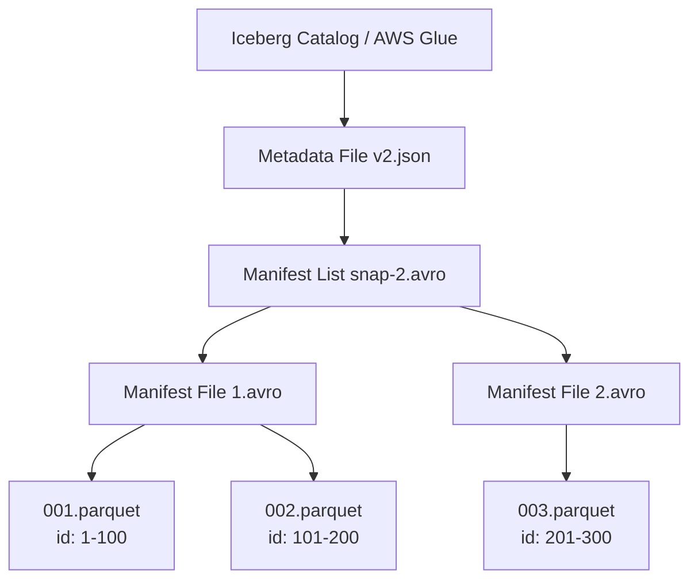
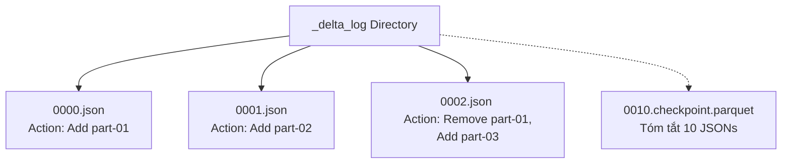

Lịch sử ngành dữ liệu từng chia làm hai nửa rõ rệt (Two-tier architecture): **Data Lake** (Giá rẻ, lưu trữ phi cấu trúc phục vụ Machine Learning) và **Data Warehouse** (Đắt đỏ, lưu trữ có cấu trúc phục vụ BI/Báo cáo). Việc duy trì cả hai hệ thống tạo ra sự nhân bản dữ liệu, Data Silos, và chi phí khổng lồ.

**Data Lakehouse** ra đời để hội tụ (Convergence) hai thế giới này lại làm một: Cung cấp hiệu năng truy vấn và giao dịch **ACID** của Warehouse trực tiếp trên **Object Storage** (S3, GCS) giá rẻ. 

Bí mật đằng sau khả năng kỳ diệu này nằm ở một lớp trừu tượng gọi là **Metadata Layer (Table Format)**.

---

## 1. Cấu Phẫu Lớp Siêu Dữ Liệu (Metadata Layer)

Một bảng trong Lakehouse thực chất được cấu tạo từ hai thành phần độc lập trên Cloud Storage:
1. **Data Files**: Dữ liệu thực tế (Parquet hoặc ORC).
2. **Metadata Files**: Nhật ký giao dịch, schema, và đường dẫn tuyệt đối đến các Data Files.

### 1.1. Apache Iceberg: Cây Thư Mục Metadata (Metadata Tree)
Khác với Apache Hive theo dõi dữ liệu ở cấp độ thư mục (Partition Directory), Iceberg theo dõi dữ liệu ở cấp độ từng **tệp tin (File-level)**.


- **Manifest List**: Lưu Min/Max Stats ở cấp độ Snapshot, giúp Query Engine (Spark/Trino) bỏ qua nguyên một nhánh dữ liệu mà không cần tải các Manifest Files bên dưới.

### 1.2. Databricks Delta Lake: Nhật Ký Giao Dịch
Delta Lake tiếp cận bằng cách sử dụng chuỗi sự kiện `_delta_log`.


Mỗi thao tác [INSERT, UPDATE] sinh ra một file JSON chứa mảng các `add` (thêm file Parquet mới) và `remove` (đánh dấu xóa logic file Parquet cũ). Cứ 10 commits, Delta gom chúng lại thành file `checkpoint.parquet` để tăng tốc đọc Metadata.

---

## 2. Các Cơ Chế Cốt Lõi (Core Mechanisms)

Làm sao hàng ngàn user cùng đọc/ghi vào S3 mà không làm hỏng dữ liệu?

### 2.1. Optimistic Concurrency Control (OCC)
Hệ thống DB truyền thống dùng Khóa (Locks). Trên S3, cài đặt Lock Server phân tán rất chậm. Giải pháp là **OCC (Kiểm soát đồng thời lạc quan)**.
- **Bản chất:** Giả định rất hiếm khi hai người cùng sửa một file cùng lúc.
- **Cơ chế Commit:** Job A xử lý và đẩy file Parquet mới lên S3 (chưa ai thấy). Khi chuẩn bị Commit vào Catalog, nó kiểm tra xem có ai vừa Commit chèn ngang không. Nếu có, Job A bị **Abort** và phải Retry.

> **[!CAUTION] Cạm Bẫy Retry Storm**
> Nếu bạn có 50 Spark Streaming jobs cùng Append liên tục vào một bảng Delta, xung đột OCC sẽ xảy ra 100%. Các job sẽ liên tục Retry, gây ra hiệu ứng Thundering Herd làm sập Catalog. 
> *Cách khắc phục:* Giới hạn số lượng writers, dùng Micro-batching, hoặc tăng `backoffDuration` giữa các lần retry.

### 2.2. Data Skipping [Chống Cartesian Explosion]
Data Warehouse truyền thống quét dữ liệu qua B-Tree Index. Lakehouse sử dụng **Data Skipping**.
Khi truy vấn `WHERE user_id = 100`, Query Engine đọc file Metadata trước. Nếu file Parquet A có `max(user_id) = 90`, file đó sẽ bị gạt bỏ hoàn toàn khỏi kế hoạch truy vấn (Skipped) mà không tốn 1 byte Disk I/O nào.

---

## 3. Rủi Ro Vận Hành (Operational Risks)

### 3.1. Sự Cố Rác File Nhỏ & OOMKilled
**Incident:** Hệ thống Kafka đẩy sự kiện vào Iceberg mỗi phút (mỗi phút sinh 1 file Parquet 50KB). Sau 6 tháng, bảng có 250,000 files. Khi gõ lệnh `SELECT COUNT(*)`, Spark Driver bị văng lỗi **OOMKilled** (Hết RAM).
**Root Cause:** Spark Driver phải tải 250,000 đường dẫn URI file và Metadata JSON khổng lồ vào bộ nhớ Heap. Cạn kiệt RAM trước khi kịp đọc Data.
**Giải pháp:** Lập lịch dọn dẹp định kỳ (Compaction).
```sql
-- Iceberg Compaction (Gom file 50KB thành file 256MB)
CALL catalog.system.rewrite_data_files(
  table => 'production.user_events',
  options => map('target-file-size-bytes', '268435456')
);
```

### 3.2. Lạm Phát Storage Do Time Travel
Lakehouse cho phép **Time Travel** (Truy vấn quá khứ). Vì vậy, khi bạn chạy `DELETE` hoặc `UPDATE`, các file Parquet cũ KHÔNG bị xóa vật lý (Soft Delete). Hóa đơn AWS S3 của bạn sẽ tăng phi mã.
**Giải pháp:** Chạy lệnh `VACUUM` (Xóa cứng dữ liệu quá hạn định kỳ).
```sql
-- Delta Lake: Xóa cứng dữ liệu mồ côi quá 7 ngày
VACUUM production.orders RETAIN 168 HOURS;
```

---

## 4. Systemic Trade-offs: Lakehouse vs Cloud Data Warehouse

Khi nào chọn Lakehouse (Iceberg/Databricks), khi nào chọn Warehouse (Snowflake, BigQuery)?

| Tiêu chí | Data Lakehouse (Open Formats) |" Cloud Data Warehouse (Snowflake/BigQuery) "|
| :--- | :--- | :--- |
| **Vendor Lock-in** | **Không**. Dữ liệu dạng Parquet mã nguồn mở. Đổi Compute Engine thoải mái. | **Cao**. Định dạng lưu trữ độc quyền. Chuyển nhà cực khổ. |
| **Chi Phí Lưu Trữ** | Rẻ nhất. Trả đúng giá gốc của AWS S3 / GCS. |" Bị đội giá (Premium storage pricing). "|
|" **Vận Hành (Ops)** "| Đòi hỏi Data Engineer cứng tay để chống Small Files, tune OCC, VACUUM. |" Hệ thống tự động tối ưu ngầm (Auto-clustering). Ít tốn công duy trì. "|
| **Hiệu Năng BI** | Độ trễ (Latency) tính bằng giây/phút. Phù hợp báo cáo lớn. |" Siêu việt cho OLAP (Sub-second latency) với hàng ngàn user đồng thời. "|

Lakehouse không tiêu diệt Data Warehouse, nó chỉ trả quyền làm chủ Dữ liệu (Data Ownership) về tay bạn, với cái giá phải trả là sự phức tạp trong vận hành.

---

## Nguồn Tham Khảo
* [Databricks: What is a Data Lakehouse?](https://www.databricks.com/blog/2020/01/30/what-is-a-data-lakehouse.html)
* [Apache Iceberg Architecture](https://iceberg.apache.org/docs/latest/architecture/)
* [AWS: Optimistic Concurrency Control](https://aws.amazon.com/blogs/architecture/)
