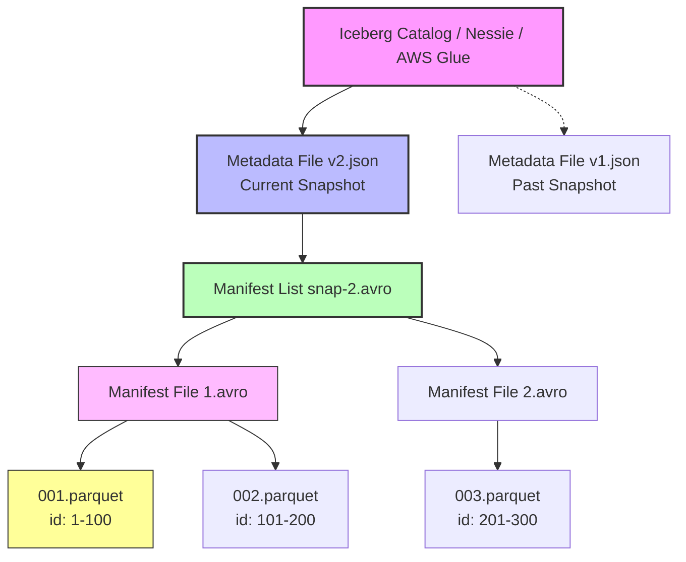
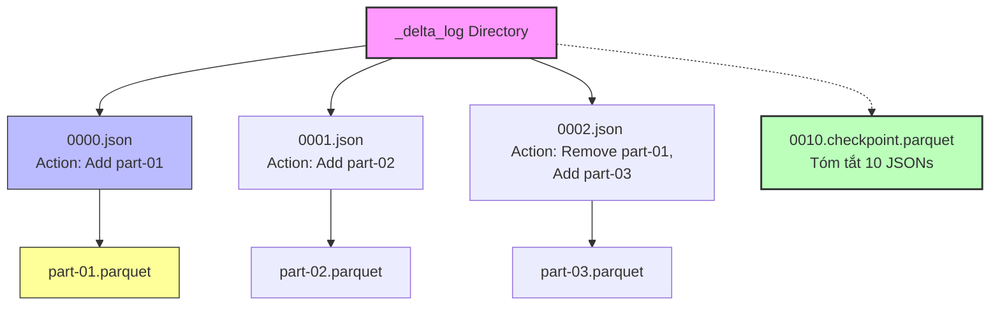

Thay vì lặp lại những định nghĩa sách giáo khoa "Lakehouse là gì?", bài viết này sẽ đưa bạn đi sâu vào bên dưới lớp vỏ bọc (under the hood). Làm thế nào một đống file Parquet tĩnh lưu trên AWS S3 hay Google Cloud Storage lại có thể hỗ trợ **ACID Transactions** nhiều người đọc/ghi cùng lúc mà không làm hỏng dữ liệu? 

Bí mật nằm ở **Table Format (Metadata Layer)**.

---

## 1. Kiến trúc Thực thi Vật lý (Physical Execution Architecture)

Một bảng trong Lakehouse thực chất được cấu tạo từ hai thành phần độc lập trên Cloud Storage:
1. **Data Files**: Chứa dữ liệu thực tế (thường định dạng Parquet hoặc ORC).
2. **Metadata Files**: Chứa log giao dịch, schema, và đường dẫn đến các Data Files tương ứng (định dạng JSON hoặc Avro).

Hãy cùng mổ xẻ cấu trúc của hai định dạng phổ biến nhất hiện nay: Apache Iceberg và Databricks Delta Lake.

### 1.1. Apache Iceberg: Cây thư mục Metadata (The Metadata Tree)

Khác với Apache Hive chỉ theo dõi metadata ở cấp độ thư mục (Partition Directory), Iceberg theo dõi dữ liệu ở cấp độ từng **tệp tin (File-level)**.



* **Iceberg Catalog**: Đây là chốt chặn cuối cùng (Lock/Concurrency control). Catalog (có thể là Nessie, Hive Metastore, RDS) trỏ tới file `.json` mới nhất.
* **Metadata File (`.json`)**: Chứa Table schema, partition specs, và mảng các Snapshots lịch sử.
* **Manifest List (`.avro`)**: Liệt kê các Manifest Files trong 1 Snapshot. Điểm ăn tiền là nó lưu luôn **min/max stats** của partition range để thực hiện *Data Skipping* cực nhanh.
* **Manifest File (`.avro`)**: Chứa đường dẫn tuyệt đối (URIs) đến các Data Files (`.parquet`), kèm column-level min/max stats.

### 1.2. Delta Lake: Nhật ký Giao dịch (Transaction Log)

Delta Lake tiếp cận theo một cách khác: Sử dụng chuỗi sự kiện `_delta_log` thay vì cây thư mục nhị phân.



* Mỗi lần bạn thao tác (INSERT, UPDATE), Delta sinh ra một file `0000X.json`. Trong file json lưu hành động `add` (thêm file data mới) hoặc `remove` (đánh dấu file data cũ bị xoá logic).
* Cứ sau 10 commits, Delta gom 10 file `.json` thành 1 file `.checkpoint.parquet` để Engine đọc nhanh hơn, tránh việc quét hàng ngàn file json mỗi lần query.

---

## 2. Cơ chế Hoạt động Cốt lõi (Core Mechanisms)

### 2.1. Phá bỏ Deadlock với Optimistic Concurrency Control (OCC)

Hệ cơ sở dữ liệu truyền thống (PostgreSQL, MySQL) sử dụng cơ chế Khóa (Row-level Locks, Table Locks) để đảm bảo ACID. Trên Lakehouse (Cloud Storage), việc cài đặt Lock Server phân tán là bất khả thi hoặc quá chậm. Giải pháp: **Optimistic Concurrency Control (OCC)**.

* **Bản chất của OCC:** Giả định rằng rất hiếm khi hai người cùng ghi vào cùng một file dữ liệu cùng một lúc (lạc quan).
* **Luồng thực thi:**
  1. **Read**: Job A đọc table ở Version 10.
  2. **Process**: Job A thực thi logic và ghi Data Files `.parquet` mới ra storage (lúc này chưa ai biết các file này tồn tại).
  3. **Commit**: Job A tạo file `00011.json`. Nhưng trước khi commit, nó kiểm tra xem Catalog đã có bản V11 do Job B commit trước đó chưa. Nếu có (Xung đột!), Job A bị **Abort**, đọc lại V11 mới nhất và thử lại (Retry) toàn bộ quá trình.

> **[!CAUTION] Cạm bẫy Retry Storm**
> Nếu bạn có 50 Spark Streaming jobs cùng append vào 1 bảng Delta, xung đột OCC sẽ xảy ra liên tục. Các Job sẽ Retry vòng lặp, dẫn tới CPU Spike và kẹt hệ thống. 
> *Khắc phục:* Giới hạn số lượng writers, gộp batch, hoặc tinh chỉnh cấu hình retry của Delta:

```python
# Cấu hình chống Retry Storm trong PySpark (Delta Lake)
spark.conf.set("spark.databricks.delta.commitValidation.maxRetries", "50")
# Tăng thời gian backoff giữa các lần retry để giảm tải Catalog
spark.conf.set("spark.databricks.delta.commitValidation.backoffDuration", "2000")
```

### 2.2. Data Skipping và Z-Ordering (Chống Cartesian Explosion)

Trong Data Warehouse, bạn quét dữ liệu qua Index (B-Tree). Trên Lakehouse, Indexing được thay bằng **Data Skipping**.

Khi bạn gọi `SELECT * FROM table WHERE user_id = 100`, Query Engine (Spark/Trino) không quét toàn bộ hàng triệu file Parquet. Nó sẽ đọc file **Manifest/Checkpoint** trước, xem file Parquet nào có `min(user_id) <= 100 <= max(user_id)` rồi mới tải file đó về RAM.

Để min/max hoạt động hiệu quả, dữ liệu cần được gom cụm. Kỹ thuật **Z-Ordering** giúp ánh xạ nhiều cột (vd: `user_id`, `event_date`) vào không gian 1 chiều, gom các bản ghi có giá trị giống nhau vào chung một data file.

```sql
-- Chạy định kỳ vào ban đêm để sắp xếp lại dữ liệu vật lý
OPTIMIZE user_events
ZORDER BY (event_date, user_id);
```

> **[!TIP] Trade-off của Z-Ordering**
> Quá trình Z-Order tốn cực kỳ nhiều Compute Cost (vì đòi hỏi **Network Shuffle** toàn bộ dataset). Chỉ Z-Order các cột thường xuyên xuất hiện ở mệnh đề `WHERE`. Tuyệt đối không Z-Order các cột Cardinality thấp (như `gender` hay `country_code`).

---

## 3. Rủi ro Vận hành (Operational Risks) & Troubleshooting

### 3.1. Vấn nạn Small Files & Cơn ác mộng JVM OOMKilled

**Incident:** Một hệ thống Kafka Ingestion đẩy sự kiện vào Iceberg mỗi phút (mỗi phút sinh 1 file Parquet kích thước 50KB). Sau 6 tháng, bảng có 250,000 files. Khi Data Analyst gõ lệnh `SELECT COUNT(*)`, Spark Driver Node bất ngờ bị văng lỗi **OOMKilled** (Hết RAM).

**Nguyên nhân gốc (Root Cause):** Để plan query, Spark Driver phải tải 250,000 đường dẫn file từ Metadata Layer vào bộ nhớ Heap. Chi phí lưu trữ Metadata (String object in Java) lớn hơn dung lượng cho phép của JVM. Dữ liệu thực chưa kịp xử lý thì hệ thống đã sập.

**Giải pháp (Compaction):** Data Engineer phải lập lịch dọn dẹp, gom các file nhỏ (KB) thành file chuẩn (128MB - 512MB).

```sql
-- Chạy Compaction trên Apache Iceberg (Spark SQL)
CALL catalog.system.rewrite_data_files(
  table => 'production.user_events',
  strategy => 'binpack',
  options => map('target-file-size-bytes', '268435456') -- 256 MB
);
```

### 3.2. Rác Storage do Time Travel (FinOps Leak)

Nhờ cơ chế Snapshot, Lakehouse cho phép **Time Travel** (truy vấn quá khứ):
```sql
SELECT * FROM orders TIMESTAMP AS OF '2026-06-25';
```

**Trade-off:** Để làm được điều này, Lakehouse thực hiện **Soft Delete**. Khi bạn chạy lệnh `DELETE/UPDATE`, các file Parquet cũ KHÔNG bị xóa khỏi S3. Hệ quả là hóa đơn AWS S3 của bạn sẽ tăng phi mã theo thời gian.

**Giải pháp (Vacuum):** Dọn dẹp rác vật lý (Hard Delete) định kỳ bằng `VACUUM` (Delta) hoặc `expire_snapshots` (Iceberg).

```sql
-- Dọn sạch các file vật lý đã mồ côi (không còn thuộc snapshot nào) quá 7 ngày
VACUUM production.orders RETAIN 168 HOURS;
```

> **[!WARNING] Lỗi FileNotFoundException**
> Đừng bao giờ chạy `VACUUM RETAIN 0 HOURS`. Nếu có một Long-running Query đang phân tích một Snapshot được tạo từ 2 giờ trước, việc bạn chạy VACUUM 0 giờ sẽ xóa bay file vật lý bên dưới, khiến truy vấn của Analyst chết giữa chừng với lỗi `FileNotFoundException`. Default an toàn luôn là 7 ngày.

---

## 4. Tóm lược Systemic Trade-offs: Lakehouse vs Data Warehouse

Đứng ở vị trí Architect, khi nào thì chọn Lakehouse và khi nào thì chọn Data Warehouse (Snowflake, BigQuery, ClickHouse)?

| Tiêu chí | Data Lakehouse (Iceberg/Delta + S3 + Spark/Trino) | Cloud Data Warehouse (Snowflake / BigQuery) |
| :--- | :--- | :--- |
| **Kiến trúc** | Storage và Compute tách rời hoàn toàn (Decoupled). Metadata lưu dưới dạng file. | Compute gắn liền Storage (hoặc ảo hóa ẩn sau Managed Services). |
| **Chi phí Lưu trữ** | Siêu rẻ. Dữ liệu nằm trong Cloud Bucket của riêng bạn. Trả tiền cho AWS/GCP. | Thường bị Markup giá lưu trữ (Premium storage pricing). |
| **Khóa hệ thống (Lock-in)**| **Không**. Dữ liệu dạng Parquet. Thích thì rút Spark, cắm Trino vào đọc tiếp. | **Cao**. Dữ liệu nằm trong format độc quyền. Chuyển nhà cực kỳ đau khổ. |
| **Chi phí Vận hành (Ops)**| **Cực lớn.** Data Engineer phải tự lo việc VACUUM, Compaction, chống Small files, tune JVM. | **Nhỏ.** Hệ thống tự tối ưu ngầm (Auto-clustering, Auto-compaction). |
| **Concurrency & Latency**| Phù hợp cho Batch / Micro-batch, báo cáo có độ trễ phút. OCC dễ gây lỗi nếu scale số lượng writers quá lớn. | Tối ưu đỉnh cao cho OLAP. Xử lý hàng ngàn queries đồng thời với độ trễ Mili-giây (Sub-second latency). |

Lakehouse sinh ra không phải để tiêu diệt Data Warehouse, mà để tối ưu hóa **Chi phí lưu trữ và Xử lý linh hoạt** ở quy mô cực lớn (Petabytes). Đối với các bảng Dashboard cần độ trễ phản hồi < 1 giây phục vụ CEO, một Data Warehouse đích thực vẫn là vua.

---

## Nguồn Tham Khảo (References)

1. [Apache Iceberg: An Architectural Look Under the Covers](https://iceberg.apache.org/docs/latest/architecture/)
2. [Delta Lake Transaction Log - Databricks Engineering Blog](https://databricks.com/blog/2019/08/21/diving-into-delta-lake-unpacking-the-transaction-log.html)
3. Martin Kleppmann (2017) - *Designing Data-Intensive Applications* (O'Reilly Media). Chương 3: Storage and Retrieval.
4. [Optimistic Concurrency Control in Distributed Systems - AWS Architecture Blog](https://aws.amazon.com/blogs/architecture/)
